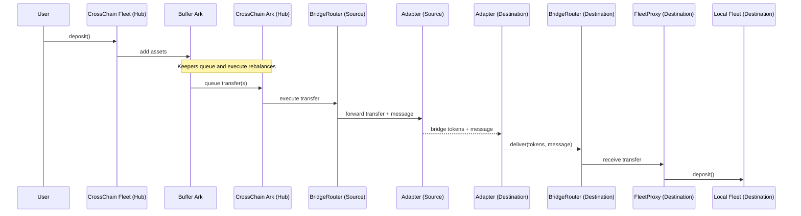

### Cross-Chain Overview

This document explains, at a high level, how Summer's cross-chain system moves assets between chains
as part of fleet management. Users interact with fleets as usual; cross-chain movement is an
internal, keeper-led rebalancing process.

#### What is a CrossChain Fleet?

- A CrossChain Fleet is a fleet deployed on a hub chain that can allocate capital across multiple chains.
- Users deposit to the CrossChain Fleet using the same interface as regular fleets.
- Deposits first accumulate in a Buffer Ark; keepers then rebalance from the buffer to one or more CrossChain Arks targeting other chains.

#### Core Components

- **CrossChain Fleet (Hub)**: User entry point and strategy accounting.
- **Buffer Ark**: Staging area for new capital prior to cross-chain deployment.
- **CrossChain Ark (Hub)**: Hub-chain Ark that executes cross-chain transfers to destination chains.
- **BridgeRouter**: Bridge coordination contract that validates adapters and forwards operations.
- **Bridge Adapters**: Protocol-specific adapters (e.g., Stargate, LayerZero) that bridge tokens and
  messages.
- **FleetProxy (Destination)**: Gatekeeper on the destination chain that accepts calls only from the
  local BridgeRouter and deposits into the local fleet after registry validation of the hub-chain Ark.
- **CrossChainRegistry**: Authoritative mapping of valid Ark ↔ Proxy pairs across chains; checked
  on both source and destination.
- **Keepers**: Off-chain agents that plan and execute rebalances (queue and execute transfers).

#### End-to-End Flow (Keeper-led)

#### Notifications (standardized)

- FleetProxy → Hub (MESSAGE): After receiving assets on the satellite, the destination `FleetProxy` can notify the hub-chain Ark using `notifyHubChain(options)`. The MESSAGE payload is `(fleetAssets, latestIncomingTransferId)` and is used by the Ark to update `lastRemoteAssetBalance` and clear inflight when the transfer ID matches.
- Hub → FleetProxy (MESSAGE): After a hub-side withdrawal completes, the Ark can ACK back to the satellite using `notifySatelliteReceipt(options)`. The MESSAGE payload contains `latestIncomingTransferId`, allowing `FleetProxy` to clear `inflightWithdrawals` when it matches `latestOutgoingTransferId`.
- Operational requirement: both notifications use `BridgeOptions` and require a non-zero `gasLimit`.

#### Security at a Glance

- Registry-first validation on source and destination: invalid relationships revert immediately.
- Recipients trust only the local BridgeRouter; the router authenticates adapters and verifies
  adapter peer mappings via the registry during delivery.
- Pausing and governance-controlled emergency actions at routers/proxies.
- Reentrancy protection on critical entry points.

Operational requirement:
- All cross-chain operations MUST include explicit `BridgeOptions` with a non-zero `gasLimit`. The router will revert with `ZeroGasLimit()` if gas limit is zero. There is no registry-level default gas limit.

Note on withdrawals:

- Disembark (withdraw) checks ensure sufficient local assets. Cross-chain withdrawals are initiated
  on the satellite by keepers via `FleetProxy.withdrawAndTransfer(...)` and delivered back to the
  Ark on the hub chain.
- Single-flight semantics apply to both Ark (outbound) and FleetProxy (withdrawals). Ark typically
  clears its inflight state upon processing the MESSAGE from `FleetProxy.notifyHubChain(...)` that
  contains the latest received transfer ID and remote balance. FleetProxy clears withdrawal inflight
  via a hub → satellite MESSAGE ACK from `CrossChainArk.notifySatelliteReceipt(...)` when the
  transfer ID matches. Fallback: SuperKeeper can call `acknowledgeHubReceipt(operationId)`, and
  governance retains emergency controls.

#### Where to go next

- Rebalancing details: `docs/cross-chain/REBALANCING_FLOW.md`
- Router and adapters: `docs/cross-chain/BRIDGE_ROUTER_AND_ADAPTERS.md`
- Registry and security: `docs/cross-chain/REGISTRY_AND_SECURITY.md`
- Operations playbook: `docs/cross-chain/OPERATIONS_PLAYBOOK.md`
