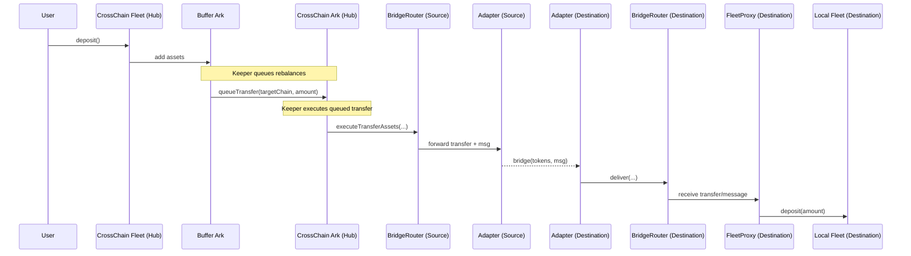

### Keeper-Led Rebalancing Flow

This document describes the operational sequence from user deposits through keeper-led rebalancing
to destination fleets.

#### High-Level Steps

1. Users deposit into the CrossChain Fleet (hub chain) via the standard fleet interface.
2. Assets accrue in the Buffer Ark.
3. Keepers decide target allocations per destination chain and queue transfers (including full
   ExecuteTransferParams and BridgeOptions) from the Buffer Ark to the respective CrossChain Ark(s).
4. A registered executor (keeper) executes the queued transfers by calling the CrossChain Ark on the
   hub chain.
5. The CrossChain Ark routes the transfer to the BridgeRouter, which forwards to a selected,
   registered adapter.
6. The adapter bridges the tokens plus a small operation message to the destination chain.
7. The destination adapter calls its local BridgeRouter.
   - **Automated adapters** (StargateAdapter, LayerZeroAdapter): Delivery completes automatically via protocol callbacks
   - **ERC7802 adapters** (ERC7802OFTAdapter, ERC7802SuperchainAdapter): Keeper must monitor for minted tokens and call `finalize()` to complete delivery
8. The destination BridgeRouter calls the FleetProxy corresponding to the target local fleet.
9. The FleetProxy deposits into the local fleet.

#### Sequence Diagram

#### Validation and Checks

- Source chain: CrossChain Ark consults CrossChainRegistry to ensure a valid Ark ↔ Proxy
  relationship for the target chain. Router execution is gated by `onlyAuthorizedExecutor` (keepers
  must be registered executors).
- Destination chain: Router authenticates adapters and peer mappings; FleetProxy trusts only the
  router, then validates the hub-chain Ark + chain pair via the registry before depositing.

#### Single-Flight Gating and Inflight Accounting

- CrossChain Ark enforces single-flight semantics: it will not queue/execute a new outbound transfer
  while `inflightAssets` is non-zero or a pending transfer is present.
- When `executeTransferAssets()` is called, Ark sets `inflightAssets = amount` and emits
  `InflightSet(amount, operationId)` after the router returns the operation ID.
- Ark clears inflight on receipt of the next successful remote balance update corresponding to the
  latest outgoing operation, emitting `InflightCleared(operationId, amount)`. It also resets
  `lastSentAmount`.
- FleetProxy enforces single-flight on withdrawals: it rejects a new withdraw-and-transfer while a
  previous withdrawal is inflight (`InFlight`). On initiating a withdrawal, it sets
  `inflightWithdrawals = amount` and emits `InflightSet(amount, operationId)`.
- FleetProxy inflight is cleared via an off-chain ACK path (`acknowledgeHubReceipt(operationId)` by
  SuperKeeper) once receipt is verified on the hub, or via governance using
  `forceUpdateInflightAssets(amount)` for emergency corrections.

#### Events and Monitoring (updated)

- Track Ark: `PendingTransferQueued`, `InflightSet(amount, operationId)`,
  `InflightCleared(operationId, amount)`, `RemoteAssetBalanceUpdated(...)`.
- Track FleetProxy: `AssetsWithdrawnAndTransferred(...)`, `InflightSet(amount, operationId)`,
  `InflightCleared(operationId, amount)`, `ProxyDeposit(...)`.
- Router/adapter lifecycle events (initiate, deliver, fail) remain important for end-to-end tracing.

#### Failure Modes (typical)

- Bridge delivery failure: 
  - Assets remain in BridgeRouter after failed delivery
  - Use `retryFailedDelivery(operationId, newRecipient)` to retry with optional recipient override
  - Pass `address(0)` as `newRecipient` to use original recipient, or specify new recipient address
  - Assets may be held by the adapter's fail-safe; recover per adapter's documented procedure
- Registry mismatch: destination rejects delivery; investigate registry sync/state across chains.
- Pause state: routers or proxies may be paused by guardians/governance; resume only after incident
  resolution.

#### Withdrawals (destination → hub)

- Keepers on the destination chain call `FleetProxy.withdrawAndTransfer(amount, options)` to withdraw
  from the local fleet and bridge assets back to the Ark on the hub chain.
- Single-flight applies; a new withdrawal cannot be initiated until inflight is cleared via
  `acknowledgeHubReceipt` or governance override.
