# Intents and Solver Bonds

The intent system lets bonded **solvers** commit a target yield to a Fleet's Ark, holding that yield in escrow until the intent's term expires. It is coordinated by the [`IntentHandler`](../contracts/intent-system/reference/contracts/intent-handler.md), backed by per-solver bond contracts created through the [`IntentBondFactory`](../contracts/intent-system/reference/contracts/intent-bond-factory.md).

## Roles

- **Keeper** — the operator. Creates intents, pre-registers solvers (by deploying their escrow and bond contracts), and can resign an intent on the user's behalf.
- **Solver** — a bonded party who accepts (solves) an intent by escrowing the promised yield. To act, a solver must already have an escrow registered via `addSolverEscrow` (which is what makes `onlySolver` pass).
- **Anyone** — settlement is permissionless once the term has expired.

An intent's identity is `keccak256(abi.encode(intent))`. Each intent carries a `term` (between `MIN_TERM` = 1 day and `MAX_TERM` = 365 days), an `expiry`, a `requiredBond`, a `targetYield`, a `token`, and a `user` (the Ark address).

## Lifecycle states

The `IntentState` enum is: `None`, `Created`, `Solved`, `Active`, `Settled`, `UserResigned`, `SolverResigned`. **`Active` is reserved and currently unused** by the handler's transitions.

```mermaid
stateDiagram-v2
    [*] --> None
    None --> Created: createIntent &#40;onlyKeeper&#41;
    Created --> Solved: solveIntent &#40;onlySolver&#41;
    Solved --> Settled: settleIntent &#40;permissionless, after expiry&#41;
    Created --> UserResigned: resignByUser &#40;onlyKeeper&#41;
    Solved --> UserResigned: resignByUser &#40;onlyKeeper, refunds solver&#41;
    Solved --> SolverResigned: resignBySolver &#40;solver, bond slashed 50%&#41;
    Settled --> [*]
    UserResigned --> [*]
    SolverResigned --> [*]
```

### Creation

`createIntent(intent)` is **`onlyKeeper`**. It requires the intent not to already exist, the `term` to be within `[MIN_TERM, MAX_TERM]`, and the `expiry` to be in the future. State becomes `Created`.

### Solving

`solveIntent(intent, escrowedYield)` is **`onlySolver`**. The intent must be `Created` and not past expiry. The handler checks the solver is vouched with a sufficient bond (`isSolverVouched`), that the price oracle is not stale (within `MAX_PRICE_AGE` = 1 hour), and that `escrowedYield` is not below the intent's `targetYield`. It pulls the yield from the solver and deposits it into the solver's `Escrow`, recording the solve time. State becomes `Solved`.

A `BUFFER_TIME` of 10 minutes after solving is a window during which `hasCommitted` reports the intent as not-yet-committed, even if the Ark already holds the required notional.

### Settlement

`settleIntent(intent)` is **permissionless** but gated on `block.timestamp >= intent.expiry` (and the intent being `Solved`). It withdraws the escrowed yield and forwards it to the **BufferArk** of the user-Ark's FleetCommander, so the committed yield lands back in the Fleet. State becomes `Settled`. The solver keeps their bond.

### Resignation

- `resignByUser(intent)` is **`onlyKeeper`** and accepts either the `Created` or `Solved` state. If the intent was `Solved`, the escrowed yield is returned to the solver. State becomes `UserResigned`.
- `resignBySolver(intent)` is callable by the intent's solver and accepts `Solved` (or the reserved `Active`). It slashes **50%** of the solver's bond via the factory and moves the intent to `SolverResigned`.

## Solver bonds

Each solver has an isolated `SolverBond` contract, created by `createBond(solver)` on the factory — which is **`onlyKeeper`, not solver-callable**. `isSolverVouched(solver, requiredBond)` converts the USD-denominated `requiredBond` into a SUMR amount using the oracle price and checks the bond contract holds at least that much. Slashing is driven only by the IntentHandler (`onlyIntentHandler` on `slashBond`).

This bond-and-escrow design lets solvers underwrite yield commitments to Arks with skin in the game: honest solvers recover their escrow path through settlement and retain their bond, while a solver who resigns on a committed intent forfeits half their bond.
