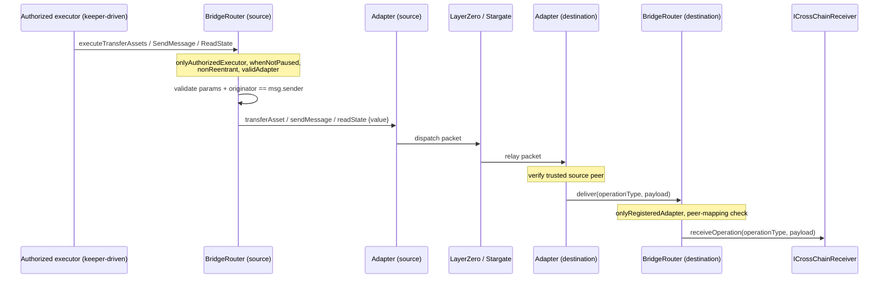

# Cross-Chain Overview

The cross-chain system lets the protocol move assets, send messages, and read remote state across EVM chains. It is built around three on-chain components — the **BridgeRouter**, a set of **registered bridge adapters** (LayerZero and Stargate), and the **CrossChainRegistry** — plus off-chain executors (keepers) that initiate operations.

## Live components

- **BridgeRouter** ([`router/bridge-router.md`](reference/router/bridge-router.md)) — the single entry point for outbound operations and the single sink for inbound deliveries. It validates parameters, pulls assets, applies a fee buffer, dispatches to a chosen adapter, and on the destination chain forwards delivered payloads to the recipient's `ICrossChainReceiver.receiveOperation`.
- **Bridge adapters** ([`adapters/stargate-adapter.md`](reference/adapters/stargate-adapter.md), [`adapters/layer-zero-adapter.md`](reference/adapters/layer-zero-adapter.md)) — protocol-specific shims. Stargate handles asset transfers (OFT-based); LayerZero handles messaging and `lzRead` state reads.
- **CrossChainRegistry** ([`contracts/cross-chain-registry.md`](reference/contracts/cross-chain-registry.md)) — governance-managed source of truth for which contracts may act as executors and which adapters are trusted peers across chains.

## Deprecated / legacy components

> The earlier fleet-level cross-chain vehicles — **`CrossChainArk`** and **`FleetProxy`** — are **deprecated**. Their implementations were removed from active source and moved to `packages/core-contracts/src/contracts/arks/legacy/CrossChainArk.sol.old` and `packages/core-contracts/src/contracts/legacy/FleetProxy.sol.old`. The orphan interfaces `ICrossChainArk` and `IFleetProxy` remain but have no active implementation. Documentation describing keeper-driven fleet rebalancing through these contracts (queue/execute, `withdrawAndTransfer`, `notifySourceChain`, `inflightAssets`) is obsolete. Only the bridge layer described on this page is live.

## Operation types

The router and adapters support three operation types, defined in [`BridgeTypes.OperationType`](reference/libraries/bridge-types.md):

- `TRANSFER_ASSET` — move ERC-20 assets to a recipient on another chain.
- `MESSAGE` — deliver an arbitrary message to a target contract on another chain.
- `READ_STATE` — request a remote view-function read and receive the response back on the originating chain.

## Live flow

An authorized executor (a contract registered in the registry as an `EXECUTOR_RELATIONSHIP`) initiates an operation on the router. The router validates and forwards it to a caller-specified adapter, which hands off to the underlying bridge. On the destination chain the peer adapter receives the packet, validates trust, and calls `BridgeRouter.deliver`, which routes to the recipient.

## Access and safety at a glance

- Outbound calls (`executeTransferAssets`, `executeSendMessage`, `executeReadState`) are gated by `onlyAuthorizedExecutor`, `whenNotPaused`, `nonReentrant`, and `validAdapter`. The router also enforces `params.originator == msg.sender`.
- Inbound `deliver` is gated by `onlyRegisteredAdapter` and (for `TRANSFER_ASSET` and `MESSAGE`) an `(sourceChainId, adapter)` peer-mapping check in the registry. `READ_STATE` deliveries skip the peer check and instead match the request's recorded adapter and originator.
- Governance can register/remove adapters and recover stuck assets; the guardian or governance can pause the router (unpause is governance-only).

See [Bridge Router and Adapters](bridge-router-and-adapters.md) and [Registry and Security](registry-and-security.md) for detail.
