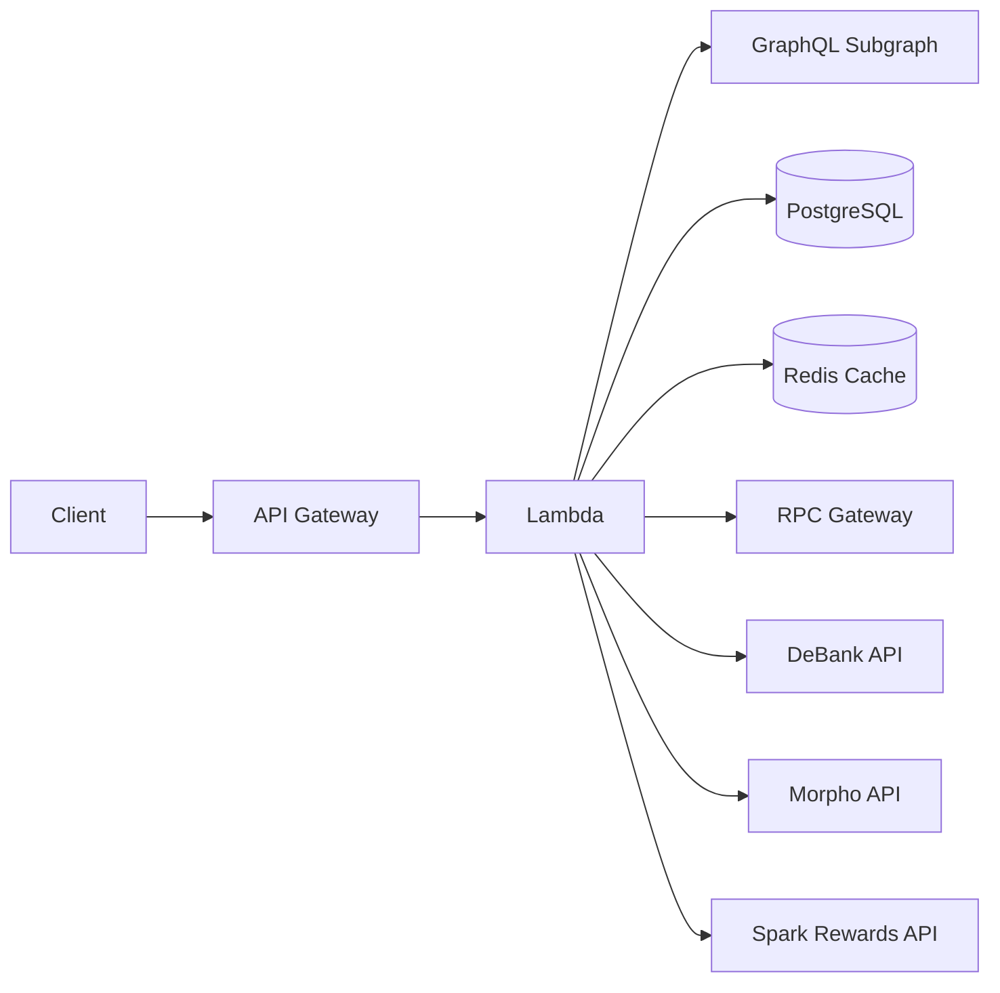

# APIs

The Summer.fi backend is a collection of AWS Lambda functions. Each function handles a discrete concern — rate/APY data, portfolio inspection, automation triggers, and external integrations — and is exposed through API Gateway routes. All functions are written in TypeScript and use the AWS Lambda Powertools logger and Zod for request validation.

> **TODO (human input):** Confirm the API Gateway base URL(s) for each environment (staging / production). None of the source files hard-code an externally visible hostname.

> **TODO (human input):** Confirm whether any of these endpoints require an API key, JWT, or other authentication header beyond the internal service tokens already present in stage variables.

## Endpoint index

### Rates and APY (`summerfi-api`)

| Function | Method | Path |
|---|---|---|
| get-rates | GET | `/api/rates/{chainId}` |
| get-rates (batch) | POST | `/api/rates` |
| get-rates (historical) | GET | `/api/historicalRates/{chainId}` |
| get-vault-rates | POST | `/api/vault/rates` |
| get-vault-rates (historical) | POST | `/api/vault/historicalRates` |
| get-apy | GET | `/api/apy/{chainId}/{protocol}` |

### Portfolio (`summerfi-api`)

| Function | Method | Path |
|---|---|---|
| portfolio-assets | GET | `(path from API Gateway stage variables)` |
| portfolio-overview | GET | `(path from API Gateway stage variables)` |

> **TODO (human input):** Confirm the exact API Gateway paths for portfolio-assets and portfolio-overview. The handlers only read `event.queryStringParameters`; no `rawPath` routing is present in their source.

### Triggers (`summerfi-api`)

| Function | Method | Path |
|---|---|---|
| get-triggers | GET | `(path from API Gateway stage variables)` |
| setup-trigger | POST | `/{chainId}/{protocol}/{trigger}` |

> **TODO (human input):** Confirm the base path prefix for get-triggers and setup-trigger.

### External and protocol integrations

| Function | Source | Method | Path |
|---|---|---|---|
| get-protocol-info (stats) | `external-api` | GET | `/` |
| get-protocol-info (users) | `external-api` | POST / GET | `/users` |
| get-protocol-info (all-users) | `external-api` | GET | `/all-users` |
| get-protocol-info (circulating-supply) | `external-api` | GET | `/circulating-supply` |
| get-collateral-locked | `external-api` | GET | `(path from API Gateway)` |
| get-campaign-data | `external-api` | GET | `/api/campaigns/{campaign}/{questNumber}/{walletAddress}` |
| get-migrations | `summerfi-api` | GET | `(path from API Gateway)` |
| get-morpho-claims | `summerfi-api` | GET | `(path from API Gateway)` |
| spark-rewards-claim | `summerfi-api` | GET | `(path from API Gateway)` |

## Data sources

## Common patterns

- **Validation** — all inputs pass through a `zod` schema; invalid requests return `400` with a `{ message, errors }` body.
- **Caching** — rate/APY functions use a distributed Redis cache keyed by a SHA-256 hash of the request parameters. Cache TTL varies by function (2 min for get-rates, 6 hours for get-apy).
- **Multi-chain** — most functions accept a numeric `chainId` query or path parameter. Where omitted, all supported chains are queried in parallel.
- **Error responses** — `500` responses return `{ error: string }` or `{ message: string }`.
