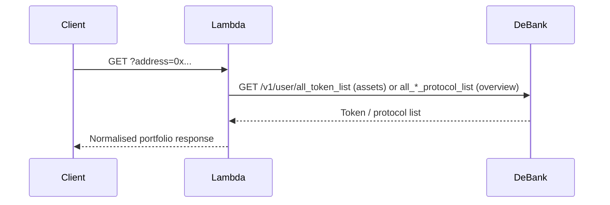

# Portfolio

Two Lambda functions power the portfolio section of the Summer.fi interface:

- **portfolio-assets-function** — returns all wallet-held tokens for an address, including USD values and 24h price changes.
- **portfolio-overview-function** — returns a high-level USD summary of an address's DeFi positions: supplied value, borrowed value, Summer.fi-specific net value, and total protocol exposure.

Both functions delegate to the **DeBank API** under the hood. The DeBank API key and base URL are injected via API Gateway stage variables or environment variables.

> **TODO (human input):** Confirm the API Gateway base URL and any required authentication headers.

---

## GET portfolio-assets

Returns a sorted list of wallet token balances across all supported networks.

### Query parameters

| Parameter | Type | Required | Description |
|---|---|---|---|
| `address` | Ethereum address | yes | The wallet address to inspect |

### Response `200`

```json
{
  "totalAssetsUsdValue": 12345.67,
  "totalAssetsPercentageChange": 0,
  "assets": [
    {
      "name": "Ethereum",
      "symbol": "ETH",
      "network": "ethereum",
      "priceUSD": 3400.00,
      "price24hChange": 0.015,
      "balance": 2.5,
      "balanceUSD": 8500.00,
      "id": "eth"
    }
  ]
}
```

`assets` is sorted by `balanceUSD` descending. Tokens with `price == 0` or `is_wallet == false` are excluded. Only tokens on networks present in the protocol's supported `NetworkNames` enum are returned. `totalAssetsPercentageChange` is always `0` in the current implementation (not yet computed).

### Response `400`

Returned when `address` is missing or not a valid Ethereum address.

```json
{ "message": "..." }
```

---

## GET portfolio-overview

Returns aggregate USD values for a wallet's DeFi protocol exposure, with Summer.fi positions broken out separately.

### Query parameters

| Parameter | Type | Required | Description |
|---|---|---|---|
| `address` | Ethereum address | yes | The wallet address to inspect |

### How values are computed

The function makes two parallel calls to DeBank:

1. `GET /v1/user/all_simple_protocol_list` — all protocol positions across supported chains. `allAssetsUsdValue` is the sum of `net_usd_value` across this list.
2. `GET /v1/user/all_complex_protocol_list` — complex (multi-asset) protocol positions. The result is filtered to Summer.fi positions only via `getSupportedPositions`. From this filtered set:
   - `suppliedUsdValue` = sum of `stats.asset_usd_value`
   - `borrowedUsdValue` = sum of `stats.debt_usd_value`
   - `summerUsdValue` = sum of `stats.net_usd_value`

Both calls use the same set of supported DeBank chain IDs (`DEBANK_SUPPORTED_CHAIN_IDS`).

### Response `200`

```json
{
  "suppliedUsdValue": 8500.00,
  "suppliedPercentageChange": 0,
  "borrowedUsdValue": 3200.00,
  "borrowedPercentageChange": 0,
  "summerUsdValue": 5300.00,
  "summerPercentageChange": 0,
  "allAssetsUsdValue": 42000.00
}
```

`*PercentageChange` fields are all `0` in the current implementation (not yet computed).

### Response `400`

Returned when `address` is missing or not a valid Ethereum address.

### Response `500`

Returned if the DeBank calls fail.

---

## Architecture note



The functions do not cache responses. DeBank is authorised with an `Accesskey` header whose value comes from the `DEBANK_API_KEY` stage variable.
