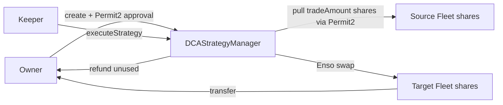

# Dollar-Cost Averaging (DCA)

The [`DCAStrategyManager`](../contracts/core/reference/contracts/DCA/dca-strategy-manager.md) lets a user automate recurring conversions from one Fleet position into another — dollar-cost averaging between two FleetCommander vaults. A permissioned keeper triggers each trade, but the strategy is entirely **user-owned**, and the contract **holds no funds between transactions**.

## Stateless ownership via commitments

There is no per-strategy owner mapping. Instead, ownership is proven statelessly:

- On creation the contract stores `keccak256(abi.encode(config))` as the strategy's **commitment hash** (`strategyCommitments[strategyId]`). The full `StrategyConfig` is never stored on-chain.
- Every owner-gated function (`editStrategy`, `pauseStrategy`, `resumeStrategy`, `cancelStrategy`) takes the full `StrategyConfig` as calldata, recomputes the hash, checks it against the stored commitment, and then checks `msg.sender == config.owner`. A mismatch reverts with `CommitmentMismatch`; the **commitment hash is the authorization proof**.
- `strategyId` is the mapping key only — it is *not* part of the hashed payload, and is passed as an explicit argument.
- `activeCommitments[hash]` blocks duplicate strategies in O(1). Terminal states (`CANCELLED`, `COMPLETED`) do not free the entry; a genuine edit naturally produces a fresh hash.

## Configuration bounds

`_validateStrategyConfig` enforces, among others:

- **Interval**: at least **1 day** (`_MIN_INTERVAL`) and at most **90 days** (`_MAX_INTERVAL`).
- **`maxTrades`**: a `uint256`, must be non-zero (`ZeroMaxTrades`).
- **`tradeAmount`**: non-zero (`ZeroTradeAmount`).
- **Slippage**: at most 50% in BPS (`InvalidSlippage`).
- Source and target vaults must differ and be active FleetCommanders; `inAsset`/`outAsset` must match the respective vault assets.
- Optional Chainlink price-guard bounds (`minPrice` / `maxPrice`) and oracle feed addresses.

## Execution

A keeper calls `executeStrategy(strategyId, config, ensoData)` — gated `onlyKeeper`. The flow:

1. Verify the config matches the stored commitment and that the strategy is `ACTIVE`.
2. Pre-flight terminal checks: if `tradesExecuted >= maxTrades` or `endDate` has passed, the strategy auto-completes (`StrategyCompleted`) instead of trading. If the execution window (`nextTriggerAt`) has not arrived, it reverts with `ExecutionWindowNotReached`.
3. Fetch oracle prices, enforce the price-guard bounds, and compute a slippage-adjusted `minOut`.
4. **Pull exactly `tradeAmount` source-vault shares from the strategy owner via Permit2** `AllowanceTransfer`. The manager never holds a standing ERC20 approval; the owner pre-authorizes the recurring pull by approving `sourceVault → Permit2` and `Permit2 → manager`.
5. Route those shares through the **Enso aggregator** (`_ensoSwap`) into target-vault shares, verify the output clears `minOut` (`SwapOutputBelowMinOut`), and transfer the resulting target shares to the owner. Any source shares the router did not consume are refunded to the owner.
6. Advance state (`tradesExecuted`, `nextTriggerAt`, `lastScheduledAt`) **before** the swap (effects-before-interactions), and auto-complete the strategy if this was the last trade.

## Creating and managing strategies

`createStrategy` registers a strategy whose source shares the user already holds. `depositAndCreate` is a convenience entry point that pulls the underlying `inAsset`, deposits it into `config.sourceVault` (shares routed directly to the user), and registers the strategy in one transaction. Permit2 variants (`createStrategyWithPermit2`, `depositAndCreateWithPermit2`) set up the recurring sub-allowance via a signed permit, and validate up front that the signed allowance covers the worst-case spend (`tradeAmount * maxTrades`) and remains valid until `endDate`.

`editStrategy` re-keys the commitment but **disallows ownership transfer** (`newConfig.owner` must equal `oldConfig.owner`). `pauseStrategy` / `resumeStrategy` toggle the `ACTIVE`/`PAUSED` status, and `cancelStrategy` moves a non-terminal strategy to `CANCELLED`. `checkUpkeep` is a view used by keepers to decide whether a strategy is due, factoring in status, timing, trade count, end date, and price guards.
