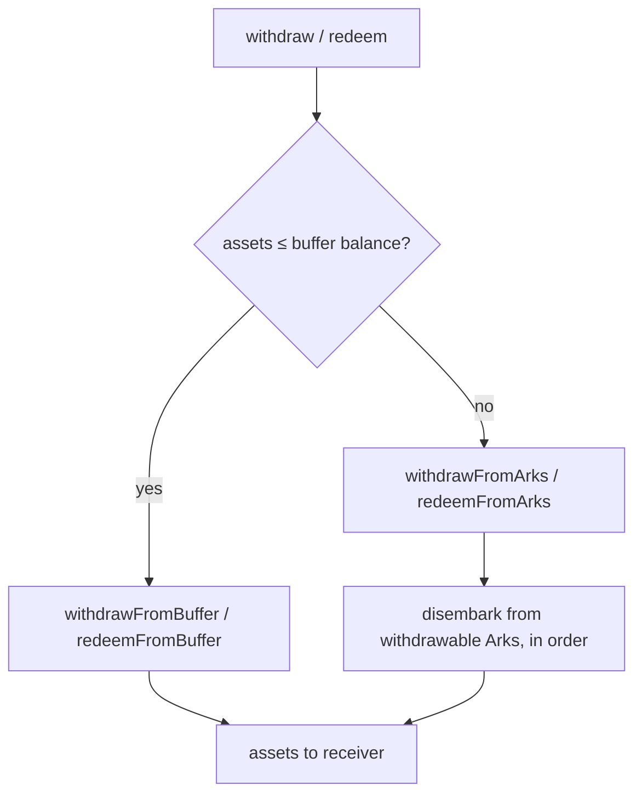

# Deposits, Withdrawals and the Buffer

A Fleet is an ERC4626 vault, so depositing and withdrawing follow the standard interface — but the routing of funds through the **BufferArk** and the protocol's withdrawability accounting add important nuance. This page covers how value enters and leaves a [`FleetCommander`](../contracts/core/reference/contracts/fleet-commander.md).

## Depositing and minting

Users add capital with `deposit(assets, receiver)` or `mint(shares, receiver)`. Both:

1. Validate the amount against `maxDeposit` / `maxMint` (which enforce the Fleet-wide `depositCap` and the caller's balance) and revert with `FleetCommanderZeroAmount` on a zero amount.
2. Mint ERC4626 shares to the receiver.
3. **Board the assets into the BufferArk** via `_board`, so newly deposited capital sits idle and immediately withdrawable until a keeper rebalances it into yield-bearing Arks.

A convenience overload `deposit(assets, receiver, referralCode)` emits a `FleetCommanderReferral` event and then performs the same deposit.

`maxDeposit(owner)` returns `depositCap - totalAssets` (or zero if the cap is reached), bounded by the owner's asset balance. `totalAssets()` includes everything held across all Arks plus the buffer.

## The buffer and instant withdrawals

The **BufferArk** holds undeployed assets so the Fleet can serve withdrawals without unwinding external positions. Its `totalAssets()` is simply its token balance, and it is always fully withdrawable.

Withdrawals are routed automatically:

- `withdraw(assets, …)` checks whether `assets <= bufferBalance`. If so it calls `withdrawFromBuffer`; otherwise it falls through to `withdrawFromArks`.
- `redeem(shares, …)` compares the requested shares against the buffer balance expressed in shares and routes to `redeemFromBuffer` or `redeemFromArks` accordingly.

Passing `MAX_UINT256` as the amount redeems/withdraws the owner's entire position. Buffer-only paths (`withdrawFromBuffer`, `redeemFromBuffer`) are capped by `maxBufferWithdraw` / `maxBufferRedeem`, which is the minimum of the buffer balance and the owner's share value.

When a withdrawal exceeds the buffer, `_forceDisembarkFromSortedArks` pulls assets from withdrawable Arks one at a time until the requested amount is satisfied, draining each Ark in turn.

## Arks are not always instantly withdrawable

A crucial point: **only the buffer is guaranteed instantly withdrawable.** An Ark's availability depends on the external venue's liquidity and on the Ark's own configuration.

Each Ark exposes `withdrawableTotalAssets()`. In the base [`Ark`](../contracts/core/reference/contracts/ark.md):

- If the Ark has `requiresKeeperData == true`, `withdrawableTotalAssets()` returns **0** — it cannot be drained in the synchronous user path and needs keeper-supplied data (e.g. asynchronous-redemption Arks such as those built on [`ArkWithWithdrawalRequest`](../contracts/core/reference/contracts/ark-with-withdrawal-request.md)).
- Otherwise it returns the Ark-specific `_withdrawableTotalAssets()`, which conservatively reflects what can actually be pulled given the underlying protocol's available liquidity.

The Fleet aggregates these into `withdrawableTotalAssets()` (buffer plus all withdrawable Arks). This value — not `totalAssets()` — bounds user exits.

## How withdrawable caps bound exits

The ERC4626 `maxWithdraw` and `maxRedeem` views are derived from `withdrawableTotalAssets()`, not total assets:

- `maxWithdraw(owner) = min(withdrawableTotalAssets(), previewRedeem(balanceOf(owner)))`
- `maxRedeem(owner) = min(convertToShares(withdrawableTotalAssets()), balanceOf(owner))`

Ark-path withdrawals are validated against these maxima and revert with `ERC4626ExceededMaxWithdraw` / `ERC4626ExceededMaxRedeem` if exceeded. So even though a user owns shares worth a given amount, they can only withdraw up to what is currently liquid across the buffer and withdrawable Arks. If external liquidity is low, or positions need keeper-driven redemption, a user may need to withdraw in tranches as liquidity frees up.

Finally, every user-facing entry point carries `whenNotPaused`: when the Fleet is paused, deposits and withdrawals revert entirely. See [Rebalancing](rebalancing.md) for how keepers keep the buffer topped up.
