# Fees and Tips

The Earn Protocol funds its operations through **tips** — a continuously accruing fee taken in vault shares — and recycles harvested reward tokens through a **Raft** auction system and a **BuyAndBurn** mechanism. This page explains how each piece accrues value and where it flows.

## Tip accrual (the Tipper)

Every Fleet inherits [`Tipper`](../contracts/core/reference/contracts/tipper.md), which charges a time-based assets-under-management fee. The fee is taken by **minting new shares** to the TipJar rather than transferring assets, slightly diluting existing holders to pay for protocol operations.

Key mechanics:

- `tipRate` is a `Percentage` (18-decimal precision) and is hard-capped at **5%** (`MAX_TIP_RATE`); `setTipRate` (governor-only) and the constructor both reject higher values.
- `previewTip` scales the annual rate by elapsed time (`timeElapsed * tipRate / SECONDS_PER_YEAR`) and applies it to the supply *excluding* shares already held by the TipJar, so the TipJar's own balance is not re-tipped.
- `_accrueTip` mints the computed shares to the TipJar and updates `lastTipTimestamp`. The Fleet wraps every state-changing user action in a `collectTip` modifier so accrual happens before deposits, withdrawals, and rebalances. `totalSupply()` transparently includes not-yet-minted accrued tip shares in view contexts.

### Performance fees (the FlexibleTipper)

[`FlexibleTipper`](../contracts/core/reference/contracts/flexible-tipper.md) extends the base Tipper with an optional **high-water-mark (HWM)** performance fee. It supports three modes: `AUM` (time-based, the original behavior), `PERFORMANCE` (HWM-based only), and `BOTH`. A performance fee is charged only when the assets-per-share ratio exceeds the highest ratio ever recorded; after a drawdown, no performance fee is taken until the old HWM is surpassed. The performance fee rate is capped at **50%** (`MAX_PERFORMANCE_FEE_RATE`) and, like the AUM fee, is collected by minting shares to the TipJar. The HWM is global (per-share, not per-user) — an intentional choice to preserve ERC4626 share fungibility.

## Distributing tips (the TipJar)

Accrued tip shares accumulate in the [`TipJar`](../contracts/core/reference/contracts/tip-jar.md). Calling `shake(fleetCommander)` (keeper-only) redeems the TipJar's shares in that Fleet for underlying assets and distributes them:

- Each configured **tip stream** receives its `allocation` (a `Percentage`) of the redeemed assets; the last stream that brings the running total to 100% absorbs rounding dust.
- Any remainder is sent to the protocol `treasury()`.

Governance manages streams with `addTipStream`, `updateTipStream`, and `removeTipStream`. The total allocation across streams may not exceed 100%, individual allocations must be non-zero and in range, and a stream may be locked until a future epoch (capped at 750 days). `shakeMultiple` and `shakeAll` batch the operation across Fleets.

```mermaid
flowchart TD
    Fleet["FleetCommander: mints tip shares"] --> TipJar
    TipJar -->|shake: redeem shares| Assets[underlying assets]
    Assets --> S1[Tip stream 1]
    Assets --> S2[Tip stream 2]
    Assets --> Treasury[Treasury &#40;remainder&#41;]
    Ark -->|harvest / sweep| Raft
    Raft -->|Dutch auction| RewardBuyers[buyers pay in vault asset]
    RewardBuyers -->|board proceeds| Ark
    Treasury2[tokens] --> BuyAndBurn
    BuyAndBurn -->|Dutch auction, paid in SUMR| Burn["burn SUMR"]
```

## Recycling rewards (the Raft)

Yield-bearing Arks often earn reward tokens (incentives, governance tokens). The [`Raft`](../contracts/core/reference/contracts/raft.md) collects and monetizes these. It is the **only** contract allowed to call an Ark's `harvest` and `sweep` (both `onlyRaft` on the Ark side).

- `harvest` (super-keeper gated internally) pulls reward tokens from an Ark into the Raft, accumulating them in `obtainedTokens`.
- `sweep` rescues stray tokens, restricted to a curator-maintained sweepable whitelist and a governance-maintained non-sweepable blacklist (e.g. receipt tokens are protected).
- `startAuction` (or `harvestAndStartAuction` / `sweepAndStartAuction`) opens a **Dutch auction** selling the collected reward token for the Ark's underlying asset. Buyers call `buyTokens`; once sold out or finalized, the proceeds are **boarded back into the originating Ark**, compounding the reward into the strategy. Unsold tokens roll into the next auction. Per-Ark, per-token auction parameters are required before an auction can start.

## Buy and burn

The [`BuyAndBurn`](../contracts/core/reference/contracts/buy-and-burn.md) contract runs Dutch auctions that sell protocol-held tokens **for the `$SUMR` token**, then burns every `$SUMR` raised. `startAuction` opens an auction for a token's full balance (paid in SUMR, with proceeds routed to `treasury()` as the auction's payment target), `buyTokens` lets buyers purchase, and on settlement the raised SUMR is burned via `summerToken.burn`, emitting `SummerBurned`. This creates deflationary pressure on SUMR funded by protocol revenue.
