# Fleets and Arks

The Earn Protocol is built on two core building blocks: **Fleets** and **Arks**. A Fleet is the vault users interact with; Arks are the isolated adapters that actually deploy capital into external yield sources. This separation lets a single user-facing vault diversify across many protocols while keeping each integration contained.

## The core model

A **Fleet** is a [`FleetCommander`](../contracts/core/reference/contracts/fleet-commander.md) — a standard ERC4626 vault. Users `deposit` an underlying asset (e.g. USDC) and receive fungible shares; the share price tracks the Fleet's total assets across all of its Arks. Because it is ERC4626, a Fleet exposes the familiar `deposit`, `mint`, `withdraw`, `redeem`, and `convertTo*` interface.

An **Ark** is an adapter contract (see [`Ark`](../contracts/core/reference/contracts/ark.md)) that wraps a single external strategy or protocol — for example an Aave V3 market, a Morpho vault, a Pendle position, or a real-world-asset custodian. Each Ark holds only its own position; a problem in one Ark cannot directly touch the assets held by another. Roughly forty protocol Arks ship with the protocol, all extending the same abstract `Ark` base.

Every Fleet also owns one special Ark: the **BufferArk** (see [`BufferArk`](../contracts/core/reference/contracts/arks/buffer-ark.md)). The buffer holds idle, undeployed assets so that withdrawals can be served instantly. It is created automatically in the `FleetCommanderConfigProvider` constructor and is treated as a first-class member of the Fleet's accounting.

```mermaid
flowchart TD
    User -->|deposit / withdraw| FC[FleetCommander &#40;ERC4626 Fleet&#41;]
    FC -->|board / disembark| Buffer[BufferArk: idle assets]
    FC -->|rebalance: move| Ark1[AaveV3Ark]
    FC -->|rebalance: move| Ark2[MorphoVaultArk]
    FC -->|rebalance: move| Ark3[PendlePTArk]
    Ark1 --> AaveProtocol[Aave V3]
    Ark2 --> MorphoProtocol[Morpho]
    Ark3 --> PendleProtocol[Pendle]
```

## Only the commander moves funds

The defining security property of an Ark is that **only its registered FleetCommander can move its funds**. An Ark's `board` (deposit into the strategy), `disembark` (withdraw from the strategy), and `move` (transfer between Arks) functions are all gated to the commander. The commander address starts as `address(0)` and is set exactly once when the Fleet calls `registerFleetCommander()` — and an Ark refuses to register a second commander.

The Fleet drives this through internal `_board`, `_disembark`, and `_move` helpers: deposits flow into the BufferArk, and the keeper-driven `rebalance` flow moves assets between Arks. Harvesting and sweeping are the only fund-touching operations restricted to a different role: the [`Raft`](../contracts/core/reference/contracts/raft.md) (see [Fees and Tips](fees-and-tips.md)).

## Per-Ark deposit caps

Each Ark constrains how much capital the Fleet may route into it. Two limits combine to form the **effective deposit cap**:

- An absolute `depositCap` (in token units), set per Ark.
- A `maxDepositPercentageOfTVL`, a percentage of the Fleet's total assets.

`getEffectiveArkDepositCap` returns the **lower** of the percentage-based cap and the absolute cap. During rebalancing the Fleet reverts with `FleetCommanderEffectiveDepositCapExceeded` if an inflow would push an Ark's allocation above this effective cap. Arks also carry independent `maxRebalanceInflow` and `maxRebalanceOutflow` limits that bound how much can move in or out per operation.

Governance manages the Ark set: `addArk` validates that the Ark's asset matches the Fleet's asset and registers the commander; `removeArk` only succeeds once the Ark's deposit cap is zero and it holds no assets, preventing accidental removal of a funded adapter.

## Why isolation matters

Because each Ark is a self-contained adapter with its own caps and its own external integration, the Fleet can offer a single, diversified yield product while bounding the blast radius of any one venue. Curators tune caps and rebalance limits per Ark; the commander-only invariant ensures no external party can extract an Ark's funds.

For mechanics of moving capital in and out, see [Deposits, Withdrawals and the Buffer](deposits-withdrawals-buffer.md) and [Rebalancing](rebalancing.md).
