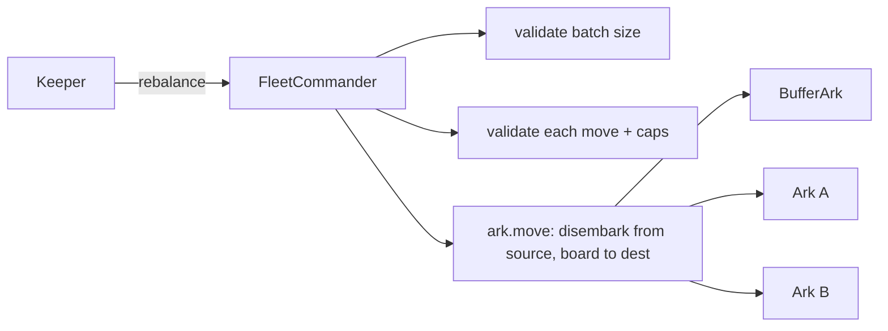

# Rebalancing

Deposited capital lands in the BufferArk idle. **Rebalancing** is how that capital gets deployed into yield-bearing Arks, and how allocations are tuned over time — all within the limits curators and governance configure. Rebalancing is keeper-driven and bounded; it never moves a user's funds out of the Fleet, only between Arks.

## Who can rebalance

The [`FleetCommander`](../contracts/core/reference/contracts/fleet-commander.md) exposes two entry points:

- `rebalance(RebalanceData[])` — `onlyKeeper`, and additionally subject to a cooldown via `enforceCooldown`. This is the normal operational path.
- `forceRebalance(RebalanceData[])` — `onlyGovernor`, with no cooldown. Reserved for governance interventions.

Both collect the protocol tip first (`collectTip`) and require the Fleet to be unpaused. The rebalance cooldown itself is configurable through `updateRebalanceCooldown` (curator-gated).

Each `RebalanceData` entry names a `fromArk`, a `toArk`, an `amount`, and optional `boardData` / `disembarkData` forwarded to the Arks. Using `MAX_UINT256` as the amount moves the source Ark's entire balance (except when moving *out of* the buffer — see below).

## Validation and caps

Before executing, the Fleet runs two layers of validation.

`_validateReallocateAllAssets` checks the batch shape: it reverts with `FleetCommanderRebalanceNoOperations` on an empty array and `FleetCommanderRebalanceTooManyOperations` if the batch exceeds `maxRebalanceOperations` (capped at the `MAX_REBALANCE_OPERATIONS` constant of 50).

`_validateReallocateAssets` checks each individual move:

- Amount must be non-zero (`FleetCommanderRebalanceAmountZero`).
- Both Arks must be active or the buffer (`FleetCommanderArkNotActive`) and non-zero addresses (`FleetCommanderArkNotFound`).
- The destination Ark's `depositCap` must be non-zero (`FleetCommanderArkDepositCapZero`).
- The move must respect the source Ark's `maxRebalanceOutflow` (`FleetCommanderExceedsMaxOutflow`) and the destination's `maxRebalanceInflow` (`FleetCommanderExceedsMaxInflow`).

Then `_reallocateAssets` enforces the **effective deposit cap** of the destination: if `toArkAllocation + amount` would exceed `getEffectiveArkDepositCap(toArk)` (the lower of the percentage-of-TVL cap and the absolute cap), it reverts with `FleetCommanderEffectiveDepositCapExceeded`. The actual transfer happens through the Ark's commander-only `move`. See [Fleets and Arks](fleets-and-arks.md) for how these caps are defined.

## Managing the buffer

The buffer is special. `_validateAdjustBuffer` inspects every operation that touches the BufferArk and computes the **net** change to the buffer balance across the batch. Two rules apply:

- You **cannot** use `MAX_UINT256` as the amount when moving funds *out of* the buffer (`FleetCommanderCantUseMaxUintMovingFromBuffer`). The full-balance shortcut is only allowed when moving *into* the buffer.
- If the batch nets a withdrawal from the buffer, `_validateBufferExcessFunds` enforces that the buffer starts above `minimumBufferBalance` (else `FleetCommanderNoExcessFunds`) and that only the **excess** above that minimum is moved (else `FleetCommanderInsufficientBuffer`).

This guarantees the buffer never drops below its configured minimum during rebalancing, preserving the instant-withdrawal liquidity described in [Deposits, Withdrawals and the Buffer](deposits-withdrawals-buffer.md). The minimum itself, the Fleet deposit cap, and per-Ark caps are all adjusted by curators through the [`FleetCommanderConfigProvider`](../contracts/core/reference/contracts/fleet-commander-config-provider.md).

## In practice

Keepers continuously: deploy excess buffer into the highest-yielding Arks within caps, top the buffer back up when withdrawals draw it down, and shift allocations as venue yields change — always within the outflow/inflow and deposit-cap guardrails. Because every move is validated against caps and the buffer minimum, rebalancing optimizes yield without compromising the Fleet's withdrawal guarantees or Ark isolation.
