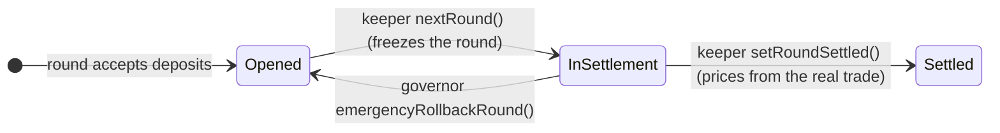

# RWA Arks and Asynchronous Settlement

RWA Arks connect a Fleet to **regulated fund tokens** — tokenized treasuries, money-market funds and private credit. They are ordinary [Arks](fleets-and-arks.md) with one complication: several of the underlying funds settle **off-chain on a T+1 schedule** against a net-asset-value (NAV) strike, which the protocol handles with an asynchronous batch layer rather than moving capital synchronously.

## The connector family

Each connector adapts one issuer and reports a conservative valuation into the Fleet's share price. They differ mainly in how a buy (USDC → fund token) and a sell (fund token → USDC) settle:

| Issuer / Ark | Example tokens | Buy | Sell | Valuation |
| --- | --- | --- | --- | --- |
| [Franklin Templeton](../contracts/core/reference/contracts/arks/benji-ark.md) | BENJI | Atomic on-chain, 1:1 par via SwapPool | Atomic on-chain, 1:1 par (+ DEX escape hatch) | Fixed $1 par, no oracle |
| [Superstate — Subscribe](../contracts/core/reference/contracts/arks/superstate-subscribe-ark.md) | USTB | Atomic on-chain via `subscribe()` | Async (pending-withdrawal + slippage-banded sweep) | NAV oracle, 24h staleness bound |
| [Superstate — Standard](../contracts/core/reference/contracts/arks/superstate-standard-ark.md) | USTB, USCC | Off-chain, T+1/T+2 | Off-chain, T+1/T+2 | NAV oracle, 24h staleness bound |
| [Securitize](../contracts/core/reference/contracts/arks/securitize-ark.md) | VBILL, ACRED-class | Atomic on-chain (signed subscription mints same tx) | Off-chain, T+1 (no on-chain off-ramp) | RedStone NAV oracle |
| [WisdomTree](../contracts/core/reference/contracts/arks/wisdom-tree-ark.md) | WTGXX (MMF), CRDYX (credit) | Off-chain, T+1 (USDC to custodian) | Off-chain, T+1 | Chainlink NAV oracle, 24h staleness bound |
| [Maple institutional](../contracts/core/reference/contracts/arks/maple-institutional-ark.md) | Maple/Syrup pools | Synchronous ERC4626 deposit | Queued redemption (escrowed shares) | Pool-reported |

The full protocol catalog lives in the [Ark Catalog](../contracts/ark-catalog.md).

## Why settlement can't always be synchronous

When a fund is valued by an off-chain NAV strike published on a predictable schedule, a naive synchronous vault would let a fast actor **sandwich the strike** — mint shares cheap just before a favourable NAV update and redeem just after — extracting value from the other depositors. The asynchronous batch layer removes that surface by pricing user activity against the *actual* settlement trade rather than a live preview.

## Rounds: the asynchronous batch layer

For T+1 Fleets the entry path is a [`RoundsVault`](../contracts/core/reference/contracts/rounds-vault/rounds-vault-base.md) pair: a [`RoundsVaultInput`](../contracts/core/reference/contracts/rounds-vault/rounds-vault-input.md) (USDC in → Fleet shares) and a [`RoundsVaultOutput`](../contracts/core/reference/contracts/rounds-vault/rounds-vault-output.md) (Fleet shares in → USDC). Users deposit into the **currently open round** and receive an ERC-1155 receipt for that round; a keeper then advances and settles rounds:

1. Users deposit during an **Opened** round and hold transferable receipts; they can exit freely while the round is open.
2. `nextRound()` freezes the round's total as a liability and opens the next round (users are never locked out of joining the queue).
3. Once the underlying Ark actually settles off-chain, `setRoundSettled()` executes the trade against the Fleet in one operation and snapshots the round's exchange rate **from the amount the trade really returned** — not a preview, not an oracle.
4. Receipt holders redeem at that snapshotted rate whenever they like. NAV drift between request and settlement lands **pro-rata on that round's participants and on no one else**.

## Recovery and safeguards

- **Stuck-round recovery.** A round whose settlement reverts can be rolled back by the Governor (`emergencyRollbackRound`, InSettlement → Opened) and retried by the keeper — settled rounds are terminal.
- **Oracle discipline.** Every conversion enforces a positive answer and a 24h staleness bound; a stale feed halts settlement rather than valuing blind.
- **Slippage-banded settlement.** Keeper settlement verifies received amounts against oracle-implied expectations within a capped band; a short delivery reverts rather than silently repricing the Fleet, with governor-only overrides for genuine partials.
- **Freeze mechanism.** For ex-dividend windows (e.g. CRDYX), a connector's valuation can be frozen at a snapshot and its flows quarantined until the venue normalizes.
- **Pending-state accounting.** In-flight deposits/withdrawals are tracked explicitly, with the live share balance frozen during a deposit cycle, so `totalAssets()` can never double-count wired cash and freshly minted fund tokens.

## Discovery

Rounds-vault pairs are registered in a [`RoundsVaultRegistry`](../contracts/core/reference/contracts/rounds-vault/rounds-vault-registry.md), the on-chain discovery root that the institutional subgraph reads to index every Fleet's rounds, receipts and settlement rates.
