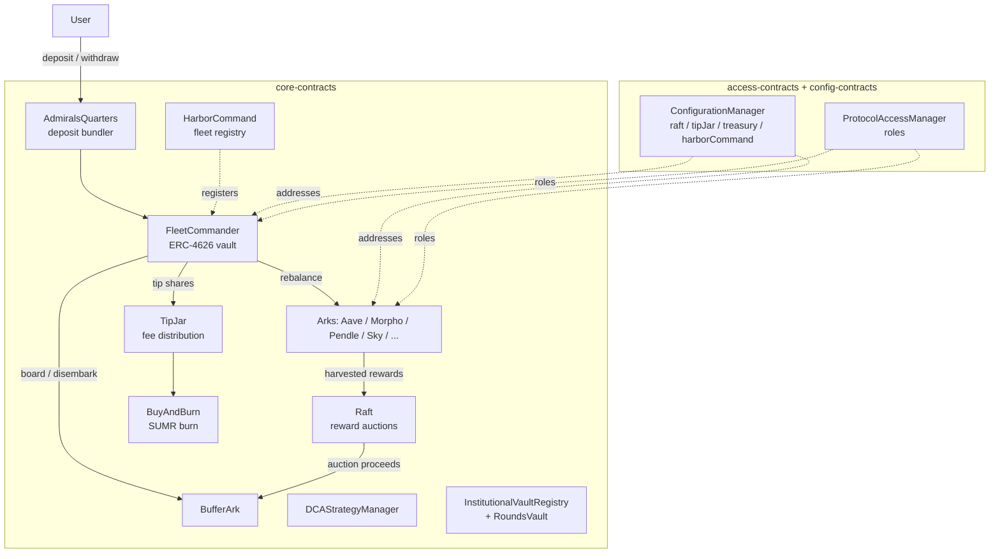
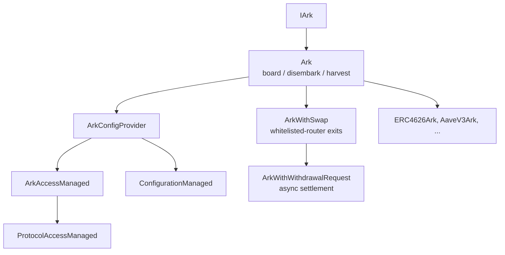

# Smart Contracts Architecture Overview

The Summer.fi Earn Protocol is organised around two roles: a **FleetCommander** (an ERC-4626 vault that takes user deposits in a single asset) and a set of **Arks** (adapters that each wrap one external yield source). A FleetCommander never holds yield-bearing positions directly; it routes capital to its Arks and keeps idle liquidity in a dedicated `BufferArk`. A thin periphery handles fee accrual, reward auctions, deposit bundling, and protocol-wide registries, while sibling packages provide shared access control, configuration, and cross-chain plumbing.

This page is the system map. For behavioural detail see the linked [concept](../concepts/) pages; for per-contract APIs see the generated reference under [`core/reference/contracts/`](core/reference/contracts/); for permission detail see the [Security & Audits](../security/README.md) section.

## Contract-system map

## FleetCommander (the vault)

[`FleetCommander`](core/reference/contracts/fleet-commander.md) is the user-facing ERC-4626 vault. It inherits a layered spine: [`FleetCommanderConfigProvider`](core/reference/contracts/fleet-commander-config-provider.md) tracks the active Ark set and `FleetConfig`; [`FleetCommanderPausable`](core/reference/contracts/fleet-commander-pausable.md) adds a guardian pause with a 2-day minimum pause window; [`FleetCommanderCache`](core/reference/contracts/fleet-commander-cache.md) snapshots Ark `totalAssets` during deposit/withdraw to avoid repeated external calls; and [`Tipper`](core/reference/contracts/tipper.md) accrues management fees. Deposits land in the buffer and are later spread across Arks by keepers via rebalancing; withdrawals pull from the buffer first and fall back to Arks. See [Fleets & Arks](../concepts/fleets-and-arks.md), the [deposit/withdrawal buffer](../concepts/deposits-withdrawals-buffer.md), and [rebalancing](../concepts/rebalancing.md).

The config provider has governance and whitelist variants — [`fleet-commander-config-provider-dao.md`](core/reference/contracts/fleet-commander-config-provider-dao.md) and [`fleet-commander-config-provider-whitelist.md`](core/reference/contracts/fleet-commander-config-provider-whitelist.md) — used to assemble the public DAO fleet and gated institutional fleets respectively.

## The Ark family

Arks share a common inheritance spine and differ only in how they talk to their external protocol:

[`Ark`](core/reference/contracts/ark.md) is the abstract base defining the `_board`, `_disembark`, `_harvest`, and `_withdrawableTotalAssets` hooks every adapter implements. It composes [`ArkConfigProvider`](core/reference/contracts/ark-config-provider.md) (holds `ArkConfig`), which composes [`ArkAccessManaged`](core/reference/contracts/ark-access-managed.md) (gates `board`/`disembark` to the commander, Raft, and sibling Arks). Two abstract extensions add exit machinery: [`ArkWithSwap`](core/reference/contracts/ark-with-swap.md) routes exits through a curator-whitelisted DEX-aggregator router under a curator-set slippage bound, and [`ArkWithWithdrawalRequest`](core/reference/contracts/ark-with-withdrawal-request.md) (which inherits `ArkWithSwap`) adds the asynchronous `requestWithdrawal` / `claimWithdrawal` flow for sources that settle off-chain. Concrete Arks (e.g. [`erc4626-ark.md`](core/reference/contracts/arks/erc4626-ark.md), [`aave-v3-ark.md`](core/reference/contracts/arks/aave-v3-ark.md)) live under [`core/reference/contracts/arks/`](core/reference/contracts/arks/). [`BufferArk`](core/reference/contracts/arks/buffer-ark.md) is the special idle-liquidity Ark every fleet owns.

## Fees, rewards, and burning

Fee accrual is built into the vault via `Tipper` and its [`FlexibleTipper`](core/reference/contracts/flexible-tipper.md) extension, which adds high-water-mark performance fees on top of the AUM fee. Accrued fees are minted as vault shares and stream to the [`TipJar`](core/reference/contracts/tip-jar.md), which redeems and distributes them. Harvested Ark rewards flow to the [`Raft`](core/reference/contracts/raft.md), which runs Dutch auctions (shared `AuctionManagerBase` / `DutchAuctionLibrary`) to convert them into the fleet asset and board the proceeds back into the buffer. [`BuyAndBurn`](core/reference/contracts/buy-and-burn.md) similarly auctions collected value to buy and burn the `SUMR` token. See [Fees & Tips](../concepts/fees-and-tips.md).

## Periphery, registries, and specialised vaults

[`AdmiralsQuarters`](core/reference/contracts/admirals-quarters.md) is the user-facing router/bundler: it batches Permit2 pulls, swaps, FleetCommander deposits, and rewards-manager staking through a `ProtectedMulticall`, so an entry can be composed in one transaction. [`HarborCommand`](core/reference/contracts/harbor-command.md) is the governance-gated registry of authorised FleetCommanders — the protocol's source of truth for which fleets are official. [`DCAStrategyManager`](core/reference/contracts/DCA/dca-strategy-manager.md) lets a keeper execute user-owned dollar-cost-averaging strategies that swap fleet shares over time; it holds no funds and verifies ownership statelessly (see [DCA](../concepts/dca.md)). For institutions, the [`InstitutionalVaultRegistry`](core/reference/contracts/institutional-vault-registry.md) records gated institution metadata and the rounds-vault contracts ([`rounds-vault-base.md`](core/reference/contracts/rounds-vault/rounds-vault-base.md), `-input`, `-output`, [`-registry`](core/reference/contracts/rounds-vault/rounds-vault-registry.md)) implement round-based deposit/redemption against a target fleet.

## Dependencies on sibling packages

Core contracts do not implement their own auth or wiring. **access-contracts** supplies `ProtocolAccessManager` and the `ProtocolAccessManaged` mixin, defining the role set (`GOVERNOR_ROLE`, `SUPER_KEEPER_ROLE`, `GUARDIAN_ROLE`, `ADMIRALS_QUARTERS_ROLE`, plus per-contract `CURATOR_ROLE` / `KEEPER_ROLE` / `COMMANDER_ROLE`) that every gated function checks. **config-contracts** supplies `ConfigurationManager` (and the `ConfigurationManaged` mixin), the single registry holding the canonical `raft`, `tipJar`, `treasury`, `harborCommand`, and `fleetCommanderRewardsManagerFactory` addresses that fleets and Arks read. **gov-contracts** holds the `SUMR` token, staking, and governance that ultimately controls those roles.

## Trust and permission boundaries

At a high level: users trust the **FleetCommander** to custody assets within ERC-4626 accounting; the FleetCommander trusts its **Arks** (which only governance can add) to report and return assets; Arks trust their underlying external protocols. Privileged actions — adding/removing Arks, setting fees and caps, pausing, whitelisting swap routers, and registering fleets — are gated through the access-contracts role hierarchy, with keepers limited to routine operations (rebalancing, harvesting, settling withdrawals). Curators set per-Ark risk parameters such as slippage and caps. The full role matrix, timelocks, upgradeability posture, and external-dependency trust assumptions are documented in the [Security & Audits](../security/README.md) section — see [Roles & Access Control](../security/roles-and-access-control.md) and [Trust Assumptions](../security/trust-assumptions.md).
