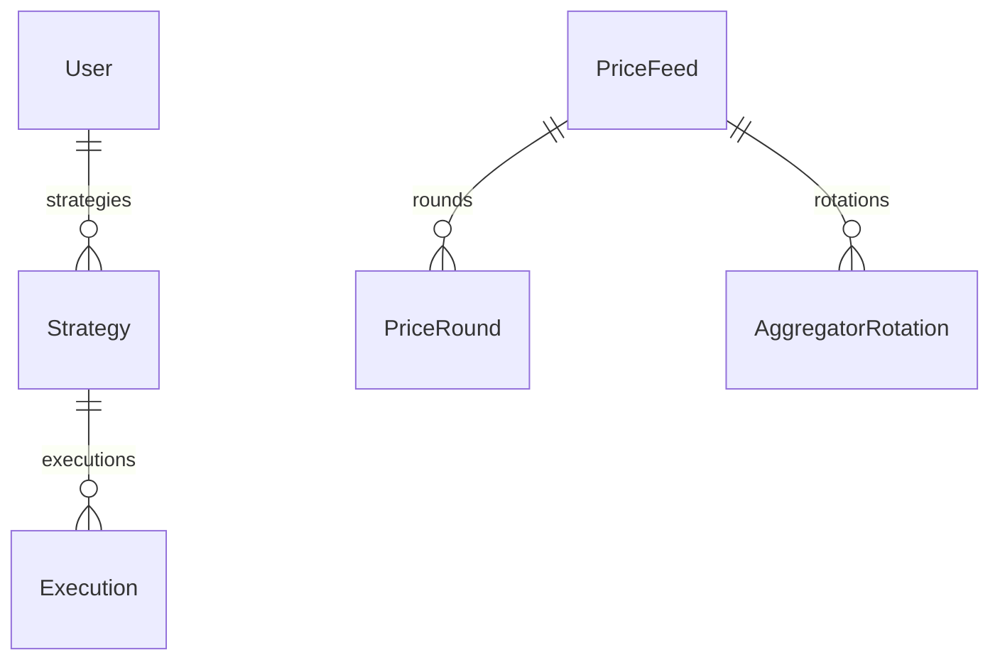

# DCA Subgraph

The DCA subgraph indexes the `DCAStrategyManager` contract on Base. It tracks user-created dollar-cost averaging strategies (vault-to-vault periodic swaps), every individual trade execution, and the Chainlink price feeds used to enforce price bounds. The subgraph also maintains a continuous price-round history for the bootstrapped USDC/USD and ETH/USD feeds, giving the UI a baseline price chart on day one.

**Source:** `packages/summer-earn-dca-subgraph`

**Network:** Base (Goldsky slug: `summer-dca-base`)

**DCAStrategyManager address (Base):** `0xc7de5CFE86ebEfb80b01014549D6eB0041Af9c72` (start block 46 283 733)

## Architecture

The subgraph uses three data-source types:

1. **Static `DCAStrategyManager` data source** — handles strategy lifecycle events (`StrategyCreated`, `StrategyEdited`, `StrategyPaused`, `StrategyResumed`, `StrategyCancelled`, `StrategyCompleted`, `ExecutionCompleted`).
2. **Static bootstrap `ChainlinkProxy` data sources** — two proxy addresses (USDC/USD, ETH/USD) seeded at `feed-start-block` (~14 days before the manager deploy) so the UI has a historical price chart from the start.
3. **Dynamic `ChainlinkProxy` and `ChainlinkAggregator` templates** — registered when a new feed address first appears in a `StrategyCreated` or `StrategyEdited` event. A `kind: once` block handler resolves the proxy's current aggregator implementation at the registration block, then the `ChainlinkAggregator` template streams `AnswerUpdated` events forward from that block.

## Entity overview



## Key entities

### User

Created the first time an address interacts with `DCAStrategyManager`.

| Field | Type | Notes |
|---|---|---|
| `id` | `Bytes!` | Owner address |
| `createdAt` | `BigInt!` | Timestamp of first interaction |
| `strategies` | `[Strategy!]!` | Derived from `Strategy.owner` |

### Strategy

One entity per DCA strategy configuration. Updated in place on every edit, pause, resume, or cancellation. Status transitions are derived from `tradesExecuted`, `maxTrades`, and `endDate`; the contract's `StrategyCompleted` event also triggers an explicit status update.

| Field | Type | Notes |
|---|---|---|
| `id` | `String!` | `strategyId.toString()` |
| `strategyId` | `BigInt!` | Numeric strategy ID from the contract |
| `owner` | `User!` | Strategy owner |
| `sourceVault` | `Bytes!` | Address of the vault shares are pulled from |
| `targetVault` | `Bytes!` | Address of the vault shares are minted into |
| `inAsset` | `Bytes!` | Underlying token of the source vault |
| `outAsset` | `Bytes!` | Underlying token of the target vault |
| `inAssetFeed` | `Bytes!` | Chainlink proxy address for the in-asset |
| `outAssetFeed` | `Bytes!` | Chainlink proxy address for the out-asset |
| `tradeAmount` | `BigInt!` | Source-vault shares consumed per trade |
| `interval` | `BigInt!` | Seconds between trades |
| `slippageBps` | `BigInt!` | Allowed slippage in basis points |
| `maxPrice` | `BigInt!` | Ceiling on the 1e18-scaled out/in price ratio; `0` = no ceiling |
| `minPrice` | `BigInt!` | Floor on the 1e18-scaled out/in price ratio; `0` = no floor |
| `endDate` | `BigInt!` | Unix timestamp after which the strategy auto-completes |
| `maxTrades` | `BigInt!` | Maximum number of trades before auto-completion |
| `status` | `String!` | `ACTIVE`, `PAUSED`, `CANCELLED`, or `COMPLETED` |
| `nextTriggerAt` | `BigInt!` | Earliest timestamp the keeper may execute the next trade |
| `lastScheduledAt` | `BigInt!` | Timestamp when the last trade was scheduled |
| `tradesExecuted` | `BigInt!` | Count of completed trades |
| `totalInAssetSwapped` | `BigInt!` | Cumulative in-asset amount consumed (asset units) |
| `totalOutAssetReceived` | `BigInt!` | Cumulative out-asset amount received (asset units) |
| `createdAt` / `updatedAt` | `BigInt!` | Lifecycle timestamps |
| `executions` | `[Execution!]!` | Derived trade records |

### Execution

An immutable record of a single completed trade. ID format: `{strategyId}-{txHashHex}-{logIndex}`.

| Field | Type | Notes |
|---|---|---|
| `id` | `String!` | Stable across re-indexing |
| `strategy` | `Strategy!` | Parent strategy |
| `inAssets` | `BigInt!` | In-asset amount consumed (`sourceVault.convertToAssets(inShares)` at execution time) |
| `outAssets` | `BigInt!` | Out-asset amount received (`targetVault.convertToAssets(outShares)` at execution time) |
| `inShares` | `BigInt!` | Source-vault shares pulled from the owner |
| `outShares` | `BigInt!` | Target-vault shares minted to the owner |
| `tradesExecutedAfter` | `BigInt!` | `Strategy.tradesExecuted` immediately after this trade |
| `executionTimestamp` | `BigInt!` | Unix timestamp of the trade |
| `blockNumber` | `BigInt!` | Block of the trade |
| `txHash` | `Bytes!` | Transaction hash |

### PriceFeed

One entity per Chainlink aggregator proxy tracked by the subgraph. Keyed by the proxy address (lowercased bytes).

| Field | Type | Notes |
|---|---|---|
| `id` | `Bytes!` | Proxy contract address |
| `decimals` | `Int!` | Feed decimals |
| `description` | `String` | Feed description (e.g. `"USDC / USD"`) |
| `aggregator` | `Bytes!` | Current implementation address behind the proxy |
| `latestAnswer` | `BigInt!` | Most recent price answer |
| `latestRoundId` | `BigInt!` | Most recent round ID |
| `latestUpdatedAt` | `BigInt!` | Chainlink-reported `updatedAt` for the latest round |
| `firstSeenBlock` | `BigInt!` | Block at which the feed was first registered |
| `firstSeenAt` | `BigInt!` | Timestamp at which the feed was first registered |
| `rounds` | `[PriceRound!]!` | All price rounds indexed for this feed |
| `rotations` | `[AggregatorRotation!]!` | Implementation rotation history |

### PriceRound

One immutable record per `AnswerUpdated` event from the current aggregator implementation. ID format: `{proxyAddrHex}-{roundId}` — stable across implementation rotations.

| Field | Type | Notes |
|---|---|---|
| `id` | `String!` | `proxyAddrHex-roundId` |
| `feed` | `PriceFeed!` | Parent price feed |
| `roundId` | `BigInt!` | Chainlink round ID |
| `answer` | `BigInt!` | Raw price answer in feed-decimal units |
| `updatedAt` | `BigInt!` | Chainlink-reported `updatedAt` from the event (not block timestamp) |
| `blockNumber` | `BigInt!` | Block when `AnswerUpdated` was emitted |
| `txHash` | `Bytes!` | Transaction hash |

### AggregatorRotation

Logged when Chainlink rotates the implementation behind a proxy (`AggregatorConfirmed`). Useful for annotating price charts at implementation-change boundaries.

| Field | Type | Notes |
|---|---|---|
| `id` | `String!` | `{proxyAddrHex}-{blockNumber}-{logIndex}` |
| `feed` | `PriceFeed!` | Affected price feed |
| `previous` | `Bytes!` | Old aggregator implementation address |
| `latest` | `Bytes!` | New aggregator implementation address |
| `blockNumber` | `BigInt!` | Block of the rotation |
| `timestamp` | `BigInt!` | Unix timestamp of the rotation |

## Sample queries

### Active strategies for a user

```graphql
{
  strategies(
    where: { owner: "0xYOUR_ADDRESS", status: "ACTIVE" }
    orderBy: createdAt
    orderDirection: desc
  ) {
    id
    strategyId
    sourceVault
    targetVault
    inAsset
    outAsset
    tradeAmount
    interval
    slippageBps
    maxPrice
    minPrice
    tradesExecuted
    maxTrades
    totalInAssetSwapped
    totalOutAssetReceived
    nextTriggerAt
    endDate
    status
  }
}
```

### Recent trade executions for a strategy

```graphql
{
  executions(
    where: { strategy: "42" }
    orderBy: executionTimestamp
    orderDirection: desc
    first: 20
  ) {
    id
    inAssets
    outAssets
    inShares
    outShares
    executionTimestamp
    txHash
    tradesExecutedAfter
  }
}
```

### Price history for a feed

```graphql
{
  priceRounds(
    where: { feed: "0xUSERs_FEED_PROXY_ADDRESS" }
    orderBy: updatedAt
    orderDirection: desc
    first: 100
  ) {
    roundId
    answer
    updatedAt
    blockNumber
  }
}
```

### Strategies due for execution (keeper use)

```graphql
{
  strategies(
    where: {
      status: "ACTIVE"
      nextTriggerAt_lte: "CURRENT_UNIX_TIMESTAMP"
    }
    orderBy: nextTriggerAt
    orderDirection: asc
    first: 50
  ) {
    id
    strategyId
    owner { id }
    sourceVault
    targetVault
    tradeAmount
    nextTriggerAt
  }
}
```
