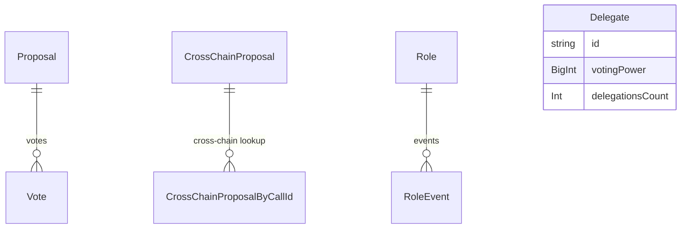

# Governance Subgraph

The governance subgraph indexes the `SummerGovernor` contract deployed on HyperEVM. It captures the full proposal lifecycle — creation, queuing, execution, and cancellation — including cross-chain proposal relay to spoke chains. It also tracks role grants and revocations from the protocol's access-control system and maintains a per-delegate voting-power snapshot.

**Source:** `packages/summer-earn-protocol-gov-subgraph`

**Network:** HyperEVM (single deployment; cross-chain messages are indexed as `CrossChainProposal` entities when they are relayed from HyperEVM to other chains)

## Entity overview



## Key entities

### Proposal

One entity per on-chain governance proposal created via `SummerGovernor.propose()`.

| Field | Type | Notes |
|---|---|---|
| `id` | `ID!` | `proposalId` emitted by the governor |
| `description` | `String!` | Proposal description text |
| `descriptionHash` | `Bytes!` | Keccak hash of the description |
| `status` | `String!` | Current lifecycle status (`Pending`, `Active`, `Queued`, `Executed`, `Canceled`) |
| `governor` | `String!` | Governor contract address |
| `voteStart` | `BigInt!` | Block number when voting opens |
| `voteEnd` | `BigInt!` | Block number when voting closes |
| `eta` | `BigInt!` | Earliest execution timestamp after queuing |
| `createdAt` | `BigInt!` | Timestamp of the `ProposalCreated` event |
| `quorum` | `BigInt!` | Quorum required for the proposal to pass |
| `forVotes` | `BigInt!` | Cumulative votes in favour |
| `againstVotes` | `BigInt!` | Cumulative votes against |
| `abstainVotes` | `BigInt!` | Cumulative abstain votes |
| `targets` | `[String!]!` | Target contract addresses for execution |
| `values` | `[BigInt!]!` | ETH values for each call |
| `calldatas` | `[Bytes!]!` | Encoded calldata for each call |
| `chains` | `[String!]!` | Destination chain identifiers (for cross-chain proposals) |
| `dstIds` | `[String!]!` | LayerZero destination IDs |
| `votes` | `[Vote!]!` | Derived from `Vote.proposal` |

### Vote

One entity per `VoteCast` event. Keyed by `txHash + logIndex`.

| Field | Type | Notes |
|---|---|---|
| `id` | `ID!` | `txHash-logIndex` |
| `proposal` | `Proposal!` | Parent proposal |
| `voter` | `String!` | Voter address |
| `support` | `Int!` | `0` = Against, `1` = For, `2` = Abstain |
| `votes` | `BigInt!` | Voting power cast |
| `reason` | `String!` | Optional reason string supplied by the voter |
| `params` | `Bytes` | Fractional voting params if used |
| `blockNumber` | `BigInt!` | Block of the vote |
| `timestamp` | `BigInt!` | Unix timestamp of the vote |

### CrossChainProposal

Records a governor proposal that has been relayed to a spoke chain via LayerZero. Created when `ProposalSentCrossChain` or `ProposalReceivedCrossChain` is emitted.

| Field | Type | Notes |
|---|---|---|
| `id` | `ID!` | Internal entity key |
| `proposalId` | `String!` | Parent proposal identifier |
| `chainId` | `String!` | Destination chain identifier |
| `status` | `String!` | Relay status |
| `salt` | `Bytes!` | Cross-chain message salt |
| `targets` / `values` / `calldatas` | arrays | Execution payload mirrored from the proposal |
| `eta` | `BigInt!` | Earliest execution time on the destination chain |

### CrossChainProposalByCallId

A secondary lookup index that maps a LayerZero call ID to its `CrossChainProposal`. Useful when resolving delivery confirmations from the destination chain.

| Field | Type | Notes |
|---|---|---|
| `id` | `ID!` | LayerZero call ID |
| `callId` | `String!` | Same as `id` |
| `proposal` | `CrossChainProposal!` | Parent cross-chain proposal |

### Role

One entity per access-control role instance across all protocol contracts. Created when a role is first granted.

| Field | Type | Notes |
|---|---|---|
| `id` | `ID!` | `role-targetContract` composite |
| `name` | `String!` | Role name |
| `owner` | `String!` | Address that currently holds the role |
| `targetContract` | `String!` | Contract the role applies to |
| `accessController` | `String!` | Access controller that manages the role |
| `active` | `Boolean!` | Whether the role is currently active |
| `createdTimestamp` | `BigInt!` | When the role was first granted |
| `events` | `[RoleEvent!]!` | Full grant/revoke history |

### RoleEvent

An immutable record of a single grant or revocation.

| Field | Type | Notes |
|---|---|---|
| `id` | `ID!` | `txHash-logIndex` |
| `hash` | `String!` | Transaction hash |
| `action` | `RoleAction!` | `GRANT_ROLE` or `REVOKE_ROLE` |
| `caller` | `String!` | Address that triggered the change |
| `role` | `Role!` | Affected role |
| `timestamp` | `BigInt!` | Unix timestamp |

### Delegate

A snapshot of the voting power held by each delegate address. Updated whenever delegation changes.

| Field | Type | Notes |
|---|---|---|
| `id` | `ID!` | Delegate address |
| `votingPower` | `BigInt!` | Current delegated voting power (in SUMR token units) |
| `delegationsCount` | `Int!` | Number of accounts that have delegated to this address |

## Sample queries

### Active proposals with vote tallies

```graphql
{
  proposals(where: { status: "Active" }, orderBy: voteEnd, orderDirection: asc) {
    id
    description
    voteStart
    voteEnd
    quorum
    forVotes
    againstVotes
    abstainVotes
    votes(first: 10, orderBy: votes, orderDirection: desc) {
      voter
      support
      votes
      reason
    }
  }
}
```

### Cross-chain proposal status

```graphql
{
  crossChainProposals(where: { proposalId: "YOUR_PROPOSAL_ID" }) {
    id
    chainId
    status
    eta
    targets
    calldatas
  }
}
```

### Top delegates by voting power

```graphql
{
  delegates(first: 20, orderBy: votingPower, orderDirection: desc) {
    id
    votingPower
    delegationsCount
  }
}
```

### Role grant history for a contract

```graphql
{
  roles(where: { targetContract: "0xYOUR_CONTRACT" }) {
    name
    owner
    active
    events(orderBy: timestamp, orderDirection: desc) {
      action
      caller
      timestamp
      hash
    }
  }
}
```
