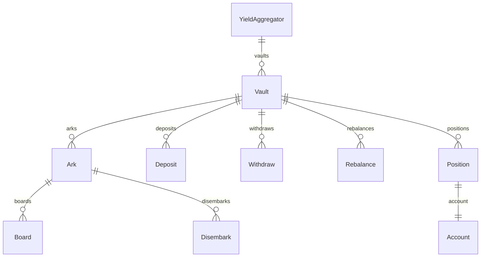

---
description:
  GraphQL subgraph indexing vaults, Arks, deposits, withdrawals, rebalances, and user positions
  across all protocol networks.
---

# Protocol Subgraph

The protocol subgraph tracks the full lifecycle of every
[FleetCommander](../contracts/core/reference/contracts/fleet-commander.md) vault and its constituent
[Arks](../contracts/core/reference/contracts/ark.md). It implements the
[Messari Yield Aggregator schema v1.3.1](https://github.com/messari/subgraphs/blob/master/docs/SCHEMA.md)
and adds Summer.fi-specific extensions for rebalances, per-Ark snapshots, staking lockups, and
referral tracking.

**Source:** `packages/summer-earn-protocol-subgraph`

**Networks:** Ethereum mainnet, Arbitrum One, Base, Sonic, HyperEVM (one deployment per chain,
driven by `config/<network>.json`)

## Entity overview



## Key entities

### YieldAggregator

The singleton root entity keyed by the protocol registry address. Aggregates protocol-wide TVL,
cumulative revenues (supply-side and protocol-side), and unique-user counts. Carries derived arrays
of `Vault` entities and links to daily/hourly/financial snapshots.

| Field                       | Type          | Notes                                 |
| --------------------------- | ------------- | ------------------------------------- |
| `id`                        | `ID!`         | Protocol registry contract address    |
| `totalValueLockedUSD`       | `BigDecimal!` | Current protocol-wide TVL in USD      |
| `cumulativeTotalRevenueUSD` | `BigDecimal!` | Lifetime total revenue                |
| `cumulativeUniqueUsers`     | `Int!`        | Unique depositing addresses ever seen |
| `totalPoolCount`            | `Int!`        | Number of live vaults                 |
| `vaults`                    | `[Vault!]!`   | Derived from `Vault.protocol`         |

### Vault

One entity per FleetCommander. Extends the Messari `Vault` type with Summer.fi-specific fields.

| Field                                                 | Type            | Notes                                 |
| ----------------------------------------------------- | --------------- | ------------------------------------- |
| `id`                                                  | `ID!`           | FleetCommander contract address       |
| `inputToken`                                          | `Token!`        | Underlying asset (e.g. USDC)          |
| `outputToken`                                         | `Token`         | Share token minted to depositors      |
| `depositCap`                                          | `BigInt!`       | Maximum total deposits in asset units |
| `minimumBufferBalance`                                | `BigInt!`       | Buffer floor kept in the vault        |
| `totalValueLockedUSD`                                 | `BigDecimal!`   | Current TVL in USD                    |
| `pricePerShare`                                       | `BigDecimal`    | Current share price                   |
| `calculatedApr`                                       | `BigDecimal!`   | APR derived from last two snapshots   |
| `apr7d` / `apr30d` / `apr90d` / `apr180d` / `apr365d` | `BigDecimal!`   | Rolling APR windows                   |
| `withdrawableTotalAssets`                             | `BigInt!`       | Liquid assets available to withdraw   |
| `arks`                                                | `[Ark!]!`       | Derived Ark list                      |
| `rebalances`                                          | `[Rebalance!]!` | All rebalance events                  |
| `positions`                                           | `[Position!]!`  | All user positions                    |
| `rebalanceCount`                                      | `BigInt!`       | Cumulative rebalance count            |

Time-series snapshots are available at hourly, daily, and weekly granularity via `hourlySnapshots`,
`dailySnapshots`, and `weeklySnapshots`.

### Ark

One entity per [Ark](../contracts/core/reference/contracts/ark.md) contract attached to a vault.

| Field                       | Type            | Notes                                           |
| --------------------------- | --------------- | ----------------------------------------------- |
| `id`                        | `ID!`           | Ark contract address                            |
| `vault`                     | `Vault!`        | Parent FleetCommander                           |
| `productId`                 | `String!`       | Opaque identifier linking to the rates subgraph |
| `depositCap`                | `BigInt!`       | Ark-level deposit ceiling                       |
| `maxDepositPercentageOfTVL` | `BigInt!`       | Max allocation as % of protocol TVL             |
| `maxRebalanceOutflow`       | `BigInt!`       | Max funds that can leave in one rebalance       |
| `maxRebalanceInflow`        | `BigInt!`       | Max funds that can enter in one rebalance       |
| `requiresKeeperData`        | `Boolean!`      | Whether keeper calldata is needed               |
| `inputTokenBalance`         | `BigInt!`       | Current assets held by the Ark                  |
| `calculatedApr`             | `BigDecimal!`   | APR derived from cumulative earnings            |
| `cumulativeEarnings`        | `BigInt!`       | Total interest earned in asset units            |
| `boards`                    | `[Board!]!`     | Deposit-to-ark events                           |
| `disembarks`                | `[Disembark!]!` | Withdrawal-from-ark events                      |

### Deposit / Withdraw

Transaction-level events implementing the `Event` interface. Each record includes:

- `hash` — transaction hash
- `logIndex` — position within the transaction
- `from` / `to` — depositor and receiver addresses
- `asset` — token deposited or withdrawn
- `amount` — native token units
- `amountUSD` — USD value at time of transaction
- `vault` — parent vault reference
- `position` — the user position this event updates

### Rebalance

Recorded when the FleetCommander keeper moves liquidity between two Arks.

| Field            | Type                     | Notes                                     |
| ---------------- | ------------------------ | ----------------------------------------- |
| `id`             | `ID!`                    | `txHash-logIndex`                         |
| `from`           | `Ark!`                   | Source Ark                                |
| `to`             | `Ark!`                   | Destination Ark                           |
| `amount`         | `BigInt!`                | Assets moved in native units              |
| `amountUSD`      | `BigDecimal!`            | USD value at rebalance time               |
| `vault`          | `Vault!`                 | Parent vault                              |
| `fromPostAction` | `PostActionArkSnapshot!` | Ark state immediately after the rebalance |
| `toPostAction`   | `PostActionArkSnapshot!` | Ark state immediately after the rebalance |

### Position

Tracks the cumulative state of a single account in a single vault. Updated on every deposit and
withdrawal.

| Field                     | Type       | Notes                                 |
| ------------------------- | ---------- | ------------------------------------- |
| `id`                      | `ID!`      | `account-vault` composite             |
| `account`                 | `Account!` | Depositor address                     |
| `vault`                   | `Vault!`   | Vault                                 |
| `inputTokenBalance`       | `BigInt!`  | Current net balance in asset units    |
| `outputTokenBalance`      | `BigInt!`  | Current share token balance           |
| `inputTokenDeposits`      | `BigInt!`  | Cumulative deposits                   |
| `inputTokenWithdrawals`   | `BigInt!`  | Cumulative withdrawals                |
| `stakedInputTokenBalance` | `BigInt!`  | Portion staked in the rewards manager |

### Additional entities

- `Account` — unique depositor, carries staking totals and referral linkage
- `StakeLockup` — individual time-locked SUMR stake with weighted amounts and end timestamp
- `GovernanceStaking` — protocol-wide staking stats (total staked, reward emissions, lockup
  averages)
- `ReferralData` — referrer-level aggregation of referred deposits and accounts
- `CurationEvent` — admin configuration changes (deposit cap, min buffer, tip rate, performance
  rate, and ark added/removed) with before/after values
- `VaultFee` — individual fee records by type (`DEPOSIT_FEE`, `WITHDRAWAL_FEE`, `PERFORMANCE_FEE`,
  `MANAGEMENT_FEE`)

## Sample query

Fetch the five largest vaults with their top Arks and the last five rebalances:

```graphql
{
  vaults(first: 5, orderBy: totalValueLockedUSD, orderDirection: desc) {
    id
    name
    totalValueLockedUSD
    calculatedApr
    apr30d
    inputToken {
      symbol
      decimals
    }
    arks {
      id
      productId
      inputTokenBalance
      calculatedApr
      depositCap
    }
    rebalances(first: 5, orderBy: timestamp, orderDirection: desc) {
      id
      timestamp
      amount
      amountUSD
      from {
        id
        productId
      }
      to {
        id
        productId
      }
    }
  }
}
```

### Query a user position

```graphql
{
  positions(where: { account: "0xYOUR_ADDRESS" }) {
    vault {
      id
      name
    }
    inputTokenBalance
    inputTokenDeposits
    inputTokenWithdrawals
    createdTimestamp
    deposits(first: 10, orderBy: timestamp, orderDirection: desc) {
      hash
      amount
      amountUSD
      timestamp
    }
  }
}
```
