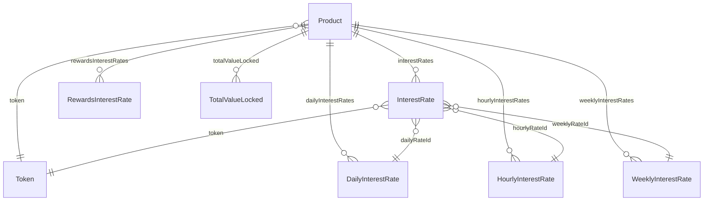

# Rates Subgraph

The rates subgraph aggregates supply and borrow interest rates from the underlying lending protocols that Summer.fi Arks deploy into — Aave v3, Compound (Comet), Gearbox, Pendle, Sky (SUSDS/PSM3), and others. It feeds the APY displays in the Summer.fi UI and is the authoritative source for historical rate charts.

**Source:** `packages/summer-earn-rates-subgraph`

**Networks:** Ethereum mainnet, Arbitrum One, Base, Optimism, Sonic, HyperEVM

## How rates are collected

The subgraph uses a price-oracle entry-point (`EntryPoint` data source, pinned to the Chainlink ETH/USD feed on each network) as a block-trigger to poll interest rates from each indexed protocol pool. This polling pattern means rate records are created on every update tick rather than on discrete on-chain events. The ABI list in the manifest includes `Comet`, `AaveV3Pool`, `GearboxPool`, `PendleOracle`, `PendleMarket`, `SkyPSM3`, `SkySUSDS`, `SkySSRAuthOracle`, and several ERC-4626 and rate-provider interfaces.

## Entity overview



## Key entities

### Product

A `Product` represents one Ark's underlying lending position — a specific pool on a specific protocol for a specific token. It is the primary key used to join rates data back to the protocol subgraph via `Ark.productId`.

| Field | Type | Notes |
|---|---|---|
| `id` | `ID!` | Unique product identifier |
| `name` | `String!` | Human-readable name (e.g. `"Aave v3 USDC"`) |
| `protocol` | `String!` | Protocol slug (e.g. `"aave-v3"`) |
| `token` | `Token!` | Underlying asset |
| `network` | `String!` | Chain name |
| `pool` | `String!` | Pool or market contract address |

### InterestRate

A single raw interest-rate sample collected at a specific block. Immutable once written.

| Field | Type | Notes |
|---|---|---|
| `id` | `String!` | Unique sample identifier |
| `type` | `String!` | Rate type (e.g. supply rate, variable borrow rate) |
| `rate` | `BigDecimal!` | Annualised rate as a decimal (e.g. `0.05` = 5 %) |
| `blockNumber` | `BigInt!` | Block at which the rate was sampled |
| `timestamp` | `BigInt!` | Unix timestamp of the sample |
| `protocol` | `String!` | Protocol slug |
| `token` | `Token!` | Underlying asset |
| `productId` | `String!` | Parent product identifier |
| `product` | `Product!` | Parent product |
| `dailyRateId` | `DailyInterestRate!` | Bucket this sample contributes to |
| `hourlyRateId` | `HourlyInterestRate!` | Bucket this sample contributes to |
| `weeklyRateId` | `WeeklyInterestRate!` | Bucket this sample contributes to |

### DailyInterestRate / HourlyInterestRate / WeeklyInterestRate

Pre-aggregated rate buckets. Each bucket accumulates the sum and count of all `InterestRate` samples within the time window, exposing an `averageRate` computed as `sumRates / updateCount`.

| Field | Type | Notes |
|---|---|---|
| `id` | `ID!` | Bucket identifier |
| `date` / `weekTimestamp` | `BigInt!` | Period start timestamp |
| `averageRate` | `BigDecimal!` | Mean rate over the period |
| `sumRates` | `BigDecimal!` | Sum of individual rate samples |
| `updateCount` | `BigInt!` | Number of samples in the bucket |
| `protocol` | `String!` | Protocol slug |
| `productId` | `String!` | Parent product |

### RewardsInterestRate

Reward-token yields layered on top of the base lending rate (e.g. AAVE token incentives on top of the USDC supply APY).

| Field | Type | Notes |
|---|---|---|
| `id` | `String!` | Unique identifier |
| `type` | `String!` | Reward classification |
| `rate` | `BigDecimal!` | Annualised rewards APY |
| `rewardToken` | `Token!` | Token distributed as the reward |
| `token` | `Token!` | Base asset the reward is paid on |
| `productId` | `String!` | Parent product |

### TotalValueLocked

Point-in-time TVL snapshots per product, useful for charting the growth of individual Ark allocations.

| Field | Type | Notes |
|---|---|---|
| `id` | `String!` | Snapshot identifier |
| `totalValueLockedInAssets` | `BigInt!` | TVL in native asset units |
| `totalValueLockedInAssetsNormalized` | `BigDecimal!` | TVL in decimal-adjusted units |
| `totalValueLockedInUSD` | `BigDecimal!` | TVL in USD |
| `blockNumber` | `BigInt!` | Block of the snapshot |
| `timestamp` | `BigInt!` | Unix timestamp |

### Token

Immutable reference entity for each ERC-20 asset.

| Field | Type | Notes |
|---|---|---|
| `id` | `Bytes!` | Token contract address |
| `symbol` | `String!` | Token symbol |
| `decimals` | `BigInt!` | Decimal places |
| `precision` | `BigInt!` | `10 ** decimals` |

## Sample queries

### Historical daily rates for a product

```graphql
{
  dailyInterestRates(
    where: { productId: "your-product-id" }
    orderBy: date
    orderDirection: desc
    first: 30
  ) {
    date
    averageRate
    updateCount
    product {
      name
      protocol
      token {
        symbol
      }
    }
  }
}
```

### All products on a given protocol

```graphql
{
  products(where: { protocol: "aave-v3" }) {
    id
    name
    network
    pool
    token {
      symbol
      decimals
    }
    interestRates(first: 1, orderBy: timestamp, orderDirection: desc) {
      rate
      type
      timestamp
    }
  }
}
```

### Current TVL per product

```graphql
{
  products {
    id
    name
    protocol
    totalValueLocked(first: 1, orderBy: timestamp, orderDirection: desc) {
      totalValueLockedInUSD
      totalValueLockedInAssetsNormalized
      timestamp
    }
  }
}
```
