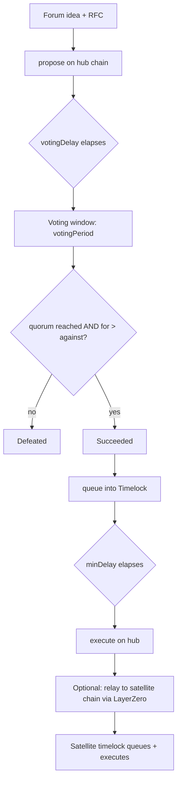
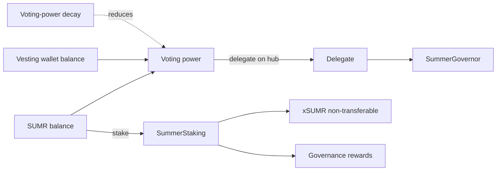

# Governance Overview

Summer.fi Earn Protocol is governed on-chain by SUMR token holders. Governance is built on OpenZeppelin's `Governor` framework, extended for LayerZero OFT cross-chain execution, voting-power decay, and guardian-aware timelocks. This page maps the moving parts; each subsystem has a dedicated page.

## Components

- **SummerGovernor / SummerGovernorV2** — the OpenZeppelin `Governor` that accepts proposals, tallies votes, and queues approved actions into a timelock. It operates in a hub-and-satellite topology: governance actions (propose, vote, execute, cancel) are restricted to the hub chain, and approved operations can be dispatched to satellite chains over LayerZero via `sendProposalToTargetChain`. See [`SummerGovernor`](./reference/contracts/summer-governor.md).
- **SUMR token (`SummerToken`)** — an `ERC20Votes` + LayerZero OFT token with a supply cap, gated transfers, hub-only delegation, and voting-power decay. It is the unit of voting power. See [sumr-token.md](./sumr-token.md).
- **Staking & rewards** — `SummerStaking` lets holders lock SUMR for weighted staking positions that earn governance rewards through `GovernanceRewardsManager`, minting non-transferable xSUMR (`StakedSummerToken`). See [staking-and-rewards.md](./staking-and-rewards.md).
- **Vesting** — `SummerVestingWallet` (V1) and `SummerVestingWalletV2`, created through their factories, hold allocations for team and investors. Tokens held in vesting wallets still count toward the beneficiary's voting power. See [vesting.md](./vesting.md).
- **Timelocks** — `SummerTimelockController` and `RwaTimelock` enforce a delay between a proposal passing and its execution, with guardian-aware cancellation rules. See [`SummerTimelockController`](./reference/contracts/summer-timelock-controller.md).

## Hub-and-satellite topology

The protocol designates one **hub chain** (`hubChainId` / `HUB_CHAIN_ID`). Voting power, delegation, and proposal lifecycle all live on the hub. When a proposal targets a different chain, the governor encodes the operation and relays it over LayerZero; the receiving satellite governor queues it into its local timelock for execution. This keeps a single canonical source of voting truth while letting governance act across deployments.

## Proposal lifecycle

The proposer must hold (directly or by delegation) at least the configured `proposalThreshold`. The governor's `votingDelay`, `votingPeriod`, `quorumFraction`, and the timelock's `minDelay` are **governable parameters** set at deployment and adjustable by governance — they are not hard-coded constants. The only range-validated bound in the contract is `proposalThreshold`, which must fall between `MIN_PROPOSAL_THRESHOLD` (1,000 SUMR) and `MAX_PROPOSAL_THRESHOLD` (100,000 SUMR).

## How power flows

Voting power for an account is its SUMR balance **plus** the balance of its associated vesting wallet, scaled by a decay factor that erodes idle voting power over time (reset by participation). Delegation is the mechanism that activates voting power and is only permitted on the hub chain.

## Where to go next

- [SUMR token](./sumr-token.md) — supply, transfer gating, delegation, decay.
- [Staking and rewards](./staking-and-rewards.md) — lockups, penalties, weighted buckets.
- [Vesting](./vesting.md) — V1/V2 wallets and performance goals.
- [SIP process](./sip-process.md) — proposal stages, categories, and the governable voting mechanism.
- Generated contract reference under [`./reference/`](./reference/README.md) and the [voting-decay](./voting-decay/README.md) library docs.
