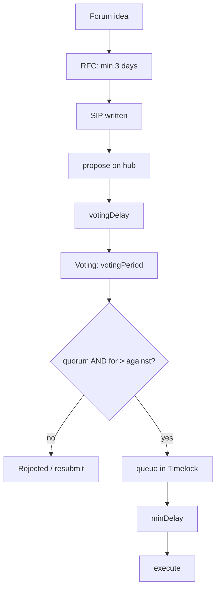

# SIP Process

Changes to the protocol are made through **Summer Improvement Proposals (SIPs)**. The SIP process combines an off-chain social phase (forum discussion and refinement) with the on-chain governance mechanism enforced by `SummerGovernor` and the timelock. This page describes the process structure and the on-chain mechanism; the exact timing and quorum values are governable parameters, not fixed constants.

## Proposal stages

1. **Idea submission** — a community member posts the idea in the Summer forum with background, problem statement, and a potential solution.
2. **Request for Comments (RFC)** — the idea enters a minimum 3-day RFC period for community feedback and refinement.
3. **SIP submission** — the refined proposal is written up with summary, motivation, and specifications.
4. **On-chain voting** — the proposal is submitted to `SummerGovernor` on the hub chain; delegated token holders cast votes.
5. **Execution** — an approved proposal is queued into the timelock and executed after the configured delay.

Rejected proposals (those that fail quorum or the for/against tally) may be revised and resubmitted, ideally with a summary of changes made in response to feedback.

## SIP categories

SIPs use a primary-number-plus-sub-number scheme (`SIP[Primary].[Sub]`) so related proposals group under one topic. The primary categories are:

| Category | Scope |
| --- | --- |
| SIP0 | Governance process |
| SIP1 | Vault / Fleet management (onboarding & offboarding, config, vault-level ops) |
| SIP2 | ARK management (onboarding & offboarding, ARK-specific config) |
| SIP3 | Token rewards |
| SIP4 | Governance parameters |
| SIP5 | Special governance votes (one-off proposals) |

Sub-numbers are independent across categories (SIP1.1 and SIP2.1 are unrelated). New categories are themselves added through a governance proposal that defines the name, motivation, and template, then updates this documentation.

## The on-chain voting mechanism

The voting and execution mechanism is implemented by `SummerGovernor` / [`SummerGovernorV2`](./reference/contracts/summer-governor-v2.md) on the OpenZeppelin `Governor` framework. Its key parameters are **governable** — set at deployment and changeable by governance — rather than hard-coded:

- **`votingDelay`** — time between proposal submission and the start of voting.
- **`votingPeriod`** — length of the voting window.
- **`quorumFraction`** — the fraction of the votable supply (via `GovernorVotesQuorumFraction`) required for a proposal to be valid.
- **timelock `minDelay`** — the delay enforced by `SummerTimelockController` between queueing and execution.

> The day/percent figures historically quoted for voting period, quorum, and timelock delay are **deployment defaults** and may differ from any specific live deployment. Always read the live values from the deployed governor and timelock rather than assuming fixed numbers.

The one value the contract range-validates is the **proposal threshold**: it must lie between `MIN_PROPOSAL_THRESHOLD` (1,000 SUMR) and `MAX_PROPOSAL_THRESHOLD` (100,000 SUMR), enforced by `_validateProposalThreshold` (and `ProposalThresholdOutOfBounds`). A proposer must hold or be delegated at least the current threshold to propose; below it, anyone may cancel the proposal. Active guardians can propose without meeting the threshold and have additional cancellation powers.

Vote counting follows standard OpenZeppelin semantics: a proposal succeeds when quorum is met and "for" votes exceed "against" (abstentions count toward quorum but not the for/against tally). Proposing, voting, executing, and cancelling are all restricted to the hub chain; approved cross-chain actions are relayed to satellite chains via `sendProposalToTargetChain` (see [overview.md](./overview.md)).

## Timelock and guardians

After a proposal succeeds it is queued into `SummerTimelockController`, which enforces `minDelay` before execution and gives the community a window for review or emergency action. Cancellation is guardian-aware: guardian-expiry operations can be cancelled **only** by governors, governors with the cancel role can cancel any other operation, and active guardians with the cancel role can cancel any non-expiry operation. The separate `RwaTimelock` provides the same delay machinery for RWA-related operations, where `minDelay == 0` allows same-block execution and `minDelay > 0` enforces a waiting period.
