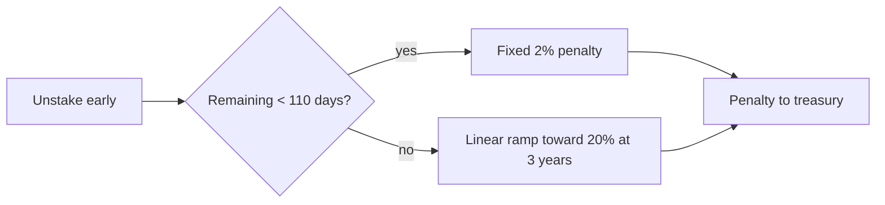

# Staking and Rewards

`SummerStaking` lets SUMR holders lock tokens to earn governance rewards and to back governance participation. Staking pulls SUMR, wraps it internally, and mints an equal amount of **xSUMR** (`StakedSummerToken`) to the staker as their staked representation. See the generated [`SummerStaking`](./reference/contracts/summer-staking.md) and [`StakedSummerToken`](./reference/contracts/staked-summer-token.md) references.

## xSUMR: non-transferable staked token

xSUMR is a non-transferable accounting token. Direct transfers are disabled — only mint (from the zero address) and burn (to the zero address) are allowed. Only modules holding `MINTER_ROLE` may mint, and `burnFrom` requires either the owner or a `BURNER_ROLE` holder with a standard allowance. The staking module is granted both roles when it is registered, so it can mint xSUMR on stake and burn it on unstake.

## Lockups and stake limits

Each stake specifies a lockup period in seconds:

- The lockup may range from 0 (no lockup) up to `MAX_LOCKUP_PERIOD` = **3 years** (`3 * 365 days`). A longer lockup reverts with `Staking_InvalidLockupPeriod`.
- A single owner may hold at most `MAX_AMOUNT_OF_STAKES` = **1000** distinct lockup positions; index 0 aggregates all no-lockup stake, and positions with a lockup occupy later indices.

## Early-unstake penalty schedule

Unstaking before a lockup expires incurs a penalty, split to the treasury. The schedule (`_calculatePenalty`) is:

- if the remaining lockup is below `FIXED_PENALTY_PERIOD` = **110 days**, a fixed minimum penalty of `MIN_PENALTY_PERCENTAGE` = **2%** applies;
- otherwise the penalty ramps **linearly** with remaining time up to `MAX_PENALTY_PERCENTAGE` = **20%** at the maximum 3-year lockup (`timeRemaining * MAX_PENALTY / MAX_LOCKUP_PERIOD`).

## Weighted buckets

Rewards accounting is driven by a **weighted** stake amount, not the raw token amount. The weight rewards longer lockups via a quadratic multiplier: `WEIGHTED_STAKE_BASE` = WAD (1.0) plus a quadratic term using `WEIGHTED_STAKE_COEFFICIENT` = 700 (i.e. 7e-16 scaled to 60.18 fixed-point) applied to the lockup duration. The protocol's base manager tracks `totalSupply` as the weighted sum, so longer-locked positions earn a larger share of rewards.

Every lockup duration maps to a discrete **bucket** via `_findBucket`. Buckets gate the total *raw* (unweighted) SUMR that can be staked at each duration tier:

| Bucket | Lockup range |
| --- | --- |
| `NoLockup` | 0 seconds |
| `ShortTerm` | 1 second – 14 days |
| `TwoWeeksToThreeMonths` | >14 days – 90 days |
| `ThreeToSixMonths` | >90 days – 180 days |
| `SixToTwelveMonths` | >180 days – 365 days |
| `OneToTwoYears` | >365 days – 730 days |
| `TwoToThreeYears` | >730 days – 1095 days |

Each bucket's lower bound is exactly one second above the previous bucket's maximum. Bucket caps are applied to the unweighted amount with these semantics:

- `cap == 0` → bucket disabled (any positive stake reverts with `Staking_BucketCapExceeded`);
- `cap == type(uint256).max` → unlimited;
- otherwise `currentRawStaked + amount` must be `<= cap`.

By default all bucket caps are zero storage (disabled) until governance sets them, and the governor controls both bucket caps and penalty enablement.

## Governance rewards

`GovernanceRewardsManager` distributes rewards to stakers and supports multiple reward tokens. It accrues against each account's weighted balance and applies a smoothed decay factor to reward accounting. Public mutating entrypoints on the staking path are `nonReentrant` and update rewards before mutating balances, keeping accounting correct across stake, unstake, and reward claims.
