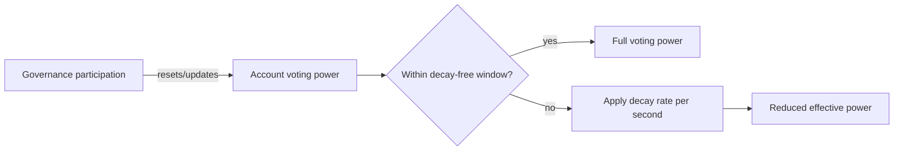

# SUMR Token

`SummerToken` (SUMR) is the protocol's governance token. It combines OpenZeppelin `ERC20Votes`, `ERC20Capped`, `ERC20Permit`, and `ERC20Burnable` with a LayerZero OFT for cross-chain transfers, plus custom transfer gating, hub-restricted delegation, and voting-power decay. See the generated [`SummerToken`](./reference/contracts/summer-token.md) reference for the full surface.

## Supply and cross-chain transfers

SUMR uses a hard supply cap via `ERC20Capped`. The cap (`maxSupply`) is a constructor parameter; the deployment default is 1,000,000,000 SUMR (1e9 × 1e18). The initial supply is minted once during `initialize`.

As a LayerZero OFT, SUMR moves between chains by burning on the source chain and minting on the destination — there is no wrapped or bridged representation. The overridden `send` function applies the same transfer gate described below before debiting the sender.

## Gated transfers

Transfers are disabled by default and only become unrestricted once governance enables them. The gate lives in `_canTransfer` (enforced in `_update`) and the cross-chain `send` path. A movement is permitted when **any** of these hold:

- it is a mint or burn (the `from` or `to` party is the zero address);
- transfers have been globally enabled (`transfersEnabled == true`);
- the `from` or `to` address is whitelisted (`whitelistedAddresses`).

Transfers cannot be globally enabled before `transferEnableDate` (an immutable timestamp). For cross-chain sends, a self-send (`to == msg.sender`) is also allowed. Any other transfer reverts with `TransferNotAllowed`. This lets the protocol distribute tokens to vesting wallets, staking modules, and approved addresses while keeping the broad market frozen until governance opens it.

## Hub-only delegation

Voting power must be activated by delegation, and `delegate` is restricted to the hub chain via the `onlyHubChain` modifier — `block.chainid` must equal `hubChainId`, otherwise it reverts with `NotHubChain`. This guarantees a single canonical voting ledger on the hub. Two additional rules apply:

- you cannot undelegate (delegate to the zero address) while you have an active stake — it reverts with `CannotUndelegateWhileStaked`;
- delegating initializes decay tracking for the delegatee if they have none yet.

Voting units include both the holder's direct SUMR balance and the balance of their associated vesting wallet (`_getVotingUnits`), so vesting allocations vote.

## Voting-power decay

To discourage passive, never-participating voting weight, SUMR applies decay to voting power through the [`VotingDecayLibrary`](./voting-decay/voting-decay-library.md). Each account has a decay factor (WAD-scaled) that reduces effective voting power over time and is refreshed by governance participation. Decay supports Linear and Exponential modes and is configured by two governance parameters:

- **Decay-free window** — a grace period during which no decay accrues. It is validated to be between **30 days** and **365.25 days** (`MIN_DECAY_FREE_WINDOW` / `MAX_DECAY_FREE_WINDOW`); values outside this range revert with `InvalidDecayFreeWindow`.
- **Yearly decay rate** — the per-year rate, converted to a per-second rate internally (`rate / SECONDS_PER_YEAR`, where `SECONDS_PER_YEAR = 365.25 days`). It is validated against an upper bound: the rate may not exceed 50% per year (`Constants.WAD / 2`), otherwise it reverts with `DecayRateTooHigh`.

`getDecayFactor`, `getPastDecayFactor`, `getDecayRatePerYear`, and `getDecayFreeWindow` expose the current and historical state; historical decay factors are checkpointed so past-vote queries (`getPastVotes`) stay consistent.

> Decay parameters and transfer enablement are set during `initialize` and updated by governance. Effective voting power at any timepoint is the decayed view of voting units — see the [voting-decay math](./voting-decay/voting-decay-math.md) page for the underlying formulas.
