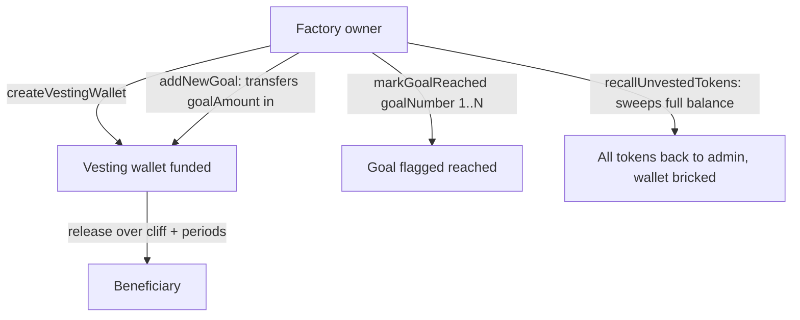

# Vesting

Vesting wallets hold SUMR allocations for team members and investors and release them on a schedule. Tokens sitting in a vesting wallet still count toward the beneficiary's voting power (the token's `_getVotingUnits` adds the associated wallet balance). Wallets are created through factories — `SummerVestingWalletFactory` (V1) and `SummerVestingWalletFactoryV2` — both with `onlyOwner` creation. See the generated [`SummerVestingWalletV2`](./reference/contracts/summer-vesting-wallet-v2.md) reference.

## V1: `SummerVestingWallet`

V1 implements a fixed schedule: a **6-month cliff**, then monthly time-based release over a **2-year** total duration (`DURATION_SECONDS = 730 days`, `MONTH = 30 days`). There are two vesting types:

- `TeamVesting` (0) — time-based release **plus** optional performance-based goals;
- `InvestorExTeamVesting` (1) — time-based release only.

Performance-goal functions are restricted to `TeamVesting` wallets; calling them on an investor wallet reverts with `OnlyTeamVesting`. The schedule and type are immutable for the lifetime of a V1 wallet.

## V2: `SummerVestingWalletV2`

V2 generalizes the schedule. A wallet is parameterized by `cliffAmount` and `cliffEndTimestamp`, a number of `vestingPeriods` (each `30 days`, so duration = `vestingPeriods * 30 days`), and a `totalVestingAmount`, alongside a dynamic list of performance goals. The factory's `createVestingWallet` is `onlyOwner`, records beneficiary/wallet mappings, checks the admin's allowance and balance, and transfers the full cliff + time + performance amount into the new wallet at creation. A wallet with `totalVestingAmount > 0` but `vestingPeriods == 0` reverts. V2 contracts are **not upgradeable**.

### Performance goals are 1-indexed

This is a common source of confusion. Internally the goals live in a zero-based array, but the **external API is 1-indexed**:

- `performanceGoals(goalNumber)` rejects `goalNumber < 1` (and out-of-range values) with `InvalidGoalNumber`, then returns `_performanceGoals[goalNumber - 1]`;
- `markGoalReached(goalNumber)` applies the same 1-based check before flagging the goal.

So the first goal is goal number **1**, not 0.

### `addNewGoal` transfers tokens

`addNewGoal(goalAmount, description)` is `onlyFactoryOwner`. Beyond appending the goal, it **transfers `goalAmount` tokens from the caller (admin) into the vesting wallet** via `safeTransferFrom`. The admin must therefore hold sufficient SUMR and have granted allowance, or the call reverts. The emitted `NewGoalAdded` event reports the new goal count, amount, and description.

### `recallUnvestedTokens` recalls the entire balance

`recallUnvestedTokens()` is `onlyFactoryOwner` and **transfers the entire token balance currently held by the wallet to the admin** — not only the unvested portion. It reads `balanceOf(address(this))`, sets `isRecalled = true` (permanently bricking the wallet), and transfers everything out, including any vested-but-not-yet-released tokens still sitting in the wallet. Calling it twice reverts with `TokensAlreadyRecalled`.

## Voting power note

Because vesting-wallet balances are included in the beneficiary's voting units, recalling a wallet or releasing tokens changes the beneficiary's voting power accordingly. Delegation still happens from the beneficiary account on the hub chain — see [sumr-token.md](./sumr-token.md).
