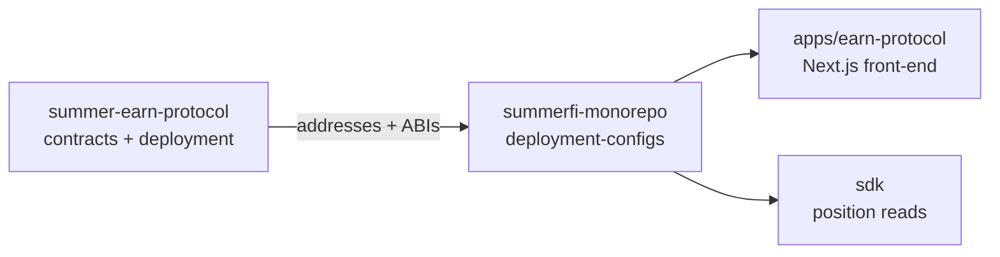

# Repository Map

The Summer Earn Protocol is maintained across two separate GitHub repositories. Understanding what lives where prevents duplicate work and misdirected pull requests.

## summer-earn-protocol

**GitHub**: `OasisDEX/summer-earn-protocol`
**Package manager**: pnpm 10 (`packageManager: pnpm@10.32.1`)
**Node requirement**: `>=20`
**Build orchestration**: Turborepo 2

This is the primary protocol repository. It contains all Solidity contracts, the Hardhat Ignition deployment system, off-chain keepers, and the oracle tooling. All on-chain logic starts here.

### Package index

| Package | Description |
|---|---|
| `contracts-protocol` (`@summerfi/earn-protocol`) | Core Solidity: FleetCommander, Ark base contracts, HarborCommand, Raft, AdmiralsQuarters, intent system |
| `gov-contracts` (`@summerfi/earn-gov-contracts`) | Governance Solidity: SummerToken, SummerGovernorV2, SummerStaking, StakedSummerToken, SummerVestingWalletsEscrow |
| `access-contracts` | ProtocolAccessManager and role definitions |
| `config-contracts` | ConfigurationManager for on-chain parameter storage |
| `rewards-contracts` | RewardsManager and RewardsRedeemer contracts |
| `dutch-auction` | DutchAuction library and AuctionManagerBase |
| `chain-bridge` | Cross-chain bridge system (not yet live; excluded from public docs) |
| `deployment` | Hardhat Ignition modules + interactive deploy scripts + fleet config JSONs |
| `ark-rebalancer` | Python keeper: polls Ark rates and calls `FleetCommander.rebalance` |
| `oracle-cli` | TypeScript CLI for deploying and operating RWA oracles (WisdomTree) |
| `oracle-dashboard` | Terminal dashboard for monitoring oracle state |
| `summer-earn-gov-alert-bot` | Telegram bot that monitors on-chain governance events |
| `summer-earn-gov-validator` | Next.js app for decoding and executing governance proposals |
| `summer-earn-interface` | Main earn UI (excluded from default `pnpm build` to speed CI) |
| `subgraph` / `summer-earn-protocol-subgraph` | The Graph subgraphs for indexing protocol events |
| `voting-decay` | Voting power decay library |
| `external-dependencies` | Pinned third-party Solidity imports |
| `tenderly-utils` | Tenderly API helpers for fork tests |

### Repository layout

```
summer-earn-protocol/
├── packages/
│   ├── contracts-protocol/   # Core Solidity
│   ├── gov-contracts/        # Governance Solidity
│   ├── deployment/           # Ignition + scripts + fleet configs
│   ├── ark-rebalancer/       # Python rebalancer keeper
│   ├── oracle-cli/           # RWA oracle tooling
│   ├── summer-earn-gov-alert-bot/
│   ├── summer-earn-gov-validator/
│   └── ...
├── gitbook/                  # This documentation
├── docs/audit/               # Audit reports and staleness checks
├── infrastructure/           # Terraform
└── scripts/docs/             # Doc assembly scripts
```

## summerfi-monorepo

**GitHub**: `OasisDEX/summerfi-monorepo`
**Package manager**: pnpm 8 (`packageManager: pnpm@8.15.9`)
**Node requirement**: `>=20`
**Build orchestration**: Turborepo (SST-aware)

This repository contains the front-end applications, the Summerfi SDK, shared UI component packages, serverless backend handlers (SST/AWS Lambda), and the off-chain database packages.

### Key apps

| App | Description |
|---|---|
| `apps/earn-protocol` | Main Earn front-end (Next.js) |
| `apps/earn-protocol-institutions` | Institutions-facing Earn UI |
| `apps/earn-protocol-landing-page` | Marketing landing page |

### Key packages (selection)

| Package | Description |
|---|---|
| `sdk` | Summerfi SDK: position reads, order building, transaction encoding |
| `app-db` | Kysely DB client for the main application database |
| `borrow-db` (`@summerfi/borrow-db`) | Kysely DB client for the borrow/Ajna rewards database |
| `summer-protocol-db` (`@summerfi/summer-protocol-db`) | Kysely DB client for protocol-level data (fleet rates, DCA orders, campaigns) |
| `summer-institutions-db` (`@summerfi/summer-protocol-institutions-db`) | Kysely DB client for institution feedback and admin data |
| `summer-beach-club-db` (`@summerfi/summer-beach-club-db`) | Kysely DB client for points/beach-club program |
| `app-earn-ui` | Shared Earn UI component library |
| `app-ui` | Shared design-system components |
| `redis-cache` | Shared Redis caching utilities |
| `deployment-configs` | Shared deployment address configs consumed by SDK and apps |

## How the two repos interact

The earn front-end (`summerfi-monorepo`) consumes on-chain addresses and ABIs published from `summer-earn-protocol` via `@summerfi/deployment-configs` and versioned npm packages. Changes to contract ABIs or deployment addresses must be reflected in the monorepo's `deployment-configs` package before the front-end picks them up.


