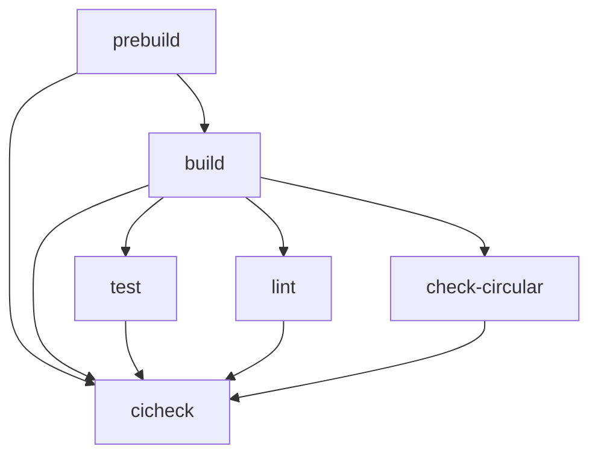

# Dev Environment

Both repositories use pnpm workspaces orchestrated by Turborepo. The toolchains differ slightly — `summer-earn-protocol` adds Foundry for Solidity testing, while `summerfi-monorepo` uses SST for serverless deployment.

## Prerequisites

| Tool | Required version | Notes |
|---|---|---|
| Node.js | `>=20` | Both repos require `engines.node >= 20` |
| pnpm | 10.x | `summer-earn-protocol` (`packageManager: pnpm@10.32.1`) |
| pnpm | 8.x | `summerfi-monorepo` (`packageManager: pnpm@8.15.9`) |
| Foundry (`forge`, `cast`, `anvil`) | latest stable | Required only for `summer-earn-protocol` |
| lcov | any | Optional — only needed for HTML coverage reports |

> Use a Node version manager (e.g. `nvm`, `fnm`) to switch between Node versions if you work in both repos in the same shell session.

## summer-earn-protocol

### Install

```bash
# From repo root
pnpm i
# postinstall hook runs: git submodule update --init
```

Submodules bring in pinned Solidity dependencies (LayerZero, OZ, etc.). If the submodule step fails, run it manually:

```bash
git submodule update --init --recursive
```

### Install Foundry

```bash
curl -L https://foundry.paradigm.xyz | bash
foundryup
# Restart your terminal after this step
```

Verify:

```bash
forge --version
pnpm --version
```

### Build

Turborepo caches build artifacts under `.turbo/`. The root `pnpm build` excludes the four front-end apps to keep CI fast:

```bash
# Build all non-UI packages (contracts + tooling)
pnpm build

# Build a single package
pnpm -F @summerfi/earn-gov-contracts build

# Contracts compile with Foundry via forge
# TypeScript packages compile with tsc / esbuild
```

### Test

```bash
# All packages (sequential — Turborepo forces concurrency=1)
pnpm test

# Single package
pnpm -F @summerfi/earn-gov-contracts test

# Forge directly (from within a contracts package)
forge test -vvv

# Filter to a specific test
forge test -m YourTestName -vvv

# Gas snapshots
forge snapshot
```

### Coverage

```bash
# All packages
pnpm coverage

# Gov contracts only
pnpm -F @summerfi/earn-gov-contracts coverage

# Generate LCOV data
pnpm -F @summerfi/earn-gov-contracts coverage:lcov

# HTML report (requires lcov installed)
pnpm -F @summerfi/earn-gov-contracts coverage:report
# Open: packages/gov-contracts/coverage/index.html
```

Coverage uses `--no-match-coverage '(script|test|TestBase|Mock|Test)'` to exclude non-source files.

### Lint, format, circular-dep checks

```bash
pnpm lint
pnpm lint:fix
pnpm format
pnpm format:fix   # Run this after every edit before committing
pnpm check-circular
```

### Docs

```bash
# Regenerate forge doc + TypeDoc into gitbook/
pnpm docs:build

# Check that generated docs are in sync with source (used in CI)
pnpm docs:check
```

### Environment variables

Turborepo forwards these env vars to all tasks (defined in `turbo.json#globalEnv`):

```bash
MAINNET_RPC_URL=
ARBITRUM_RPC_URL=
BASE_RPC_URL=
SONIC_RPC_URL=
OPTIMISM_RPC_URL=
HYPERLIQUID_RPC_URL=
ETHERSCAN_API_KEY=
FOUNDRY_FUZZ_RUNS=   # optional — increase for deeper fuzzing
```

Place them in `.env.local` at the repo root (picked up by `turbo.json#globalDependencies`).

## summerfi-monorepo

### Install

```bash
# From repo root
pnpm i
```

### Build

```bash
pnpm build

# Single package
pnpm -F @summerfi/summer-protocol-db build
```

### Develop

```bash
pnpm dev   # starts all persistent dev watchers concurrently
```

### Test

```bash
pnpm test
```

### Environment variables

The monorepo has a large set of `globalEnv` entries in its `turbo.json` including subgraph URLs, Mixpanel keys, AWS/SST settings, and RPC gateways. Check `turbo.json` at the repo root for the full list and create `.env.local` accordingly.

## Turborepo task graph

Both repos follow the same pipeline shape:



Run `pnpm dlx nx graph` from either repo root for a visual dependency graph.
