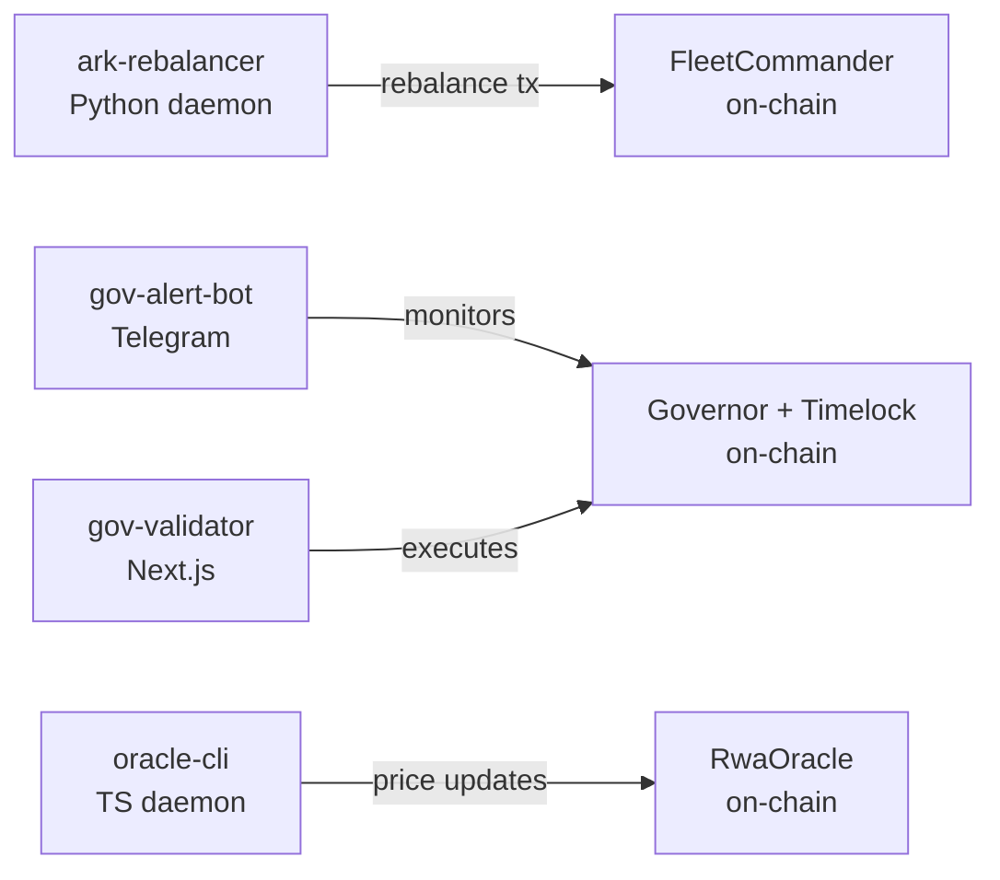

# Operations

Four off-chain components handle runtime operations: a Python rebalancer keeper, a Telegram governance alert bot, a Next.js governance proposal validator, and a TypeScript oracle CLI.

## Ark Rebalancer (`packages/ark-rebalancer`)

A single-file Python script (`ark_rebalancer.py`) that monitors Ark yield rates within a `FleetCommander` and submits `rebalance` transactions when a better yield opportunity is stable.

### How it works

1. Every 10 seconds the script calls `FleetCommander.arks()` to get the list of Ark addresses.
2. For each Ark it calls `rate()` to retrieve the current yield rate.
3. Rates are sorted descending. The highest-rate Ark becomes the `toArk` target.
4. A 2-minute window (`deque(maxlen=12)`) confirms the top Ark is stable.
5. Once confirmed, it calls `totalAssets()` on each non-top Ark and builds `RebalanceData[]` (skipping Arks with ≤100 wei).
6. The transaction is simulated with `eth.call` before being signed and broadcast.

### Setup

```bash
cd packages/ark-rebalancer
python -m venv venv
venv/bin/pip install -r requirements.txt
```

Dependencies (from `requirements.txt`): `web3==5.31.1`, `requests==2.32.4`, `mypy==1.11.0`, `python-dotenv==1.2.2`.

### Environment variables

```bash
BASE_RPC_URL=https://…
DEPLOYER_PRIV_KEY=0x…
FLEET_COMMANDER_ADDRESS=0x…
```

### Running

```bash
# From repo root
pnpm start:ark-rebalancer

# Type-check
pnpm typecheck:ark-rebalancer
```

## Governance Alert Bot (`packages/summer-earn-gov-alert-bot`)

A TypeScript Telegram bot (`@summerfi/summer-earn-gov-alert-bot`) that polls on-chain governance events and pushes notifications to a configured Telegram channel. It uses `node-cron` for scheduled polling and `telegraf` for Telegram interaction.

### Features

- Scheduled polling cycle via `node-cron`
- Manual `/check` command triggers a dry-run poll; result is sent back to the issuing chat
- `/tx <network> <hash>` command decodes and reports on a single governance transaction
- State is persisted to `state.json` to avoid duplicate alerts across restarts

### Setup

```bash
cd packages/summer-earn-gov-alert-bot
pnpm install
```

### Environment variables

```bash
TG_BOT_TOKEN=<Telegram bot token>
TG_CHAT_ID=<target channel or chat ID>
```

Both variables are required. The bot exits immediately if either is missing.

### Running

```bash
pnpm start    # production: tsx src/index.ts
pnpm dev      # watch mode: tsx watch src/index.ts
```

## Governance Validator (`packages/summer-earn-gov-validator`)

A Next.js application for decoding and executing governance proposals. It is excluded from the default workspace build (`--filter='!./packages/summer-earn-gov-validator'`).

### Pages

| Route | Purpose |
|---|---|
| `/` | Paste a proposal and decode calldata; validate structure |
| `/cross-chain` | List pending cross-chain proposals; execute them via connected wallet |

### Chains supported

Mainnet, Base, Arbitrum, Sonic (configured in RainbowKit).

### Cross-chain execution

The `/cross-chain` page reads proposals from the subgraph and surfaces an Execute button for pending timelock operations. Clicking Execute:

1. Switches the connected wallet to the correct chain.
2. Calls `TimelockController.executeBatch` with the proposal's `targets`, `values`, `calldatas`, and `salt`.

### Setup and run

```bash
cd packages/summer-earn-gov-validator
pnpm install

# Optional
echo "NEXT_PUBLIC_WALLETCONNECT_PROJECT_ID=your_id" > .env.local

pnpm dev
# open http://localhost:3000
```

## Oracle CLI (`packages/oracle-cli`)

A TypeScript CLI (`@summerfi/oracle-cli`) for deploying and operating RWA oracle contracts (`OracleRegistry`, `RwaOracle`). It targets the WisdomTree price feed and is pre-configured for Base, Arbitrum, and Ethereum mainnet.

### Key commands

```bash
# Deploy oracle(s) defined in deploy-input.json
pnpm deploy:oracles

# Run daemon: monitor SPXUX with 0.5% deviation threshold, 24h heartbeat
pnpm cli start SPXUX --deviation 0.5 --heartbeat 86400

# Push a price update once
pnpm cli update SPXUX

# Fetch latest NAV from DataSpan API
pnpm cli wt-data WTSYX

# Historical NAV trend chart in terminal
pnpm cli wt-data-range CRDYX 2026-03-01 2026-03-09

# WisdomTree organisation details
pnpm cli wt-me

# Manage signers
pnpm cli add-signer <ORACLE_ADDR> <SIGNER_ADDR>
pnpm cli set-threshold <ORACLE_ADDR> <THRESHOLD>

# Registry management
pnpm cli registry-set TICKER ASSET_ADDR ORACLE_ADDR
```

### Deploy input format

Edit `deploy-input.json` before running `pnpm deploy:oracles`:

```json
[
  {
    "network": "base",
    "assetAddress": "0x833589fCD6eDb6E08f4c7C32D4f71b54bdA02913",
    "signers": ["0x…"],
    "threshold": 1
  }
]
```

The script fetches the asset symbol on-chain to use as the ticker and writes the deployed `OracleRegistry` address to `src/deployments.json`, which is also consumed by the oracle dashboard.

### Environment variables

```bash
BASE_RPC_URL=https://mainnet.base.org
ARBITRUM_RPC_URL=https://arb1.arbitrum.io/rpc
MAINNET_RPC_URL=https://eth.llamarpc.com
DEPLOYER_PRIVATE_KEY=0x…
PRIVATE_KEYS=0x_signer1,0x_signer2,…   # comma-separated, used by node daemon
# WisdomTree API credentials
WT_CLIENT=…
WT_SECRET=…
WT_LOGIN=…
WT_PASSWORD=…
```

The CLI loads `.env` from the repo root first, then from `packages/oracle-cli/`.

## Operational overview


