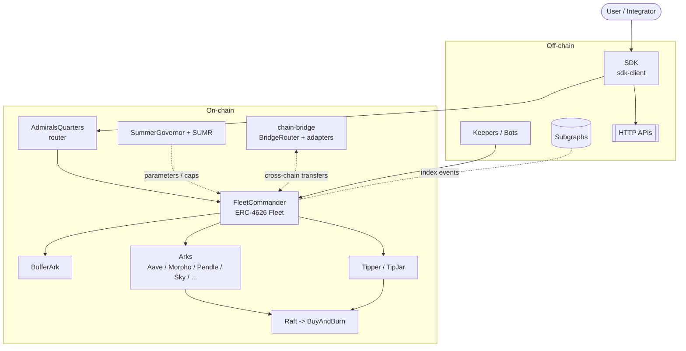

# Ecosystem Map

The Summer.fi Earn Protocol spans on-chain contracts, off-chain services, and a
client SDK. At a high level:

### On-chain
- **Fleets & Arks** — `FleetCommander` vaults allocate deposits across `Ark` adapters; `BufferArk` holds instant liquidity. See [Protocol Concepts](../concepts/fleets-and-arks.md).
- **Fees & buy-and-burn** — `Tipper`/`TipJar` accrue protocol tips; `Raft` collects Ark rewards; `BuyAndBurn` converts and burns SUMR.
- **Governance** — `SummerGovernor` + the `SUMR` token govern the protocol cross-chain. See [Governance](../governance/overview.md).
- **Cross-chain** — the `chain-bridge` package moves assets and messages between chains. See [Cross-Chain](../cross-chain/overview.md).

### Off-chain
- **SDK** (`@summer_fi/sdk-client`) — the supported way to read protocol state and build transactions. Documented in the **SDK** section of this docs site.
- **Keepers/bots** — trigger rebalances, harvests, and bridge execution.
- **Subgraphs & HTTP APIs** — index protocol events and expose rates/portfolio/APY data.

### Two repositories
- **summer-earn-protocol** — Solidity contracts, deployment, subgraphs, keeper tooling. (This space's contract reference is generated from its NatSpec.)
- **summerfi-monorepo** — the TypeScript SDK, apps, and backend services. (The SDK API reference is generated from its TSDoc.)
