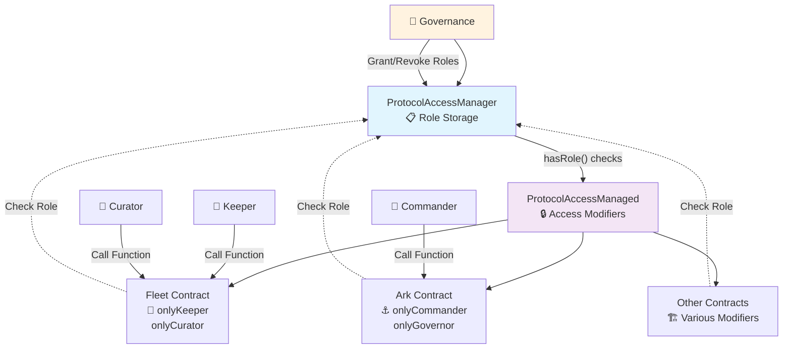

# Protocol Access Control System

## Overview

The Summer protocol uses a centralized access control system with two main contracts:

- **`ProtocolAccessManager`**: Central authority that stores and manages all roles
- **`ProtocolAccessManaged`**: Base contract that connects to the manager and provides access modifiers

## Architecture Intent



## Role System

### Core Roles
- **`GOVERNOR_ROLE`**: Supreme authority, manages all other roles
- **`GUARDIAN_ROLE`**: Emergency powers (pause/unpause, cancel proposals)
- **`SUPER_KEEPER_ROLE`**: Global maintenance across all contracts

### Contract-Specific Roles
- **`CURATOR_ROLE`**: Fleet-specific management (per fleet)
- **`KEEPER_ROLE`**: Contract-specific maintenance (per contract)  
- **`COMMANDER_ROLE`**: Ark-specific control (per ark)

### Specialized Roles
- **`DECAY_CONTROLLER_ROLE`**: Voting power decay management
- **`ADMIRALS_QUARTERS_ROLE`**: Asset bundling operations
- **`FOUNDATION_ROLE`**: Vesting and token distribution

## Usage Pattern

```solidity
// 1. Your contracts inherit from ProtocolAccessManaged
contract MyContract is ProtocolAccessManaged {
    constructor(address accessManager) ProtocolAccessManaged(accessManager) {}
    
    // 2. Use built-in modifiers for access control
    function adminFunction() external onlyGovernor {
        // Only governors can call
    }
    
    function maintenanceTask() external onlyKeeper {
        // Contract-specific keepers OR super keepers can call
    }
    
    function emergencyStop() external onlyGuardianOrGovernor {
        // Either guardians or governors can call
    }
}

// 3. Role management happens centrally through ProtocolAccessManager
accessManager.grantKeeperRole(contractAddress, keeperAddress);
accessManager.grantCuratorRole(fleetAddress, curatorAddress);
```

## Key Benefits

1. **Single Source of Truth**: All roles managed in one place
2. **Consistent Access Control**: Same modifiers across all contracts
3. **Flexible Role System**: Both global and contract-specific roles
4. **Emergency Powers**: Guardian role for crisis management
5. **Secure by Default**: Built on LimitedAccessControl foundation

## Contract-Specific Role Generation

For roles tied to specific contracts (Curator, Keeper, Commander), the system generates unique role IDs:

```solidity
// Each contract gets its own keeper role
bytes32 keeperRole = keccak256(abi.encodePacked(KEEPER_ROLE, contractAddress));

// Fleet at 0x123... gets its own curator
bytes32 curatorRole = keccak256(abi.encodePacked(CURATOR_ROLE, 0x123...));
```

This ensures a Keeper for Fleet A cannot perform maintenance on Fleet B.

## Guardian Expiration System

Guardians have **time-limited powers** (7-180 days) to balance security:
- **Prevents malicious proposals**: Can't immediately remove guardians
- **Prevents malicious guardians**: Powers automatically expire
- **Active check**: Use `isActiveGuardian()` for time-sensitive functions
