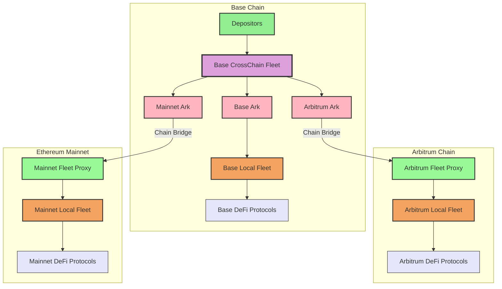

# Cross-Chain Fleet Architecture

This document illustrates the architecture of Summer's Cross-Chain Fleet system, where a single CrossChainFleet deployed on Base (the hub chain) can deploy capital across multiple chains through its Arks.

## Architecture Overview

The CrossChainFleet operates as a centralized hub that accepts deposits on Base and then strategically deploys capital across multiple chains to optimize yield and diversify risk.

## Key Components

### CrossChain Fleet (Hub on Base)
- **Single Entry Point**: All user deposits flow into the CrossChain Fleet on Base
- **Capital Allocation**: Manages strategic allocation across multiple chains
- **Risk Management**: Centralizes risk assessment and portfolio management
- **Governance**: Single point of control for cross-chain investment decisions

### Arks (Cross-Chain Investment Vehicles)
- **One Per Fleet**: Each Ark represents a specific investment allocation to one target fleet
- **Base Ark**: Directly invests in the Base Local Fleet (no bridging required)
- **Satellite Arks**: Use the Chain Bridge system to move assets to satellite chains
- **Rebalancing**: Can dynamically adjust allocations based on market conditions

### Fleet Proxies (Satellite Chain Gateways)
- **Arbitrum Fleet Proxy**: Receives bridged assets and forwards to Arbitrum Local Fleet
- **Mainnet Fleet Proxy**: Receives bridged assets and forwards to Mainnet Local Fleet
- **Bridge Integration**: Seamlessly handles cross-chain asset reception and forwarding
- **Local Management**: Provides local governance and emergency controls on satellite chains

### Local Fleets (Chain-Specific)
- **Base Local Fleet**: Directly connected to Base Ark, invests in Base ecosystem protocols
- **Arbitrum Local Fleet**: Receives assets via Fleet Proxy, targets Arbitrum DeFi protocols
- **Mainnet Local Fleet**: Receives assets via Fleet Proxy, accesses Ethereum mainnet protocols

## Investment Flow

1. **Deposit**: Users deposit assets into the CrossChain Fleet on Base
2. **Allocation Decision**: Fleet determines optimal cross-chain allocation strategy  
3. **Ark Funding**: Each Ark (Base, Arbitrum, Mainnet) receives its allocated capital
4. **Base Investment**: Base Ark directly funds Base Local Fleet (no bridging needed)
5. **Cross-Chain Transfer**: Satellite Arks use Chain Bridge to transfer assets to target chains
6. **Proxy Reception**: Fleet Proxies on satellite chains receive and validate bridged assets
7. **Local Fleet Funding**: Proxies forward assets to their respective Local Fleets
8. **DeFi Investment**: Local Fleets invest in chain-specific DeFi protocols
9. **Yield Generation**: Each local fleet generates yield from its respective protocols
10. **Rebalancing**: Periodic rebalancing optimizes allocations across all chains

## Benefits

### For Users
- **Simplified Access**: Single deposit point for multi-chain yield strategies
- **Professional Management**: Expert allocation across chains and protocols
- **Reduced Complexity**: No need to manage multiple wallets or bridge assets manually
- **Gas Optimization**: Efficient batching of cross-chain operations

### For the Protocol
- **Capital Efficiency**: Optimal allocation across the best opportunities on each chain
- **Risk Diversification**: Spread exposure across multiple chains and protocols
- **Operational Efficiency**: Centralized management with decentralized execution
- **Scalability**: Easy addition of new chains and protocols

## Technical Implementation

The architecture leverages several key components:

- **Chain Bridge System**: Secure, efficient asset transfers between chains
- **Fleet Management**: Smart contract logic for allocation and rebalancing
- **Ark Mechanism**: Individual investment vehicles for specific strategies
- **Cross-Chain Governance**: Coordinated decision-making across the ecosystem

## Future Enhancements

- **Dynamic Rebalancing**: Automated rebalancing based on yield differentials
- **Risk-Adjusted Allocation**: ML-driven optimization of cross-chain allocations
- **Additional Chains**: Expansion to Polygon, Optimism, and other L2s
- **Strategy Diversification**: Multiple fleet types (conservative, aggressive, sector-specific) 