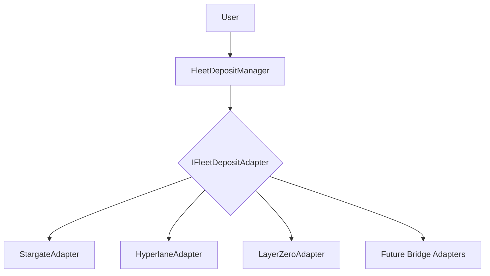
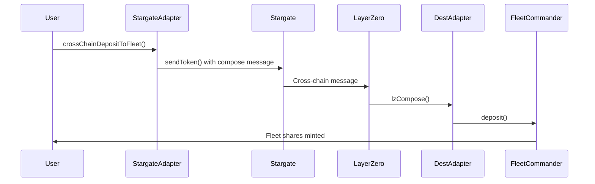

# Cross-Chain Fleet Deposits - Vendor Agnostic Architecture

## Overview

The Summer Protocol now supports **vendor-agnostic** cross-chain fleet deposits, allowing users to deposit assets from one chain directly to FleetCommanders on another chain using their preferred bridge technology. This architecture provides flexibility and future-proofs the system against bridge technology changes.

## Architecture

### 🏗️ Core Components

1. **FleetDepositManager**: Main orchestrator contract that users interact with
2. **IFleetDepositAdapter**: Interface implemented by bridge adapters  
3. **Bridge Adapters**: Implementation-specific adapters (StargateAdapter, HyperlaneAdapter, etc.)

### 🔄 Vendor Agnostic Design

Users can choose their preferred bridge technology:
- **Stargate V2**: Fast, secure, and widely supported
- **LayerZero**: Direct messaging protocol
- **Hyperlane**: Modular interoperability framework
- **Future bridges**: Easy to add new bridge technologies



### 🎯 Benefits of Vendor Agnostic Design

1. **User Choice**: Users can select their preferred bridge based on fees, speed, or trust preferences
2. **Risk Diversification**: Not dependent on a single bridge technology
3. **Future-Proof**: Easy to add support for new bridge technologies
4. **Competitive Fees**: Bridges compete on pricing and features
5. **Reduced Vendor Lock-in**: No dependency on any specific bridge protocol
6. **Modularity**: Bridge logic separated from fleet deposit logic

### 🔌 How to Add New Bridge Adapters

To support a new bridge technology:

1. **Implement Interface**: Create adapter implementing `IFleetDepositAdapter`
2. **Register with BridgeRouter**: Use existing governance process
3. **Users Can Use**: Immediately available to all users

```solidity
// Example: Adding Hyperlane support
contract HyperlaneAdapter is IFleetDepositAdapter, IBridgeAdapter {
    function executeCrossChainFleetDeposit(...) external payable override {
        // Hyperlane-specific implementation
    }
    
    function supportsFleetDeposits() external pure override returns (bool) {
        return true;
    }
    
    // ... standard IBridgeAdapter methods
}

// Governance registers the new adapter with BridgeRouter (existing process)
bridgeRouter.registerAdapter(hyperlaneAdapter);
```

## Use Cases

1. **User has USDC on Arbitrum, wants to deposit to USDC Fleet on Base**
2. **User has USDT on Ethereum, wants to deposit to USDT Fleet on Polygon** 
3. **User wants to use referral codes for tracking/rewards**
4. **Batch deposits for multiple users via aggregator contracts**

## Key Features

### 🚀 Core Functionality
- **Single Transaction**: Bridge + Deposit in one transaction
- **Referral Support**: Built-in referral code tracking
- **Fee Estimation**: Accurate cross-chain fee calculation
- **Error Recovery**: Robust failure handling and manual recovery

### 🔒 Safety Features
- **Composability Safety**: Uses Stargate V2's compose functionality
- **Failed Operation Tracking**: Records and allows recovery of failed deposits
- **Asset Validation**: Validates FleetCommander compatibility before deposit
- **Governance Recovery**: Manual recovery for edge cases

## Implementation Details

### New Functions Added

#### `crossChainDepositToFleet()`
```solidity
function crossChainDepositToFleet(
    uint16 destinationChainId,
    address asset,
    uint256 amount,
    address fleetCommander,
    address shareRecipient,
    bytes memory referralCode,
    BridgeTypes.AdapterParams calldata adapterParams
) external payable returns (bytes32 operationId)
```

Main function for users to deposit assets cross-chain to FleetCommanders.

#### `estimateFleetDepositFee()`
```solidity
function estimateFleetDepositFee(
    uint16 destinationChainId,
    address asset,
    uint256 amount,
    address fleetCommander,
    bytes memory referralCode
) external view returns (uint256 nativeFee, uint256 tokenFee)
```

Estimates the native fee required for cross-chain fleet deposits.

### Enhanced Compose Message Handling

The adapter now supports two types of compose messages:
1. **Legacy Asset Transfer** (existing functionality)
2. **Fleet Deposit** (new functionality)

Messages are differentiated by a type identifier in the first 32 bytes.

### Fleet Deposit Flow



## Usage Examples

### Basic Cross-Chain Fleet Deposit (Vendor Agnostic)

```solidity
// User on Arbitrum wants to deposit USDC to Summer's Base USDC Fleet using Stargate
contract MyContract {
    function depositToBaseFleet(
        address fleetDepositManager,
        address stargateAdapter,
        address usdcToken,
        address baseFleetCommander,
        uint256 amount
    ) external {
        // 1. User approves FleetDepositManager to spend their USDC
        IERC20(usdcToken).approve(fleetDepositManager, amount);

        // 2. Create fleet deposit message for fee estimation
        bytes memory composeMessage = IFleetDepositManager(fleetDepositManager)
            .createFleetDepositMessage(
                baseFleetCommander,
                msg.sender, // share recipient
                usdcToken,
                amount,
                bytes("") // no referral code
            );

        // 3. Estimate fee using adapter's standard estimateFee
        (uint256 nativeFee, ) = IBridgeAdapter(stargateAdapter)
            .estimateFee(
                8453, // Base chain ID
                usdcToken,
                amount,
                BridgeTypes.AdapterParams({
                    gasLimit: 500000, // Higher gas for fleet operations
                    calldataSize: 0,
                    msgValue: 0,
                    options: composeMessage // Pass compose message here
                }),
                BridgeTypes.OperationType.TRANSFER_ASSET
            );

        // 4. Execute cross-chain deposit through chosen bridge adapter
        IFleetDepositManager(fleetDepositManager).crossChainDepositToFleet{
            value: nativeFee
        }(
            stargateAdapter, // User's choice: could be hyperlaneAdapter, layerZeroAdapter, etc.
            8453, // Base chain ID
            usdcToken,
            amount,
            baseFleetCommander,
            msg.sender, // User receives the fleet shares
            bytes(""), // No referral code
            BridgeTypes.AdapterParams({
                gasLimit: 500000,
                calldataSize: 0,
                msgValue: 0,
                options: bytes("")
            })
        );
    }
}
```

### Cross-Chain Deposit with Referral Code

```solidity
function depositWithReferral(
    address stargateAdapter,
    address token,
    address fleetCommander,
    uint16 destinationChainId,
    uint256 amount,
    string memory referralCode
) external {
    IERC20(token).approve(stargateAdapter, amount);

    bytes memory referralCodeBytes = bytes(referralCode);

    // Estimate fee (referral code affects message size)
    (uint256 nativeFee, ) = IStargateAdapter(stargateAdapter)
        .estimateFee(
            destinationChainId,
            token,
            amount,
            BridgeTypes.AdapterParams({
                gasLimit: 500000,
                calldataSize: 0,
                msgValue: 0,
                options: abi.encode(
                    StargateAdapter.FLEET_DEPOSIT_TYPE,
                    fleetCommander,
                    msg.sender,
                    token,
                    amount,
                    block.chainid,
                    bytes32(0),
                    msg.sender,
                    referralCodeBytes
                )
            }),
            BridgeTypes.OperationType.TRANSFER_ASSET
        );

    // Execute with referral code
    IStargateAdapter(stargateAdapter).crossChainDepositToFleet{
        value: nativeFee
    }(
        destinationChainId,
        token,
        amount,
        fleetCommander,
        msg.sender,
        referralCodeBytes,
        BridgeTypes.AdapterParams({
            gasLimit: 500000,
            calldataSize: 0,
            msgValue: 0,
            options: bytes("")
        })
    );
}
```

### Integration with DEX (Swap + Cross-Chain Deposit)

```solidity
function swapAndCrossChainDeposit(
    address dexRouter,
    address stargateAdapter,
    address inputToken,
    address outputToken,
    uint256 inputAmount,
    uint256 minOutputAmount,
    address fleetCommander,
    uint16 destinationChainId
) external payable {
    // 1. Swap on local chain
    IERC20(inputToken).safeTransferFrom(msg.sender, address(this), inputAmount);
    IERC20(inputToken).approve(dexRouter, inputAmount);

    uint256 outputAmount = IDEXRouter(dexRouter).swapExactTokensForTokens(
        inputAmount,
        minOutputAmount,
        inputToken,
        outputToken
    );

    // 2. Cross-chain deposit the swapped tokens
    IERC20(outputToken).approve(stargateAdapter, outputAmount);

    IStargateAdapter(stargateAdapter).crossChainDepositToFleet{
        value: msg.value
    }(
        destinationChainId,
        outputToken,
        outputAmount,
        fleetCommander,
        msg.sender,
        bytes("SWAP_AND_DEPOSIT"),
        BridgeTypes.AdapterParams({
            gasLimit: 500000,
            calldataSize: 0,
            msgValue: 0,
            options: bytes("")
        })
    );
}
```

### Batch Processing Multiple Users

```solidity
function batchFleetDeposits(
    address stargateAdapter,
    address token,
    address fleetCommander,
    uint16 destinationChainId,
    address[] memory users,
    uint256[] memory amounts
) external payable {
    require(users.length == amounts.length, "Array length mismatch");

    uint256 totalAmount = 0;
    for (uint256 i = 0; i < amounts.length; i++) {
        totalAmount += amounts[i];
        IERC20(token).safeTransferFrom(users[i], address(this), amounts[i]);
    }

    IERC20(token).approve(stargateAdapter, totalAmount);

    // Execute single cross-chain deposit for all users
    // Note: In production, you'd need logic to distribute shares proportionally
    IStargateAdapter(stargateAdapter).crossChainDepositToFleet{
        value: msg.value
    }(
        destinationChainId,
        token,
        totalAmount,
        fleetCommander,
        address(this), // This contract receives shares temporarily
        bytes("BATCH_DEPOSIT"),
        BridgeTypes.AdapterParams({
            gasLimit: 750000, // Higher gas for batch processing
            calldataSize: 0,
            msgValue: 0,
            options: bytes("")
        })
    );
}
```

## Enhanced Fee Estimation

The `StargateAdapter.estimateFee()` function has been enhanced to handle both legacy transfers and fleet deposits through a flexible compose message system:

### Usage Patterns

**For Fleet Deposits (with compose message):**
```solidity
// Create fleet deposit compose message for accurate fee estimation
bytes memory composeMsg = abi.encode(
    StargateAdapter.FLEET_DEPOSIT_TYPE,
    fleetCommander,
    shareRecipient,
    asset,
    amount,
    block.chainid,
    bytes32(0), // operation ID (filled by adapter)
    msg.sender, // original user
    referralCode
);

(uint256 nativeFee, ) = adapter.estimateFee(
    destinationChainId,
    asset,
    amount,
    BridgeTypes.AdapterParams({
        gasLimit: 500000, // Higher gas for fleet operations
        calldataSize: 0,
        msgValue: 0,
        options: composeMsg // Compose message for accurate sizing
    }),
    BridgeTypes.OperationType.TRANSFER_ASSET
);
```

**For Legacy Transfers (without compose message):**
```solidity
// Legacy format - uses dummy compose message for estimation
(uint256 nativeFee, ) = adapter.estimateFee(
    destinationChainId,
    asset,
    amount,
    BridgeTypes.AdapterParams({
        gasLimit: 300000, // Standard gas
        calldataSize: 0,
        msgValue: 0,
        options: bytes("") // Empty - uses fallback dummy message
    }),
    BridgeTypes.OperationType.TRANSFER_ASSET
);
```

### Benefits

1. **Accurate Pricing**: Uses actual compose message size for precise fee calculation
2. **Variable Gas Limits**: Allows custom gas limits via `adapterParams.gasLimit`
3. **Referral Code Support**: Accounts for variable message sizes due to referral codes
4. **Backward Compatible**: Empty `options` falls back to dummy message for legacy compatibility
5. **Single Function**: Eliminates need for separate fee estimation functions

### Error Handling and Recovery

```solidity
function checkAndRecoverFailedDeposits(
    address stargateAdapter,
    address governance
) external {
    require(msg.sender == governance, "Only governance");

    bytes32[] memory failedOps = IStargateAdapter(stargateAdapter).getFailedOperations();
    
    for (uint256 i = 0; i < failedOps.length; i++) {
        (
            address asset,
            uint256 amount,
            address intendedRecipient,
            bytes32 operationId,
            address originator,
            ,
            ,
        ) = IStargateAdapter(stargateAdapter).failedComposes(failedOps[i]);

        // Recover tokens to the original user
        IStargateAdapter(stargateAdapter).manualRecovery(
            asset,
            amount,
            originator, // Send back to original user
            operationId,
            false, // Don't retry fleet deposit
            bytes("")
        );
    }
}
```

### Utility Functions

```solidity
// Check if chain and asset are supported
function checkSupport(
    address stargateAdapter,
    uint16 chainId,
    address asset
) external view returns (bool chainSupported, bool assetSupported) {
    chainSupported = IStargateAdapter(stargateAdapter).supportsChain(chainId);
    assetSupported = IStargateAdapter(stargateAdapter).isAssetSupported(chainId, asset);
}

// Estimate fees for multiple amounts
function estimateFeesForAmounts(
    address stargateAdapter,
    uint16 destinationChainId,
    address asset,
    address fleetCommander,
    uint256[] memory amounts,
    bytes memory referralCode
) external view returns (uint256[] memory fees) {
    fees = new uint256[](amounts.length);

    for (uint256 i = 0; i < amounts.length; i++) {
        (fees[i], ) = IStargateAdapter(stargateAdapter).estimateFee(
            destinationChainId,
            asset,
            amounts[i],
            BridgeTypes.AdapterParams({
                gasLimit: 500000,
                calldataSize: 0,
                msgValue: 0,
                options: abi.encode(
                    StargateAdapter.FLEET_DEPOSIT_TYPE,
                    fleetCommander,
                    address(0xdead),
                    asset,
                    amounts[i],
                    block.chainid,
                    bytes32(0),
                    address(0xdead),
                    referralCode
                )
            }),
            BridgeTypes.OperationType.TRANSFER_ASSET
        );
    }
}
```

## Testing

### Unit Tests
- **Mock FleetCommander Tests**: `StargateAdapter.CrossChainFleet.t.sol`
- Covers basic functionality, error cases, and edge scenarios

### Integration Tests  
- **Real FleetCommander Tests**: `StargateAdapter.FleetIntegration.t.sol`
- Tests with actual Summer Protocol FleetCommander contracts
- End-to-end testing of the complete flow

### Demo Contract
- **Usage Examples**: `CrossChainFleetDepositDemo.sol`
- Practical examples for different use cases
- Integration patterns and monitoring examples

## Supported Chains & Assets

The functionality works with any chain and asset combination that:
1. Is supported by Stargate V2
2. Has StargateAdapter deployed on both source and destination chains
3. Has the asset configured in the adapter's `assetToStargateContract` mapping

## Gas Considerations

- **Source Chain**: Standard bridge transaction + compose overhead
- **Destination Chain**: Fleet deposit gas is covered by the bridging fee
- **Fee Estimation**: Includes compose gas in the quote

## Security Considerations

### Validation
- FleetCommander asset compatibility validation
- Deposit limit checks via `maxDeposit()`
- Chain and asset support validation

### Failure Scenarios
- FleetCommander deposit failures (deposit cap exceeded, paused, etc.)
- Invalid FleetCommander addresses
- Insufficient adapter balance
- LayerZero delivery failures

### Recovery Mechanisms
- Failed operations tracking
- Governance-controlled manual recovery
- Asset validation before operations

## Future Enhancements

1. **Batch Operations**: Support for multiple fleet deposits in one transaction
2. **Slippage Protection**: Minimum share amount guarantees  
3. **Auto-retry**: Automatic retry mechanism for recoverable failures
4. **Fee Optimization**: Dynamic gas limit adjustment based on fleet complexity

## Events

### CrossChainFleetDepositInitiated
Emitted when a user initiates a cross-chain fleet deposit.

### CrossChainFleetDepositCompleted  
Emitted when a cross-chain fleet deposit completes successfully.

### CrossChainFleetDepositFailed
Emitted when a cross-chain fleet deposit fails.

### ComposeFailedAssetsHeld
Emitted when assets are held for governance recovery after a failure.

## Integration Guide

For projects wanting to integrate cross-chain fleet deposits:

1. **Frontend Integration**:
   - Call `estimateFleetDepositFee()` for fee quotes
   - Use `crossChainDepositToFleet()` for execution
   - Monitor events for operation status

2. **Smart Contract Integration**:
   - Approve tokens before calling
   - Include sufficient ETH for fees
   - Handle potential failures gracefully

3. **Backend Integration**:
   - Monitor failed operations for manual intervention
   - Track referral codes for rewards/analytics
   - Set up alerts for stuck operations

## Conclusion

The cross-chain fleet deposit functionality provides a seamless user experience for depositing assets to Summer Protocol fleets across different chains. The implementation prioritizes safety, recoverability, and user experience while maintaining the composability benefits of the Stargate V2 protocol. 