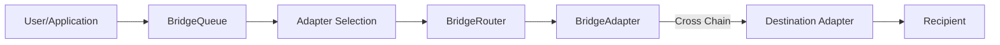
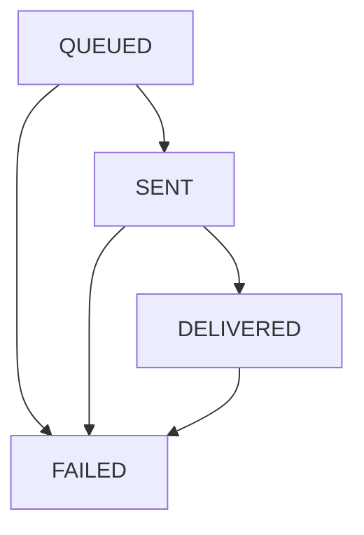

# Chain Bridge System

This directory contains the implementation of a modular cross-chain bridge system that enables secure asset transfers and message passing between different blockchains. The system is designed around a queue-based architecture where the `BridgeQueue` handles user interactions and adapter selection, while the `BridgeRouter` executes operations.

## Core Components

- **BridgeRouter**: Central execution contract that coordinates cross-chain operations
- **Bridge Adapters**: Protocol-specific implementations (LayerZero, Stargate, etc.)
- **CrossChainReceiver**: Interface for contracts that need to receive cross-chain data

## Architecture Overview

### Operation Flow



### Role Separation

1. **BridgeQueue**: 
   - Handles user interactions
   - Manages adapter selection logic
   - Collects fees and manages refunds
   - Queues operations for execution

2. **BridgeRouter**:
   - Executes operations initiated by BridgeQueue
   - Manages adapter registry and callbacks
   - Handles cross-chain message coordination
   - Tracks operation status

## Cross-Chain Operations

### Available Operations

1. **Asset Transfers**: Move tokens between chains
   ```solidity
   function executeTransferAssets(
       BridgeTypes.ExecuteTransferParams calldata params
   ) external payable returns (bytes32 operationId)
   ```

2. **Message Sending**: Send arbitrary data cross-chain
   ```solidity
   function executeSendMessage(
       BridgeTypes.ExecuteSendMessageParams calldata params
   ) external payable returns (bytes32 operationId)
   ```

3. **State Reading**: Query data from other chains
   ```solidity
   function executeReadState(
       BridgeTypes.ExecuteReadStateParams calldata params
   ) external payable returns (bytes32 operationId)
   ```

### Adapter Selection

The current implementation requires explicit adapter specification through `BridgeOptions.specifiedAdapter`. The router validates that:
- The specified adapter is registered
- The adapter supports the requested operation type
- The adapter supports the destination chain

> **Future Enhancement**: Automatic adapter selection logic may be re-added to the router for fallback scenarios and optimization.

## Operation Status Management

### Status Lifecycle

Operations progress through these states:
1. `QUEUED`: Operation initiated and queued for execution
2. `SENT`: Operation successfully sent by the adapter
3. `DELIVERED`: Operation received on destination chain  
4. `COMPLETED`: Final status (currently not implemented)
5. `FAILED`: Operation failed at any point



### Status Updates

1. **Adapter Updates**:
   - `updateOperationStatus()`: Called by adapter on source chain (QUEUED → SENT, SENT → FAILED)
   - `updateReceiveStatus()`: Called by adapter on destination chain
   - `notifyMessageReceived()`: Called when message/transfer is received

2. **Manual Recovery**:
   - `recoverOperationStatus()`: Called by governance to manually update status when automation fails

## Fee Handling

### Current Fee Structure

The router applies a simple fee buffer system:

```solidity
function _applyFeeBuffer(uint256 baseFee) internal pure returns (uint256) {
    // Add 1% buffer to account for fee volatility
    return (baseFee * 101) / 100;
}
```

### Fee Process

1. **Estimation**: `quote()` function returns base fee + 1% buffer
2. **Validation**: Router validates that `msg.value >= bufferedFee`
3. **Execution**: Full buffered fee is passed to the adapter
4. **Refunds**: Adapters handle excess fee refunds back through the chain

> **Note**: The previous fee multiplier system (200% fees) and confirmation funding have been removed in favor of this simpler approach.

## Adapter Integration

### Required Adapter Interface

Adapters must implement:
- `IBridgeAdapter.estimateFee()`: Fee estimation
- `IBridgeAdapter.supportsOperation()`: Operation type support

Plus some of:
- `IAssetAdapter.transferAsset()`: Asset transfer execution
- `IMessageAdapter.sendMessage()`: Message sending execution  
- `IMessageAdapter.readState()`: State reading execution

### Adapter Callbacks

Adapters call back to the router to:
- Update operation status (`updateOperationStatus`)
- Notify of received messages (`notifyMessageReceived`) 
- Update receive status (`updateReceiveStatus`)
- Deliver read responses (`deliverReadResponse`)

## Security Considerations

- **Access Control**: Only BridgeQueue can initiate operations
- **Adapter Registry**: Only governance can add/remove adapters
- **Pause Mechanism**: Guardian and governance can pause; only governance can unpause
- **Status Progression**: Status updates are validated and controlled
- **Adapter Authentication**: Only registered adapters can call callback functions
- **Manual Recovery**: Governance can manually update operation status if automation fails
- **Reentrancy Protection**: Critical functions use ReentrancyGuard

## Integration Guide

### For Users/Applications

Interact with the `BridgeQueue` contract (not directly with BridgeRouter):

```solidity
// Example: Transfer assets cross-chain
bridgeQueue.transferAssets{value: estimatedFee}(
    destinationChainId,
    asset,
    amount,
    recipient,
    options
);
```

### For Cross-Chain Message Recipients

Implement the `ICrossChainMessageReceiver` interface to receive arbitrary messages:

```solidity
function receiveMessage(
    BridgeTypes.DeliveredMessageParams calldata params
) external {
    // Validate caller and source
    require(msg.sender == bridgeRouter, "Only bridge router");
    require(params.sourceChainId == trustedChainId, "Invalid source chain");
    
    // Decode and process the message
    MyMessageStruct memory data = abi.decode(params.message, (MyMessageStruct));
    _processMessage(data, params.operationId);
}
```

The `DeliveredMessageParams` struct provides:
- `operationId`: Unique identifier for the cross-chain operation
- `originator`: Address that initiated the message on the source chain
- `sourceChainId`: Chain ID where the message originated
- `recipient`: Address of the receiving contract (should be `address(this)`)
- `message`: Encoded message payload to process

### For Cross-Chain Asset Recipients

Implement the `ICrossChainAssetReceiver` interface to receive assets with accompanying messages:

```solidity
function receiveMessageWithAssets(
    BridgeTypes.DeliveredTransferParams calldata params
) external {
    // Validate caller and source
    require(msg.sender == bridgeRouter, "Only bridge router");
    require(params.sourceChainId == trustedChainId, "Invalid source chain");
    require(params.asset == expectedToken, "Unsupported asset");
    
    // Verify we received the expected amount
    require(
        IERC20(params.asset).balanceOf(address(this)) >= expectedBalance + params.amount,
        "Assets not received"
    );
    
    // Decode and process the accompanying message
    DepositInstruction memory instruction = abi.decode(params.message, (DepositInstruction));
    _processDepositWithInstruction(params.asset, params.amount, instruction, params.operationId);
}
```

The `DeliveredTransferParams` struct provides:
- `operationId`: Unique identifier for the cross-chain operation
- `originator`: Address that initiated the transfer on the source chain
- `sourceChainId`: Chain ID where the transfer originated
- `recipient`: Address of the receiving contract (should be `address(this)`)
- `asset`: Address of the transferred token contract
- `amount`: Amount of tokens transferred (in token's native decimals)
- `message`: Encoded message payload to process with the transfer

**Important**: Assets are transferred to your contract BEFORE `receiveMessageWithAssets()` is called, so your contract balance will already reflect the received amount.

### For State Read Recipients

Implement the `ICrossChainStateReadReceiver` interface to receive state read responses:

```solidity
function receiveStateRead(
    bytes calldata resultData,
    bytes32 requestId,
    uint16 sourceChainId
) external {
    // Validate caller and source
    require(msg.sender == bridgeRouter, "Only bridge router");
    require(sourceChainId == trustedChainId, "Invalid source chain");
    require(pendingRequests[requestId], "Unknown request");
    
    // Decode the result based on expected return type
    uint256 balance = abi.decode(resultData, (uint256));
    _processStateReadResult(requestId, balance);
    
    delete pendingRequests[requestId]; // Prevent replay
}
```

## Router API

### View Functions

- `quote()`: Estimate fees for operations
- `getOperationStatus()`: Check operation status
- `getAdapters()`: List registered adapters
- `isValidAdapter()`: Validate adapter registration

### Governance Functions

- `registerAdapter()` / `removeAdapter()`: Manage adapter registry
- `pause()` / `unpause()`: Emergency controls
- `recoverOperationStatus()`: Manual status recovery
- `recoverFunds()`: Withdraw accumulated native tokens
- `setChainRouterAddress()`: Configure cross-chain router addresses

> **Note**: The BridgeRouter is designed to be extended with additional functionality like automatic adapter selection, fee optimization, and advanced routing logic as the protocol evolves.