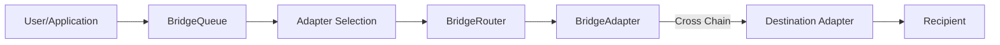

# Chain Bridge System

This directory contains the implementation of a modular cross-chain bridge system that enables secure asset transfers and message passing between different blockchains. The system is designed around a queue-based architecture where the `BridgeQueue` handles user interactions and adapter selection, while the `BridgeRouter` executes operations.

## Core Components

- **BridgeRouter**: Central execution contract that coordinates cross-chain operations
- **Bridge Adapters**: Protocol-specific implementations (LayerZero, Stargate, etc.)
- **CrossChainReceiver**: Interface for contracts that need to receive cross-chain data

## Architecture Overview

### Operation Flow



### Role Separation

1. **BridgeQueue**: 
   - Handles user interactions
   - Manages adapter selection logic
   - Collects fees and manages refunds
   - Queues operations for execution

2. **BridgeRouter**:
   - Executes operations initiated by BridgeQueue
   - Manages adapter registry and callbacks
   - Handles cross-chain message coordination

## Cross-Chain Operations

### Available Operations

1. **Asset Transfers**: Move tokens between chains
   ```solidity
   function executeTransferAssets(
       BridgeTypes.ExecuteTransferParams calldata params
   ) external payable returns (bytes32 operationId)
   ```

2. **Message Sending**: Send arbitrary data cross-chain
   ```solidity
   function executeSendMessage(
       BridgeTypes.ExecuteSendMessageParams calldata params
   ) external payable returns (bytes32 operationId)
   ```

3. **State Reading**: Query data from other chains
   ```solidity
   function executeReadState(
       BridgeTypes.ExecuteReadStateParams calldata params
   ) external payable returns (bytes32 operationId)
   ```

### Adapter Selection

The current implementation requires explicit adapter specification through `BridgeOptions.specifiedAdapter`. The router validates that:
- The specified adapter is registered
- The adapter supports the requested operation type
- The adapter supports the destination chain

> **Future Enhancement**: Automatic adapter selection logic may be re-added to the router for fallback scenarios and optimization.

## Fee Handling

### Current Fee Structure

The router applies a simple fee buffer system:

```solidity
function _applyFeeBuffer(uint256 baseFee) internal pure returns (uint256) {
    // Add 1% buffer to account for fee volatility
    return (baseFee * 101) / 100;
}
```

### Fee Process

1. **Estimation**: `quote()` function returns base fee + 1% buffer
2. **Validation**: Router validates that `msg.value >= bufferedFee`
3. **Execution**: Full buffered fee is passed to the adapter
4. **Refunds**: Adapters handle excess fee refunds back through the chain

> **Note**: The previous fee multiplier system (200% fees) and confirmation funding have been removed in favor of this simpler approach.

## Adapter Integration

### Required Adapter Interface

Adapters must implement:
- `IBridgeAdapter.estimateFee()`: Fee estimation
- `IBridgeAdapter.supportsOperation()`: Operation type support

Plus some of:
- `IAssetAdapter.transferAsset()`: Asset transfer execution
- `IMessageAdapter.sendMessage()`: Message sending execution  
- `IMessageAdapter.readState()`: State reading execution

### Adapter Callbacks

Adapters call back to the router to deliver cross-chain operations using the unified `deliver()` function.

## Security Considerations

- **Access Control**: Only BridgeQueue can initiate operations
- **Adapter Registry**: Only governance can add/remove adapters
- **Pause Mechanism**: Guardian and governance can pause; only governance can unpause
- **Adapter Authentication**: Only registered adapters can call callback functions
- **Reentrancy Protection**: Critical functions use ReentrancyGuard

## Integration Guide

### For Users/Applications

Interact with the `BridgeQueue` contract (not directly with BridgeRouter):

```solidity
// Example: Transfer assets cross-chain
bridgeQueue.transferAssets{value: estimatedFee}(
    destinationChainId,
    asset,
    amount,
    recipient,
    options
);
```

### For Cross-Chain Message Recipients

Implement the `ICrossChainReceiver` interface to receive operations:

```solidity
function receiveOperation(
    BridgeTypes.OperationType operationType,
    bytes calldata operationPayload
) external {
    // Validate caller is bridge router
    require(msg.sender == bridgeRouter, "Only bridge router");
    
    if (operationType == BridgeTypes.OperationType.TRANSFER_ASSET) {
        BridgeTypes.RelayedTransferParams memory params = abi.decode(
            operationPayload,
            (BridgeTypes.RelayedTransferParams)
        );
        _handleAssetTransfer(params);
    } else if (operationType == BridgeTypes.OperationType.MESSAGE) {
        BridgeTypes.RelayedMessageParams memory params = abi.decode(
            operationPayload,
            (BridgeTypes.RelayedMessageParams)
        );
        _handleMessage(params);
    } else if (operationType == BridgeTypes.OperationType.READ_STATE) {
        BridgeTypes.RelayedReadResponse memory params = abi.decode(
            operationPayload,
            (BridgeTypes.RelayedReadResponse)
        );
        _handleReadResponse(params);
    }
}
```

## Router API

### View Functions

- `quote()`: Estimate fees for operations
- `getAdapters()`: List registered adapters
- `isValidAdapter()`: Validate adapter registration

### Governance Functions

- `registerAdapter()` / `removeAdapter()`: Manage adapter registry
- `pause()` / `unpause()`: Emergency controls
- `recoverFunds()`: Withdraw accumulated native tokens

> **Note**: The BridgeRouter is designed to be extended with additional functionality like automatic adapter selection, fee optimization, and advanced routing logic as the protocol evolves.