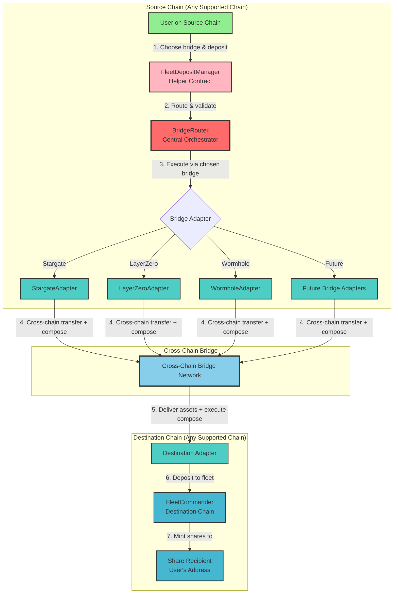

# Cross-Chain Fleet Architecture

**This** document describes Summer's Cross-Chain Fleet system, which enables users to deposit assets from any supported chain directly to FleetCommanders on any other supported chain using their choice of bridge technology.

## Architecture Overview

The system operates through a **vendor-agnostic** architecture where users can choose their preferred bridge technology (Stargate, LayerZero, Hyperlane, etc.) for cross-chain fleet deposits.



## Key Components

### 1. FleetDepositManager (Helper Contract)
- **User Interface**: Convenient entry point for fleet deposits
- **Input Validation**: Validates parameters before routing
- **Message Encoding**: Creates fleet deposit compose messages
- **Routes to BridgeRouter**: All operations go through BridgeRouter

### 2. BridgeRouter (Central Orchestrator)
- **Operation Management**: Tracks all cross-chain operations with unique IDs
- **Adapter Validation**: Ensures only registered adapters are used
- **Fee Management**: Applies fee buffers and handles payments
- **Vendor Agnostic**: Works with any registered bridge adapter
- **Direct Access**: Supports direct user fleet deposits via `executeUserFleetDeposit()`

### 3. Bridge Adapters (Protocol-Specific)
- **StargateAdapter**: Stargate V2 with LayerZero compose functionality
- **LayerZeroAdapter**: Direct LayerZero messaging
- **Future Adapters**: Easy to add new bridge technologies
- **Standard Interface**: All implement `IBridgeAdapter` and `ISendAdapter`
- **Compose Messages**: Handle fleet deposit instructions via compose callbacks

### 4. FleetCommanders (Destination)
- **Asset Recipients**: Receive bridged assets on destination chain
- **Share Issuance**: Mint fleet shares to specified recipients
- **Validation**: Check asset compatibility and deposit limits
- **Protocol Integration**: Deploy capital to chain-specific DeFi protocols

## Deposit Flow

### Simple User Fleet Deposit
1. **User Choice**: User selects target FleetCommander and preferred bridge
2. **Helper Validation**: FleetDepositManager validates inputs
3. **Central Orchestration**: BridgeRouter manages operation tracking and fees
4. **Bridge Execution**: Chosen adapter executes cross-chain transfer with compose message
5. **Destination Processing**: Adapter on destination chain deposits to FleetCommander
6. **Share Delivery**: FleetCommander mints shares to user's specified address

### Example: USDC from Arbitrum to Base Fleet
```
User (Arbitrum) 
→ FleetDepositManager (validates & encodes)
→ BridgeRouter (tracks operation, applies fees)
→ StargateAdapter (user's choice)
→ Stargate V2 Cross-Chain
→ StargateAdapter (Base)
→ FleetCommander (Base USDC Fleet)
→ Shares minted to user's Base address
```

## Benefits

### For Users
- **Bridge Choice**: Select preferred bridge technology (Stargate, LayerZero, etc.)
- **Direct Access**: Deposit to any fleet on any supported chain
- **Single Transaction**: Bridge + deposit in one operation
- **Transparent Fees**: Clear fee estimation before execution
- **Operation Tracking**: Monitor status via unique operation IDs

### For the Protocol
- **Vendor Agnostic**: Not locked to any single bridge provider
- **Future-Proof**: Easy to add new bridge technologies
- **Reliability**: Multiple bridge options provide redundancy
- **Scalability**: Simple addition of new chains and adapters
- **Security**: Centralized operation tracking and governance controls

## Technical Implementation

### Core Flow
```solidity
// 1. User calls FleetDepositManager
fleetDepositManager.initiateDepositToTargetChainFleet(
    bridgeAdapter,        // User's choice: Stargate, LayerZero, etc.
    destinationChainId,
    asset,
    amount,
    fleetCommander,
    shareRecipient,
    referralCode,
    adapterParams
);

// 2. FleetDepositManager routes to BridgeRouter
bridgeRouter.executeUserFleetDeposit(params);

// 3. BridgeRouter calls chosen adapter
adapter.transferAsset(operationId, params, composeMessage);

// 4. Adapter handles cross-chain transfer with fleet deposit compose
```

### Message Structure
Fleet deposits use standardized compose messages:
```solidity
struct FleetDepositMessageData {
    address fleetCommander;    // Target FleetCommander
    address shareRecipient;    // Share recipient address
    address asset;             // Asset being deposited
    uint256 amount;            // Deposit amount
    uint256 sourceChainId;     // Origin chain
    address originalUser;      // Original depositor
    bytes32 operationId;       // Unique operation ID
    bytes referralCode;        // Optional referral
}
```

## Supported Bridges

### Current
- **Stargate V2**: Primary bridge with LayerZero V2 infrastructure
- **LayerZero**: Direct messaging protocol

### Future
- **Hyperlane**: Modular interoperability protocol
- **Wormhole**: Guardian-based bridge network
- **Custom Bridges**: Protocol-specific implementations

Adding new bridges requires only:
1. Implementing `IBridgeAdapter` interface
2. Registering with BridgeRouter via governance
3. Immediately available to all users

## Security Features

- **Access Control**: ProtocolAccessManager integration
- **Operation Tracking**: All operations tracked with unique IDs
- **Fee Buffers**: Protection against fee volatility
- **Adapter Validation**: Only registered adapters allowed
- **Failure Recovery**: Manual recovery mechanisms for edge cases
