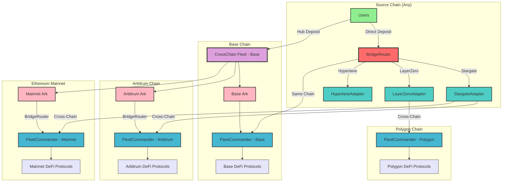

# Cross-Chain Fleet Architecture

This document describes Summer's Cross-Chain Fleet system, which supports both centralized fleet management and direct user-initiated fleet deposits across multiple chains through a vendor-agnostic bridge system.

## Architecture Overview

The Cross-Chain Fleet system operates through two complementary models:
1. **Centralized Fleet Management**: Hub fleets on Base allocating capital across chains
2. **Direct User Fleet Deposits**: Users depositing directly to any fleet on any supported chain



## Key Components

### BridgeRouter (Central Orchestrator)
- **Universal Entry Point**: Handles all cross-chain operations including fleet deposits
- **Vendor Agnostic**: Works with any bridge adapter (Stargate, LayerZero, Hyperlane)
- **Operation Management**: Tracks operation status and provides fee estimation
- **Security**: Integrated with ProtocolAccessManager for governance controls

### Bridge Adapters (Protocol-Specific)
- **StargateAdapter**: Implements Stargate V2 with LayerZero compose functionality
- **IFleetDepositAdapter Interface**: Standardizes fleet deposit operations across bridges
- **Compose Messaging**: Enables complex cross-chain operations with custom logic
- **Fee Management**: Handles bridge-specific fee estimation and payment

### FleetCommanders (Destination Contracts)
- **Direct Recipients**: Receive deposits directly from bridge adapters
- **Asset Validation**: Verify asset compatibility and deposit limits
- **Share Issuance**: Mint shares to specified recipients on destination chain
- **Protocol Integration**: Deploy capital to chain-specific DeFi protocols

### CrossChain Fleet (Hub Model - Optional)
- **Centralized Management**: Professional allocation across multiple chains
- **Ark System**: Individual investment vehicles for specific chain strategies
- **Rebalancing**: Dynamic optimization of cross-chain allocations
- **Risk Management**: Centralized oversight and portfolio management

## Deposit Flows

### Direct User Fleet Deposits
1. **User Selection**: User chooses target FleetCommander on any chain
2. **Bridge Route**: BridgeRouter selects optimal bridge adapter
3. **Fee Estimation**: Adapter provides cross-chain operation cost
4. **Asset Transfer**: User assets transferred to adapter
5. **Cross-Chain Send**: Adapter executes bridge operation with compose message
6. **Destination Compose**: Adapter on destination chain executes fleet deposit
7. **Share Minting**: FleetCommander mints shares to user's specified recipient
8. **Protocol Deployment**: FleetCommander deploys assets to DeFi protocols

### Centralized Hub Deposits (Legacy/Parallel)
1. **Hub Deposit**: Users deposit to CrossChain Fleet on Base
2. **Allocation Strategy**: Hub determines optimal cross-chain distribution
3. **Ark Funding**: Each Ark receives allocated capital for its target chain
4. **Cross-Chain Transfer**: Arks use BridgeRouter to move assets to target chains
5. **Fleet Deposit**: Assets deposited to FleetCommanders on destination chains
6. **Yield Generation**: Each FleetCommander generates yield from local protocols

## Technical Implementation

### Core Contracts
```solidity
// Central routing and operation management
contract BridgeRouter {
    function executeUserFleetDeposit(
        BridgeTypes.ExecuteUserFleetDepositParams calldata params
    ) external payable returns (bytes32 operationId);
}

// Bridge-specific implementation
contract StargateAdapter implements IFleetDepositAdapter {
    function sendFleetDepositToDestinationChain(
        uint16 destinationChainId,
        address asset,
        uint256 amount,
        address destinationAdapter,
        bytes memory composeMessage,
        BridgeTypes.AdapterParams calldata adapterParams
    ) external payable returns (bytes32 operationId);
}

// Standardized fleet deposit interface
interface IFleetDepositAdapter {
    function supportsUserInitiatedFleetDeposits() external view returns (bool);
}
```

### Message Encoding
Fleet deposits use structured compose messages:
```solidity
struct FleetDepositMessageData {
    address fleetCommander;      // Target FleetCommander
    address shareRecipient;      // Share recipient address
    address asset;               // Asset being deposited
    uint256 amount;              // Deposit amount
    uint256 sourceChainId;       // Origin chain
    bytes32 operationId;         // Unique operation ID
    address originalUser;        // Original depositor
    bytes referralCode;          // Optional referral
}
```

## Benefits

### For Users
- **Chain Flexibility**: Deposit to any fleet on any supported chain
- **Bridge Choice**: Select preferred bridge technology (Stargate, LayerZero, etc.)
- **Direct Access**: No need for intermediate proxies or hub contracts
- **Transparent Fees**: Clear fee estimation before transaction execution
- **Operation Tracking**: Unique operation IDs for monitoring cross-chain status

### For the Protocol
- **Vendor Agnostic**: Not locked into any single bridge provider
- **Scalability**: Easy addition of new bridges and chains
- **Composability**: Complex cross-chain operations through compose messaging
- **Reliability**: Multiple bridge options provide redundancy
- **Efficiency**: Direct deposits eliminate intermediate steps

## Security Features

### Access Control
- **ProtocolAccessManager**: Centralized governance and emergency controls
- **Adapter Registration**: Only approved bridge adapters can be used
- **FleetCommander Validation**: Deposits only to active, validated fleets

### Operation Safety
- **Fee Buffers**: 1% buffer applied to fee estimates for volatility protection
- **Operation Tracking**: All cross-chain operations tracked with unique IDs
- **Failure Handling**: Automatic refunds and recovery mechanisms
- **Slippage Protection**: Configurable slippage tolerance for bridge operations

## Supported Bridges

### Stargate V2 (Primary)
- **LayerZero V2**: Latest LayerZero infrastructure
- **OFT Standard**: Unified token standard across chains
- **Compose Support**: Complex cross-chain operations
- **Gas Efficiency**: Optimized for cost-effective transfers

### Future Bridges
- **Hyperlane**: Modular interoperability protocol
- **Wormhole**: Guardian-based bridge network
- **Custom Adapters**: Protocol-specific bridge implementations

## Future Enhancements

### Technical Improvements
- **Multi-Bridge Routing**: Route splitting across multiple bridges for large transfers
- **Dynamic Fee Optimization**: Real-time selection of cheapest bridge option
- **Batch Operations**: Batching multiple fleet deposits for gas efficiency
- **Recovery Automation**: Enhanced automatic recovery for failed operations

### Protocol Expansion
- **Additional Chains**: Polygon, Optimism, Avalanche, and emerging L2s
- **Bridge Diversity**: Integration with more bridge protocols for redundancy
- **Strategy Automation**: AI-driven allocation optimization across chains
- **Yield Aggregation**: Cross-chain yield farming strategies 