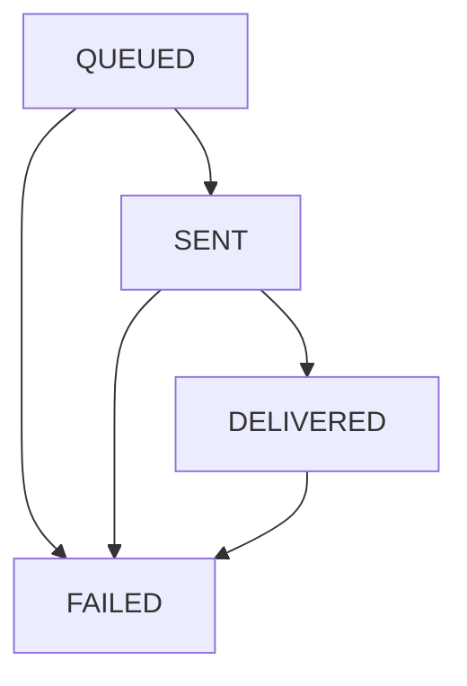

# Bridge Router System

This directory contains the implementation of a modular cross-chain bridge system that enables secure asset transfers and message passing between blockchains. The **BridgeRouter** is the single entry point for users; each pending operation is represented by a **CrossChainArk** token until it is finalised on the destination chain.

## Core Components

- **BridgeRouter**: Central execution contract that coordinates cross-chain operations
- **CrossChainArk**: Tracks assets held in a protocol on a neighbouring chain. Tracks a pending cross-chain operation (the system’s only “queue”)
- **Bridge Adapters**: Protocol-specific implementations (LayerZero, Stargate, etc.)
- **CrossChainReceiver**: Interface for contracts that need to receive cross-chain data

## Architecture Overview

### Operation Flow

```mermaid
graph LR
    A[User / App] --> B[BridgeRouter]
    B --> C[Sending Adapter]
    C -->|Cross-Chain| D[Receiving Adapter]
    D --> E[BridgeRouter (dest)]
    E --> F[Recipient]
```

### Role Separation

1. **BridgeRouter**  
   - Accepts user operations and mints a CrossChainArk to the caller  
   - Forwards the call and full fee to the selected adapter  
   - On the destination chain, receives the callback from the adapter and forwards the payload to the recipient  
   - Tracks operation status across chains

2. **Bridge Adapters**  
   - Implement chain-specific messaging / bridging  
   - Call back to the BridgeRouter for status updates and final delivery

## Cross-Chain Operations

### Available Operations

1. **Asset Transfers**: Move tokens between chains
   ```solidity
   function executeTransferAssets(
       BridgeTypes.ExecuteTransferParams calldata params
   ) external payable returns (bytes32 operationId)
   ```

2. **Message Sending**: Send arbitrary data cross-chain
   ```solidity
   function executeSendMessage(
       BridgeTypes.ExecuteSendMessageParams calldata params
   ) external payable returns (bytes32 operationId)
   ```

3. **State Reading**: Query data from other chains
   ```solidity
   function executeReadState(
       BridgeTypes.ExecuteReadStateParams calldata params
   ) external payable returns (bytes32 operationId)
   ```

### Adapter Selection

The current implementation requires explicit adapter specification through `BridgeOptions.specifiedAdapter`. The router validates that:
- The specified adapter is registered
- The adapter supports the requested operation type
- The adapter supports the destination chain

> **Future Enhancement**: Automatic adapter selection logic may be re-added to the router for fallback scenarios and optimization.

## Operation Status Management

### Status Lifecycle

Operations progress through these states:
1. `QUEUED`: Operation initiated and queued for execution
2. `SENT`: Operation successfully sent by the adapter
3. `DELIVERED`: Operation received on destination chain  
4. `COMPLETED`: Final status (currently not implemented)
5. `FAILED`: Operation failed at any point



### Status Updates

1. **Adapter Updates**:
   - `updateOperationStatus()`: Called by adapter on source chain (QUEUED → SENT, SENT → FAILED)
   - `updateReceiveStatus()`: Called by adapter on destination chain
   - `notifyMessageReceived()`: Called when message/transfer is received

2. **Manual Recovery**:
   - `recoverOperationStatus()`: Called by governance to manually update status when automation fails

## Fee Handling

### Current Fee Structure

The router applies a simple fee buffer system:

```solidity
function _applyFeeBuffer(uint256 baseFee) internal pure returns (uint256) {
    // Add 1% buffer to account for fee volatility
    return (baseFee * 101) / 100;
}
```

### Fee Process

1. **Estimation**: `quote()` function returns base fee + 1% buffer
2. **Validation**: Router validates that `msg.value >= bufferedFee`
3. **Execution**: Full buffered fee is passed to the adapter
4. **Refunds**: Adapters handle excess fee refunds back through the chain

> **Note**: The previous fee multiplier system (200% fees) and confirmation funding have been removed in favor of this simpler approach.

## Adapter Integration

### Required Adapter Interface

Adapters must implement:
- `IBridgeAdapter.estimateFee()`: Fee estimation
- `IBridgeAdapter.supportsOperation()`: Operation type support
- `ISendAdapter.transferAsset()`: Asset transfer execution
- `ISendAdapter.sendMessage()`: Message sending execution  
- `ISendAdapter.readState()`: State reading execution

### Adapter Callbacks

Adapters always return to the router first; the router then delivers the message (or assets) to the final recipient contract.

## Security Considerations

- **Access Control**: All bridge operations must be initiated via BridgeRouter
- **Adapter Registry**: Only governance can add/remove adapters
- **Pause Mechanism**: Guardian and governance can pause; only governance can unpause
- **Status Progression**: Status updates are validated and controlled
- **Adapter Authentication**: Only registered adapters can call callback functions
- **Manual Recovery**: Governance can manually update operation status if automation fails
- **Reentrancy Protection**: Critical functions use ReentrancyGuard

## Integration Guide

### For Users / Applications

Interact directly with the `BridgeRouter` contract:

```solidity
// Example: transfer assets cross-chain
bridgeRouter.executeTransferAssets{value: estimatedFee}(
    destinationChainId,
    asset,
    amount,
    recipient,
    options
);
```

### For Cross-Chain Message Recipients

Implement the `ICrossChainReceiver` interface to receive messages and transfers.

### For State Read Recipients

Implement the `ICrossChainStateReadReceiver` interface:

```solidity
function receiveStateRead(
    bytes calldata resultData,
    address originator,
    bytes32 operationId,
    uint16 sourceChainId
) external;
```

## Router API

### View Functions

- `quote()`: Estimate fees for operations
- `getOperationStatus()`: Check operation status
- `getAdapters()`: List registered adapters
- `isValidAdapter()`: Validate adapter registration

### Governance Functions

- `registerAdapter()` / `removeAdapter()`: Manage adapter registry
- `pause()` / `unpause()`: Emergency controls
- `recoverOperationStatus()`: Manual status recovery
- `recoverFunds()`: Withdraw accumulated native tokens
- `setChainRouterAddress()`: Configure cross-chain router addresses

> **Note**: The BridgeRouter is designed to be extended with additional functionality like automatic adapter selection, fee optimization, and advanced routing logic as the protocol evolves.