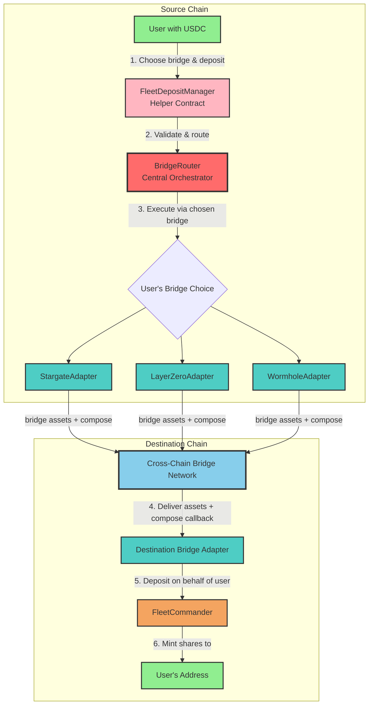
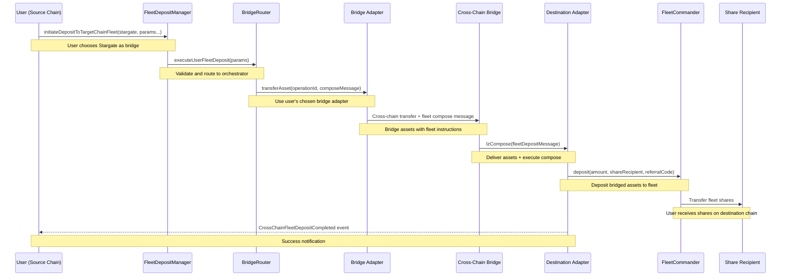

# Cross-Chain Fleet Deposits - Implementation Guide

## Overview

Summer Protocol enables **vendor-agnostic** user-initiated cross-chain fleet deposits, allowing users to deposit assets from one chain directly to FleetCommanders on another chain using their preferred bridge technology.

## Architecture

### 🏗️ Core Components

1. **FleetDepositManager**: Helper contract providing user-friendly interface
2. **BridgeRouter**: Central orchestrator managing all cross-chain operations  
3. **Bridge Adapters**: Protocol-specific implementations (Stargate, LayerZero, etc.)

### 🔄 Vendor Agnostic Design

Users choose their preferred bridge technology:
- **Stargate V2**: Fast, secure, widely supported
- **LayerZero**: Direct messaging protocol
- **Future Bridges**: Easy to add new technologies



### 🎯 Benefits of Vendor Agnostic Design

1. **User Choice**: Select preferred bridge based on fees, speed, or trust
2. **Risk Diversification**: Not dependent on single bridge technology
3. **Future-Proof**: Easy to add new bridge support
4. **Competitive Ecosystem**: Bridges compete on pricing and features
5. **No Vendor Lock-in**: Protocol flexibility across bridge technologies

### 🔌 How to Add New Bridge Adapters

To support a new bridge technology:

1. **Implement Interface**: Create adapter implementing `IBridgeAdapter` and `ISendAdapter`
2. **Register with BridgeRouter**: Use governance to register adapter
3. **Available Immediately**: Users can select new bridge option

```solidity
// Example: Adding Hyperlane support
contract HyperlaneAdapter is IBridgeAdapter, ISendAdapter {
    function transferAsset(...) external payable override {
        // Hyperlane-specific implementation
    }
    
    function supportsOperation(BridgeTypes.OperationType operationType) 
        external pure override returns (bool) {
        return operationType == BridgeTypes.OperationType.TRANSFER_ASSET;
    }
    
    // ... standard IBridgeAdapter methods
}

// Governance registers the new adapter
bridgeRouter.registerAdapter(hyperlaneAdapter);
```

## Implementation Details

### Component Responsibilities

#### FleetDepositManager (Helper Contract)
- **Entry Point**: User-friendly interface for fleet deposits
- **Validation**: Basic parameter validation
- **Message Encoding**: Creates fleet deposit compose messages  
- **Routing**: All operations routed to BridgeRouter

#### BridgeRouter (Central Orchestrator)
- **Operation Management**: Tracks operations with unique IDs
- **Fee Management**: Applies buffers, handles payments
- **Adapter Validation**: Ensures only registered adapters used
- **Direct Access**: Supports `executeUserFleetDeposit()` for direct calls

#### Bridge Adapters
- **Protocol-Specific**: Implement bridge technology (Stargate, LayerZero, etc.)
- **Standard Interface**: All implement `IBridgeAdapter` and `ISendAdapter`
- **Compose Handling**: Process fleet deposit compose messages on destination

### Core Functions

#### FleetDepositManager
```solidity
function initiateDepositToTargetChainFleet(
    address bridgeAdapter,           // User's choice of bridge
    uint16 destinationChainId,
    address asset,
    uint256 amount,
    address fleetCommander,
    address shareRecipient,
    bytes memory referralCode,
    BridgeTypes.AdapterParams calldata adapterParams
) external payable returns (bytes32 operationId)
```

#### BridgeRouter  
```solidity
function executeUserFleetDeposit(
    BridgeTypes.ExecuteUserFleetDepositParams calldata params
) external payable returns (bytes32 operationId)
```

### Fleet Deposit Flow



## Usage Examples

### Basic Cross-Chain Fleet Deposit

```solidity
// User on Arbitrum deposits USDC to Base USDC Fleet using Stargate
contract Example {
    function depositToBaseFleet() external {
        address fleetDepositManager = 0x...;
        address stargateAdapter = 0x...;
        address usdcToken = 0x...;
        address baseFleetCommander = 0x...;
        uint256 amount = 1000e6; // 1000 USDC
        
        // 1. Approve FleetDepositManager
        IERC20(usdcToken).approve(fleetDepositManager, amount);
        
        // 2. Estimate fees using BridgeRouter  
        bytes memory composeMessage = IFleetDepositManager(fleetDepositManager)
            .encodeFleetDepositMessage(
                baseFleetCommander,
                msg.sender,
                usdcToken, 
                amount,
                bytes("")
            );
            
        (uint256 fee,) = IBridgeRouter(bridgeRouter).quote(
            8453, // Base chain ID
            usdcToken,
            amount,
            BridgeTypes.BridgeOptions({
                specifiedAdapter: stargateAdapter,
                adapterParams: BridgeTypes.AdapterParams({
                    gasLimit: 500000,
                    calldataSize: 0,
                    msgValue: 0,
                    options: composeMessage
                })
            }),
            BridgeTypes.OperationType.TRANSFER_ASSET
        );
        
        // 3. Execute fleet deposit
        IFleetDepositManager(fleetDepositManager).initiateDepositToTargetChainFleet{
            value: fee
        }(
            stargateAdapter,     // User chose Stargate
            8453,               // Base chain ID
            usdcToken,
            amount,
            baseFleetCommander,
            msg.sender,         // Shares to user's address
            bytes(""),          // No referral
            BridgeTypes.AdapterParams({
                gasLimit: 500000,
                calldataSize: 0,
                msgValue: 0,
                options: bytes("")
            })
        );
    }
}
```

### With Referral Code

```solidity
function depositWithReferral() external {
    bytes memory referralCode = bytes("SUMMER2024");
    
    // ... setup code ...
    
    bytes32 operationId = fleetDepositManager.initiateDepositToTargetChainFleet{
        value: estimatedFee
    }(
        stargateAdapter,        // User's bridge choice
        destinationChainId,
        token,
        amount,
        fleetCommander,
        msg.sender,
        referralCode,           // Referral tracking
        adapterParams
    );
}
```

## Message Structure

Fleet deposits use standardized compose messages:

```solidity
struct FleetDepositMessageData {
    address fleetCommander;    // Target FleetCommander contract
    address shareRecipient;    // Address to receive fleet shares
    address asset;             // Asset being deposited
    uint256 amount;            // Deposit amount
    uint256 sourceChainId;     // Source chain ID
    address originalUser;      // Original transaction initiator
    bytes32 operationId;       // Unique operation identifier
    bytes referralCode;        // Optional referral code
}
```

## Error Handling and Recovery

### Validation Errors
- **InvalidParams**: Zero amounts, addresses, etc.
- **UnsupportedBridgeAdapter**: Adapter not registered or doesn't support fleet deposits
- **InsufficientFee**: Provided fee below required amount

### Runtime Errors  
- **FleetCommanderNotActive**: Target fleet not accepting deposits
- **AssetMismatch**: Asset doesn't match fleet's supported asset
- **ExceedsMaxDeposit**: Amount exceeds fleet's deposit cap
- **DepositFailed**: Fleet deposit execution failed

### Recovery Mechanisms
```solidity
// Failed operations are tracked for governance intervention
function recoverFailedOperation(
    bytes32 operationId,
    address newRecipient
) external onlyGovernance {
    // Manual recovery for edge cases
}
```

## Testing

### Unit Tests
- `FleetDepositManager.t.sol`: Core functionality testing
- Covers validation, encoding, and routing

### Integration Tests  
- `FleetDepositManager.fork.t.sol`: Real adapter integration
- End-to-end testing with actual bridge contracts
- Cross-chain deposit completion verification

## Supported Chains & Assets

Works with any chain/asset combination that:
1. Has BridgeRouter and adapters deployed
2. Is registered with chosen bridge adapter
3. Has target FleetCommander deployed and active

## Gas Considerations

- **Source Chain**: Standard bridge transaction + compose overhead
- **Destination Chain**: Fleet deposit gas covered by bridging fee  
- **Estimation**: Includes full compose execution in quotes

## Security Features

### Validation
- FleetCommander compatibility checks
- Deposit limit validation via `maxDeposit()`
- Chain and asset support verification

### Access Control
- Only registered adapters allowed
- ProtocolAccessManager integration
- Governance recovery mechanisms

### Operation Safety
- Unique operation ID tracking
- Fee buffers for volatility protection
- Robust failure handling