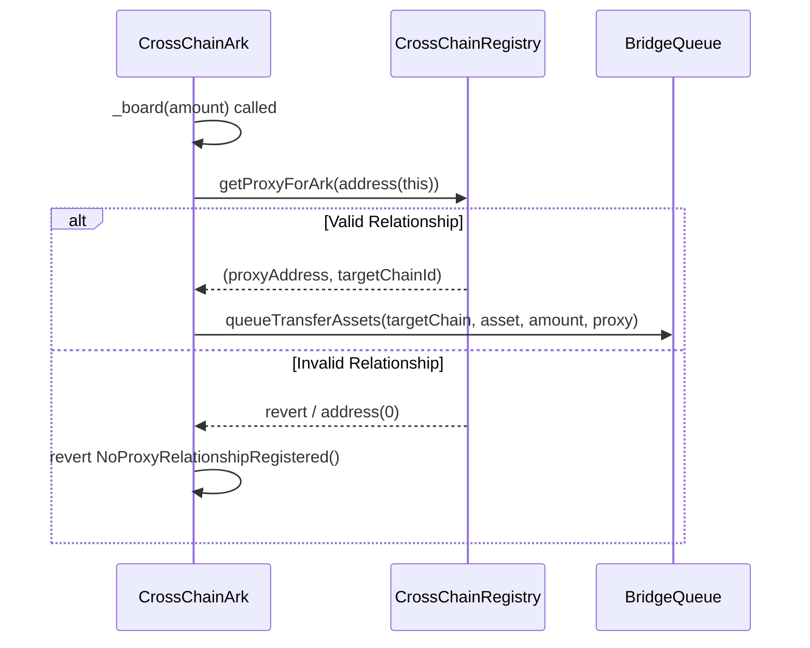
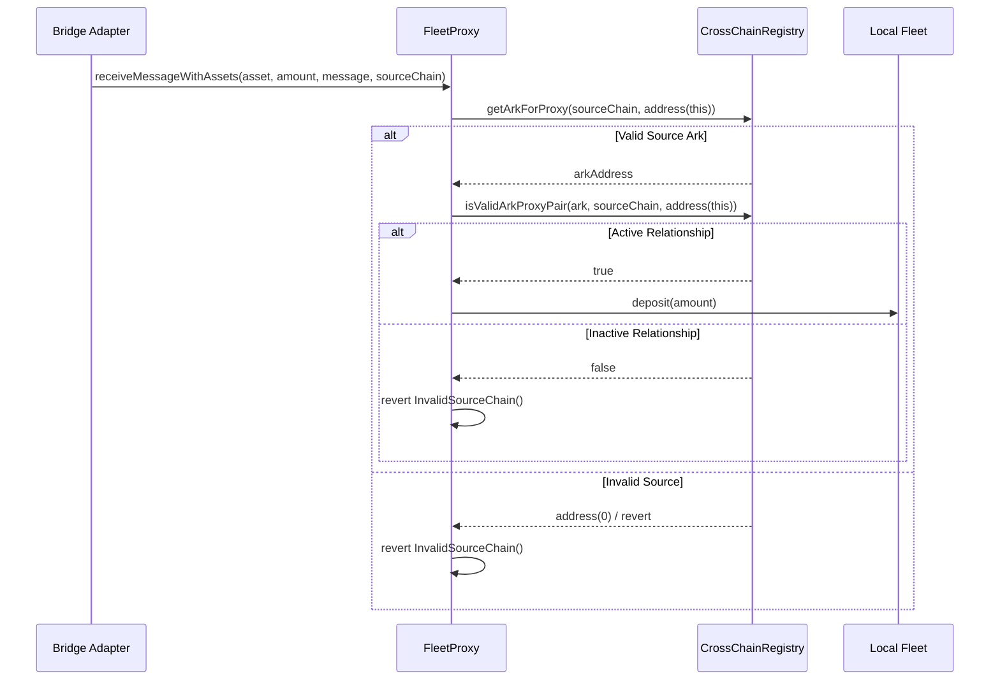
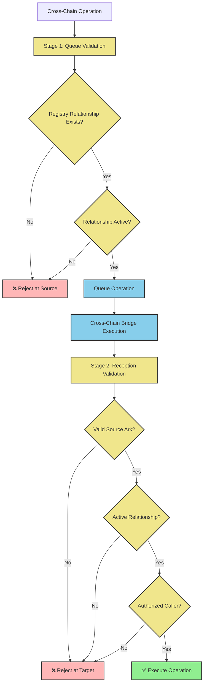

# Cross-Chain Ark Technical Architecture

This document describes the security and validation mechanisms for Summer's Cross-Chain Ark system, focusing on how the CrossChainRegistry, CrossChainArk, and FleetProxy contracts coordinate to ensure secure cross-chain operations.

## Core Security Components

- **CrossChainRegistry**: Central security gatekeeper that validates cross-chain relationships
- **CrossChainArk**: Source chain contract that securely initiates cross-chain transfers
- **FleetProxy**: Target chain contract that validates and processes incoming transfers

## CrossChainRegistry - Security Gatekeeper

**Purpose**: Provides authoritative validation for all cross-chain operations between Ark and FleetProxy contracts.

**Security Functions**:
```solidity
// Core validation functions
function getProxyForArk(address ark) external view returns (address proxy, uint16 targetChainId)
function getArkForProxy(uint16 sourceChainId, address proxy) external view returns (address ark)
function isValidArkProxyPair(address ark, uint16 sourceChainId, address proxy) external view returns (bool)

// Governance functions
function registerArkProxy(address ark, uint16 sourceChainId, uint16 targetChainId, address proxy)
function unregisterArkProxy(address ark)
function updateRelationshipStatus(address ark, bool isActive)
```

**Security Model**:
- Only governance can register/modify relationships
- Registry must be deployed with identical state across all chains
- All cross-chain operations require registry validation
- Supports emergency deactivation of relationships

## Two-Stage Validation Process

Cross-chain operations require validation at two critical points:

### Stage 1: Operation Queuing Validation

When CrossChainArk initiates a cross-chain transfer:



**Security Check**:
```solidity
modifier onlyWithValidProxyRelationship() {
    address proxy = _getTargetProxy();
    if (proxy == address(0)) revert NoProxyRelationshipRegistered();
    _;
}

function _getTargetProxy() internal view returns (address) {
    try crossChainRegistry.getProxyForArk(address(this)) returns (
        address proxy, uint16 chainId
    ) {
        if (proxy != address(0) && chainId == targetChainId) {
            return proxy;
        }
    } catch {}
    return address(0);
}
```

### Stage 2: Asset Reception Validation

When FleetProxy receives cross-chain assets:



**Security Validation**:
```solidity
function _isValidSourceChain(uint16 sourceChainId) internal view returns (bool) {
    try crossChainRegistry.getArkForProxy(sourceChainId, address(this)) returns (address ark) {
        if (ark != address(0)) {
            return crossChainRegistry.isValidArkProxyPair(ark, sourceChainId, address(this));
        }
    } catch {}
    return false;
}
```

## Multi-Layer Security Architecture

The system implements defense-in-depth through multiple validation layers:



## Security Properties

### Registry Guarantees

1. **Authoritative Mappings**: Only governance can establish Ark ↔ Proxy relationships
2. **Bilateral Validation**: Both source and target chains validate relationships
3. **Atomic Operations**: Relationships are either fully valid or completely invalid
4. **Emergency Controls**: Governance can instantly deactivate compromised relationships

### Validation Properties

1. **Source Validation**: CrossChainArk cannot initiate transfers to unregistered proxies
2. **Target Validation**: FleetProxy cannot accept assets from unregistered arks
3. **Chain Validation**: Operations must occur between correct source/target chain pairs
4. **Status Validation**: Inactive relationships are rejected at both stages

### Attack Prevention

The two-stage validation prevents several attack vectors:

- **Malicious Ark Registration**: Cannot register without governance approval
- **Proxy Impersonation**: Target validation prevents unauthorized asset reception
- **Chain Confusion**: Explicit chain ID validation prevents wrong-chain attacks  
- **Relationship Hijacking**: Bilateral validation ensures both sides agree on relationship

## Technical Implementation

### CrossChainArk Security Integration

```solidity
contract CrossChainArk is Ark, ICrossChainAssetReceiver {
    ICrossChainRegistry public immutable crossChainRegistry;
    
    // Stage 1: Validate before queueing operation
    modifier onlyWithValidProxyRelationship() {
        address proxy = _getTargetProxy();
        if (proxy == address(0)) revert NoProxyRelationshipRegistered();
        _;
    }
    
    function _board(uint256 amount, bytes calldata) 
        internal 
        override 
        onlyWithValidProxyRelationship 
    {
        address proxyAddress = _getTargetProxy();
        config.asset.approve(address(bridgeQueue), amount);
        bridgeQueue.queueTransferAssets(targetChainId, address(config.asset), amount, proxyAddress);
    }
}
```

### FleetProxy Security Integration

```solidity
contract FleetProxy is IFleetProxy, ProtocolAccessManaged {
    ICrossChainRegistry public immutable crossChainRegistry;
    
    // Stage 2: Validate incoming transfers
    function receiveMessageWithAssets(
        address asset,
        uint256 amount,
        bytes calldata message,
        uint16 sourceChainId
    ) external whenNotPaused nonReentrant {
        if (!bridgeRouter.isValidAdapter(msg.sender)) {
            revert CallerNotRegisteredAdapter();
        }
        
        if (!_isValidSourceChain(sourceChainId)) {
            revert InvalidSourceChain();
        }
        
        _handleReceiveAssets(asset, amount, sourceChainId);
    }
}
```

## Deployment Security

### Registry Synchronization

Critical security requirement: Registry state must be identical across all chains:

```solidity
// Must execute on ALL participating chains
crossChainRegistry.registerArkProxy(
    arkAddress,      // Same ark address
    sourceChainId,   // Same source chain
    targetChainId,   // Same target chain  
    proxyAddress     // Same proxy address
);
```

### Security Checklist

- [ ] Deploy CrossChainRegistry on all participating chains
- [ ] Verify identical registry state across chains
- [ ] Register all Ark ↔ Proxy relationships
- [ ] Test both validation stages reject unauthorized operations
- [ ] Configure emergency pause mechanisms
- [ ] Set up monitoring for validation failures

## Emergency Response

### Immediate Response Actions

```solidity
// Deactivate compromised relationship
crossChainRegistry.updateRelationshipStatus(compromisedArk, false);

// Pause affected contracts  
fleetProxy.pause();  // Guardian can execute
```

### Recovery Procedures

```solidity
// After investigation, reactivate if safe
crossChainRegistry.updateRelationshipStatus(arkAddress, true);

// Resume operations
fleetProxy.unpause();  // Governance required
```

This two-stage validation architecture ensures that cross-chain operations can only occur between properly authorized and actively validated Ark-Proxy pairs, providing robust security against unauthorized cross-chain transfers.