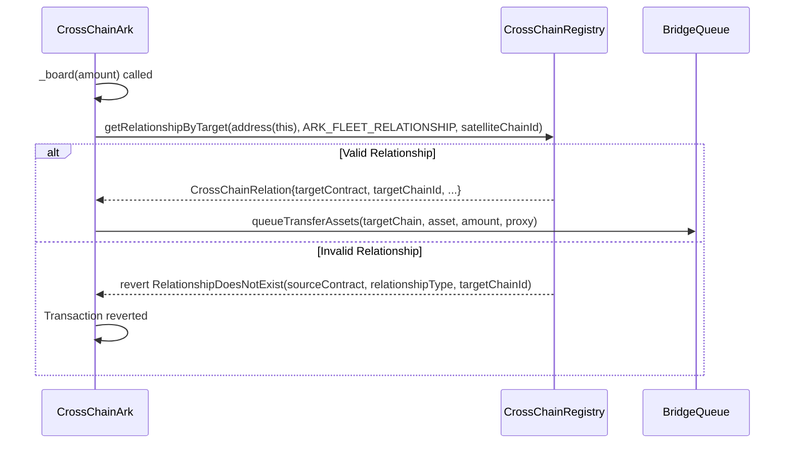
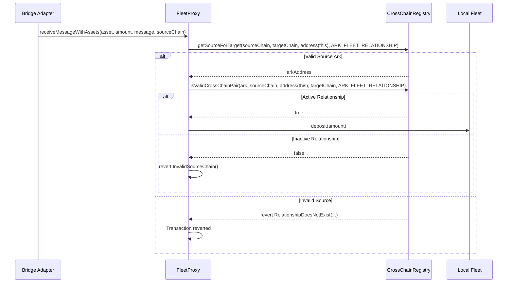
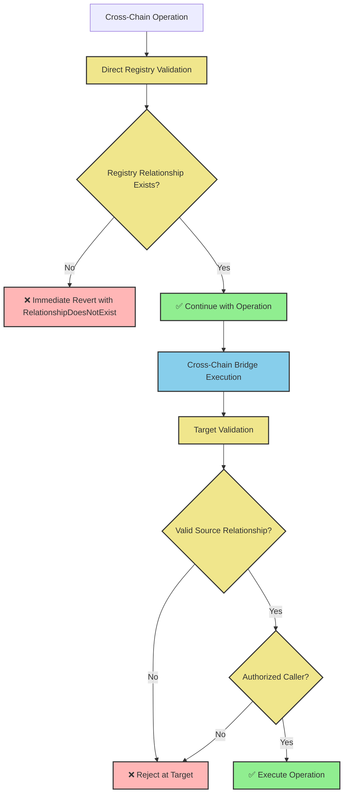

# Cross-Chain Ark Technical Architecture

This document describes the security and validation mechanisms for Summer's Cross-Chain Ark system, focusing on how the CrossChainRegistry, CrossChainArk, and FleetProxy contracts coordinate to ensure secure cross-chain operations.

## Core Security Components

- **CrossChainRegistry**: Central security gatekeeper that validates cross-chain relationships
- **CrossChainArk**: Source chain contract that securely initiates cross-chain transfers
- **FleetProxy**: Target chain contract that validates and processes incoming transfers

## CrossChainRegistry - Security Gatekeeper

**Purpose**: Provides authoritative validation for all cross-chain operations between Ark and FleetProxy contracts.

**Security Functions**:
```solidity
// Core validation functions
function getRelationshipByTarget(address sourceContract, bytes32 relationshipType, uint16 targetChainId) 
    external view returns (CrossChainRelation memory)
function getTargetsForSource(address sourceContract, bytes32 relationshipType) 
    external view returns (address[] memory, uint16[] memory)
function getSourceForTarget(uint16 sourceChainId, uint16 targetChainId, address proxy, bytes32 relationshipType) 
    external view returns (address ark)
function isValidCrossChainPair(address ark, uint16 sourceChainId, address proxy, uint16 targetChainId) 
    external view returns (bool)

// Governance functions
function registerCrossChainRelationship(address ark, address proxy, uint16 sourceChainId, uint16 targetChainId, bytes32 relationshipType)
function unregisterCrossChainRelationship(address ark, bytes32 relationshipType, uint16 targetChainId)
```

**Security Model**:
- Only governance can register/modify relationships
- Registry must be deployed with identical state across all chains
- All cross-chain operations require registry validation
- Registry functions revert with detailed errors when relationships don't exist

## Direct Registry Validation

Cross-chain operations use direct registry validation that reverts immediately when relationships don't exist:

### CrossChainArk Registry Integration

When CrossChainArk needs to perform operations:



**Direct Registry Call**:
```solidity
function _getTargetProxy() internal view returns (address proxyAddress) {
    ICrossChainRegistry.CrossChainRelation memory relation = crossChainRegistry.getRelationshipByTarget(
        address(this),
        ARK_FLEET_RELATIONSHIP,
        satelliteChainId
    );
    return relation.targetContract;
}

function _board(uint256 amount, bytes calldata) internal override {
    address proxyAddress = _getTargetProxy(); // Reverts if no relationship
    
    config.asset.approve(address(bridgeQueue), amount);
    bridgeQueue.queueTransferAssets(satelliteChainId, address(config.asset), amount, proxyAddress);
}
```

### FleetProxy Registry Integration

When FleetProxy receives cross-chain assets:



**Direct Registry Validation**:
```solidity
function _isValidSourceChain(uint16 sourceChainId) internal view returns (bool) {
    try crossChainRegistry.getSourceForTarget(
        sourceChainId, 
        uint16(block.chainid), 
        address(this), 
        ARK_FLEET_RELATIONSHIP
    ) returns (address ark) {
        if (ark != address(0)) {
            return crossChainRegistry.isValidCrossChainPair(
                ark, 
                sourceChainId, 
                address(this), 
                uint16(block.chainid), 
                ARK_FLEET_RELATIONSHIP
            );
        }
    } catch {}
    return false;
}
```

## Simplified Security Architecture

The system implements direct validation through registry calls:



## Security Properties

### Registry Guarantees

1. **Authoritative Mappings**: Only governance can establish Ark ↔ Proxy relationships
2. **Direct Validation**: Operations fail immediately if relationships don't exist
3. **Detailed Errors**: Registry provides specific error information for debugging
4. **Emergency Controls**: Governance can instantly deactivate compromised relationships

### Validation Properties

1. **Source Validation**: CrossChainArk cannot initiate transfers to unregistered proxies
2. **Target Validation**: FleetProxy cannot accept assets from unregistered arks
3. **Chain Validation**: Operations must occur between correct source/target chain pairs
4. **Immediate Failure**: Invalid operations revert at the first validation point

### Attack Prevention

The direct validation approach prevents several attack vectors:

- **Malicious Ark Registration**: Cannot register without governance approval
- **Proxy Impersonation**: Target validation prevents unauthorized asset reception
- **Chain Confusion**: Explicit chain ID validation prevents wrong-chain attacks  
- **Relationship Hijacking**: Direct registry validation ensures only valid relationships proceed

## Technical Implementation

### CrossChainArk Security Integration

```solidity
contract CrossChainArk is Ark, ICrossChainAssetReceiver {
    ICrossChainRegistry public immutable crossChainRegistry;
    
    // Direct registry validation - reverts immediately if relationship doesn't exist
    function _getTargetProxy() internal view returns (address proxyAddress) {
        ICrossChainRegistry.CrossChainRelation memory relation = crossChainRegistry.getRelationshipByTarget(
            address(this),
            ARK_FLEET_RELATIONSHIP,
            satelliteChainId
        );
        return relation.targetContract;
    }
    
    function _board(uint256 amount, bytes calldata) internal override {
        address proxyAddress = _getTargetProxy(); // Direct call - reverts if no relationship
        config.asset.approve(address(bridgeQueue), amount);
        bridgeQueue.queueTransferAssets(satelliteChainId, address(config.asset), amount, proxyAddress);
    }
    
    function requestRemoteAssetBalanceUpdate() external onlyKeeper returns (bytes32 queueId) {
        address proxyAddress = _getTargetProxy(); // Direct call - reverts if no relationship
        queueId = bridgeQueue.queueReadState(satelliteChainId, proxyAddress, IFleetProxy.totalAssets.selector, "");
        emit RemoteAssetBalanceUpdateRequested(queueId, satelliteChainId, proxyAddress);
    }
}
```

### FleetProxy Security Integration

```solidity
contract FleetProxy is IFleetProxy, ProtocolAccessManaged {
    ICrossChainRegistry public immutable crossChainRegistry;
    
    // Direct registry validation for incoming transfers
    function receiveMessageWithAssets(
        address asset,
        uint256 amount,
        bytes calldata message,
        uint16 sourceChainId
    ) external whenNotPaused nonReentrant {
        if (!bridgeRouter.isValidAdapter(msg.sender)) {
            revert CallerNotRegisteredAdapter();
        }
        
        if (!_isValidSourceChain(sourceChainId)) {
            revert InvalidSourceChain();
        }
        
        _handleReceiveAssets(asset, amount, sourceChainId);
    }
}
```

## Error Types

The simplified system uses registry errors directly:

```solidity
// Registry errors (from ICrossChainRegistry)
error RelationshipDoesNotExist(
    address sourceContract,
    bytes32 relationshipType,
    uint16 targetChainId
);

// Example error when CrossChainArk calls _getTargetProxy() with no relationship:
RelationshipDoesNotExist(
    0x123...ark_address, 
    keccak256("ARK_FLEET"), 
    42161 // Arbitrum chain ID
)
```

## Deployment Security

### Registry Synchronization

Critical security requirement: Registry state must be identical across all chains:

```solidity
// Must execute on ALL participating chains
crossChainRegistry.registerCrossChainRelationship(
    arkAddress,      // Same ark address
    proxyAddress,    // Same proxy address
    sourceChainId,   // Same source chain
    targetChainId,   // Same target chain  
    keccak256("ARK_FLEET")  // Same relationship type
);
```

### Security Checklist

- [ ] Deploy CrossChainRegistry on all participating chains
- [ ] Verify identical registry state across chains
- [ ] Register all Ark ↔ Proxy relationships
- [ ] Test that invalid operations revert with registry errors
- [ ] Configure emergency pause mechanisms
- [ ] Set up monitoring for validation failures

## Emergency Response

### Immediate Response Actions

```solidity
// Unregister compromised relationship (reverts future operations immediately)
crossChainRegistry.unregisterCrossChainRelationship(
    compromisedArk, 
    keccak256("ARK_FLEET"), 
    targetChainId
);

// Pause affected contracts  
fleetProxy.pause();  // Guardian can execute
```

### Recovery Procedures

```solidity
// After investigation, re-register if safe
crossChainRegistry.registerCrossChainRelationship(
    arkAddress,
    proxyAddress, 
    sourceChainId,
    targetChainId,
    keccak256("ARK_FLEET")
);

// Resume operations
fleetProxy.unpause();  // Governance required
```

This direct registry validation architecture ensures that cross-chain operations can only occur between properly registered Ark-Proxy pairs, with immediate failure and detailed error information when invalid operations are attempted.