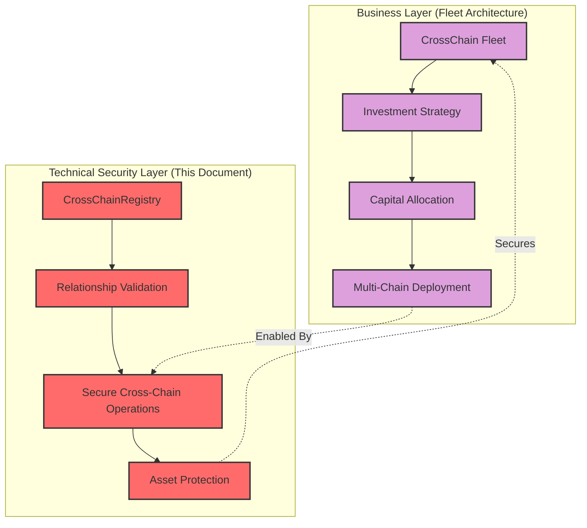
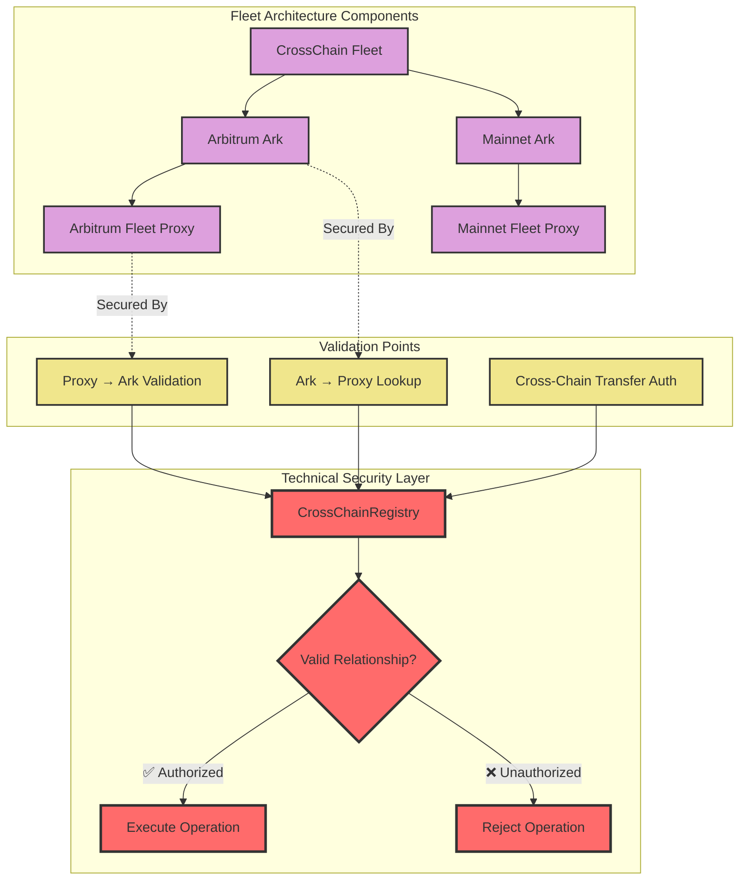
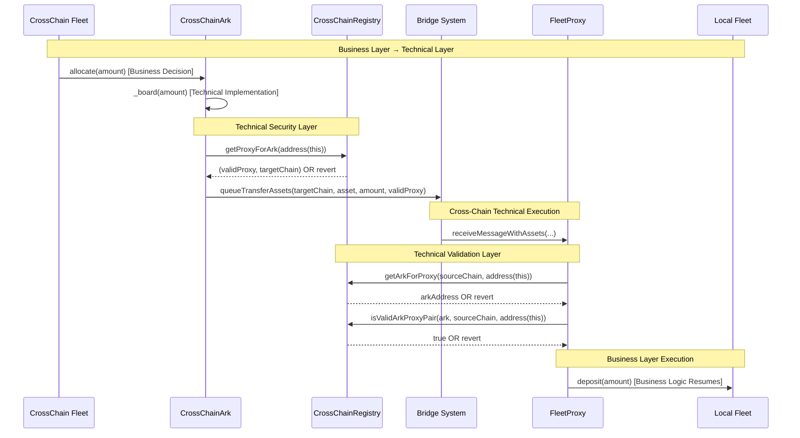
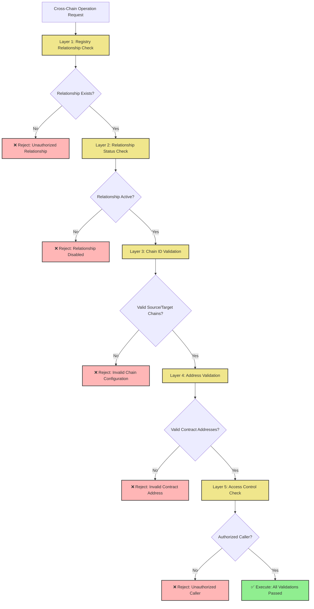

# Cross-Chain Ark Technical Architecture

This document describes the technical implementation layer of Summer's Cross-Chain system, focusing on the security, validation, and coordination mechanisms that enable the cross-chain fleet operations described in [`CROSS_CHAIN_FLEET_ARCHITECTURE.md`](../chain-bridge/CROSS_CHAIN_FLEET_ARCHITECTURE.md).

## Overview

While the [Cross-Chain Fleet Architecture](../chain-bridge/CROSS_CHAIN_FLEET_ARCHITECTURE.md) describes the business logic and capital allocation flows, this document focuses on the **technical security layer** that makes those flows possible through three core contracts:

- **CrossChainRegistry**: Central registry that validates and manages cross-chain relationships
- **CrossChainArk**: Technical implementation of the "Arks" that handle cross-chain asset bridging
- **FleetProxy**: Technical implementation of the "Fleet Proxies" that receive and validate bridged assets

## Relationship to Fleet Architecture

This technical layer implements the secure foundation for the investment flows described in the Fleet Architecture:



## Technical Components

### CrossChainRegistry - The Security Gatekeeper

**Purpose**: Provides the security and validation layer that ensures all cross-chain operations occur between properly authorized contracts.

**Why It's Critical**: Without the registry's validation, malicious contracts could impersonate legitimate Arks or FleetProxies, potentially draining funds or disrupting operations.

**Technical Responsibilities**:
- Maintain authoritative mappings between CrossChainArk and FleetProxy addresses
- Validate every cross-chain operation before execution
- Provide tamper-proof lookup services across all chains
- Enable governance to control cross-chain relationship lifecycle

```solidity
// Core validation functions used by other contracts
function getProxyForArk(address ark) external view returns (address proxy, uint16 targetChainId)
function getArkForProxy(uint16 sourceChainId, address proxy) external view returns (address ark)
function isValidArkProxyPair(address ark, uint16 sourceChainId, address proxy) external view returns (bool)
```

### CrossChainArk - Technical Bridge Implementation

**Purpose**: Technical implementation of the "Arks" described in the Fleet Architecture, handling the secure bridging mechanics.

**Relationship to Fleet Architecture**: These are the actual smart contracts that implement the "Arbitrum Ark", "Mainnet Ark", etc. shown in the Fleet Architecture diagrams.

**Technical Responsibilities**:
- Securely validate target destinations using the registry
- Coordinate with bridge infrastructure for asset transfers
- Track remote asset balances through cross-chain state reads
- Handle bidirectional asset flows (deposits and returns)

**Registry Integration**:
```solidity
// Every cross-chain operation requires registry validation
modifier onlyWithValidProxyRelationship() {
    address proxy = _getTargetProxy();
    if (proxy == address(0)) revert NoProxyRelationshipRegistered();
    _;
}
```

### FleetProxy - Secure Asset Reception

**Purpose**: Technical implementation of the "Fleet Proxies" that securely receive and validate cross-chain assets.

**Relationship to Fleet Architecture**: These implement the "Arbitrum Fleet Proxy", "Mainnet Fleet Proxy", etc. that forward assets to Local Fleets.

**Technical Responsibilities**:
- Authenticate incoming cross-chain transfers using the registry
- Reject unauthorized transfer attempts
- Forward validated assets to Local Fleet contracts
- Coordinate withdrawal flows back to source chains

**Security Validation**:
```solidity
// All incoming transfers must pass registry validation
function _isValidSourceChain(uint16 sourceChainId) internal view returns (bool) {
    address ark = crossChainRegistry.getArkForProxy(sourceChainId, address(this));
    return crossChainRegistry.isValidArkProxyPair(ark, sourceChainId, address(this));
}
```

## Technical Architecture Flow

### Registry-Gated Security Model

The registry serves as the central security checkpoint for all cross-chain operations:



### Operation Validation Sequence

Every cross-chain operation follows this technical validation pattern:



## Security Implementation Details

### Multi-Layer Validation

The technical architecture implements defense-in-depth through multiple validation layers:



### Technical vs Business Separation

This architecture maintains clear separation between business logic and technical security:

| Layer | Component | Responsibility |
|-------|-----------|----------------|
| **Business** | CrossChain Fleet | Investment strategy and capital allocation |
| **Business** | Local Fleets | Chain-specific investment execution |
| **Technical** | CrossChainRegistry | Security validation and relationship management |
| **Technical** | CrossChainArk | Secure cross-chain asset bridging |
| **Technical** | FleetProxy | Secure cross-chain asset reception |
| **Technical** | Bridge System | Cross-chain communication infrastructure |

## Integration with Fleet Architecture

### Enabling Business Flows

The technical components enable the business flows described in the Fleet Architecture:

1. **User Deposits** → CrossChain Fleet uses technically secure CrossChainArks
2. **Capital Allocation** → Registry ensures only authorized deployments
3. **Cross-Chain Transfers** → Technical validation prevents unauthorized operations
4. **Asset Reception** → FleetProxies validate sources before forwarding to Local Fleets
5. **Yield Generation** → Secure foundation enables confident capital deployment

### Technical Requirements for Fleet Operations

For the Fleet Architecture to operate securely, this technical layer must provide:

- **Relationship Authentication**: Registry must validate all Ark ↔ Proxy relationships
- **Transfer Security**: All cross-chain transfers must be cryptographically validated
- **Emergency Controls**: Technical layer must support pause/unpause for business continuity
- **Audit Trail**: All operations must be logged for compliance and monitoring

## Deployment and Configuration

### Registry Synchronization

The CrossChainRegistry must be deployed with identical configuration across all participating chains:

```solidity
// Example: Registering the relationship shown in Fleet Architecture
// "Arbitrum Ark" → "Arbitrum Fleet Proxy" relationship

crossChainRegistry.registerArkProxy(
    arbitrumArkAddress,     // The "Arbitrum Ark" from Fleet Architecture
    baseChainId,           // Source chain (Base)
    arbitrumChainId,       // Target chain (Arbitrum)
    arbitrumFleetProxyAddress  // The "Arbitrum Fleet Proxy" from Fleet Architecture
);
```

### Integration Checklist

To implement the Fleet Architecture securely:

- [ ] Deploy CrossChainRegistry on all participating chains
- [ ] Register all Ark ↔ FleetProxy relationships in the registry
- [ ] Deploy CrossChainArk contracts with registry addresses
- [ ] Deploy FleetProxy contracts with registry addresses  
- [ ] Test end-to-end flows with registered relationships
- [ ] Verify security validations reject unauthorized operations
- [ ] Configure emergency controls and governance access

## Monitoring and Operations

### Technical Health Checks

Monitor the technical layer to ensure Fleet Architecture operates smoothly:

- **Registry Synchronization**: Verify identical registry state across all chains
- **Relationship Status**: Monitor active/inactive status of cross-chain relationships
- **Operation Success Rates**: Track success/failure rates of cross-chain operations
- **In-Flight Asset Tracking**: Monitor asset amounts currently being bridged

### Emergency Response

Technical layer provides emergency controls for business continuity:

- **Relationship Deactivation**: Temporarily disable specific cross-chain relationships
- **Asset Recovery**: Force-update in-flight asset tracking