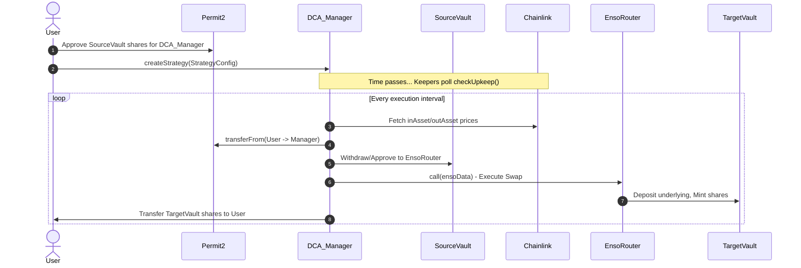
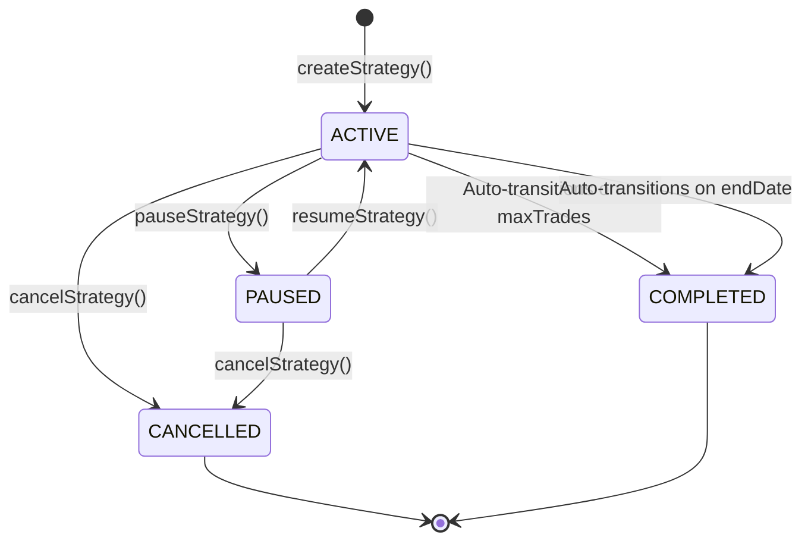

# DCA Strategy Manager: Integration & Architecture Guide

The `DCAStrategyManager` enables automated Dollar-Cost Averaging (DCA) operations for users between two Fleet Commanders (Vaults) using the Enso router. This guide is tailored for SDK and Frontend developers integrating the DCA feature.

---

## 1. System Architecture

The DCA strategy manager executes swaps asynchronously via keeper networks. Users configure a strategy, approve funds, and the keepers trigger the exact execution times based on the interval.



---

## 2. Core Concepts & `StrategyConfig`

The entire strategy is driven by the `StrategyConfig` struct. Authorization in this contract is **stateless**: the hash of the `StrategyConfig` serves as the strategy's unique identifier and authorization proof.

```solidity
struct StrategyConfig {
    address owner;               // Must match msg.sender for edits/pauses
    IFleetCommander sourceVault; // Where funds are pulled from (Source)
    IFleetCommander targetVault; // Where swapped funds are deposited (Destination)
    IERC20 inAsset;              // Underlying asset of sourceVault
    IERC20 outAsset;             // Underlying asset of targetVault
    address inAssetFeed;         // Chainlink oracle for inAsset
    address outAssetFeed;        // Chainlink oracle for outAsset
    uint256 tradeAmount;         // Amount of sourceVault shares to swap per interval
    uint256 interval;            // Time between swaps (Min: 7 days)
    uint256 slippageBps;         // Max slippage (e.g., 50 = 0.5%)
    uint256 maxPrice;            // Execution ceiling price
    uint256 minPrice;            // Execution floor price
    uint256 endDate;             // Timestamp when the strategy terminates
    uint248 maxTrades;           // Max number of successful executions
}
```

### Important Integration Notes:
- **Stateless Authorization**: To edit, pause, or cancel a strategy, the Frontend/SDK **must pass the exact original `StrategyConfig`**. The contract hashes this config to ensure it matches the stored commitment.
- **Editing strategies**: When `editStrategy` is called, the original commitment is discarded and a new one is created. Note that ownership transfer is explicitly disallowed during an edit.

---

## 3. Price Guardrails and Sentinels (`maxPrice` / `minPrice`)

To protect users against extreme market volatility, they can define price ceilings and floors. 

### Sentinel Values (`0`)
If a user does not want a price guardrail, the frontend should pass `0` for `maxPrice` and/or `minPrice`.
- `maxPrice == 0`: No ceiling. The swap executes regardless of how high the input asset price goes.
- `minPrice == 0`: No floor. The swap executes regardless of how low the input asset price goes.

> [!TIP]
> **Gas Optimization:** If **both** `maxPrice` and `minPrice` are `0`, the keeper's `checkUpkeep` function skips the Chainlink oracle staticcall entirely. This saves gas and ensures the strategy remains active even if an oracle experiences temporary downtime.

---

## 4. Frontend Integration Workflow

### Step 1: Approvals
Before a strategy can be successfully executed by the keeper, the user must approve the pull of their source shares.
1. The user must grant `Permit2` token approval on the `SourceVault` shares.
2. The user must grant the `DCAStrategyManager` a `Permit2` allowance for the `SourceVault` shares.

### Step 2: Creating a Strategy
Submit the `StrategyConfig` payload to `createStrategy`.

> [!WARNING] 
> Strategies must be unique by configuration hash. If a user wants to create an identical strategy to one they already cancelled, the frontend should slightly mutate `endDate` (e.g., +1 second) to generate a unique hash.

### Step 3: Managing the Strategy
When building the UI for managing active strategies, use the following lifecycle.



### Auto-Completion
Strategies automatically enter the `COMPLETED` state during execution if:
1. `tradesExecuted >= maxTrades`
2. `nextTriggerAt >= endDate`

---

## 5. Slippage Protection (MinOut)

The contract enforces slippage strictly on-chain to protect against MEV and bad Enso routing:
1. It reads the exact Chainlink prices of both assets.
2. It standardizes decimals across tokens and feeds.
3. It simulates how many target shares should be minted using the target vault's `previewDeposit`.
4. It applies the user's `slippageBps` to calculate an absolute `minOut`.

If the Enso swap returns fewer shares than this mathematically guaranteed `minOut`, the execution reverts with `SwapOutputBelowMinOut`, and the keeper will try again next block/interval.
