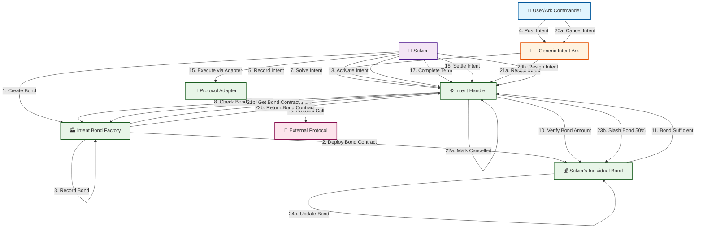
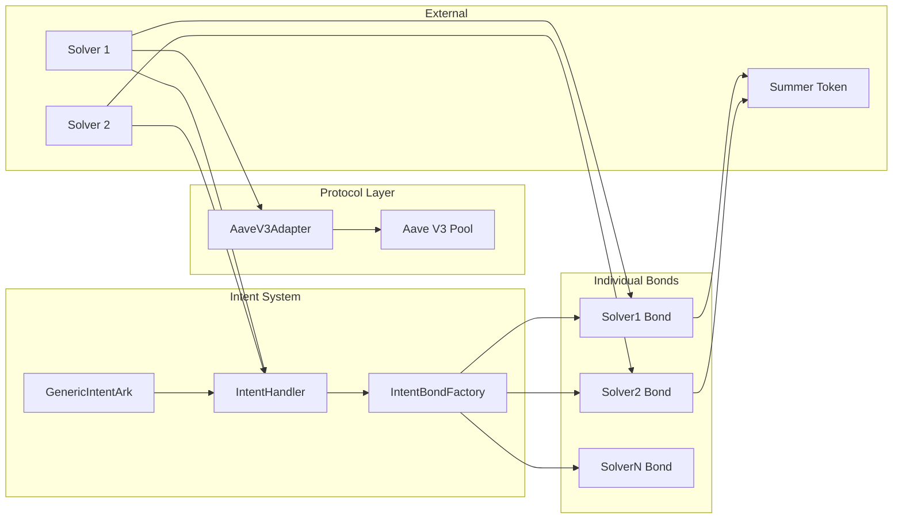
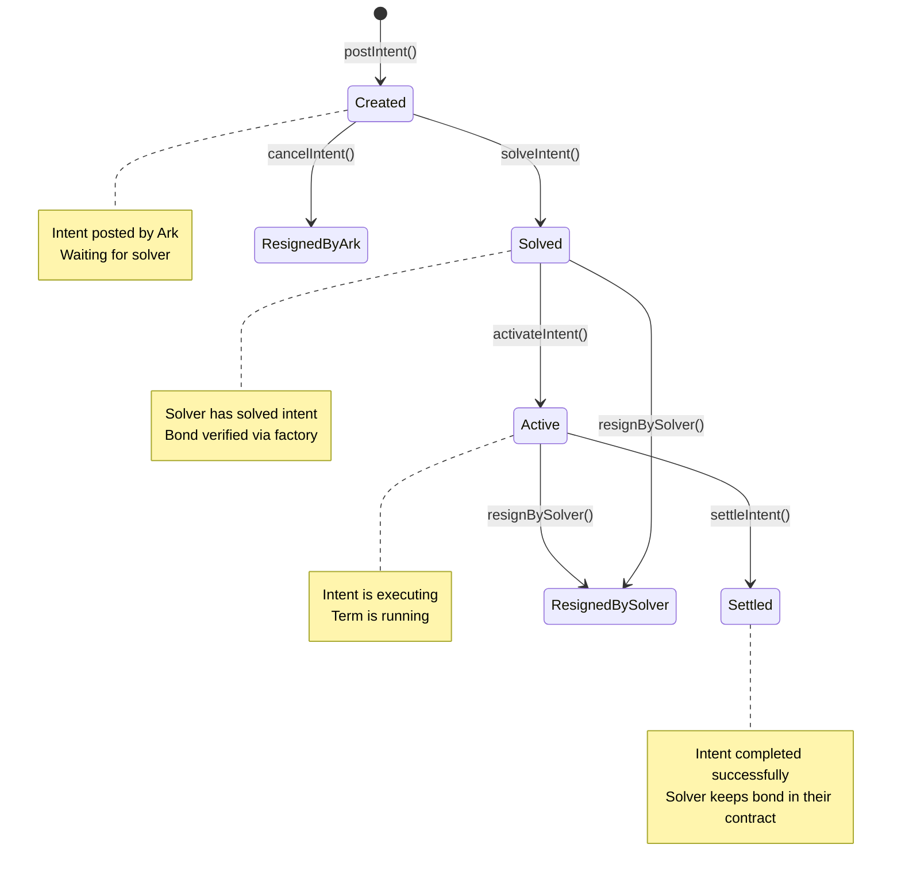

# Intent-Based Bond System

## Overview

The Intent-Based Bond System is a CoW Swap-style bonding mechanism where **each solver creates their own individual bond contract** via a factory. The system uses a generic Ark that posts intents offchain, and solvers solve them directly without needing Ark approval.

## Architecture

### System Components

- **GenericIntentArk**: Generic Ark that posts intents and can cancel them before solving
- **IntentBondFactory**: Factory that creates individual bond contracts for each solver
- **SolverBond**: Individual bond contract per solver (Summer tokens only)
- **IntentHandler**: Manages intent lifecycle and bond verification
- **Protocol Adapters**: Handle specific protocol interactions (Aave V3, etc.)

## Flow Diagram

## Detailed Flow Steps

### 1. Solver Bond Creation
- **Solver** calls `IntentBondFactory.createBond(solver)`
- **Factory** deploys new `SolverBond` contract for that solver
- **Factory** records the mapping of solver → bond contract
- **Solver** now has their own isolated bond contract

### 2. Intent Creation
- **User/Commander** posts intent with requirements (notional, term, yield, etc.)
- **GenericIntentArk** records the intent on-chain
- **IntentHandler** creates intent in `Created` state

### 3. Intent Solving
- **Solver** sees intent and calls `solveIntent()` directly
- **IntentHandler** checks if solver has bond contract via factory
- **IntentHandler** verifies solver has sufficient bond in their individual contract
- Intent transitions to `Solved` state

### 4. Intent Execution
- **Solver** activates intent (starts the term)
- **Solver** executes protocol actions via adapter
- **Protocol Adapter** handles specific protocol interactions

### 5. Intent Settlement
- **Solver** completes the term and settles intent
- Intent transitions to `Settled` state
- **Solver** keeps their bond in their individual contract

### 6. Alternative Paths
- **Ark can cancel** intent before solving (only in `Created` state)
- **Solver can resign** intent (50% bond penalty from their individual contract)

## Key Features

- ✅ **Individual bond contracts** per solver (complete isolation)
- ✅ **Factory pattern** for easy bond creation
- ✅ **Generic Ark** handles any protocol via adapters
- ✅ **Offchain intent posting** - Ark just records
- ✅ **Direct solver execution** - no Ark approval bottlenecks
- ✅ **Summer token bonds only** - simple and clean
- ✅ **50% penalty** for solver resignations

## Contract Interactions

## State Transitions

## Benefits

1. **Complete Isolation**: Each solver has their own bond contract
2. **Factory Pattern**: Easy to create new bonds for new solvers
3. **Minimal Code**: Clean separation of concerns
4. **Overly Simple**: Easy to understand and maintain
5. **CoW Swap Style**: Individual bonding pools per solver
6. **Generic Design**: One Ark handles any protocol
7. **Efficient Flow**: No approval bottlenecks
8. **Flexible**: Easy to add new protocols via adapters

## How It Works

1. **Solver creates bond**: `factory.createBond(solver)` → deploys `SolverBond` contract
2. **Ark posts intent** with requirements (notional, term, yield, etc.)
3. **Solver solves intent** directly by calling `solveIntent()`
4. **System verifies** solver has sufficient bond in their individual contract
5. **Solver executes** via protocol adapter (Aave, etc.)
6. **Solver settles** when term completes
7. **Bond stays** in solver's individual contract (no shared pools)

This is **exactly like CoW Swap's bonding pools** - each solver has their own pool, they're completely isolated, and they can solve intents directly without waiting for Ark approval.

The system is now **minimal as possible** and **overly simple** as requested! 🎉
