# Institutional Fleet & Rounds Vault — Technical Reference [WIP]

> Single authoritative reference for the institutional FleetCommander, its two
> entry/exit paths (**AdmiralsQuartersWhitelist** and **RoundsVault**), the T+1
> asynchronous Arks, access control, and the on-chain discovery registry.

---

## Document Registry

| # | Chapter | Source contracts / interfaces |
| --- | --- | --- |
| 1 | [Overview & Mental Model](#1-overview--mental-model) | — |
| 2 | [The Two Entry Paths](#2-the-two-entry-paths) | `AdmiralsQuartersWhitelist.sol`, `RoundsVaultInput.sol`, `RoundsVaultOutput.sol` |
| 3 | [Access Control & Roles](#3-access-control--roles) | `ProtocolAccessManagerV2.sol`, `ProtocolAccessManagedV2.sol`, `Whitelist.sol` |
| 4 | [FleetCommanderWhitelist](#4-fleetcommanderwhitelist) | `FleetCommanderWhitelist.sol`, `FleetCommanderConfigProviderWhitelist.sol`, `FleetCommanderCacheLib.sol`, `FlexibleTipper.sol` |
| 5 | [AdmiralsQuartersWhitelist (Path 1)](#5-admiralsquarterswhitelist-path-1--synchronous) | `AdmiralsQuartersWhitelist.sol`, `ProtectedMulticallWhitelist.sol` |
| 6 | [RoundsVault (Path 2)](#6-roundsvault-path-2--asynchronous) | `RoundsVaultBase.sol`, `RoundsVaultInput.sol`, `RoundsVaultOutput.sol`, `ERC4626MultiTokenWrapper.sol`, `ERC1155FullSupply.sol` |
| 7 | [RoundsVaultRegistry](#7-roundsvaultregistry) | `RoundsVaultRegistry.sol`, `IRoundsVaultRegistry.sol` |
| 8 | [WisdomTreeArk + RWA Ark family](#8-wisdomtreeark-t1-connector) | `arks/WisdomTreeArk.sol`, `arks/SecuritizeArk.sol`, `arks/BenjiArk.sol`, `ArkWithWithdrawalRequest.sol` |
| 9 | [End-to-End Flows by Role](#9-end-to-end-flows-by-role) (incl. Securitize §9.8, Benji §9.9) | — |
| 10 | [Entry Point Catalog](#10-entry-point-catalog) | All of the above |
| 11 | [Systemic Risks & Operational Limits](#11-systemic-risks--operational-limits) | — |
| 12 | [Configuration & Deployment Checklist](#12-configuration--deployment-checklist) | — |

---

## 1. Overview & Mental Model

### 1.1 What problem is solved

A FleetCommander is an ERC-4626 vault that aggregates user deposits and allocates
them across a curated set of yield-generating Arks. Two factors complicate the
naive `deposit()` / `withdraw()` story:

1. **Institutional gating.** Compliance requires per-fleet KYC. The Fleet must
   refuse anonymous interaction without breaking ERC-4626 conformance.
2. **Off-chain settlement.** Several Arks (WisdomTree money-market funds,
   credit funds, future Benji-style RWA Arks) settle T+0/T+1 against an
   off-chain NAV strike. On-chain deposits cannot move synchronously into these
   Arks without exposing the Fleet to NAV-strike sandwich attacks.

The system resolves these with two complementary contracts that share a single
whitelist authority (`ProtocolAccessManagerV2`):

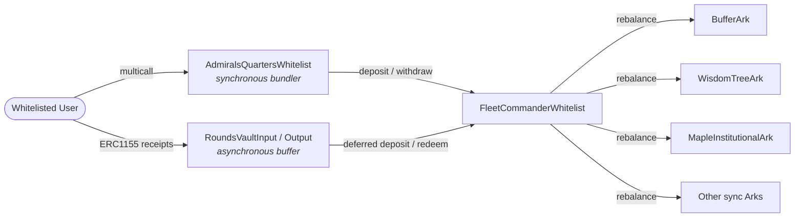

### 1.2 Glossary

| Term | Meaning |
| --- | --- |
| **Fleet** | A `FleetCommanderWhitelist` instance — the ERC-4626 vault. |
| **Ark** | A connector contract holding capital deployed to one external venue. |
| **Buffer Ark** | The Ark used for instant deposits and fast-path withdrawals. |
| **Gateway** | The boolean `config.isOperatorGatewayOpen` that switches the Fleet between operator-only and whitelisted-user mode. |
| **Operator** | An address holding `OPERATOR_ROLE` for a specific Fleet. Bypasses the gateway. |
| **Context** | An address used as a key in the central whitelist. Each Fleet is its own context; AQ uses the same Fleet address. |
| **Round** | A discrete batch processed by a `RoundsVault`, identified by `uint256` round id and tokenized as an ERC-1155 id. |
| **Exchange asset** | The asset returned when a settled-round receipt is exchanged: Fleet shares for Input vaults, underlying USDC for Output vaults. |

---

## 2. The Two Entry Paths

A user holding USDC who wants Fleet exposure picks between two paths. The choice
is driven by what underlying Arks the Fleet uses, not by user preference.

| Property | Path 1 — AdmiralsQuartersWhitelist | Path 2 — RoundsVault |
| --- | --- | --- |
| Settlement timing | Synchronous (single tx) | Asynchronous (T+0 / T+1 rounds) |
| Receipt at entry | Fleet ERC-20 shares | ERC-1155 receipt for current round id |
| Exit timing | Synchronous | Asynchronous (after Keeper settles the round) |
| Slippage / NAV exposure | Whatever the Fleet's `previewDeposit` computes at call time | Frozen per round; capture executes against actual off-chain NAV |
| Fleet gateway | Bypassed because AQ has `OPERATOR_ROLE` | Bypassed because RoundsVault has `OPERATOR_ROLE` |
| User whitelist requirement | Whitelisted on **Fleet context** | Whitelisted on **Fleet context** (RoundsVault calls `_revertIfNotWhitelisted(vault(), ...)`; `vault()` returns the Fleet) |
| Caller-side reentrancy guard | OpenZeppelin transient `nonReentrant` on every AQ entry point | CEI in `_redeemExchangeAsset` + standard ERC-1155 burn ordering |
| Position importing | Yes (Aave / Compound / ERC-4626 helpers in AQ) | No |
| Permit2 entry | `enterFleetWithPermit2` | No |
| Used when | Fleet's Arks accept synchronous deposits (Buffer, sync Maple deposit) and the user wants share-perfect immediate execution | Fleet routes capital into T+1 Arks (WisdomTree, queued Maple withdrawal, future RWA) |

**Important — both paths share the same whitelist context.** Granting a user
whitelist on the Fleet address enables both paths simultaneously. There is no
RoundsVault-scoped whitelist (`vault()` resolves to the Fleet via
`ERC4626MultiTokenWrapper`).

---

## 3. Access Control & Roles

All access is brokered through a single `ProtocolAccessManagerV2` (PAMv2). The
contracts in this stack inherit from `ProtocolAccessManagedV2` to enforce that
the manager actually implements the V2 interface.

### 3.1 Role catalog

| Role | Identifier | Scope | Granted by |
| --- | --- | --- | --- |
| `GOVERNOR_ROLE` | `keccak256("GOVERNOR_ROLE")` | Global | Self (bootstrap), then by existing Governor |
| `WHITELIST_MANAGER_ROLE` | `keccak256("WHITELIST_MANAGER_ROLE")` | Global | Governor |
| `OPERATOR_ROLE` | `keccak256(abi.encodePacked(ContractSpecificRoles.OPERATOR_ROLE, contract))` | Per contract | Governor via `grantOperatorRole(contract, account)` |
| `KEEPER_ROLE` | `keccak256(abi.encodePacked(ContractSpecificRoles.KEEPER_ROLE, contract))` | Per contract | Governor |
| `SUPER_KEEPER_ROLE` | `keccak256("SUPER_KEEPER_ROLE")` | Global | Governor |
| `ADMIRALS_QUARTERS_ROLE` | `keccak256("ADMIRALS_QUARTERS_ROLE")` | Global | Governor |
| `GUARDIAN_ROLE` | `keccak256("GUARDIAN_ROLE")` | Global | Governor |
| `FOUNDATION_ROLE` | `keccak256("FOUNDATION_ROLE")` | Global | Governor |

### 3.2 Whitelisting mechanism

Two state variables drive `isWhitelisted(context, account)`:

```solidity
function isWhitelisted(address context, address account) public view returns (bool) {
    return _isWhitelistOpen[context] || _whitelisted[context][account];
}
```

- `_isWhitelistOpen[context]` — boolean per context. When `true`, anyone is
  considered whitelisted for that context. Toggled by
  `setWhitelistOpen(context, bool)` (Whitelist Manager).
- `_whitelisted[context][account]` — boolean per `(context, account)` pair.
  Managed via `setWhitelisted` / `setWhitelistedBatch` (Whitelist Manager).

The inheritable helper `Whitelist.sol` delegates `_isWhitelisted` and
`_revertIfNotWhitelisted` to PAMv2 via the inheritor's `_getAccessManager()`
hook. All concrete contracts in this stack (`FleetCommanderWhitelist`,
`AdmiralsQuartersWhitelist`, `RoundsVaultBase`) implement that hook and check
the **Fleet address** as the context.

### 3.3 Operator role semantics — who can use what

`hasOperatorRole(account)` is defined on `ProtocolAccessManagedV2` and checks
whether `account` holds `OPERATOR_ROLE` scoped to `address(this)` — i.e. the
contract performing the check. Each contract gets to decide whether to honor
its own operator role.

The operator role is **only consulted at one place in the system: inside the
FleetCommander itself**. It is the mechanism that lets AQ and RoundsVault
talk down into a Fleet whose gateway is closed. It is *not* a user-facing
bypass and *not* checked by AQ or RoundsVault on their own entry points.

#### Where `hasOperatorRole` is checked

| Contract | Checks `hasOperatorRole(msg.sender)`? | Effect of having the role |
| --- | --- | --- |
| `FleetCommanderWhitelist` | **Yes** — in `_enforceEntryGateway`, `_enforceExitGateway`, `transfer`, `transferFrom`, `_isMaxFunctionBlocked`. | Bypasses the gateway and the whitelist. This is how AQ/RoundsVault reach the Fleet when `isOperatorGatewayOpen == false`. |
| `AdmiralsQuartersWhitelist` | **No** — `enterFleet` / `enterFleetWithPermit2` / `exitFleet` unconditionally call `_revertIfNotWhitelisted(fleetCommander, ...)` against the Fleet context. | The caller is *not* exempted from the whitelist by holding any role. |
| `RoundsVaultBase` | **No** — `deposit`, `redeem`, `redeemExchangeAsset`, batch variants, and ERC-1155 transfers unconditionally call `_revertIfNotWhitelisted(vault(), ...)`. | Same — no role grants a bypass on the user side. |

#### Concrete consequence for users

> **An end-user account cannot reach a Fleet by being granted `OPERATOR_ROLE`
> on it. The user must always be whitelisted on the Fleet's context.** This is
> true on both paths.

| Caller | Direct `fleet.deposit(...)` | Through AQ `multicall(...)` | Through RoundsVault `deposit(...)` |
| --- | --- | --- | --- |
| Whitelisted user, no operator role | ✅ (gateway must be open) | ✅ | ✅ |
| Non-whitelisted user, no operator role | ❌ (`NotWhitelisted` / gateway closed) | ❌ (AQ reverts `NotWhitelisted`) | ❌ (RoundsVault reverts `NotWhitelisted`) |
| Non-whitelisted user *with* `OPERATOR_ROLE` on the Fleet | ✅ (Fleet bypasses both gateway and whitelist) | ❌ (AQ has no operator bypass — its own whitelist check still reverts) | ❌ (RoundsVault has no operator bypass) |
| `AdmiralsQuartersWhitelist` contract (it holds `OPERATOR_ROLE` on the Fleet) | ✅ — that is *exactly* how `enterFleet` deposits on behalf of users with the gateway closed | n/a (the contract isn't going to call itself in a multicall) | n/a |
| `RoundsVaultInput` / `Output` contract (each holds `OPERATOR_ROLE` on the Fleet) | ✅ — used by the Keeper-driven `setRoundSettled` to deposit/redeem into the Fleet | n/a | n/a |

So the answer to "are AQ and RoundsVault the same on this front" is: **yes,
identical on the user-facing side.** Both contracts strictly require the user
to be whitelisted on the Fleet's context. They differ only in what the
*contract itself* is allowed to do when it then turns around and calls the
Fleet — both are granted `OPERATOR_ROLE` on the Fleet so that the Fleet's own
gateway logic lets them through.

In practice, granting an end-user account `OPERATOR_ROLE` on a Fleet is
discouraged. The role is intended for the AQ/RoundsVault contracts only.
Granting it to an EOA would only let that EOA call the Fleet directly while
still being blocked from the AQ and RoundsVault entry paths.

---

## 4. FleetCommanderWhitelist

### 4.1 Architecture

`FleetCommanderWhitelist` is a full ERC-4626 vault augmented with:

- A **BufferArk** for fast deposits and the first-priority withdrawal source.
- A sorted set of yield Arks reachable through `rebalance()`.
- A **gateway** (boolean) that switches between operator-only and
  whitelisted-user mode.
- A `FlexibleTipper` fee module (AUM + performance over a global HWM).
- Transient-storage caching of Ark data through `FleetCommanderCacheLib`.

### 4.2 Gateway enforcement

| Caller | Gateway open (`isOperatorGatewayOpen == true`) | Gateway closed |
| --- | --- | --- |
| Operator role holder (AQ, RoundsVault) | Allowed (bypass) | Allowed (bypass) |
| Whitelisted user | Allowed | **Denied** (`FleetCommanderDirectDepositsClosed` / `...WithdrawalsClosed`) |
| Non-whitelisted user | Denied (`NotWhitelisted`) | Denied |

Implemented by `_enforceEntryGateway(caller, receiver)` (entry: caller + receiver
must be whitelisted) and `_enforceExitGateway(caller, receiver, owner)` (exit:
all three must be whitelisted).

### 4.3 Deposit and mint

```text
deposit(assets, receiver) / mint(shares, receiver)
  ├─ collectTip                       (accrue fees as shares to tip jar)
  ├─ useCache                         (snapshot ark TVL into transient storage)
  ├─ _enforceEntryGateway(caller, receiver)
  ├─ _validateDeposit / _validateMint (reverts on zero, cap, etc.)
  ├─ _deposit(caller, receiver, assets, shares)   (OZ ERC-4626 mint)
  ├─ _board(bufferArk, assets)        (move USDC into the Buffer Ark)
  └─ emit FundsBufferBalanceUpdated
```

### 4.4 Withdraw and redeem

Withdrawals first try the Buffer for a fast path, then fall back to forcing
disembarkation from yield Arks.

```text
withdraw(assets, receiver, owner) / redeem(shares, receiver, owner)
  ├─ collectTip / useCache
  ├─ _enforceExitGateway(caller, receiver, owner)
  ├─ if (request <= buffer balance): _withdrawFromBuffer / _redeemFromBuffer
  └─ else: _withdrawFromArks / _redeemFromArks
            └─ _useWithdrawCachePre                  (re-cache for withdraw)
               _forceDisembarkFromSortedArks(assets) (smallest-first drain)
```

`_forceDisembarkFromSortedArks` iterates the withdrawable Arks in ascending
order of `totalAssets`, draining each until the requested amount is satisfied.
The sort is performed off the cached list (bubble sort over a small N).

There are also explicit specialized exits:

- `withdrawFromBuffer(assets, receiver, owner)` / `redeemFromBuffer(shares, ...)`
- `withdrawFromArks(assets, ...)` / `redeemFromArks(shares, ...)`

### 4.5 Transfers (ERC-20)

```solidity
if (hasOperatorRole(msg.sender)) return super.transfer(...);
if (!transfersEnabled) revert FleetCommanderTransfersDisabled();
_revertIfNotWhitelisted(address(this), msg.sender, to);  // also `from` in transferFrom
```

Operators (AQ, RoundsVault) move shares freely. End users only when transfers
are globally enabled by the Governor **and** both sides are whitelisted.

### 4.6 Rebalancing (Keeper)

`rebalance(RebalanceData[])` is gated by `onlyKeeper`. It validates:

- Operation count is in `(0, config.maxRebalanceOperations]`.
- Buffer net change keeps `bufferArk.totalAssets() >= config.minimumBufferBalance`
  (only checked if net change is negative).
- Per-Ark inflow/outflow caps via `_cacheArkFlow`.
- Destination Ark's effective deposit cap (lower of `maxDepositPercentageOfTVL`-derived
  amount and absolute `depositCap`).

`MAX_UINT256` as the amount means "everything in the source Ark" — allowed for
inflows to the Buffer, rejected for outflows from the Buffer.

### 4.7 Transient cache

A complete deposit/withdraw can call `totalAssets()` on multiple Arks several
times. The cache writes the snapshot to transient storage (`tstore`, Solidity
0.8.28+) at the start of each entry point, is consulted for all subsequent
`totalAssets` reads, and is flushed by the outermost `flushCacheOnExit`
modifier.

### 4.8 Fees (FlexibleTipper)

- AUM (streaming) fee: continuous time-based dilution to the tip jar.
- Performance fee: charged only on growth above the **global** high-water
  mark in `assetsPerShare`.
- The HWM is **global, not per-account**, to preserve ERC-4626 share
  fungibility. Users who deposit during a drawdown effectively ride free until
  the protocol reclaims the prior peak.
- `totalSupply()` is augmented in view mode to include the previewed tip so
  external integrators see an honest share count; pre-tip totalSupply is used
  internally when collecting tip to avoid recursion.

---

## 5. AdmiralsQuartersWhitelist (Path 1 — Synchronous)

`AdmiralsQuartersWhitelist` is a bundler that lets a user atomically pull tokens
from another protocol (Aave/Compound/4626), optionally swap them, and deposit
into the Fleet — all in a single transaction.

### 5.1 The `onlyMulticall` discipline

Every sensitive entry point is gated by `onlyMulticall`. They can only execute
**inside** a top-level call to the inherited `multicall(bytes[])`. The reentrant
context check is enforced by `ProtectedMulticallWhitelist`. This serves two
purposes:

1. Composability — multiple operations sharing transient-balance state inside
   AQ require batched execution.
2. Defense — it prevents external scripts from calling helper methods like
   `enterFleet` standalone with arbitrary parameters.

### 5.2 Whitelist check

`enterFleet`, `enterFleetWithPermit2`, and `exitFleet` each call:

```solidity
_revertIfNotWhitelisted(fleetCommander, /* participants */);
_validateFleetCommander(fleetCommander); // must be a known FleetCommander
```

The context is the target FleetCommander address. AQ does its own whitelist
check **before** invoking the Fleet, so even though AQ itself has
`OPERATOR_ROLE` on the Fleet (and would therefore bypass the Fleet's gateway),
the user still has to be whitelisted on that Fleet.

### 5.3 Function inventory

| Function | Modifier set | Purpose |
| --- | --- | --- |
| `depositTokens(asset, amount)` | `onlyMulticall nonReentrant payable` | Pulls ERC-20 or wraps native ETH into AQ as transient balance. |
| `withdrawTokens(asset, amount)` | `onlyMulticall nonReentrant payable` | Sends AQ-held balance back to caller; `amount == 0` drains. |
| `enterFleet(fleetCommander, assets, receiver)` | `onlyMulticall nonReentrant payable` | Deposits AQ-held asset into the Fleet for `receiver`. `assets == 0` uses all available. |
| `enterFleetWithPermit2(owner, fleetCommander, assets, referralCode, receiver, permit, sig)` | `onlyMulticall nonReentrant payable` | Permit2 variant. **Referral hardcoded to `bytes32(0)`** in the whitelist build — off-chain signers must match. |
| `exitFleet(fleetCommander, assets)` | `onlyMulticall nonReentrant payable` | Burns shares owned by `msg.sender`; assets land in AQ for later `withdrawTokens` or `swap`. `assets == 0` exits the full position. |
| `swap(fromToken, toToken, assets, minOut, swapCalldata)` | `onlyMulticall nonReentrant payable` | Routes through 1inch. Validates both tokens (must not be a FleetCommander). |
| `claimMerkleRewards(user, indices, amounts, proofs, redeemer)` | `onlyMulticall nonReentrant` | Wraps `ISummerRewardsRedeemer.claimMultiple`. |
| `moveFromAaveToAdmiralsQuarters(aToken, assets)` | `onlyMulticall nonReentrant` | Pull from Aave V3 (transferFrom aToken, then `pool.withdraw`). |
| `moveFromCompoundToAdmiralsQuarters(cToken, assets)` | `onlyMulticall nonReentrant` | Pull from Compound V3 (Comet). |
| `moveFromERC4626ToAdmiralsQuarters(vault, shares)` | `onlyMulticall nonReentrant` | Generic ERC-4626 `redeem`. |
| `rescueTokens(token, to, amount)` | `onlyOwner` | Owner sweep of stranded tokens / ETH. |

### 5.4 Typical multicall scripts

**Deposit USDC into a Fleet:**

```text
multicall([
  depositTokens(USDC, 1_000e6),
  enterFleet(fleet, 1_000e6, user)
])
```

**Migrate from Aave to Fleet, with a swap:**

```text
multicall([
  moveFromAaveToAdmiralsQuarters(aUSDC, 0),    // drain Aave position
  swap(USDC, USDT, 0, minOut, oneInchCalldata),
  enterFleet(usdtFleet, 0, user)
])
```

**Exit Fleet and ship native ETH back:**

```text
multicall([
  exitFleet(fleet, 0),                          // full exit, lands USDC in AQ
  swap(USDC, NATIVE_PSEUDO, balance, minOut, oneInchCalldata),
  withdrawTokens(NATIVE_PSEUDO, 0)              // unwraps WETH and sends ETH
])
```

---

## 6. RoundsVault (Path 2 — Asynchronous)

### 6.1 Why an async layer is needed

The Fleet itself is a 4626 vault, but if its Arks need T+0/T+1 off-chain
settlement to value capital (e.g. WisdomTree NAV strikes after 4 PM ET), then a
naive `deposit()` followed by `rebalance()` would expose the system to:

- Sandwich arbitrage around the NAV strike.
- Reverts when the Buffer is empty during a redemption cycle.
- Double-counting between in-flight USDC and freshly minted off-chain shares.

The RoundsVault batches user activity into rounds, freezes liabilities per
round, and only snapshots the exchange rate **after** the actual on-chain trade
returns its final amount.

### 6.2 Two flavors

| Vault | `asset()` | `exchangeAsset()` | `_operate` does |
| --- | --- | --- | --- |
| `RoundsVaultInput` | Fleet's underlying (e.g. USDC) | Fleet shares | `_depositOnTarget(amount)` — calls `fleet.deposit(...)` |
| `RoundsVaultOutput` | Fleet shares | Fleet's underlying (e.g. USDC) | `_redeemFromTarget(amount)` — calls `fleet.redeem(...)` |

Both inherit from `RoundsVaultBase` and only differ in `_operate` and the
fallback exchange-rate calculation.

`VAULT_TYPE` is exposed as an immutable public getter
(`BaseVaultType.Input` / `BaseVaultType.Output`) and used by the
`RoundsVaultRegistry` to validate pair registration.

### 6.3 Receipt model (ERC-1155, multi-token)

```text
deposit(assets, receiver):
  mint ERC1155 to receiver
    id     = currentRound
    amount = assets               (1:1 to deposited asset, same decimals)
```

| Property | Value |
| --- | --- |
| Standard | ERC-1155 (`ERC1155FullSupply`) |
| Token ID | `_roundNumber` at time of deposit |
| Mint amount | Equal to deposited asset amount (Input: USDC; Output: Fleet shares) |
| Transfers | Allowed only between addresses both whitelisted on `vault()` (= the Fleet) |
| Burn paths | `redeem(id, ...)` for current open round; `redeemExchangeAsset(id, ...)` for past settled rounds |

`balanceOfAll(account)` (from `ERC1155FullSupply`) returns the sum of an
account's holdings across all round ids. It backs `maxRedeem` and the
`minPositionSize` validator.

### 6.4 Round state machine

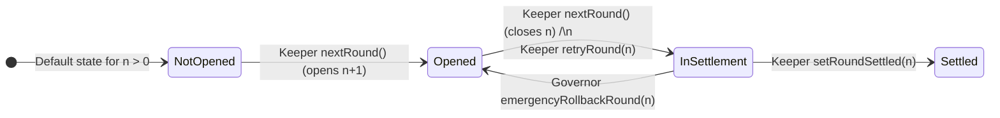

| State (`enum RoundState`) | Value | Deposit | Redeem (current) | Exchange (past) |
| --- | --- | --- | --- | --- |
| `NotOpened` | 0 | ❌ | ❌ | ❌ |
| `Opened` | 1 | ✅ | ✅ | ❌ |
| `InSettlement` | 2 | ❌ (round closed) | ❌ | ❌ |
| `Settled` | 3 | ❌ | ❌ | ✅ |

A few non-obvious properties of the enum:

- `NotOpened` is the EVM-default value of `mapping(uint256 => RoundState)`.
  Any `roundState[id]` for an `id` the contract has never touched reads as
  `NotOpened`. The constructor explicitly sets `roundState[0] = Opened` so
  round 0 is usable from deployment, and every `nextRound()` advances by
  writing `roundState[_roundNumber] = Opened` on the new round.
- `_startSettlement(roundId)` requires `roundState[roundId] == Opened`. Both
  `nextRound()` (closing the current round) and `retryRound(roundId)` (a past
  round) go through `_startSettlement`, so neither can fire on a round in
  `NotOpened`, `InSettlement`, or `Settled` directly.
- `retryRound(roundId)` therefore can only act on a past round that is
  currently `Opened`. The only way a past round ends up back in `Opened` is
  if the Governor first called `emergencyRollbackRound(roundId)` to move it
  from `InSettlement` → `Opened`. The full stuck-round recovery sequence is
  **rollback → retry → settle**, never just retry.
- `Settled` is terminal under normal flow — there is no "un-settle" path.

### 6.5 Phase 1 — `nextRound()`

```solidity
function nextRound() external onlyKeeper {
    uint256 closingRound = _roundNumber;
    _startSettlement(closingRound);                 // Opened -> InSettlement
    _roundNumber++;
    roundState[_roundNumber] = RoundState.Opened;   // open the new round
    emit RoundAdvanced(closingRound);
}
```

No funds move. The closing round's ERC-1155 supply is now the frozen
liability. The new round id accepts fresh deposits immediately.

### 6.6 Phase 2 — `setRoundSettled(roundId)` (and batch)

```solidity
function _setRoundSettled(uint256 roundId) internal {
    require(roundState[roundId] == InSettlement);
    roundState[roundId] = RoundState.Settled;        // (1) flip state early

    uint256 frozenAmount = totalSupply(roundId);     // (2) exact liability
    Price memory rate;
    if (frozenAmount > 0) {
        uint256 outputAmount = _operate(frozenAmount, roundId);
        rate = toPrice(outputAmount, frozenAmount);  // (3) snapshot real rate
    } else {
        rate = _getFallbackExchangeRate();
    }
    _exchangeRateByRound[roundId] = rate;
    emit RoundSettled(roundId, rate);
}
```

- The state flip happens **before** `_operate` so any reentrant attempt to read
  the round sees `Settled`.
- The exchange rate is `Price{ baseAmount = outputAmount, quoteAmount = frozenAmount }`
  — i.e. how much exchange asset 1 unit of receipt is worth. The rate organically
  absorbs slippage, NAV moves, withdrawal fees, and any rounding the Fleet did.

`setRoundSettledBatch(uint256[] roundIds)` runs the same logic per id in a loop.
Useful when several `InSettlement` rounds need to clear in one Keeper tx.

The virtual signature is `_operate(uint256 amount, uint256 roundId)` — the
amount comes first. The base class calls `_operate(frozenAmount, roundId)`
from `_setRoundSettled`.

### 6.7 Recovery paths

- **`retryRound(roundId)`** (Keeper). Only valid when `roundState[roundId] ==
  Opened` and `roundId < currentRound`. Pushes a past open round back into
  `InSettlement` so the Keeper can run `setRoundSettled` again. Usually paired
  with `emergencyRollbackRound` to recover a stuck round.
- **`emergencyRollbackRound(roundId)`** (Governor). Only valid when
  `roundState[roundId] == InSettlement`. Moves it back to `Opened` so users can
  redeem out via the current-round path if settlement is permanently broken.

### 6.8 User redemption paths

| Path | Round id constraint | Returns | Burns | Whitelist check |
| --- | --- | --- | --- | --- |
| `redeem(id, amount, receiver, owner)` | `id == currentRound`, state `Opened` | The deposit asset (Input: USDC; Output: Fleet shares) | Receipt of the current round | `vault()`, owner+receiver+caller |
| `redeemBatch(ids, amounts, receiver, owner)` | each `id == currentRound`, state `Opened` | Sum of deposit asset | Receipts (batch) | `vault()`, owner+receiver+caller |
| `redeemExchangeAsset(id, amount, receiver, owner)` | `id < currentRound`, state `Settled` | Exchange asset at snapshotted rate | Receipt of round `id` | `vault()`, owner+receiver+caller |
| `redeemExchangeAssetBatch(ids, amounts, receiver, owner)` | each `id < currentRound`, state `Settled` | Sum across rates | Receipts (batch) | `vault()`, owner+receiver+caller |

`_redeemExchangeAsset` follows CEI: burn first, then compute `amount * rate`,
then `safeTransfer`. The internal contract comment in the source highlights that
this is intentional defense against ERC-777-style `tokensReceived` reentrancy.

### 6.9 Minimum position size

```solidity
modifier validateMinPosition(address outgoing, address incoming) {
    _;                                  // run the body first
    if (minPositionSize == 0) return;
    // post-flight: inspect *actual* balances after the operation
    ...
}
```

Run **post-flight** so the validator inspects the real ending balances on
both sides. Logic:

- `_validateAggregateAssets(user, isInputVault, minPositionSize, fleet)`:
  - For Input vaults, count the user's open ERC-1155 receipts via
    `balanceOfAll(user)` as if they were assets, **plus** the user's
    Fleet-share balance converted to assets via `previewRedeem`.
  - For Output vaults, treat receipts as `0` (they represent capital already
    leaving) and count only the Fleet shares converted to assets.
- A self-operation (`outgoing == incoming`) is allowed to fully exit (`balanceOfAll == 0`)
  without tripping the minimum.
- `incoming == address(0)` and `incoming == address(this)` are skipped.

`setMinPositionSize(uint256)` is Governor-only. Setting `0` disables the check.

### 6.10 Receipt transfers

`safeTransferFrom` and `safeBatchTransferFrom` are overridden to:

1. Run `validateMinPosition(from, to)`.
2. Run `_revertIfNotWhitelisted(vault(), from, to, _msgSender())`.

This makes the ERC-1155 receipts transferable but only to other approved
participants on the same Fleet.

---

## 7. RoundsVaultRegistry

A standalone, Ownable registry contract that other systems (notably the
companion subgraph) use as the **discovery point** for all rounds-vault pairs.

### 7.1 Data model

```solidity
struct RoundsVaultPair {
    address inputVault;       // address(0) if no Input flavor is deployed
    address outputVault;      // address(0) if no Output flavor is deployed
    address targetVault;      // the FleetCommander this pair wraps
    bytes32 institutionId;    // operator-defined institution tag
    bool    active;           // soft-deactivation flag (history preserved)
    uint64  registeredAt;     // block.timestamp when first registered
}
```

- `pairId = keccak256(abi.encodePacked(targetVault))`. One pair per
  FleetCommander.
- An enumerable list `_pairIds[]` allows the indexer to walk all known pairs.

### 7.2 Lifecycle (all mutators are `onlyOwner`)

| Function | Purpose | Reverts on |
| --- | --- | --- |
| `registerPair(institutionId, targetVault, inputVault, outputVault)` | First-time registration of a pair. Validates each side's `VAULT_TYPE` and that its `vault()` equals `targetVault`. | `TargetVaultZero`, `NoVaultProvided`, `PairAlreadyExists`, `TargetMismatch`, `VaultFlavorMismatch` |
| `setInputVault(pairId, inputVault)` | Replace the Input-side vault. | `UseClearInsteadOfZero`, `PairNotFound`, `TargetMismatch`, `VaultFlavorMismatch` |
| `setOutputVault(pairId, outputVault)` | Replace the Output-side vault. | Same as above for Output flavor. |
| `clearInputVault(pairId)` | Remove the Input side (the Output side must remain). | `PairNotFound`, `UpdateWouldEmptyPair` |
| `clearOutputVault(pairId)` | Remove the Output side (the Input side must remain). | `PairNotFound`, `UpdateWouldEmptyPair` |
| `deactivatePair(pairId)` | Soft-disable. Preserves history for the indexer. | `PairNotFound`, `PairStateUnchanged` |
| `reactivatePair(pairId)` | Re-enable. | `PairNotFound`, `PairStateUnchanged` |

### 7.3 Views

| Function | Returns |
| --- | --- |
| `getPairId(targetVault)` | `keccak256(abi.encodePacked(targetVault))` (pure). |
| `exists(pairId)` | `true` iff `targetVault != address(0)` for that key. |
| `getPair(pairId)` | The full struct or reverts `PairNotFound`. |
| `getPairByTarget(targetVault)` | Looks up by Fleet address. |
| `pairCount()` | Length of the enumerable list. |
| `pairIdAt(index)` | The id at a given index in registration order. |

### 7.4 Why this exists

- Per-institution `ProtocolAccessManager`s prevent a single global whitelist
  authority from being the discovery root.
- The companion subgraph derives per-vault data sources directly from
  registry events, so the event shape (`RoundsVaultPairRegistered`,
  `RoundsVaultPairUpdated`, `RoundsVaultPairDeactivated`,
  `RoundsVaultPairReactivated`) is part of the public contract.
- Soft-deactivation lets the indexer keep history when a pair is retired; a
  redeployed pair is registered against the same target via a new
  `registerPair` only if the previous one was first removed (it currently
  reverts `PairAlreadyExists` while a pair is registered, regardless of
  `active`).

---

## 8. WisdomTreeArk (T+1 connector)

`WisdomTreeArk` is the canonical T+1 Ark and the one the RoundsVault async
machinery is shaped around. It bridges on-chain USDC ↔ off-chain WisdomTree
fund shares (e.g. WTGXX money-market, CRDYX credit fund).

### 8.1 Asset tracking model

```text
totalAssets() =
    sharesToAssets(currentShares + pendingWithdrawalShares)
  + pendingDepositAssets
```

Where:

```solidity
uint256 currentShares = pendingDepositAssets > 0
    ? cachedShareBalance               // freeze share view while deposit in flight
    : shareToken.balanceOf(address(this));
```

| Field | Meaning |
| --- | --- |
| `currentShares` | WT shares physically held in the Ark, *frozen* during an in-flight deposit. |
| `cachedShareBalance` | Snapshot taken at the start of a deposit batch — the share balance **before** any newly minted off-chain shares arrive. |
| `pendingDepositAssets` | USDC that has been forwarded to WT but for which shares haven't been formally recognized via `clearPendingDeposit()`. |
| `pendingWithdrawalShares` | Shares already shipped to WT awaiting USDC settlement. |
| `_frozenTotalAssets` | Stored value returned by `totalAssets()` while the Ark is in `isArkFrozen` state. |

If `isArkFrozen` is true, `totalAssets()` short-circuits to `_frozenTotalAssets`,
disconnecting the Ark from oracle and balance changes.

### 8.2 Oracle

A Chainlink `AggregatorV3Interface` reports the price of 1 WT share in the
underlying asset (USDC). Both `_sharesToAssets` and `_assetsToShares` go through
`_fetchOracleAssetPerSharePrice`, which enforces:

- `answer > 0` → otherwise `OraclePriceNotPositive`.
- `block.timestamp - updatedAt <= ORACLE_HEARTBEAT_TIMEOUT (24h)` → otherwise
  `StaleOraclePrice`.

> Operational note: WT oracles publish the previous business day's NAV when
> fresh data isn't available, to satisfy SLA. So a single calendar day may see
> two updates with the same NAV. The freshness check still passes.

### 8.3 Deposit lifecycle (board → clear)

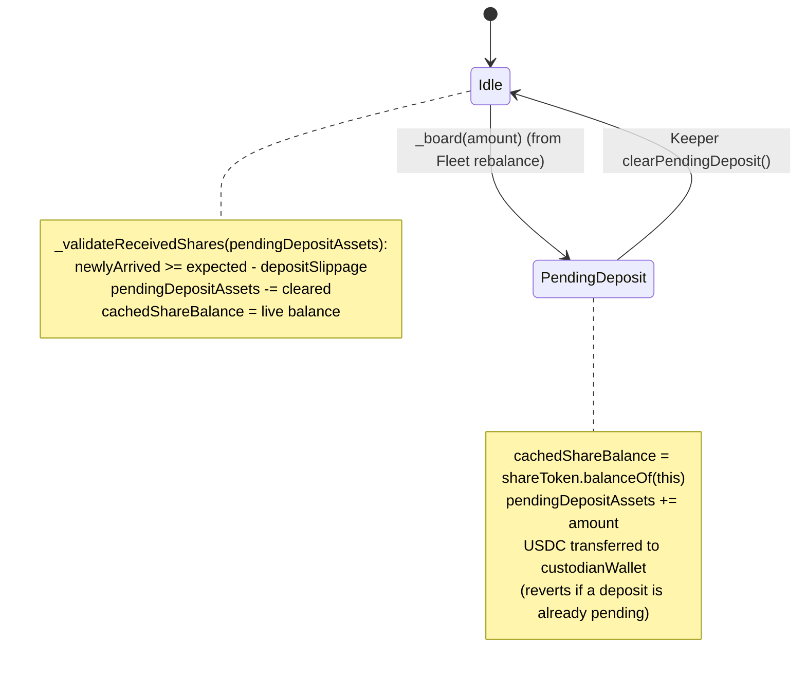

- `_board` reverts with `PendingDepositActive` if a deposit is already in
  flight — the WT pipeline is intentionally single-threaded on deposit.
- The **keeper-facing `clearPendingDeposit()` takes no parameter** and always
  clears the full pending amount. Partial clearance is only available to the
  Governor via `emergencyClearPendingDeposit(uint256 amount)`.
- `_validateReceivedShares` measures newly arrived shares as
  `shareToken.balanceOf(this) - cachedShareBalance` and compares against the
  oracle-implied expected shares (minus `depositSlippage`).

### 8.4 Withdrawal lifecycle (request → sweep)

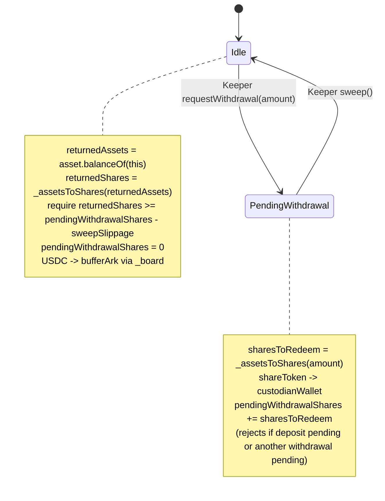

- `requestWithdrawal` reverts on `PendingDepositActive` or
  `PendingWithdrawalActive` to prevent overlapping cycles.
- `sweep()` is `onlyKeeper onlyNotFrozen nonReentrant`.
- `emergencySweep()` (`onlyGovernor`) bypasses the slippage check entirely.

### 8.5 Slippage parameters

| Setter | Max | Default | Bound check |
| --- | --- | --- | --- |
| `setSweepSlippage(Percentage)` (Keeper) | `0.5%` | — | `MAX_SWEEP_SLIPPAGE` |
| `setDepositSlippage(Percentage)` (Keeper) | `0.5%` | — | `MAX_DEPOSIT_SLIPPAGE` |

`DEFAULT_SWAP_SLIPPAGE` (inherited) is `2` (0.02%).

### 8.6 Freeze mechanism

For dividend-paying non-MMF funds (e.g. CRDYX) the ex-dividend tick drops NAV
before the dividend share drop arrives at T+1. To prevent that gap from
showing up in Fleet `totalAssets`:

```solidity
setArkFrozen(true,  type(uint256).max);   // snapshot current totalAssets
// ... dividend processing window ...
setArkFrozen(false, 0);                   // resume live reporting
```

While frozen, `_board`, `_disembark`, `requestWithdrawal`, and `sweep` all
revert via the `onlyNotFrozen` modifier. The Ark is effectively quarantined.

### 8.7 No-op overrides

The Ark has several deliberately empty methods because WT settlement is fully
off-chain:

- `_disembark` — withdrawals are async (`requestWithdrawal` + `sweep`).
- `_withdrawableTotalAssets()` — returns 0 (no sync exit).
- `claimWithdrawal()` — WT processes off-chain.
- `withdrawUsingSwap(...)` — no DEX exit supported.
- `_harvest(...)` — no on-chain rewards.

### 8.8 Authority summary

| Function | Caller |
| --- | --- |
| `setCustodianWallet`, `setArkFrozen`, `clearPendingDeposit`, `requestWithdrawal`, `claimWithdrawal`, `sweep`, `setSweepSlippage`, `setDepositSlippage`, `withdrawUsingSwap` | `onlyKeeper` |
| `emergencySweep`, `emergencyClearPendingDeposit` | `onlyGovernor` |
| `totalAssets`, `sharesToAssets`, `assetsInWithdrawalQueue`, `withdrawalRequestId`, `isWithdrawalClaimRequired` | view |

### 8.9 The RWA Ark family — WisdomTree · Securitize · Benji (product view)

`WisdomTreeArk` (§8) is one of **three** real-world-asset (RWA) connectors a Fleet
can hold. All three do the same job — turn the Fleet's USDC into a regulated
fund token and back — but they settle in three different shapes. This subsection
is the plain-language, product-level view; §9.8–9.9 give the on-chain sequences.

**The front half is identical for all three.** A whitelisted user always:

1. Deposits **USDC into the Fleet** (Path 1 AdmiralsQuarters, or Path 2
   RoundsVault). The USDC lands in the **Buffer Ark**.
2. The **Curator / Fund Manager** decides how much of the Fleet's cash to place
   into a given RWA product. The **Keeper** (automation) carries out that
   decision by rebalancing `Buffer → the product's Ark`.

**The back half is where they differ** — what happens when the money reaches the
Ark, and how the user gets their money out.

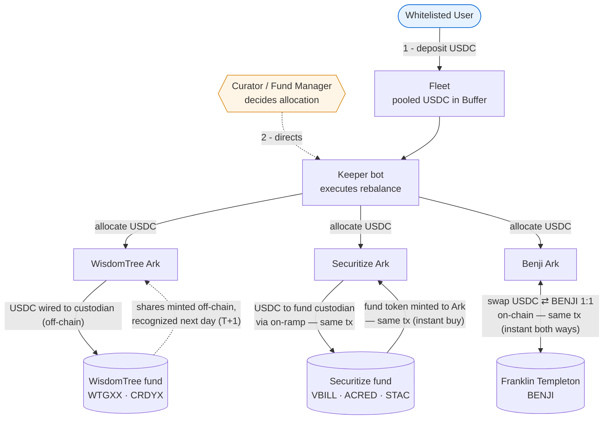

| What a product person asks | WisdomTree | Securitize | Benji |
| --- | --- | --- | --- |
| **Funds** | WTGXX (money-market), CRDYX (credit) | VBILL, ACRED, STAC | BENJI (FOBXX gov't money-market) |
| **Buying** (USDC → fund token) | **Off-chain, T+1.** USDC is wired to the fund's custodian; shares are minted off-chain and recognized the next business day. | **Instant, on-chain.** The Securitize on-ramp pulls the USDC and mints the fund token to the Ark **in the same transaction**. | **Instant, on-chain.** A Franklin Templeton SwapPool swaps USDC → BENJI **1:1 in the same transaction**. |
| **Selling** (fund token → USDC) | **Off-chain, T+1.** Token to custodian; USDC wired back the next business day. | **Off-chain, T+1.** Token to custodian; USDC wired back later. *There is no on-chain sell.* | **Instant, on-chain.** SwapPool swaps BENJI → USDC **1:1 in the same transaction**. |
| **Where the USDC physically goes** | Off-chain custodian wallet | Fund custodian (routed by the on-chain on-ramp) | On-chain SwapPool |
| **Priced by** | Chainlink NAV oracle (1 share → USDC) | RedStone NAV oracle (per-share NAV) | None — fixed **$1 par**, always 1:1 |
| **What the Keeper needs per allocation** | Nothing extra (custodian is fixed) | A **Securitize-signed authorization**, fetched from Securitize's API off-chain, relayed as board data | The whitelisted **SwapPool address**, passed as board data |
| **Needs the async RoundsVault layer?** | **Yes — both legs** (buy and sell are T+1) | **Sell leg only** (the buy settles instantly) | **No** — both legs are instant, so Path 1 (AdmiralsQuarters) is enough |

**In one sentence each:**

- **WisdomTree** — the fully off-chain model this document is shaped around. Money
  leaves the chain to a custodian on both legs and comes back a day later at the
  NAV strike. The RoundsVault exists to batch users through that T+1 wait fairly.
- **Securitize** — a **half-and-half** model. Buying is atomic on-chain: the
  Securitize on-ramp mints the fund token to the Ark in the same transaction the
  USDC leaves (the Keeper first fetches a Securitize-signed authorization
  off-chain). Selling has no on-chain path, so it behaves exactly like WisdomTree:
  token to custodian, USDC back T+1.
- **Benji** — the **fully on-chain** model. Franklin Templeton runs an on-chain
  SwapPool that swaps USDC ⇄ BENJI 1:1 with no fee and no NAV oracle, so both
  buying and selling are instant. No custodian, no T+1, no async layer needed
  (though the Curator / Fund Manager can still route it through a Fleet like any
  other Ark). If a SwapPool is ever paused, the Keeper can still exit BENJI on a
  whitelisted DEX via `withdrawUsingSwap`.

> **Who does what.** The **Curator / Fund Manager** owns the *decision* — which
> products the Fleet holds and how much goes where — and sets each Ark's caps
> (`depositCap`, `maxDepositPercentageOfTVL`, rebalance in/out limits). The
> **Keeper** is the automation that *executes* those decisions on-chain
> (`rebalance`, and the per-Ark settlement calls). A user is never exposed to
> which product their money sits in beyond the Fleet's reported share price.

---

## 9. End-to-End Flows by Role

### 9.1 User (whitelisted, has USDC) — Path 1: AdmiralsQuartersWhitelist

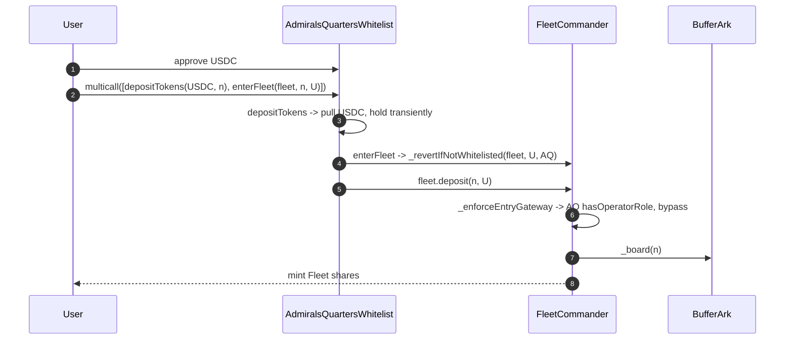

**Exit (Path 1):**

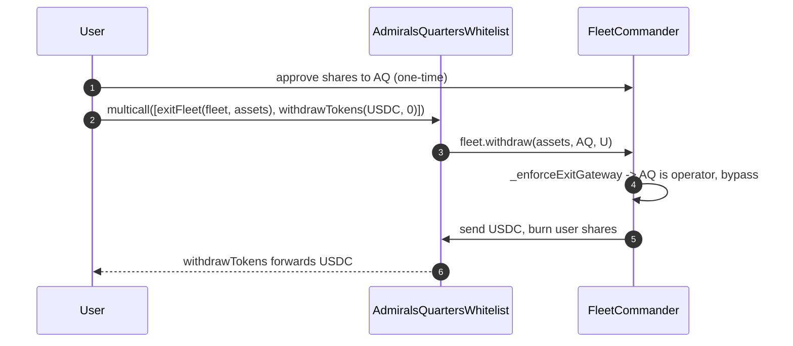

### 9.2 User (whitelisted, has USDC) — Path 2: RoundsVaultInput

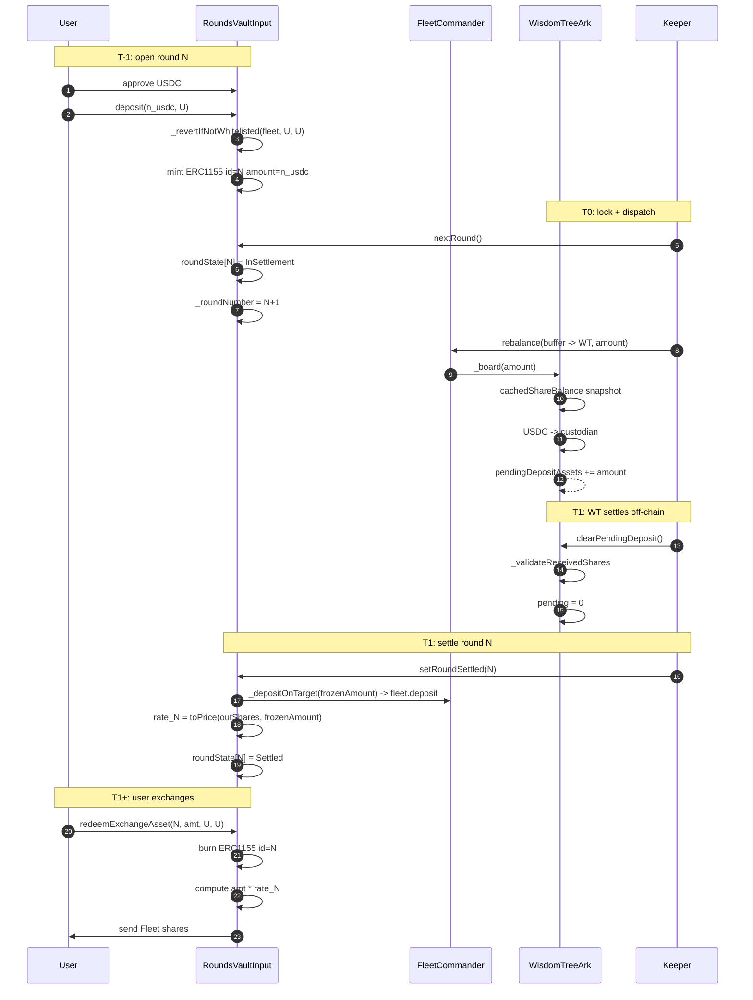

### 9.3 User (whitelisted, holds Fleet shares) — Path 2: RoundsVaultOutput

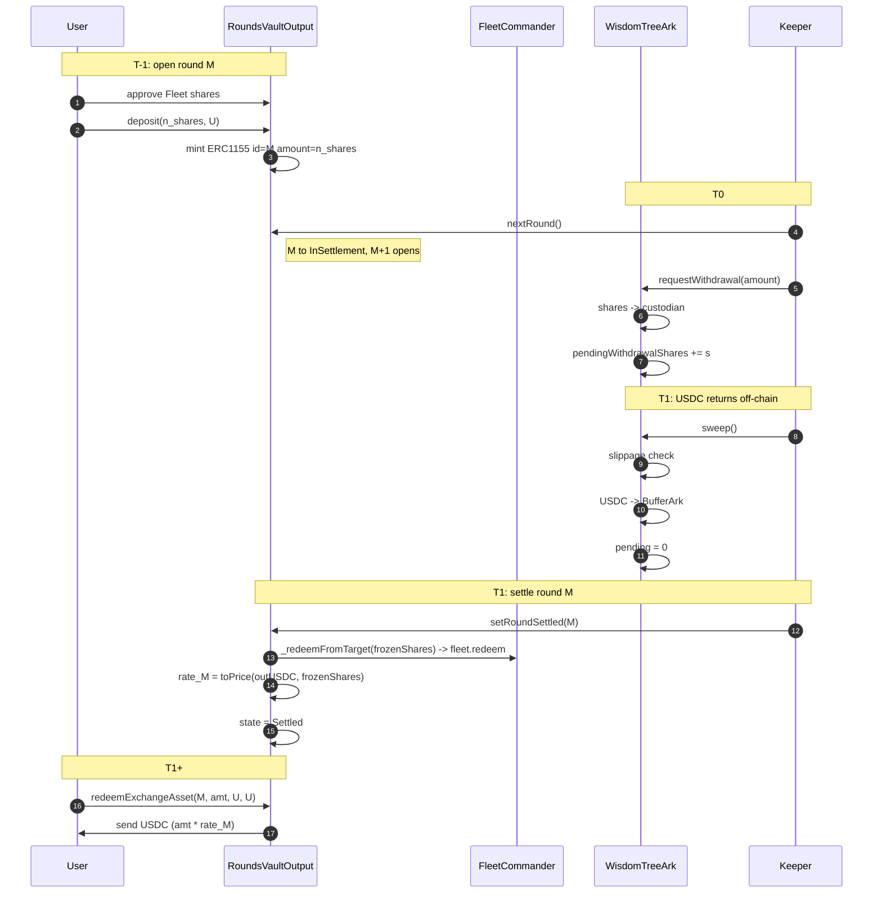

### 9.4 Keeper playbook

| Step | Subscription cycle (Input vault) | Redemption cycle (Output vault) |
| --- | --- | --- |
| 1 | Users deposit during `Opened` round | Users deposit Fleet shares during `Opened` round |
| 2 | `RoundsVaultInput.nextRound()` (Opened → InSettlement, opens N+1) | `RoundsVaultOutput.nextRound()` |
| 3 | `FleetCommander.rebalance(buffer → WT)` | `WisdomTreeArk.requestWithdrawal(amount)` |
| 4 | Wait for WT to mint shares (T+0 MMF before 3:30 PM ET / T+1 otherwise) | Wait for WT to wire back USDC |
| 5 | `WisdomTreeArk.clearPendingDeposit()` after oracle NAV refresh | `WisdomTreeArk.sweep()` — USDC arrives at BufferArk |
| 6 | `RoundsVaultInput.setRoundSettled(N)` | `RoundsVaultOutput.setRoundSettled(M)` |

Dividend handling (non-MMF, e.g. CRDYX):

| Step | Action |
| --- | --- |
| 1 | Ex-dividend declared → `WisdomTreeArk.setArkFrozen(true, type(uint256).max)` |
| 2 | Wait for dividend share drop |
| 3 | `setArkFrozen(false, 0)` to resume live reporting |

Stuck round recovery:

| Symptom | Remediation |
| --- | --- |
| `setRoundSettled` reverts (NAV anomaly, slippage trip) | Governor `emergencyRollbackRound(id)` (InSettlement → Opened), then Keeper `retryRound(id)` (Opened → InSettlement) when ready. |
| `setRoundSettled` reverts because the underlying Ark is frozen | Wait for `setArkFrozen(false, 0)` before retrying — do not roll back. |
| `sweep()` reverts due to slippage on returned USDC | Governor `emergencySweep()` bypasses the check. Re-enable normal flow once root cause is fixed. |
| WT delivers partial shares the Keeper can't process | Governor `emergencyClearPendingDeposit(partialAmount)`. |

### 9.5 Governor playbook

| Action | Function | Target |
| --- | --- | --- |
| Bootstrap whitelist authority | `grantWhitelistManagerRole(account)` | PAMv2 |
| Authorize AQ on a Fleet | `grantOperatorRole(fleet, AQ)` | PAMv2 |
| Authorize a RoundsVault on a Fleet | `grantOperatorRole(fleet, roundsVault)` | PAMv2 |
| Open/close Fleet to direct users | `setOperatorGatewayStatus(bool)` | FleetCommander |
| Enable share transfers | `setTransfersEnabled(bool)` | FleetCommander |
| Set/adjust fee model | `setFeeType`, `setTipRate`, `setPerformanceFeeRate` | FleetCommander |
| Set min position size on a RoundsVault | `setMinPositionSize(uint256)` | RoundsVault |
| Roll back a stuck round | `emergencyRollbackRound(id)` | RoundsVault |
| Force-clear a partial deposit | `emergencyClearPendingDeposit(amount)` | WisdomTreeArk |
| Force-sweep returning USDC | `emergencySweep()` | WisdomTreeArk |
| Pause / unpause Fleet | `pause()` / `unpause()` | FleetCommander |
| Register a new vault pair | `registerPair(institutionId, target, input, output)` | RoundsVaultRegistry |
| Soft-retire a pair | `deactivatePair(pairId)` | RoundsVaultRegistry |

### 9.6 Whitelist Manager playbook

| Action | Function | Target |
| --- | --- | --- |
| Approve a user for a Fleet | `setWhitelisted(fleet, user, true)` | PAMv2 |
| Approve many at once | `setWhitelistedBatch(fleet, users, true)` | PAMv2 |
| Open a Fleet's whitelist globally | `setWhitelistOpen(fleet, true)` | PAMv2 |
| Revoke a user | `setWhitelisted(fleet, user, false)` | PAMv2 |

> The same Fleet address is the context for AQ entry checks and RoundsVault
> entry checks. One whitelist update unblocks both paths.

### 9.7 AQ / RoundsVault as Operators

These contracts hold `OPERATOR_ROLE` on the Fleet via
`grantOperatorRole(fleet, contract)`. Concretely this means:

- They can call `deposit`, `mint`, `withdraw`, `redeem`, `transfer`,
  `transferFrom` on the Fleet regardless of `isOperatorGatewayOpen` and
  regardless of whether the receiver is whitelisted.
- They are still bound by per-Ark caps, per-Fleet pause state, and the Fleet's
  fee accrual.

### 9.8 User (whitelisted, has USDC) — Securitize product (`SecuritizeArk`)

Buying is **synchronous on-chain** (the on-ramp mints the fund token to the Ark
in the same transaction); selling is **asynchronous off-chain** (no on-chain
off-ramp), so the sell leg reuses the WisdomTree-style `requestWithdrawal` →
`sweep` cycle and the RoundsVault Output path.

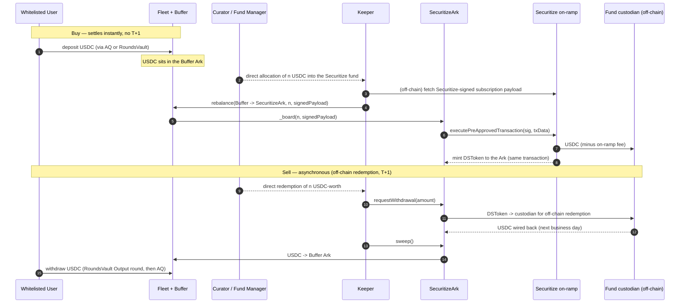

Key differences vs the WisdomTree flow in §9.2/§9.3:

- The buy has **no `clearPendingDeposit` step and no pending-deposit round** — the
  DSToken arrives in the same `_board` transaction, so a deposit round can settle
  in the same rebalance. `_disembark` reverts (`DisembarkDisabled`); the Ark
  exits **only** through the async `requestWithdrawal`/`sweep` cycle.
- The Keeper must obtain a **Securitize-signed payload off-chain** before it can
  allocate, and relays it as board data (`requiresKeeperData = true`). The Ark
  verifies the payload subscribes to itself for exactly the boarded amount before
  relaying it.

### 9.9 User (whitelisted, has USDC) — Benji product (`BenjiArk`)

Both legs are **synchronous on-chain** via the Franklin Templeton SwapPool, so
there is **no custodian, no NAV oracle, and no async RoundsVault layer** on the
happy path — Path 1 (AdmiralsQuarters) is sufficient end-to-end.

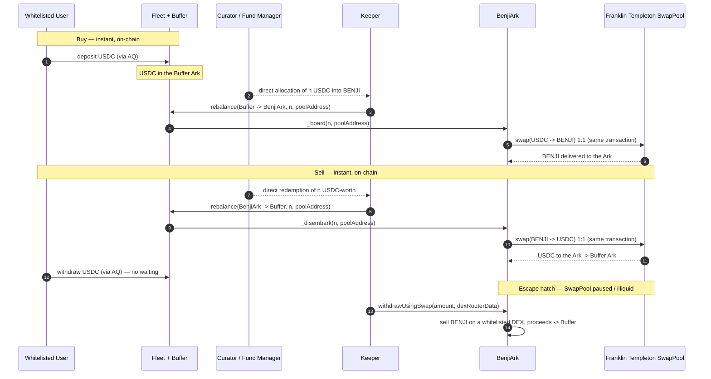

Key differences vs WisdomTree / Securitize:

- **No off-chain leg at all** on the happy path — the SwapPool settles both
  directions atomically at 1:1 par, so there is no custodian wallet, no
  `requestWithdrawal`/`sweep`, and no `clearPendingDeposit`. `BenjiArk` extends
  the swap machinery only (not the async-withdrawal base).
- **No NAV oracle** — value is fixed at $1 par with decimal normalization, so
  there is no `depositSlippage`/staleness surface for the SwapPool path.
- The Keeper passes only the **whitelisted SwapPool address** as board/disembark
  data (the Curator / Fund Manager whitelists eligible pools via
  `whitelistSwapPool`).

---

## 10. Entry Point Catalog

### 10.1 Public (whitelisted user) entry points

| Function | Contract | Notes |
| --- | --- | --- |
| `deposit / mint` | FleetCommanderWhitelist | Through `_enforceEntryGateway` — operator bypass possible. |
| `withdraw / redeem` | FleetCommanderWhitelist | Through `_enforceExitGateway`. |
| `withdrawFromBuffer / redeemFromBuffer` | FleetCommanderWhitelist | Buffer-only fast path. |
| `withdrawFromArks / redeemFromArks` | FleetCommanderWhitelist | Forces sorted disembark. |
| `transfer / transferFrom` | FleetCommanderWhitelist | Subject to `transfersEnabled`. |
| `deposit(assets, receiver)` | RoundsVaultBase | Whitelisted on `vault()`; mints ERC-1155 receipt. |
| `redeem(id, amount, receiver, owner)` | RoundsVaultBase | Current round only. |
| `redeemBatch(ids, amounts, receiver, owner)` | RoundsVaultBase | Each id must equal current round. |
| `redeemExchangeAsset(id, amount, receiver, owner)` | RoundsVaultBase | Past settled rounds. |
| `redeemExchangeAssetBatch(ids, amounts, receiver, owner)` | RoundsVaultBase | Batch settled-round exchange. |
| `safeTransferFrom / safeBatchTransferFrom` | RoundsVaultBase | ERC-1155 receipts, whitelisted+minPosition gated. |
| `multicall(bytes[])` | AdmiralsQuartersWhitelist | Container for everything below. |
| `depositTokens / withdrawTokens` | AdmiralsQuartersWhitelist | Token in/out of AQ. |
| `enterFleet / enterFleetWithPermit2 / exitFleet` | AdmiralsQuartersWhitelist | Enforce Fleet-context whitelist + Fleet validity. |
| `swap` | AdmiralsQuartersWhitelist | 1inch passthrough. |
| `claimMerkleRewards` | AdmiralsQuartersWhitelist | Wraps SummerRewardsRedeemer. |
| `moveFromAaveToAdmiralsQuarters / moveFromCompoundToAdmiralsQuarters / moveFromERC4626ToAdmiralsQuarters` | AdmiralsQuartersWhitelist | Position importers. |

### 10.2 Keeper-restricted entry points

| Function | Contract |
| --- | --- |
| `nextRound`, `retryRound`, `setRoundSettled`, `setRoundSettledBatch` | RoundsVaultBase |
| `rebalance` | FleetCommanderWhitelist |
| `tip` | FleetCommanderWhitelist |
| `clearPendingDeposit`, `requestWithdrawal`, `sweep`, `claimWithdrawal`, `withdrawUsingSwap` | WisdomTreeArk |
| `setArkFrozen`, `setCustodianWallet`, `setSweepSlippage`, `setDepositSlippage` | WisdomTreeArk |

### 10.3 Governor / Admin entry points

| Function | Contract |
| --- | --- |
| `setWhitelisted`, `setWhitelistedBatch`, `setWhitelistOpen`, `grantWhitelistManagerRole`, `revokeWhitelistManagerRole`, `grantOperatorRole`, `revokeOperatorRole` | ProtocolAccessManagerV2 |
| `setMinPositionSize`, `emergencyRollbackRound` | RoundsVaultBase |
| `setOperatorGatewayStatus`, `setTransfersEnabled`, `setTipRate`, `setPerformanceFeeRate`, `setFeeType`, `setMinimumPauseTime`, `pause`, `unpause` | FleetCommanderWhitelist |
| `emergencySweep`, `emergencyClearPendingDeposit` | WisdomTreeArk |
| `registerPair`, `setInputVault`, `setOutputVault`, `clearInputVault`, `clearOutputVault`, `deactivatePair`, `reactivatePair` | RoundsVaultRegistry (Owner) |
| `rescueTokens` | AdmiralsQuartersWhitelist (Owner) |

---

## 11. Systemic Risks & Operational Limits

### 11.1 Keeper operational ordering (CRITICAL)

The Keeper is the single synchronizer between off-chain WT state and on-chain
RoundsVault state. The two failure modes that cost real money:

- **Premature `clearPendingDeposit()`.** If called before WT actually delivers
  the shares, `cachedShareBalance` would be replaced with a live balance that
  does **not** include those shares, AND `pendingDepositAssets` would drop to
  zero. `totalAssets()` instantly gaps down by `amount`. The mitigation is
  `_validateReceivedShares` — the contract refuses to clear unless the share
  delta meets `expected - depositSlippage`. So the worst case is `revert`,
  not silent loss. Governor must use `emergencyClearPendingDeposit` if the
  Keeper genuinely needs to bypass.
- **Premature `setRoundSettled()`.** If called while the underlying Ark is in
  an artificial state (`isArkFrozen`, oracle stale, deposit not yet cleared),
  the snapshot `rate_N = toPrice(outputAmount, frozenAmount)` will reflect that
  artificial state. The exchange rate per receipt becomes wrong for everyone
  in that round. Remediation: `emergencyRollbackRound` + `retryRound` after the
  Ark normalizes.

### 11.2 Output-vault sweep stalls

If `WisdomTreeArk.sweep()` reverts (WT wired less than
`pendingWithdrawalShares - sweepSlippage`), the Output vault's round stays
`InSettlement` because `setRoundSettled` can't fire until USDC is in the
Buffer. Governor unblock options:

- `emergencySweep()` if the slippage is acceptable given context.
- `setSweepSlippage(higher)` if the parameter was simply too tight.
- `emergencyRollbackRound` to release user receipts back to the current-round
  path if the cycle is unrecoverable.

### 11.3 Oracle reliance

`_fetchOracleAssetPerSharePrice` enforces 24h freshness and positive answer.
A multi-day Chainlink outage hard-stops both `clearPendingDeposit()`
(`_validateReceivedShares` needs the oracle) and `requestWithdrawal` /
`sweep`. Governor freeze + `emergencyClearPendingDeposit` / `emergencySweep`
are the bypass tools.

### 11.4 NAV-lag absorption (intentional design)

Because `setRoundSettled` snapshots `outputAmount / frozenAmount` from the real
trade result, NAV drift between deposit time and settlement time is passed
**pro-rata** to users of that round and not to the rest of the Fleet. This is
exactly the property that motivates the async layer.

### 11.5 Whitelist scope

All four protected contracts (Fleet, AQ, Input vault, Output vault) check
whitelist against the **Fleet address** as the context. There is no separate
RoundsVault-scoped whitelist. A single `setWhitelisted(fleet, user, true)`
enables every legitimate path. A revoke removes them all.

### 11.6 AQ trust surface

`enterFleetWithPermit2` in the whitelist build forces the witness
`referralCode = bytes32(0)`. Off-chain signers must match that exactly or
Permit2 verification fails. The non-whitelist `AdmiralsQuarters.sol` (not part
of this institutional flow) honors real referral codes.

`rescueTokens` is `onlyOwner` (the deployer-set Ownable owner, distinct from
the Governor). It is the only way to recover tokens stranded mid-multicall
when a sub-call left tokens in AQ without a `withdrawTokens` after it.

---

## 12. Configuration & Deployment Checklist

### 12.1 Bootstrap a new institutional Fleet

1. **PAMv2.** Deploy `ProtocolAccessManagerV2` (or reuse the institution's
   existing one). Grant `GOVERNOR_ROLE` to the multisig; renounce the
   bootstrap if applicable.
2. **Fleet.** Deploy `FleetCommanderWhitelist` with the PAMv2 address.
   Configure caps, gateway state, buffer ark, minimumBufferBalance, fee
   parameters.
3. **Operator bindings.** Governor: `grantOperatorRole(fleet, AQ)` and
   `grantOperatorRole(fleet, roundsVaultInput / Output)`.
4. **Keeper.** Governor: `grantContractSpecificRole(KEEPER_ROLE, fleet, keeper)`.
5. **Whitelist manager.** Governor: `grantWhitelistManagerRole(account)`.
   Optionally `setWhitelistOpen(fleet, true)` for permissionless mode.

### 12.2 Add RoundsVault to the Fleet (only if T+1 Arks are in scope)

1. Deploy `RoundsVaultInput(fleet, pam, receiptsURI)`.
2. Deploy `RoundsVaultOutput(fleet, pam, receiptsURI)`.
3. Governor: `grantOperatorRole(fleet, input)` and `grantOperatorRole(fleet, output)`.
4. Governor: `grantContractSpecificRole(KEEPER_ROLE, input, keeper)` and same
   for output.
5. Optionally `setMinPositionSize(minSize)` on both vaults.
6. RoundsVaultRegistry: `registerPair(institutionId, fleet, input, output)`.

### 12.3 Add a WisdomTreeArk to the Fleet

1. Deploy `WisdomTreeArk(custodianWallet, shareToken, oracle, sweepSlippage,
   depositSlippage, arkParams)`.
2. Governor: register Ark with the Fleet (add to active arks set).
3. Governor: `grantContractSpecificRole(KEEPER_ROLE, ark, keeper)`.
4. Curator (or whoever holds Ark cap config): set `depositCap`,
   `maxDepositPercentageOfTVL`, `maxRebalanceInflow`, `maxRebalanceOutflow`.
5. Verify oracle heartbeat and price freshness off-chain before the first
   `_board`.

### 12.4 User onboarding checklist (per institution)

1. KYC pass-through to Whitelist Manager bot.
2. `setWhitelisted(fleet, user, true)`.
3. (User-side) approve USDC to AQ; or approve assets/shares to the
   RoundsVault. There is no further on-chain user step.

### 12.5 Decommission a RoundsVault pair

1. Halt new deposits — either `emergencyRollbackRound` open rounds and stop
   running `nextRound`, or just stop the Keeper.
2. Wait until all settled rounds are exchanged out by users.
3. Governor: `deactivatePair(pairId)` on `RoundsVaultRegistry`.
4. Optional: `revokeOperatorRole(fleet, input)` and same for output.

---

*Where this document and a contract's NatSpec disagree, the contract is
authoritative. Treat this reference as a navigation aid that explains how the
pieces fit together, not as a replacement for reading the contracts.*

Last update: 2026-07-01
