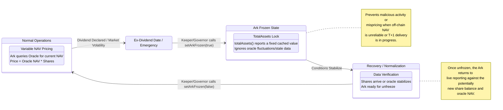
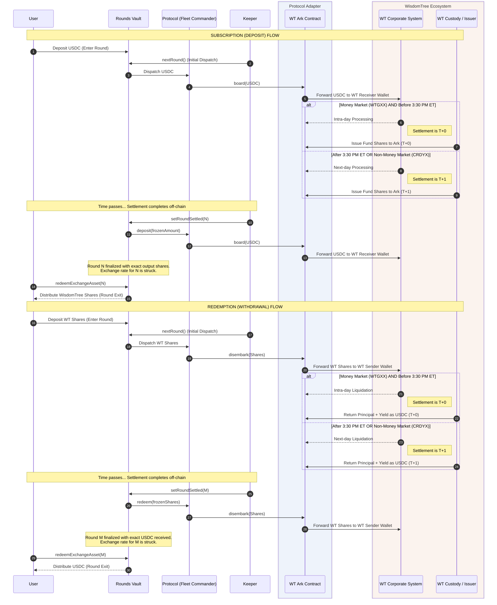
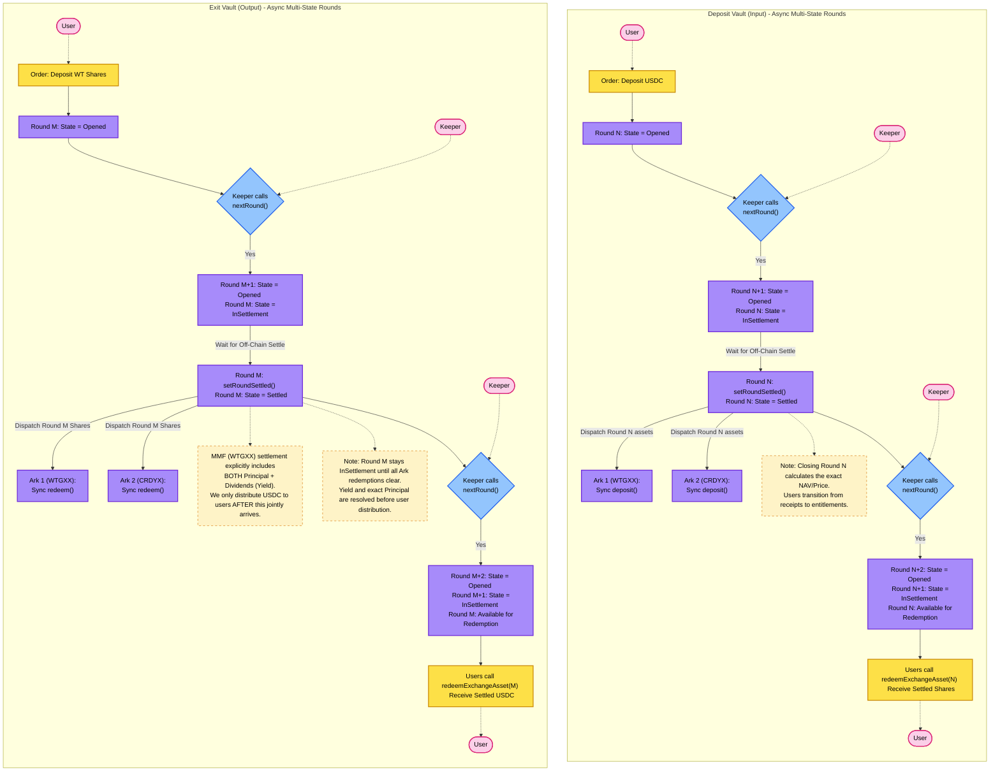

```mermaid
stateDiagram-v2
    direction LR

    state "Normal Operations" as Normal {
        state "Variable NAV Pricing" as VarNAV
        VarNAV : Ark queries Oracle for current NAV
        VarNAV : Price = Oracle NAV * Shares
    }

    state "Ex-Dividend Date / Emergency" as Emergency

    state "Ark Frozen State" as Freeze {
        state "TotalAssets Lock" as Locked
        Locked : totalAssets() reports a fixed cached value
        Locked : Ignores oracle fluctuations/stale data
    }

    Normal --> Emergency : Dividend Declared / Market Volatility
    Emergency --> Freeze : Keeper/Governor calls setArkFrozen(true)

    Note right of Freeze
        Prevents malicious activity or
        mispricing when off-chain NAV 
        is unreliable or T+1 delivery
        is in progress.
    end note

    state "Recovery / Normalization" as Settle {
        state "Data Verification" as Verify
        Verify : Shares arrive or oracle stabilizes
        Verify : Ark ready for unfreeze
    }

    Freeze --> Settle : Conditions Stabilize

    Settle --> Normal : Keeper/Governor calls setArkFrozen(false)

    Note right of Settle
        Once unfrozen, the Ark returns to 
        live reporting against the potentially
        new share balance and oracle NAV.
    end note
```

```mermaid
sequenceDiagram
    autonumber
    participant User
    participant Rounds as Rounds Vault
    participant Fleet as Protocol (Fleet Commander)
    participant K as Keeper

    box rgba(0, 100, 255, 0.05) Protocol Adapter
    participant Ark as WT Ark Contract
    end

    box rgba(255, 100, 0, 0.05) WisdomTree Ecosystem
    participant WTSys as WT Corporate System
    participant WTBank as WT Custody / Issuer
    end

    %% ========================================
    %% SUBSCRIPTION FLOW
    %% ========================================
    Note over User, WTBank: SUBSCRIPTION (DEPOSIT) FLOW

    User->>Rounds: Deposit USDC (Enter Round)

    K->>Rounds: nextRound() (Initial Dispatch)
    Rounds->>Fleet: Dispatch USDC
    Fleet->>Ark: board(USDC)
    Ark->>WTSys: Forward USDC to WT Receiver Wallet

    alt Money Market (WTGXX) AND Before 3:30 PM ET
        WTSys-->>Ark: Intra-day Processing
        Note right of WTSys: Settlement is T+0
        WTBank->>Ark: Issue Fund Shares to Ark (T+0)
    else After 3:30 PM ET OR Non-Money Market (CRDYX)
        WTSys-->>Ark: Next-day Processing
        Note right of WTSys: Settlement is T+1
        WTBank->>Ark: Issue Fund Shares to Ark (T+1)
    end

    Note over User, K: Time passes... Settlement completes off-chain

    K->>Rounds: setRoundSettled(N)
    Rounds->>Fleet: deposit(frozenAmount)
    Fleet->>Ark: board(USDC)
    Ark->>WTSys: Forward USDC to WT Receiver Wallet
    Note over Rounds: Round N finalized with exact output shares.<br/>Exchange rate for N is struck.

    User->>Rounds: redeemExchangeAsset(N)
    Rounds-->>User: Distribute WisdomTree Shares (Round Exit)

    %% ========================================
    %% REDEMPTION FLOW
    %% ========================================
    Note over User, WTBank: REDEMPTION (WITHDRAWAL) FLOW

    User->>Rounds: Deposit WT Shares (Enter Round)

    K->>Rounds: nextRound() (Initial Dispatch)
    Rounds->>Fleet: Dispatch WT Shares
    Fleet->>Ark: disembark(Shares)
    Ark->>WTSys: Forward WT Shares to WT Sender Wallet

    alt Money Market (WTGXX) AND Before 3:30 PM ET
        WTSys-->>Ark: Intra-day Liquidation
        Note right of WTSys: Settlement is T+0
        WTBank->>Ark: Return Principal + Yield as USDC (T+0)
    else After 3:30 PM ET OR Non-Money Market (CRDYX)
        WTSys-->>Ark: Next-day Liquidation
        Note right of WTSys: Settlement is T+1
        WTBank->>Ark: Return Principal + Yield as USDC (T+1)
    end

    Note over User, K: Time passes... Settlement completes off-chain

    K->>Rounds: setRoundSettled(M)
    Rounds->>Fleet: redeem(frozenShares)
    Fleet->>Ark: disembark(Shares)
    Ark->>WTSys: Forward WT Shares to WT Sender Wallet
    Note over Rounds: Round M finalized with exact USDC received.<br/>Exchange rate for M is struck.

    User->>Rounds: redeemExchangeAsset(M)
    Rounds-->>User: Distribute USDC (Round Exit)
```

```mermaid
flowchart TD
    %% Styling based on the provided Miro image
    classDef yellowNode fill:#FDE047,stroke:#CA8A04,stroke-width:2px,color:#000;
    classDef purpleNode fill:#A78BFA,stroke:#6D28D9,stroke-width:2px,color:#000;
    classDef blueDiamond fill:#93C5FD,stroke:#2563EB,stroke-width:2px,color:#000;
    classDef pinkActor fill:#FBCFE8,stroke:#DB2777,stroke-width:2px,color:#000;
    classDef externalNode fill:#E5E7EB,stroke:#4B5563,stroke-width:2px,stroke-dasharray: 5 5,color:#000;
    classDef note fill:#FEF3C7,stroke:#D97706,stroke-width:1px,color:#000,stroke-dasharray: 5 5;

    %% ----------------------------------------------------
    %% DEPOSIT LIFECYCLE (ASYNC)
    %% ----------------------------------------------------
    subgraph DepositVault ["Deposit Vault (Input) - Async Multi-State Rounds"]
        direction TB
        User_D1(["User"]):::pinkActor
        Order_D["Order: Deposit USDC"]:::yellowNode
        User_D1 -.-> Order_D

        RndN_D["Round N: State = Opened"]:::purpleNode
        Order_D --> RndN_D

        K_D1(["Keeper"]):::pinkActor
        Check_Rnd1_D{"Keeper calls <br/> nextRound()"}:::blueDiamond
        K_D1 -.-> Check_Rnd1_D

        RndN_D --> Check_Rnd1_D

        RndN1_D["Round N+1: State = Opened <br/> Round N: State = InSettlement"]:::purpleNode
        Check_Rnd1_D -->|Yes| RndN1_D

        Settle_D["Round N: setRoundSettled() <br/> Round N: State = Settled"]:::purpleNode
        RndN1_D -->|Wait for Off-Chain Settle| Settle_D

        Split_Ark1_D["Ark 1 (WTGXX): <br/> Sync deposit()"]:::purpleNode
        Split_Ark2_D["Ark 2 (CRDYX): <br/> Sync deposit()"]:::purpleNode

        Settle_D -->|Dispatch Round N assets| Split_Ark1_D
        Settle_D -->|Dispatch Round N assets| Split_Ark2_D

        Note_AsyncD["Note: Closing Round N calculates the exact NAV/Price.<br/>Users transition from receipts to entitlements."]:::note
        Settle_D -.-> Note_AsyncD

        K_D2(["Keeper"]):::pinkActor
        Check_Rnd2_D{"Keeper calls <br/> nextRound()"}:::blueDiamond
        K_D2 -.-> Check_Rnd2_D
        Settle_D --> Check_Rnd2_D

        RndN2_D["Round N+2: State = Opened <br/> Round N+1: State = InSettlement <br/> Round N: Available for Redemption"]:::purpleNode
        Check_Rnd2_D -->|Yes| RndN2_D

        Receive_D["Users call redeemExchangeAsset(N) <br/> Receive Settled Shares"]:::yellowNode
        RndN2_D --> Receive_D

        User_D2(["User"]):::pinkActor
        Receive_D -.-> User_D2
    end

    %% ----------------------------------------------------
    %% WITHDRAWAL LIFECYCLE (ASYNC)
    %% ----------------------------------------------------
    subgraph ExitVault ["Exit Vault (Output) - Async Multi-State Rounds"]
        direction TB
        User_W1(["User"]):::pinkActor
        Order_W["Order: Deposit WT Shares"]:::yellowNode
        User_W1 -.-> Order_W

        RndM_W["Round M: State = Opened"]:::purpleNode
        Order_W --> RndM_W

        K_W1(["Keeper"]):::pinkActor
        Check_Rnd1_W{"Keeper calls <br/> nextRound()"}:::blueDiamond
        K_W1 -.-> Check_Rnd1_W

        RndM_W --> Check_Rnd1_W

        RndM1_W["Round M+1: State = Opened <br/> Round M: State = InSettlement"]:::purpleNode
        Check_Rnd1_W -->|Yes| RndM1_W

        Settle_W["Round M: setRoundSettled() <br/> Round M: State = Settled"]:::purpleNode
        RndM1_W -->|Wait for Off-Chain Settle| Settle_W

        Split_Ark1_W["Ark 1 (WTGXX): <br/> Sync redeem()"]:::purpleNode
        Split_Ark2_W["Ark 2 (CRDYX): <br/> Sync redeem()"]:::purpleNode

        Settle_W -->|Dispatch Round M Shares| Split_Ark1_W
        Settle_W -->|Dispatch Round M Shares| Split_Ark2_W

        Note_MMF["MMF (WTGXX) settlement explicitly includes<br/>BOTH Principal + Dividends (Yield).<br/>We only distribute USDC to users AFTER this jointly arrives."]:::note
        Settle_W -.-> Note_MMF

        Note_AsyncW["Note: Round M stays InSettlement until all Ark redemptions clear.<br/>Yield and exact Principal are resolved before user distribution."]:::note
        Settle_W -.-> Note_AsyncW

        K_W2(["Keeper"]):::pinkActor
        Check_Rnd2_W{"Keeper calls <br/> nextRound()"}:::blueDiamond
        K_W2 -.-> Check_Rnd2_W
        Settle_W --> Check_Rnd2_W

        RndM2_W["Round M+2: State = Opened <br/> Round M+1: State = InSettlement <br/> Round M: Available for Redemption"]:::purpleNode
        Check_Rnd2_W -->|Yes| RndM2_W

        Receive_W["Users call redeemExchangeAsset(M) <br/> Receive Settled USDC"]:::yellowNode
        RndM2_W --> Receive_W

        User_W2(["User"]):::pinkActor
        Receive_W -.-> User_W2
    end
```
