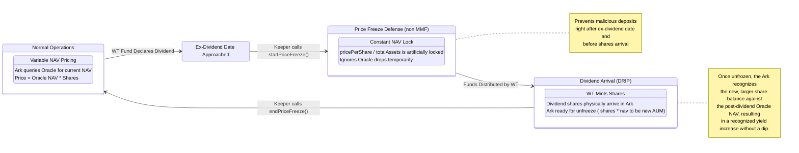
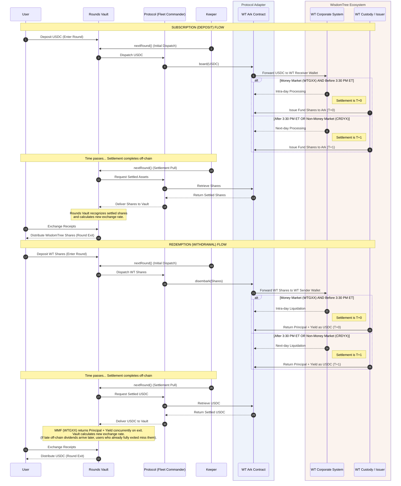
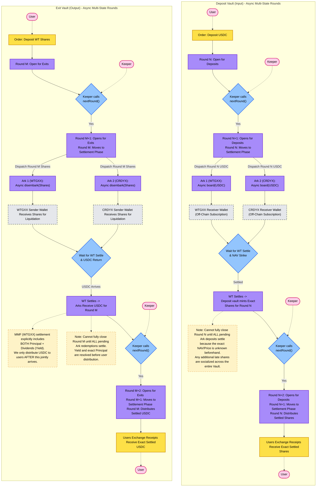

```mermaid
stateDiagram-v2
    direction LR

    state "Normal Operations" as Normal {
        state "Variable NAV Pricing" as VarNAV
        VarNAV : Ark queries Oracle for current NAV
        VarNAV : Price = Oracle NAV * Shares
    }

    state "Ex-Dividend Date Approached" as ExDiv

    state "Price Freeze Defense (non MMF)" as Freeze {
        state "Constant NAV Lock" as ConstNAV
        ConstNAV : pricePerShare / totalAssets is artificially locked
        ConstNAV : Ignores Oracle drops temporarily
    }

    Normal --> ExDiv : WT Fund Declares Dividend
    ExDiv --> Freeze : Keeper calls startPriceFreeze()

    Note right of Freeze
        Prevents malicious deposits
        right after ex-dividend date and
        before shares arrival
    end note

    state "Dividend Arrival (DRIP)" as Settle {
        state "WT Mints Shares" as Mint
        Mint : Dividend shares physically arrive in Ark
        Mint : Ark ready for unfreeze ( shares * nav to be new AUM)
    }

    Freeze --> Settle : Funds Distributed by WT

    Settle --> Normal : Keeper calls endPriceFreeze()

    Note right of Settle
        Once unfrozen, the Ark recognizes
        the new, larger share balance against
        the post-dividend Oracle NAV, resulting
        in a recognized yield increase without a dip.
    end note
```

```mermaid
sequenceDiagram
    autonumber
    participant User
    participant Rounds as Rounds Vault
    participant Fleet as Protocol (Fleet Commander)
    participant K as Keeper

    box rgba(0, 100, 255, 0.05) Protocol Adapter
    participant Ark as WT Ark Contract
    end

    box rgba(255, 100, 0, 0.05) WisdomTree Ecosystem
    participant WTSys as WT Corporate System
    participant WTBank as WT Custody / Issuer
    end

    %% ========================================
    %% SUBSCRIPTION FLOW
    %% ========================================
    Note over User, WTBank: SUBSCRIPTION (DEPOSIT) FLOW

    User->>Rounds: Deposit USDC (Enter Round)

    K->>Rounds: nextRound() (Initial Dispatch)
    Rounds->>Fleet: Dispatch USDC
    Fleet->>Ark: board(USDC)
    Ark->>WTSys: Forward USDC to WT Receiver Wallet

    alt Money Market (WTGXX) AND Before 3:30 PM ET
        WTSys-->>Ark: Intra-day Processing
        Note right of WTSys: Settlement is T+0
        WTBank->>Ark: Issue Fund Shares to Ark (T+0)
    else After 3:30 PM ET OR Non-Money Market (CRDYX)
        WTSys-->>Ark: Next-day Processing
        Note right of WTSys: Settlement is T+1
        WTBank->>Ark: Issue Fund Shares to Ark (T+1)
    end

    Note over User, K: Time passes... Settlement completes off-chain

    K->>Rounds: nextRound() (Settlement Pull)
    Rounds->>Fleet: Request Settled Assets
    Fleet->>Ark: Retrieve Shares
    Ark-->>Fleet: Return Settled Shares
    Fleet-->>Rounds: Deliver Shares to Vault
    Note over Rounds: Rounds Vault recognizes settled shares<br/>and calculates new exchange rate.

    User->>Rounds: Exchange Receipts
    Rounds-->>User: Distribute WisdomTree Shares (Round Exit)

    %% ========================================
    %% REDEMPTION FLOW
    %% ========================================
    Note over User, WTBank: REDEMPTION (WITHDRAWAL) FLOW

    User->>Rounds: Deposit WT Shares (Enter Round)

    K->>Rounds: nextRound() (Initial Dispatch)
    Rounds->>Fleet: Dispatch WT Shares
    Fleet->>Ark: disembark(Shares)
    Ark->>WTSys: Forward WT Shares to WT Sender Wallet

    alt Money Market (WTGXX) AND Before 3:30 PM ET
        WTSys-->>Ark: Intra-day Liquidation
        Note right of WTSys: Settlement is T+0
        WTBank->>Ark: Return Principal + Yield as USDC (T+0)
    else After 3:30 PM ET OR Non-Money Market (CRDYX)
        WTSys-->>Ark: Next-day Liquidation
        Note right of WTSys: Settlement is T+1
        WTBank->>Ark: Return Principal + Yield as USDC (T+1)
    end

    Note over User, K: Time passes... Settlement completes off-chain

    K->>Rounds: nextRound() (Settlement Pull)
    Rounds->>Fleet: Request Settled USDC
    Fleet->>Ark: Retrieve USDC
    Ark-->>Fleet: Return Settled USDC
    Fleet-->>Rounds: Deliver USDC to Vault
    Note over Rounds: MMF (WTGXX) returns Principal + Yield concurrently on exit.<br/>Vault calculates new exchange rate.<br/>(If late off-chain dividends arrive later, users who already fully exited miss them).

    User->>Rounds: Exchange Receipts
    Rounds-->>User: Distribute USDC (Round Exit)
```

```mermaid
flowchart TD
    %% Styling based on the provided Miro image
    classDef yellowNode fill:#FDE047,stroke:#CA8A04,stroke-width:2px,color:#000;
    classDef purpleNode fill:#A78BFA,stroke:#6D28D9,stroke-width:2px,color:#000;
    classDef blueDiamond fill:#93C5FD,stroke:#2563EB,stroke-width:2px,color:#000;
    classDef pinkActor fill:#FBCFE8,stroke:#DB2777,stroke-width:2px,color:#000;
    classDef externalNode fill:#E5E7EB,stroke:#4B5563,stroke-width:2px,stroke-dasharray: 5 5,color:#000;
    classDef note fill:#FEF3C7,stroke:#D97706,stroke-width:1px,color:#000,stroke-dasharray: 5 5;

    %% ----------------------------------------------------
    %% DEPOSIT LIFECYCLE (ASYNC)
    %% ----------------------------------------------------
    subgraph DepositVault ["Deposit Vault (Input) - Async Multi-State Rounds"]
        direction TB
        User_D1(["User"]):::pinkActor
        Order_D["Order: Deposit USDC"]:::yellowNode
        User_D1 -.-> Order_D

        RndN_D["Round N: Open for Deposits"]:::purpleNode
        Order_D --> RndN_D

        K_D1(["Keeper"]):::pinkActor
        Check_Rnd1_D{"Keeper calls <br/> nextRound()"}:::blueDiamond
        K_D1 -.-> Check_Rnd1_D

        RndN_D --> Check_Rnd1_D

        RndN1_D["Round N+1: Opens for Deposits <br/> Round N: Moves to Settlement Phase"]:::purpleNode
        Check_Rnd1_D -->|Yes| RndN1_D

        Split_Ark1_D["Ark 1 (WTGXX): <br/> Async board(USDC)"]:::purpleNode
        Split_Ark2_D["Ark 2 (CRDYX): <br/> Async board(USDC)"]:::purpleNode

        RndN1_D -->|Dispatch Round N USDC| Split_Ark1_D
        RndN1_D -->|Dispatch Round N USDC| Split_Ark2_D

        WT_D1["WTGXX Receiver Wallet <br/> (Off-Chain Subscription)"]:::externalNode
        WT_D2["CRDYX Receiver Wallet <br/> (Off-Chain Subscription)"]:::externalNode
        Split_Ark1_D --> WT_D1
        Split_Ark2_D --> WT_D2

        NavStrike_D{"Wait for WT Settle <br/> & NAV Strike"}:::blueDiamond
        WT_D1 --> NavStrike_D
        WT_D2 --> NavStrike_D

        Settle_D["WT Settles -> <br/> Deposit vault mints Exact Shares for Round N"]:::purpleNode
        NavStrike_D -->|Settled| Settle_D

        Note_AsyncD["Note: Cannot fully close Round N until ALL pending Ark deposits settle<br/>because the exact NAV/Price is unknown beforehand.<br/>Any additional late shares are socialized across the entire Vault."]:::note
        Settle_D -.-> Note_AsyncD

        K_D2(["Keeper"]):::pinkActor
        Check_Rnd2_D{"Keeper calls <br/> nextRound()"}:::blueDiamond
        K_D2 -.-> Check_Rnd2_D
        Settle_D --> Check_Rnd2_D

        RndN2_D["Round N+2: Opens for Deposits <br/> Round N+1: Moves to Settlement Phase <br/> Round N: Distributes Settled Shares"]:::purpleNode
        Check_Rnd2_D -->|Yes| RndN2_D

        Receive_D["Users Exchange Receipts <br/> Receive Exact Settled Shares"]:::yellowNode
        RndN2_D --> Receive_D

        User_D2(["User"]):::pinkActor
        Receive_D -.-> User_D2
    end

    %% ----------------------------------------------------
    %% WITHDRAWAL LIFECYCLE (ASYNC)
    %% ----------------------------------------------------
    subgraph ExitVault ["Exit Vault (Output) - Async Multi-State Rounds"]
        direction TB
        User_W1(["User"]):::pinkActor
        Order_W["Order: Deposit WT Shares"]:::yellowNode
        User_W1 -.-> Order_W

        RndM_W["Round M: Open for Exits"]:::purpleNode
        Order_W --> RndM_W

        K_W1(["Keeper"]):::pinkActor
        Check_Rnd1_W{"Keeper calls <br/> nextRound()"}:::blueDiamond
        K_W1 -.-> Check_Rnd1_W

        RndM_W --> Check_Rnd1_W

        RndM1_W["Round M+1: Opens for Exits <br/> Round M: Moves to Settlement Phase"]:::purpleNode
        Check_Rnd1_W -->|Yes| RndM1_W

        Split_Ark1_W["Ark 1 (WTGXX): <br/> Async disembark(Shares)"]:::purpleNode
        Split_Ark2_W["Ark 2 (CRDYX): <br/> Async disembark(Shares)"]:::purpleNode

        RndM1_W -->|Dispatch Round M Shares| Split_Ark1_W
        RndM1_W -->|Dispatch Round M Shares| Split_Ark2_W

        WT_W1["WTGXX Sender Wallet <br/> Receives Shares for Liquidation"]:::externalNode
        WT_W2["CRDYX Sender Wallet <br/> Receives Shares for Liquidation"]:::externalNode
        Split_Ark1_W --> WT_W1
        Split_Ark2_W --> WT_W2

        NavStrike_W{"Wait for WT Settle <br/> & USDC Return"}:::blueDiamond
        WT_W1 --> NavStrike_W
        WT_W2 --> NavStrike_W

        Settle_W["WT Settles -> <br/> Arks Receive USDC for Round M"]:::purpleNode
        NavStrike_W -->|USDC Arrives| Settle_W

        Note_MMF["MMF (WTGXX) settlement explicitly includes<br/>BOTH Principal + Dividends (Yield).<br/>We only distribute USDC to users AFTER this jointly arrives."]:::note
        Settle_W -.-> Note_MMF

        Note_AsyncW["Note: Cannot fully close Round M until ALL pending Ark redemptions settle.<br/>Yield and exact Principal are resolved before user distribution."]:::note
        Settle_W -.-> Note_AsyncW

        K_W2(["Keeper"]):::pinkActor
        Check_Rnd2_W{"Keeper calls <br/> nextRound()"}:::blueDiamond
        K_W2 -.-> Check_Rnd2_W
        Settle_W --> Check_Rnd2_W

        RndM2_W["Round M+2: Opens for Exits <br/> Round M+1: Moves to Settlement Phase <br/> Round M: Distributes Settled USDC"]:::purpleNode
        Check_Rnd2_W -->|Yes| RndM2_W

        Receive_W["Users Exchange Receipts <br/> Receive Exact Settled USDC"]:::yellowNode
        RndM2_W --> Receive_W

        User_W2(["User"]):::pinkActor
        Receive_W -.-> User_W2
    end
```
