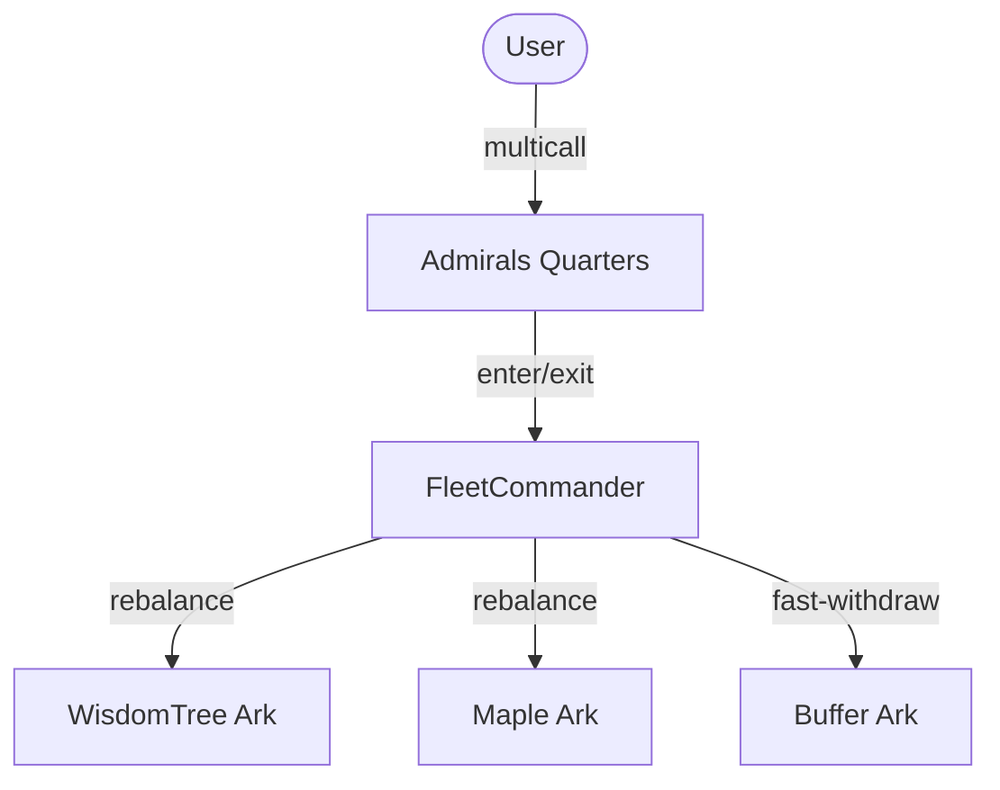

# Fleet Technical Reference

This document provides a technical deep-dive into the "Fleet" architecture, covering roles, state management, rebalancing logic, and the Admirals Quarters institutional gateway.

## Architectural Overview

A **Fleet** is an ERC-4626 compliant vault that aggregates liquidity across multiple yield-generating **Arks**. The system is designed for institutional use, featuring restricted entry/exit gateways and strategic rebalancing between Arks.



---

## Access Control & Role Hierarchy

The Fleet system utilizes `ProtocolAccessManagerV2` for context-aware role management.

| Role | Scope | Key Responsibilities |
| :--- | :--- | :--- |
| **Governor** | Global/Protocol | Adding/Removing Arks, setting Gateway status (`setOperatorGatewayStatus`), enabling transfers. |
| **Curator** | Fleet-Specific | Adjusting Ark deposit caps, maximum inflow/outflow limits, and minimum buffer balances. |
| **Operator** | Fleet-Specific | Can bypass the "Gateway" for direct deposit/withdrawal/mint/redeem even when closed to the public. Typically assigned to **AdmiralsQuarters** or a **RoundsVault**. |
| **Keeper** | Fleet-Specific | Executing `rebalance()` and `tip()` operations. |
| **Whitelist Manager** | Global/Fleet | Managing whitelisted accounts for individual fleet contexts. |

### Gateway Enforcement
Gateways control institutional entry and exit. When `config.isOperatorGatewayOpen` is `false`, only the **Operator** role can interact with the fleet. When `true`, all **Whitelisted** accounts can interact.

---

## Transient Caching System

To optimize gas during complex rebalances or multiple asset calculations, the Fleet uses `FleetCommanderCacheLib`.

### Caching Lifecycle
1. **Initiation**: A modifier (e.g. `useCache`) calls `_getArksData`.
2. **Persistence**: Data is stored using **Transient Storage** (`tstore` in EVM 0.8.28+).
3. **Consumption**: Internal functions like `totalAssets()` check the cache first, avoiding expensive repeated calls to external Arks.
4. **Flush**: The `flushCacheOnExit` modifier clears the cache at the end of the transaction to ensure state freshness.

> [!NOTE]
> Transient storage ensures that the cache is consistent within a single transaction but does not persist between blocks, making it safer and cheaper than standard storage.

---

## Strategic Rebalancing

The `rebalance()` function allows Keepers to move assets between Arks based on data provided by off-chain optimization engines.

### Validation Rules
- **Flow Caps**: Every Ark has a `maxRebalanceInflow` and `maxRebalanceOutflow`. The system tracks the net movement for each Ark within the transaction using the transient cache.
- **Deposit Caps**: The `getEffectiveArkDepositCap` ensures an Ark never exceeds its absolute cap or its percentage-of-TVL limit.
- **Buffer Minimum**: The `bufferArk` must always maintain at least `config.minimumBufferBalance` after a rebalance unless more funds are being moved *into* the buffer.

### Withdrawal Priority (Ascending Sort)
When a user withdraws more than what is available in the `bufferArk`, the fleet calls `_forceDisembarkFromSortedArks`.

```mermaid
workflow
    1. Retrieve withdrawable Arks
    2. Sort by TotalAssets ASC (Bubble Sort)
    3. Loop through sorted Arks:
       - Empty current Ark until debt met or Ark empty
       - Proceed to next smallest Ark
```

1. It retrieves all withdrawable Arks.
2. It **Sorts them by Total Assets (Ascending)** using a bubble sort.
3. It withdraws from the **smallest Arks first** until the debt is fulfilled. This strategy prioritizes clearing out smaller allocations to reduce fragmentation.

---

## Flexible Tipper (Fee System)

`FlexibleTipper` implements a dilution-based fee model.

- **AUM Fee**: A standard time-based fee (Assets Under Management).
- **Performance Fee (HWM)**: A fee charged only on growth above the **High-Water Mark**.
- **High-Water Mark (HWM)**: Tracks the highest-ever `assetsPerShare` ratio globally.

### HWM Share Fungibility
The HWM is **Global**. This is a critical design decision to maintain ERC-4626 fungibility. Users who deposit during a drawdown effectively get a "free ride" until the protocol recovers to its previous all-time-high ratio.

---

## Admirals Quarters (AQ)

The `AdmiralsQuartersWhitelist` is a primary interface for institutional bundles. 
For any given fleet, the **Operator** role is typically held by either **AdmiralsQuarters** or a **RoundsVault**, depending on the deployment requirements.

### Protected Multicall
AQ inherits from `ProtectedMulticallWhitelist`. 
- Sensitive functions like `enterFleet` and `exitFleet` use the `onlyMulticall` modifier.
- This ensures that these functions **cannot be called directly**; they must be bundled within an AQ `multicall`.
- **Reasoning**: This prevents malicious actors or unintended scripts from calling these entry points without the intended context and reentrancy protections enforced by the AQ wrapper.

### Position Importing
AQ supports one-click migration from other protocols:
- `moveFromAaveToAdmiralsQuarters`: Unwraps aTokens and prepares for Fleet entry.
- `moveFromCompoundToAdmiralsQuarters`: Withdraws from Compound V3.
- `moveFromERC4626ToAdmiralsQuarters`: Redeems from standard vaults.
