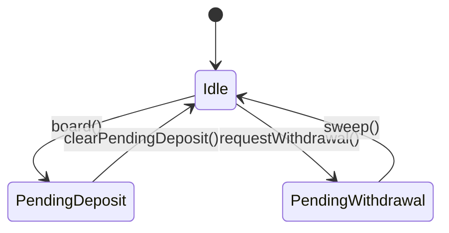

# Wisdom Tree Ark Technical Reference

The **WisdomTreeArk** is a specialized yield connector designed for managing off-chain tokenized assets (e.g., WTBTC). It follows a **T+1 custodial lifecycle**, where physical asset movement (USDC vs. Shares) happens asynchronously.

## Asset Tracking Model

To ensure accurate reporting of TVL during asynchronous transfers, the Ark uses a multi-faceted accounting formula:

```solidity
totalAssets() = (activeShares * oraclePrice) + pendingDepositAssets + (pendingWithdrawalShares * oraclePrice)
```

- **activeShares**: Shares currently held in the contract.
- **pendingDepositAssets**: USDC sent to WisdomTree but not yet cleared.
- **pendingWithdrawalShares**: Shares retired from the fleet and sent back to WisdomTree, awaiting USDC return.

---

## Custodial Lifecycle

The lifecycle is divided into two major asynchronous flows: **Inflow (Deposits)** and **Outflow (Withdrawals)**.



### 1. The Deposit Flow (Boarding)
- **Action**: `board(amount)`
- **Mechanism**: The Ark transfers USDC to a specified `custodianWallet`.
- **Double-Counting Protection**: If this is the start of a deposit queue, the Ark snapshots its current share balance into `cachedShareBalance`. While `pendingDepositAssets > 0`, the `totalAssets()` calculation uses `cachedShareBalance` instead of the live `balanceOf`. This prevents newly delivered shares from being counted twice (once as USDC and once as Shares) before the Keeper formally clears them.

### 2. Deposit Clearance
- **Action**: `clearPendingDeposit(amount)`
- **Requirement**: Shares must have arrived off-chain.
- **Validation**: The Keeper verifies that the newly arrived shares meet the `depositSlippage` threshold relative to the current Oracle price. If validated, `pendingDepositAssets` is reduced, and the `cachedShareBalance` is updated.

### 3. The Withdrawal Flow (Request)
- **Action**: `requestWithdrawal(amount)`
- **Constraint**: Cannot be called if there is a pending deposit queue.
- **Mechanism**: Calculates equivalent shares using the Oracle, transfers them to the `custodianWallet`, and increases `pendingWithdrawalShares`.

### 4. Sweep
- **Action**: `sweep()`
- **Mechanism**: USDC arrives off-chain in the Ark.
- **Validation**: The Keeper verifies that the received USDC meets the `sweepSlippage` threshold relative to the `pendingWithdrawalShares` and current Oracle price.
- **Result**: USDC is moved to the Fleet's **BufferArk**, and `pendingWithdrawalShares` is reset to zero.

---

## Oracle Reliance

The Ark depends on a **Chainlink Aggregator** (`oracle`) that provides the price of 1 WisdomTree share in terms of the underlying asset (e.g., CRDYX/USDC or WTGXX/USDC).

- **Heartbeat**: A 24-hour `ORACLE_HEARTBEAT_TIMEOUT` is enforced.
- **Slippage Enforcement**: All conversions between Assets and Shares during `clear` and `sweep` use the oracle price as the "fair value" baseline.
- **Note** - WT oracles are updated with the stale NAV if fresh data is unavailable from the provider. Consequently, even if the NAV is only updated once per business day, the oracle may be updated twice to satisfy SLA requirements.

---

## Emergency Fallbacks

In extreme market conditions or off-chain delivery misalignment, the Governor can intervene:

GOVERNOR:
- **emergencyClearPendingDeposit** : Forces a clearance regardless of the current share balance or slippage.
- **emergencySweep**: Forces a move of all held assets to the BufferArk, bypassing slippage checks.

KEEPER:
- **setArkFrozen**: Freezes the `totalAssets()` reporting to a fixed value to prevent oracle-based TVL fluctuations during emergencies or dividend processing.
