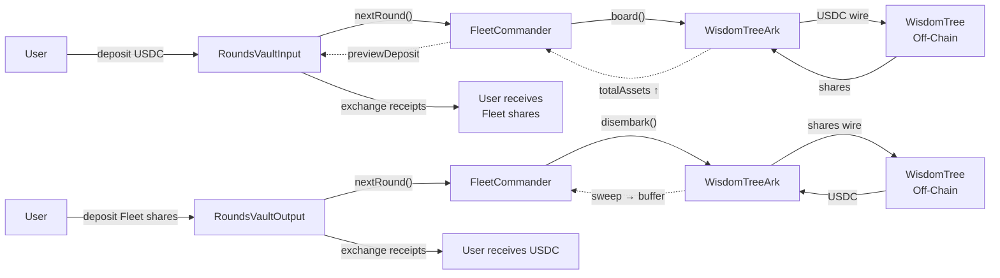
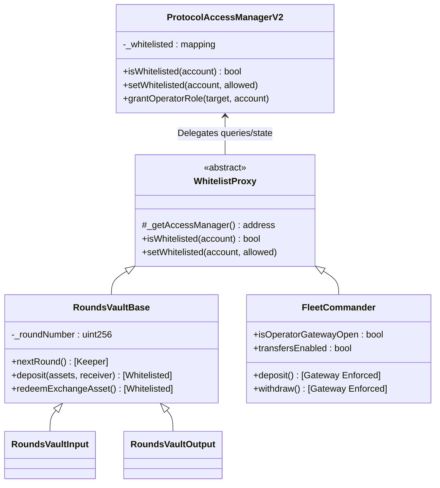
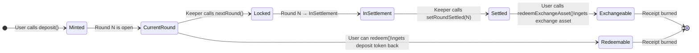
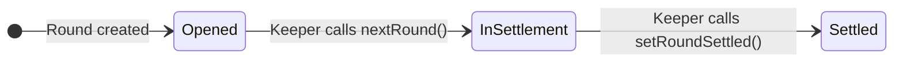
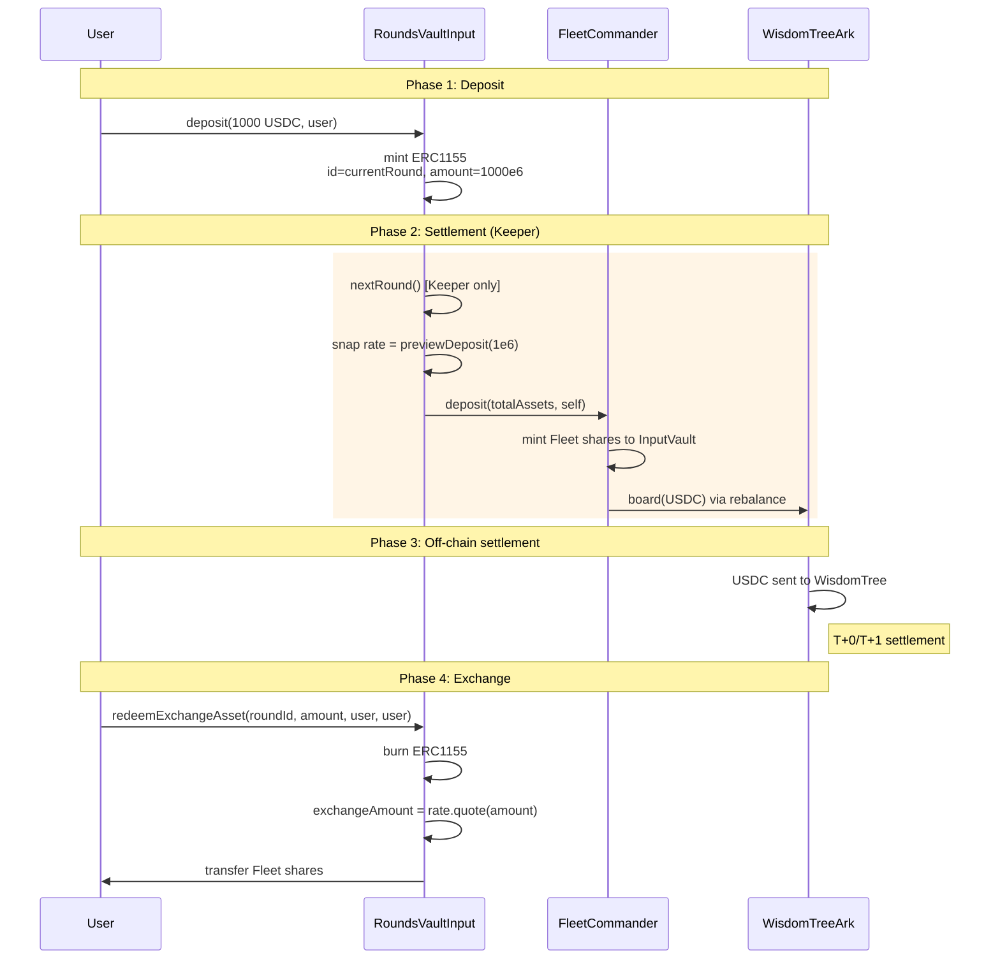
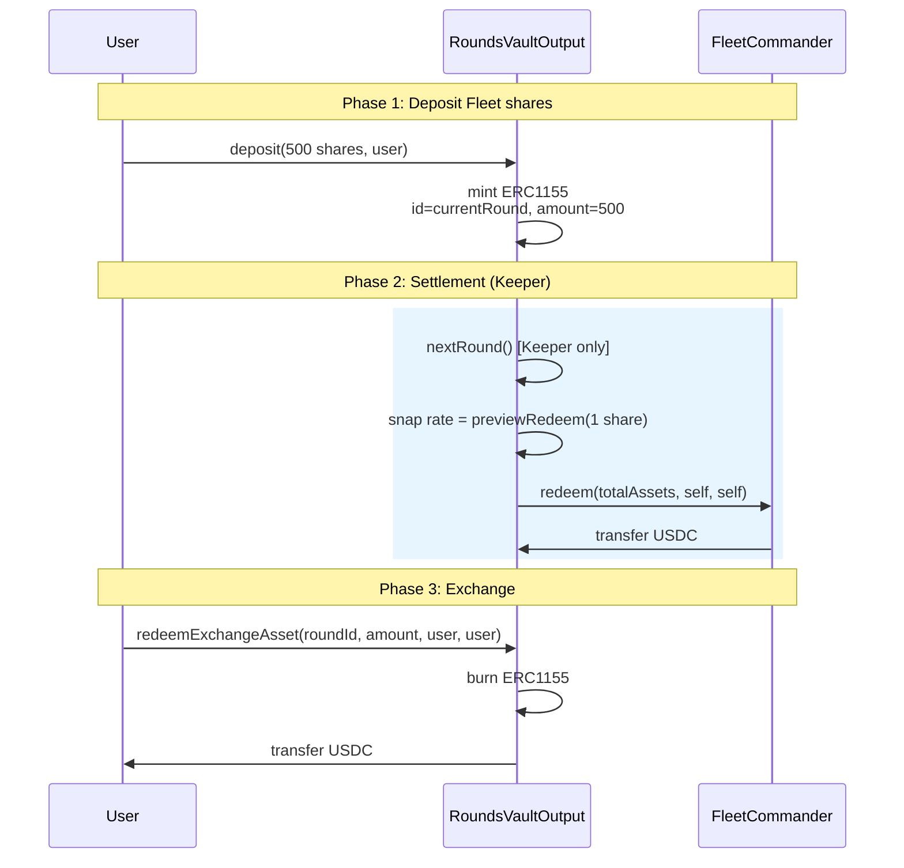
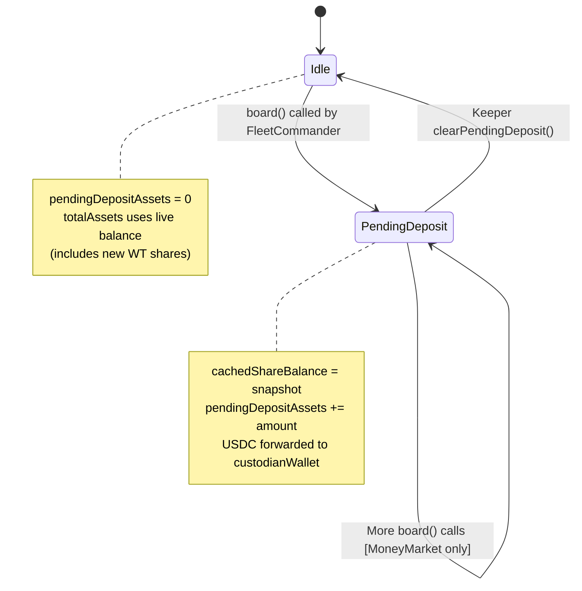
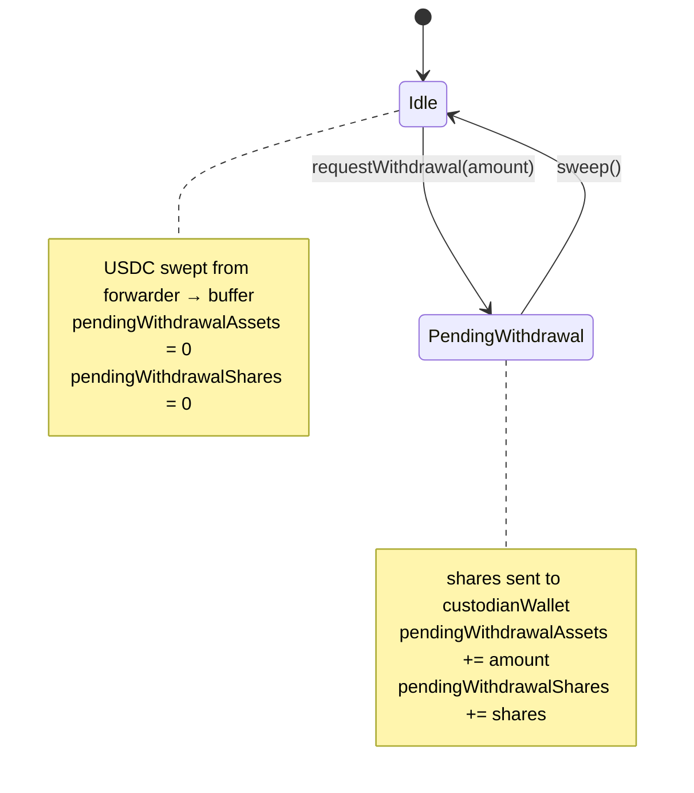

# Rounds Vault & Institutional Ark — Technical Reference

> Complete technical documentation for the async settlement architecture used by WisdomTree (and future Benji-token-style) integrations.

---

## Table of Contents

1. [Architecture Overview](#1-architecture-overview)
2. [Contract Hierarchy](#2-contract-hierarchy)
3. [Token Model: Receipts (ERC-1155 NFTs)](#3-token-model-receipts-erc-1155-nfts)
4. [Round State Machine](#4-round-state-machine)
5. [Input Vault (Deposit Flow)](#5-input-vault-deposit-flow)
6. [Output Vault (Withdrawal Flow)](#6-output-vault-withdrawal-flow)
7. [Exchange Rate Math](#7-exchange-rate-math)
8. [WisdomTreeArk Internals](#8-wisdomtreeark-internals)
9. [Keeper Operations Playbook](#9-keeper-operations-playbook)
10. [Entry Point Analysis](#10-entry-point-analysis)
11. [Systemic Risks & Operational Limitations](#11-systemic-risks-and-operational-limitations)

-----

## 1\. Architecture Overview

The Rounds Vault system solves a fundamental problem: institutional tokenized funds (e.g. WisdomTree WTGXX, CRDYX, and future Benji tokens) have **locked investment periods** where deposits/withdrawals are processed in T+0 or T+1 off-chain settlement cycles. Users cannot interact directly during these periods.

The Rounds Vault acts as an **asynchronous buffering layer** between users and the unified FleetCommander ERC-4626 vault.



-----

## 2\. Contract Hierarchy & Access Control

The protocol uses a centralized **ProtocolAccessManagerV2** to maintain a single source of truth for whitelisting and Operator roles. The `Whitelist` contract is a stateless adapter that forwards checks to the central manager.



-----

## 3\. Token Model: Receipts (ERC-1155 NFTs)

When a user deposits into a Rounds Vault, they do **not** receive ERC-20 shares. Instead they receive **ERC-1155 receipt tokens** where:

| Property | Value |
|----------|-------|
| Token standard | ERC-1155 |
| Token ID | `_roundNumber` at time of deposit |
| Amount | 1:1 with deposited assets (same decimals) |
| Transferable | Yes (standard ERC-1155 transfer) |
| Redeemable for deposit token | Only current round via `redeem()` |
| Exchangeable for exchange asset | Only past settled rounds via `redeemExchangeAsset()` |

### Receipt lifecycle



**Key rules:**

  - `redeem(id, amount, receiver, owner)` — burns receipt, returns the **deposit token** (same asset deposited). Only works for `id == currentRound`.
  - `redeemExchangeAsset(id, amount, receiver, owner)` — burns receipt, returns the **exchange asset** at the snapshotted exchange rate. Only works for `id < currentRound` AND `roundState[id] == Settled`.

-----

## 4\. Round State Machine

Each round has a state tracked in `roundState[roundNumber]`:



| State | Enum value | Deposits | Redeem (current) | Exchange (past) |
|-------|-----------|----------|-------------------|-----------------|
| `Opened` | 0 → active | ✅ Yes | ✅ Yes | ❌ No |
| `InSettlement` | 1 | ❌ No (new round opened) | ❌ No | ❌ No |
| `Settled` | 2 | ❌ No | ❌ No | ✅ Yes |

### `nextRound()` does 4 things atomically:

1.  **Snapshots the exchange rate** → `_exchangeRateByRound[N] = _getCurrentExchangeRate()`
2.  **Sets round N to InSettlement** → `roundState[N] = InSettlement`
3.  **Executes `_operate()`** → deposits/redeems bulk into/from the FleetCommander
4.  **Increments round** → `_roundNumber++`, sets new round to `Opened`

-----

## 5\. Input Vault (Deposit Flow)

| Property | Value |
|----------|-------|
| Contract | [RoundsVaultInput.sol](./RoundsVaultInput.sol) |
| `asset()` | Underlying token (e.g. USDC) |
| `exchangeAsset()` | FleetCommander address (= Fleet shares) |
| `vault()` | FleetCommander address |

### Deposit → Exchange flow



### `_operate()` implementation

```solidity
function _operate() internal override {
    uint256 assets = totalAssets();       // all USDC sitting in the vault
    if (assets > 0) {
        uint256 shares = _depositOnTarget(assets);  // Fleet.deposit(assets, self)
    }
}
```

### `_getCurrentExchangeRate()` (Input)

```solidity
function _getCurrentExchangeRate() internal view override returns (Price memory) {
    uint256 OneAsset = 10 ** asset_.decimals();   // e.g. 1e6 for USDC
    uint256 shares = IERC4626(vault()).previewDeposit(OneAsset);
    return toPrice(shares, OneAsset);
    // Price = { baseAmount: shares, quoteAmount: OneAsset }
    // quote(receiptAmount) = receiptAmount * shares / OneAsset
}
```


---

## 6. Output Vault (Withdrawal Flow)

| Property | Value |
|----------|-------|
| Contract | [RoundsVaultOutput.sol](./RoundsVaultOutput.sol) |
| `asset()` | FleetCommander (= Fleet shares) |
| `exchangeAsset()` | Underlying token (e.g. USDC) |
| `vault()` | FleetCommander address |

### Withdrawal → Exchange flow



### `_operate()` implementation (Output)

```solidity
function _operate() internal override {
    uint256 shares = totalAssets();       // all Fleet shares in the vault
    if (shares > 0) {
        uint256 assets = _redeemFromTarget(shares);  // Fleet.redeem(shares, self, self)
    }
}
```

### `_getCurrentExchangeRate()` (Output)

```solidity
function _getCurrentExchangeRate() internal view override returns (Price memory) {
    uint256 OneAsset = 10 ** asset_.decimals();   // 1 full Fleet share
    uint256 assets = IERC4626(vault()).previewRedeem(OneAsset);
    return toPrice(assets, OneAsset);
    // quote(receiptAmount) = receiptAmount * assets / OneAsset
}
```

---

## 7\. Exchange Rate Math

The `Price` struct from `@summerfi/price-solidity`:

```solidity
struct Price {
    uint256 baseAmount;    // numerator
    uint256 quoteAmount;   // denominator
}
```

**Quoting**: `price.quote(amount)` returns `amount * baseAmount / quoteAmount`

### Input Vault rate interpretation

| Field | Meaning |
|-------|---------|
| `baseAmount` | Fleet shares received for 1 full underlying token |
| `quoteAmount` | 1 full underlying token (`10 ** decimals`) |
| `quote(receiptAmount)` | How many Fleet shares the user gets for `receiptAmount` receipts |

### Output Vault rate interpretation

| Field | Meaning |
|-------|---------|
| `baseAmount` | USDC received for 1 full Fleet share |
| `quoteAmount` | 1 full Fleet share (`10 ** decimals`) |
| `quote(receiptAmount)` | How much USDC the user gets for `receiptAmount` receipts |

---

## 8\. WisdomTreeArk Internals

[WisdomTreeArk.sol](../arks/WisdomTreeArk.sol) handles the on-chain/off-chain bridge to WisdomTree funds.

### NAV Calculation (`totalAssets`)

```
totalAssets = sharesToAssets(currentShares) + pendingDepositAssets + pendingWithdrawalAssets
```

Where `currentShares` uses either cached or live balance:

```solidity
uint256 currentShares = pendingDepositAssets > 0
    ? cachedShareBalance              // frozen during pending deposit
    : shareToken.balanceOf(forwarder); // live balance
```

### Oracle Price Conversion

Uses Chainlink `AggregatorV3Interface`:

```
sharesToAssets(shares) = price.invert().quote(shares)
// where price = { base: 1 share, quote: oraclePrice in asset decimals }
```

### Deposit Lifecycle



### Withdrawal Lifecycle



### Price Freeze Mechanism

For non-MMF funds (e.g. CRDYX), dividends cause a NAV dip at ex-dividend date. The Keeper can freeze the Ark:

```solidity
setArkFrozen(true, type(uint256).max)  // freezes at current totalAssets
// ... dividend period passes, shares arrive ...
setArkFrozen(false, 0)                 // unfreezes, new shares recognized
```

When frozen, `totalAssets()` returns the stored `_frozenTotalAssets` regardless of oracle or share balance changes.

-----

## 9\. Keeper Operations Playbook

### Deposit Round Lifecycle

| Step | Action | Contract | Function |
|------|--------|----------|----------|
| 1 | Users deposit during open round | RoundsVaultInput | `deposit(assets, receiver)` |
| 2 | Advance round, dispatch USDC | RoundsVaultInput | `nextRound()` |
| 3 | Rebalance USDC into Ark | FleetCommander | `rebalance([{buffer→ark}])` |
| 4 | Wait for WT settlement (T+0/T+1) | — | — |
| 5 | WT sends shares to forwarder | WisdomTree (off-chain) | — |
| 6 | Clear pending deposit | WisdomTreeArk | `clearPendingDeposit()` |
| 7 | Mark round as settled | RoundsVaultInput | `setRoundSettled(N)` |

### Withdrawal Round Lifecycle

| Step | Action | Contract | Function |
|------|--------|----------|----------|
| 1 | Users deposit Fleet shares | RoundsVaultOutput | `deposit(shares, receiver)` |
| 2 | Advance round, redeem from Fleet | RoundsVaultOutput | `nextRound()` |
| 3 | Request withdrawal from Ark | WisdomTreeArk | `requestWithdrawal(amount)` |
| 4 | Wait for WT USDC return (T+0/T+1) | — | — |
| 5 | USDC arrives in forwarder | WisdomTree (off-chain) | — |
| 6 | Sweep USDC to buffer | WisdomTreeArk | `sweep()` |
| 7 | Mark round as settled | RoundsVaultOutput | `setRoundSettled(N)` |

### Dividend Handling (Non-MMF)

| Step | Action | Function |
|------|--------|----------|
| 1 | Ex-dividend declared | `setArkFrozen(true, MAX)` |
| 2 | Dividend shares arrive | — |
| 3 | Unfreeze | `setArkFrozen(false, 0)` |

---

## 10. Entry Point Analysis

### Summary

| Access Level | Count | Priority |
|-------------:|------:|----------|
| Public (Whitelisted) | 11 | 🔴 High |
| Keeper-restricted | 13 | 🟠 Medium |
| Admin / Governor | 10 | 🟡 Low |

### Public (Whitelisted) Entry Points

| Function | Contract | Restrictions | What it does |
|----------|----------|-------------|-------------|
| `deposit(assets, receiver)` | RoundsVaultBase | `onlyWhitelisted` | Deposits asset, mints ERC-1155 receipt for current round |
| `redeem(id, amount, ...)` | RoundsVaultBase | `onlyWhitelisted` + `currentRound` | Burns current-round receipt, returns deposit token |
| `redeemExchangeAsset(...)` | RoundsVaultBase | `onlyWhitelisted` + `Settled` | Burns past receipt, returns exchange asset at snapshotted rate |
| `deposit / mint` | FleetCommander | `_enforceEntryGateway` | Direct entry to Fleet if Gateway is OPEN |
| `withdraw / redeem` | FleetCommander | `_enforceExitGateway` | Direct exit from Fleet if Gateway is OPEN |
| `withdrawFromBuffer / Arks` | FleetCommander | `_enforceExitGateway` | Specialized exit functions for Fleet |

### Keeper-Restricted Entry Points

| Function | Contract | What it does |
|----------|----------|-------------|
| `nextRound()` | RoundsVaultBase | Snapshots rate, executes settlement, advances round |
| `setRoundSettled(roundNumber)` | RoundsVaultBase | Marks a round as settled for exchange |
| `rebalance(rebalanceData)` | FleetCommander | Moves assets between Arks and adjusts buffer |
| `clearPendingDeposit()` | WisdomTreeArk | Clears full/partial pending deposit, updates NAV |
| `requestWithdrawal(amount)` | WisdomTreeArk | Initiates off-chain redemption flow |
| `sweep()` | WisdomTreeArk | Refills buffer with returned off-chain funds |
| `setArkFrozen(bool, NAV)` | WisdomTreeArk | Freezes/unfreezes NAV reporting during settlement |
| `setCustodianWallet(...)` | WisdomTreeArk | Updates the target for off-chain transfers |
| `setAssetsForwarder(...)` | WisdomTreeArk | Updates the secure transfer proxy |

### Admin / Governor-Restricted Entry Points

| Function | Contract | Role Required | What it does |
|----------|----------|-------------|-------------|
| `setWhitelisted(acc, bool)` | PAMV2 | `WHITELIST_MANAGER` | Updates global whitelist status |
| `setWhitelistedBatch(...)` | PAMV2 | `WHITELIST_MANAGER` | Batch updates global whitelist |
| `grantOperatorRole(...)` | PAMV2 | `GOVERNOR_ROLE` | Authorizes an vault/contract as an Operator |
| `setOperatorGatewayStatus` | FleetCommander | `GOVERNOR_ROLE` | Toggles direct user access to Fleet |
| `setTipRate(Percentage)` | FleetCommander | `GOVERNOR_ROLE` | Updates protocol fee rate |
| `pause / unpause` | FleetCommander | `GOVERNOR_ROLE` | Emergency circuit breaker |
| `emergencySweep()` | WisdomTreeArk | `GOVERNOR_ROLE` | Force-sweep funds bypassing slippage checks |

-----

## 11\. Systemic Risks and Operational Limitations

#### 1\. The Output Vault "Round Block" (Liquidity Deadlock)

`RoundsVaultOutput.nextRound()` demands immediate, synchronous USDC from the FleetCommander. Because `WisdomTreeArk` returns `0` for `_withdrawableTotalAssets()`, the FleetCommander *cannot* withdraw from it synchronously.

  - **Limitation**: If the `bufferArk` (and other liquid arks) do not have enough loose USDC to cover the total redemptions for the round, **`nextRound()` will REVERT**.
  - **Impact**: The round is stuck in `InSettlement` until the Keeper manually triggers a `requestWithdrawal` on WisdomTreeArk, waits for the T+1 off-chain wire to clear, and calls `sweep()` to refill the buffer.

#### 2\. Resolved: Systemic Whitelist Fragmentation

*Previously, Input Vaults and FleetCommanders maintained isolated whitelists, leading to permanent deadlocks if a user was approved in one but not the other.*

  - **Current Architecture**: The protocol now utilizes a centralized `ProtocolAccessManagerV2`. The `Whitelist.sol` utility is a stateless proxy. If a user is approved in the RoundsVault, they are cryptographically guaranteed to be approved in the FleetCommander, eliminating the fragmentation risk entirely.

#### 3\. Oracle Update & NAV Lag

When the Keeper rebalances USDC from the `bufferArk` to `WisdomTreeArk`, `pendingDepositAssets > 0`.

  - **The Drag Effect**: During the off-chain transfer window, those assets are valued strictly at 1:1. They do not benefit from any share price appreciation recorded by the Oracle. If it takes 2 days to clear, users experience 2 days of "yield drag" on new deposits.
  - **The Sandwich Risk**: When `clearPendingDeposit()` is called, the Ark realizes the new shares. If the oracle updates to a higher price *right before* `clearPendingDeposit` is called, the protocol NAV jumps abruptly rather than smoothly.