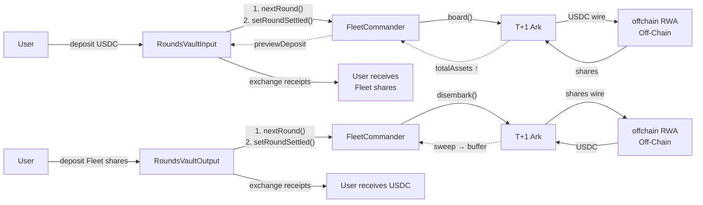
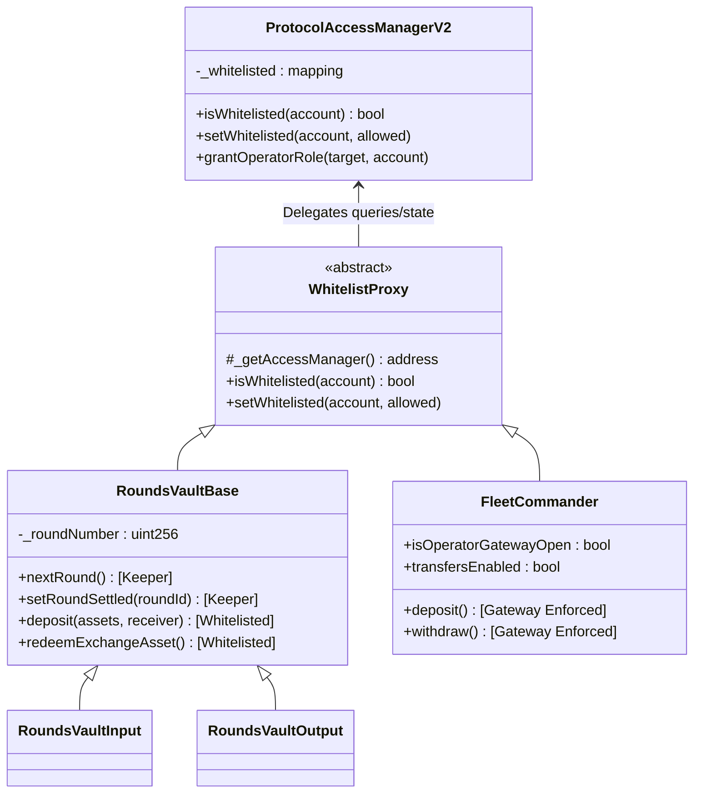
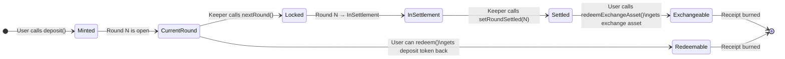
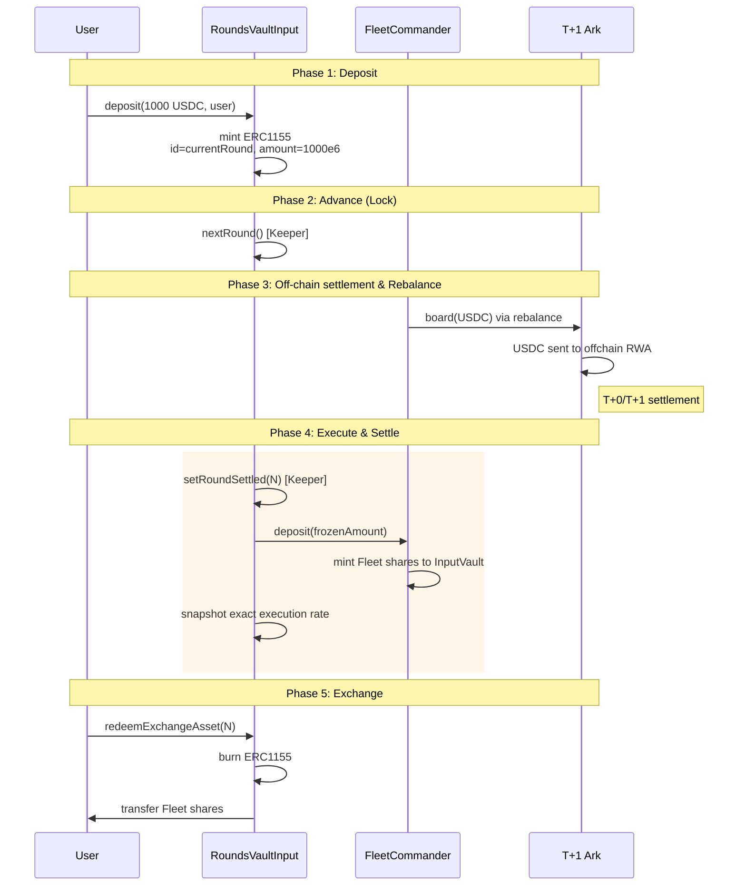
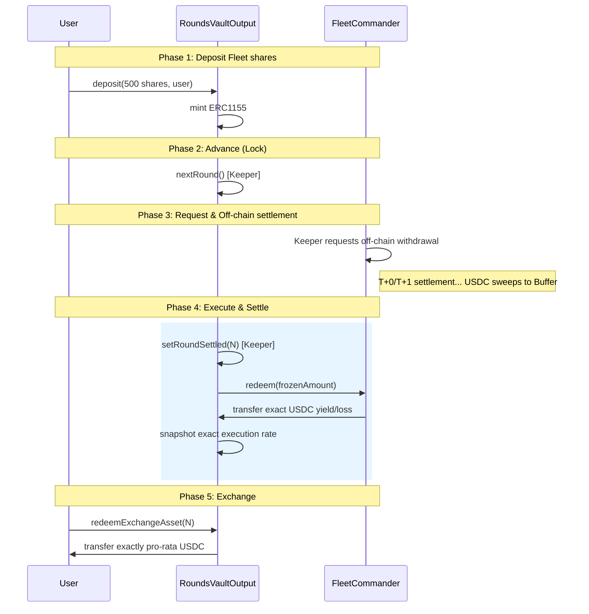
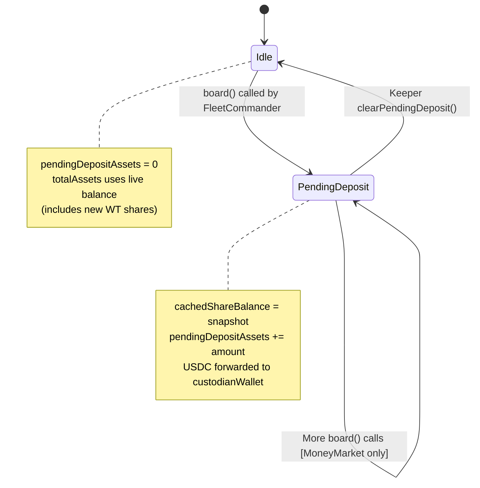
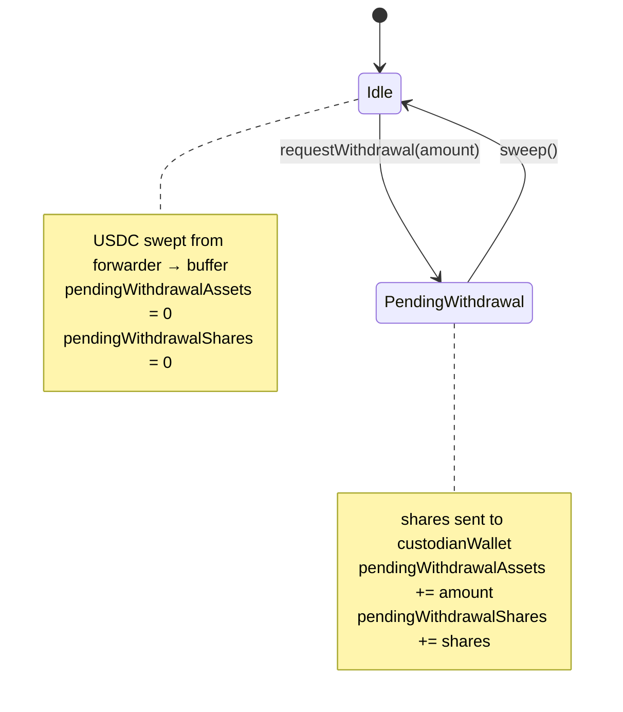

# Rounds Vault & Institutional Ark — Technical Reference

> Complete technical documentation for the async settlement architecture used by offchain RWA (and future Benji-token-style) integrations.

---

## Table of Contents

1. [Architecture Overview](#1-architecture-overview)
2. [Contract Hierarchy](#2-contract-hierarchy)
3. [Token Model: Receipts (ERC-1155 NFTs)](#3-token-model-receipts-erc-1155-nfts)
4. [Round State Machine](#4-round-state-machine)
5. [Input Vault (Deposit Flow)](#5-input-vault-deposit-flow)
6. [Output Vault (Withdrawal Flow)](#6-output-vault-withdrawal-flow)
7. [Exchange Rate Math](#7-exchange-rate-math)
8. [T+1 Ark Internals](#8-t1-ark-internals)
9. [Keeper Operations Playbook](#9-keeper-operations-playbook)
10. [Entry Point Analysis](#10-entry-point-analysis)
11. [Systemic Risks & Operational Limitations](#11-systemic-risks-and-operational-limitations)

-----

## 1\. Architecture Overview

The Rounds Vault system solves a fundamental problem: institutional tokenized funds (e.g. offchain RWA: WTGXX, CRDYX, and future Benji tokens) have **locked investment periods** where deposits/withdrawals are processed in T+0 or T+1 off-chain settlement cycles. Users cannot interact directly during these periods.

The Rounds Vault acts as an **asynchronous buffering layer** between users and the unified FleetCommander ERC-4626 vault, utilizing a **Two-Phase Settlement** model to securely isolate on-chain deposits from off-chain NAV execution.



-----

## 2\. Contract Hierarchy & Access Control

The protocol uses a centralized **ProtocolAccessManagerV2** to maintain a single source of truth for whitelisting and Operator roles. The `Whitelist` contract is a stateless adapter that forwards checks to the central manager.



-----

## 3\. Token Model: Receipts (ERC-1155 NFTs)

When a user deposits into a Rounds Vault, they do **not** receive ERC-20 shares. Instead they receive **ERC-1155 receipt tokens** where:

| Property | Value |
|----------|-------|
| Token standard | ERC-1155 |
| Token ID | `_roundNumber` at time of deposit |
| Amount | 1:1 with deposited assets (same decimals) |
| Transferable | Yes (standard ERC-1155 transfer) |
| Redeemable for deposit token | Only current round via `redeem()` |
| Exchangeable for exchange asset | Only past settled rounds via `redeemExchangeAsset()` |

### Receipt lifecycle



**Key rules:**

  * `redeem(id, amount, receiver, owner)` — burns receipt, returns the **deposit token** (same asset deposited). Only works for `id == currentRound`.
  * `redeemExchangeAsset(id, amount, receiver, owner)` — burns receipt, returns the **exchange asset** at the snapshotted exchange rate. Only works for `id < currentRound` AND `roundState[id] == Settled`.

-----

## 4\. Round State Machine (Two-Phase Settlement)

To protect the protocol from "Penny-Grief" Denial of Service attacks and to correctly absorb T+1 off-chain NAV updates, rounds are processed in two distinct phases:


| State | Enum value | Deposits | Redeem (current) | Exchange (past) |
|-------|-----------|----------|-------------------|-----------------|
| `Opened` | 0 → active | ✅ Yes | ✅ Yes | ❌ No |
| `InSettlement` | 1 | ❌ No (new round opened) | ❌ No | ❌ No |
| `Settled` | 2 | ❌ No | ❌ No | ✅ Yes |

### Phase 1: `nextRound()`

Closes the round and freezes its liabilities.

1.  Sets current round `N` to `InSettlement`.
2.  Increments round to `N+1` and sets it to `Opened`.

### Phase 2: `setRoundSettled(roundId)`

Executes the physical trade and snapshots the real-world execution rate.

1.  Retrieves the exact locked liability (`frozenAmount = totalSupply(roundId)`).
2.  Executes `_operate(roundId, frozenAmount)`.
3.  Records the actual `outputAmount` received from the target vault.
4.  Snapshots the exchange rate via `toPrice(outputAmount, frozenAmount)`.
5.  Sets round `N` to `Settled`.

-----

## 5\. Input Vault (Deposit Flow)

| Property | Value |
|----------|-------|
| Contract | [RoundsVaultInput.sol](./RoundsVaultInput.sol) |
| `asset()` | Underlying token (e.g. USDC) |
| `exchangeAsset()` | FleetCommander address (= Fleet shares) |
| `vault()` | FleetCommander address |

### Deposit → Exchange flow



### `_operate()` implementation

```solidity
function _operate(uint256 roundId, uint256 amount) internal override returns (uint256) {
    if (amount == 0) return 0;
    uint256 shares = _depositOnTarget(amount);
    emit AssetsDeposited(roundId, _msgSender(), amount, shares);
    return shares;
}
```

-----

## 6\. Output Vault (Withdrawal Flow)

| Property | Value |
|----------|-------|
| Contract | [RoundsVaultOutput.sol](./RoundsVaultOutput.sol) |
| `asset()` | FleetCommander (= Fleet shares) |
| `exchangeAsset()` | Underlying token (e.g. USDC) |
| `vault()` | FleetCommander address |

### Withdrawal → Exchange flow



### `_operate()` implementation (Output)

```solidity
function _operate(uint256 roundId, uint256 amount) internal override returns (uint256) {
    if (amount == 0) return 0;
    uint256 assets = _redeemFromTarget(amount);
    emit SharesRedeemed(roundId, _msgSender(), amount, assets);
    return assets;
}
```

-----

## 7\. Exchange Rate Math

The `Price` struct from `@summerfi/price-solidity`:

```solidity
struct Price {
    uint256 baseAmount;    // numerator
    uint256 quoteAmount;   // denominator
}
```

**Quoting**: `price.quote(amount)` returns `amount * baseAmount / quoteAmount`

Because `setRoundSettled()` generates the rate using actual output received (`toPrice(outputAmount, frozenAmount)`), the math organically perfectly absorbs off-chain slippage, NAV changes, or withdrawal fees.

### Input Vault rate interpretation

| Field | Meaning |
|-------|---------|
| `baseAmount` | Exact Fleet shares received from the FleetCommander trade |
| `quoteAmount` | Exact frozen USDC deposited by users in this round |
| `quote(receiptAmount)` | Users get exact pro-rata share of the executed trade |

### Output Vault rate interpretation

| Field | Meaning |
|-------|---------|
| `baseAmount` | Exact USDC received from the FleetCommander trade |
| `quoteAmount` | Exact frozen Fleet shares deposited by users in this round |
| `quote(receiptAmount)` | Users get exact pro-rata share of the returned USDC |

-----

## 8. T+1 Ark Internals {#8-t1-ark-internals}

The [T+1 Ark (WisdomTreeArk.sol)](../arks/WisdomTreeArk.sol) handles the on-chain/off-chain bridge to offchain RWA funds.

### NAV Calculation (`totalAssets`)

```
totalAssets = sharesToAssets(currentShares) + pendingDepositAssets + pendingWithdrawalAssets
```

Where `currentShares` uses either cached or live balance:

```solidity
uint256 currentShares = pendingDepositAssets > 0
    ? cachedShareBalance              // frozen during pending deposit
    : shareToken.balanceOf(forwarder); // live balance
```

### Oracle Price Conversion

Uses Chainlink `AggregatorV3Interface`:

```
sharesToAssets(shares) = price.invert().quote(shares)
// where price = { base: 1 share, quote: oraclePrice in asset decimals }
```

### Deposit Lifecycle



### Withdrawal Lifecycle



### Price Freeze Mechanism

For non-MMF funds (e.g. CRDYX), dividends cause a NAV dip at ex-dividend date. The Keeper can freeze the Ark:

```solidity
setArkFrozen(true, type(uint256).max)  // freezes at current totalAssets
// ... dividend period passes, shares arrive ...
setArkFrozen(false, 0)                 // unfreezes, new shares recognized
```

When frozen, `totalAssets()` returns the stored `_frozenTotalAssets` regardless of oracle or share balance changes.

-----

## 9\. Keeper Operations Playbook

### Deposit Round Lifecycle

| Step | Action | Contract | Function |
|------|--------|----------|----------|
| 1 | Users deposit during open round | RoundsVaultInput | `deposit(assets, receiver)` |
| 2 | Advance round (freezes amount) | RoundsVaultInput | `nextRound()` |
| 3 | Rebalance USDC into Ark | FleetCommander | `rebalance([{buffer→ark}])` |
| 4 | Wait for WT settlement (T+0/T+1) | — | — |
| 5 | Clear pending deposit (NAV updates)| T+1 Ark | `clearPendingDeposit()` |
| 6 | Execute trade & settle round | RoundsVaultInput | `setRoundSettled(N)` |

### Withdrawal Round Lifecycle

| Step | Action | Contract | Function |
|------|--------|----------|----------|
| 1 | Users deposit Fleet shares | RoundsVaultOutput | `deposit(shares, receiver)` |
| 2 | Advance round (freezes amount) | RoundsVaultOutput | `nextRound()` |
| 3 | Request withdrawal from Ark | T+1 Ark | `requestWithdrawal(amount)` |
| 4 | Wait for WT USDC return (T+0/T+1) | — | — |
| 5 | Sweep returning USDC to buffer | T+1 Ark | `sweep()` |
| 6 | Execute trade & settle round | RoundsVaultOutput | `setRoundSettled(N)` |

### Dividend Handling (Non-MMF)

| Step | Action | Function |
|------|--------|----------|
| 1 | Ex-dividend declared | `setArkFrozen(true, MAX)` |
| 2 | Dividend shares arrive | — |
| 3 | Unfreeze | `setArkFrozen(false, 0)` |

---

## 10\. Entry Point Analysis

### Summary

| Access Level | Count | Priority |
|-------------:|------:|----------|
| Public (Whitelisted) | 11 | 🔴 High |
| Keeper-restricted | 14 | 🟠 Medium |
| Admin / Governor | 10 | 🟡 Low |

### Public (Whitelisted) Entry Points

| Function | Contract | Restrictions | What it does |
|----------|----------|-------------|-------------|
| `deposit(assets, receiver)` | RoundsVaultBase | `onlyWhitelisted` | Deposits asset, mints ERC-1155 receipt for current round |
| `redeem(id, amount, ...)` | RoundsVaultBase | `onlyWhitelisted` + `currentRound` | Burns current-round receipt, returns deposit token |
| `redeemExchangeAsset(...)` | RoundsVaultBase | `onlyWhitelisted` + `Settled` | Burns past receipt, returns exchange asset at snapshotted rate |
| `deposit / mint` | FleetCommander | `_enforceEntryGateway` | Direct entry to Fleet if Gateway is OPEN |
| `withdraw / redeem` | FleetCommander | `_enforceExitGateway` | Direct exit from Fleet if Gateway is OPEN |
| `withdrawFromBuffer / Arks` | FleetCommander | `_enforceExitGateway` | Specialized exit functions for Fleet |

### Keeper-Restricted Entry Points

| Function | Contract | What it does |
|----------|----------|-------------|
| `nextRound()` | RoundsVaultBase | Closes round, freezes liability, opens next round |
| `setRoundSettled(roundId)` | RoundsVaultBase | Executes physical trade, snapshots rate, sets to Settled |
| `rebalance(rebalanceData)` | FleetCommander | Moves assets between Arks and adjusts buffer |
| `clearPendingDeposit()` | T+1 Ark | Clears full/partial pending deposit, updates NAV |
| `requestWithdrawal(amount)` | T+1 Ark | Initiates off-chain redemption flow |
| `sweep()` | T+1 Ark | Refills buffer with returned off-chain funds |
| `setArkFrozen(bool, NAV)` | T+1 Ark | Freezes/unfreezes NAV reporting during settlement |
| `setCustodianWallet(...)` | T+1 Ark | Updates the target for off-chain transfers |
| `setAssetsForwarder(...)` | T+1 Ark | Updates the secure transfer proxy |

### Admin / Governor-Restricted Entry Points

| Function | Contract | Role Required | What it does |
|----------|----------|-------------|-------------|
| `setWhitelisted(acc, bool)` | PAMV2 | `WHITELIST_MANAGER` | Updates global whitelist status |
| `setWhitelistedBatch(...)` | PAMV2 | `WHITELIST_MANAGER` | Batch updates global whitelist |
| `grantOperatorRole(...)` | PAMV2 | `GOVERNOR_ROLE` | Authorizes an vault/contract as an Operator |
| `setOperatorGatewayStatus` | FleetCommander | `GOVERNOR_ROLE` | Toggles direct user access to Fleet |
| `setTipRate(Percentage)` | FleetCommander | `GOVERNOR_ROLE` | Updates protocol fee rate |
| `pause / unpause` | FleetCommander | `GOVERNOR_ROLE` | Emergency circuit breaker |
| `emergencySweep()` | T+1 Ark | `GOVERNOR_ROLE` | Force-sweep funds bypassing slippage checks |

-----

## 11\. Systemic Risks and Operational Limitations

#### 1\. The Output Vault "Round Block" (Resolved via Two-Phase)

*Previously, advancing a round demanded immediate synchronous USDC, risking reverts if the Fleet buffer was empty.*

  * **Resolution**: By splitting the cycle into `nextRound()` and `setRoundSettled()`, the liquidity deadlock is solved. The Keeper can advance the round (locking the liabilities), initiate the off-chain `requestWithdrawal` to offchain RWA, wait for the USDC to hit the buffer via `sweep()`, and *only then* execute `setRoundSettled()`.

#### 2\. Resolved: Systemic Whitelist Fragmentation

  * **Current Architecture**: The protocol uses a centralized `ProtocolAccessManagerV2`. The `Whitelist.sol` utility is a stateless proxy. If a user is approved in the RoundsVault, they are cryptographically guaranteed to be approved in the FleetCommander, eliminating fragmentation.

#### 3\. Oracle Update & NAV Lag (Perfectly Absorbed)

Because `setRoundSettled()` snapshots the exchange rate using the literal `outputAmount` received from the trade rather than a predictive oracle query, the RoundsVault is immune to systemic insolvency. If the off-chain NAV drops overnight, the `setRoundSettled()` calculation inherently passes that loss pro-rata to the users of that specific round, maintaining perfect 1:1 asset backing in the smart contract.