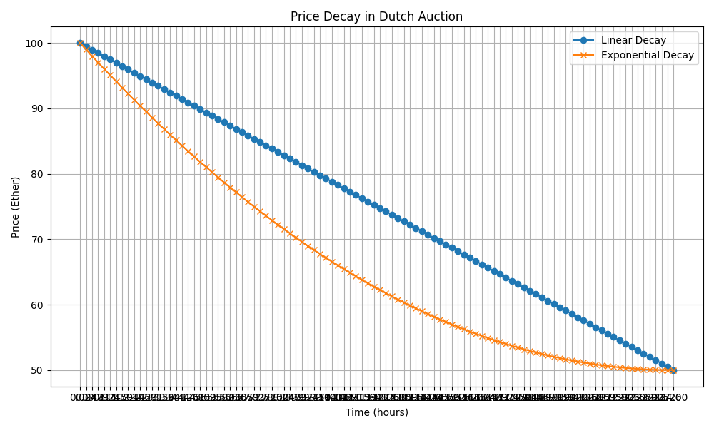

# Dutch Auction Smart Contract

This project implements a Dutch Auction system using Solidity smart contracts. It's built and tested using the Foundry framework.

## Table of Contents

- [Dutch Auction Smart Contract](#dutch-auction-smart-contract)
  - [Table of Contents](#table-of-contents)
  - [Overview](#overview)
  - [Project Structure](#project-structure)
  - [Setup](#setup)
  - [Testing](#testing)
  - [Deployment](#deployment)
  - [Contract Details](#contract-details)
    - [DutchAuctionManager](#dutchauctionmanager)
    - [DutchAuctionLibrary](#dutchauctionlibrary)
    - [DutchAuctionErrors](#dutchauctionerrors)
    - [DutchAuctionEvents](#dutchauctionevents)
  - [Python Script for Price Data](#python-script-for-price-data)
    - [Features](#features)
    - [Usage](#usage)
  - [Key Features](#key-features)
  - [Contributing](#contributing)
  - [License](#license)

## Overview

A Dutch auction is a type of auction where the price starts high and gradually decreases until a buyer accepts the current price. This implementation allows for multiple auctions to be managed simultaneously, with features such as kicker rewards and support for different price decay models (linear and exponential).

## Project Structure

```
dutch-auction/
├── src/
│   ├── DutchAuctionManager.sol
│   ├── DutchAuctionLibrary.sol
│   ├── DutchAuctionErrors.sol
│   └── DutchAuctionEvents.sol
├── test/
│   ├── DutchAuction.t.sol
│   └── DutchAuction.fuzz.t.sol
├── script/
│   └── DeployDutchAuction.s.sol
├── utils/
|   ├── generate_price_data.py
│   ├── price_decay_comparison.png
│   └── expected_prices.json
├── foundry.toml
└── README.md
```

## Setup

1. Clone the repository:
   ```bash
   git clone https://github.com/oasisdex/summer-earn-protocol.git
   cd packages/dutch-auction
   ```

2. Install Foundry if you haven't already:
   ```bash
   curl -L https://foundry.paradigm.xyz | bash
   foundryup
   ```

3. Install dependencies:
   ```bash
   forge install
   ```

4. Install Python dependencies for the script:
   ```bash
   pip install matplotlib
   ```

## Testing

Run the test suite using Forge:

```bash
forge test
```

For more verbose output:

```bash
forge test -vvv
```

## Deployment

1. Set up your `.env` file with your RPC URL and private key:
   ```plaintext
   RPC_URL=your_rpc_url
   PRIVATE_KEY=your_private_key
   ```

2. Run the deployment script:
   ```bash
   forge script script/DeployDutchAuction.s.sol:DeployDutchAuction --rpc-url $RPC_URL --private-key $PRIVATE_KEY --broadcast
   ```

## Contract Details

### DutchAuctionManager

The main contract that handles the creation and management of auctions.

### DutchAuctionLibrary

A library containing the core logic for Dutch auctions, including price calculations and token purchases.

### DutchAuctionErrors

A contract defining custom errors used throughout the system.

### DutchAuctionEvents

A contract defining events emitted by the auction system.

## Python Script for Price Data

A Python script (`utils/generate_price_data.py`) is provided to generate expected price data for both linear and exponential price decay models. It also plots these decays for visual comparison.



### Features

- **Configurable Intervals**: Adjust the number of intervals to compute prices over the auction duration.
- **Output**: Generates a JSON file (`expected_prices.json`) with expected prices and a PNG file (`price_decay_comparison.png`) for visual comparison.

### Usage

1. Edit the `num_intervals` variable in `utils/generate_price_data.py` to change the number of time intervals for price calculation.
2. Run the script:
   ```bash
   python utils/generate_price_data.py
   ```

This script will create a JSON file and a PNG image showing the price decay for the auction's duration.

## Key Features

- Multiple simultaneous auctions
- Support for both linear and exponential price decay
- Kicker reward system
- Automatic finalization when all tokens are sold

## Contributing

Contributions are welcome! Please feel free to submit a Pull Request.

## License

This project is licensed under the MIT License.