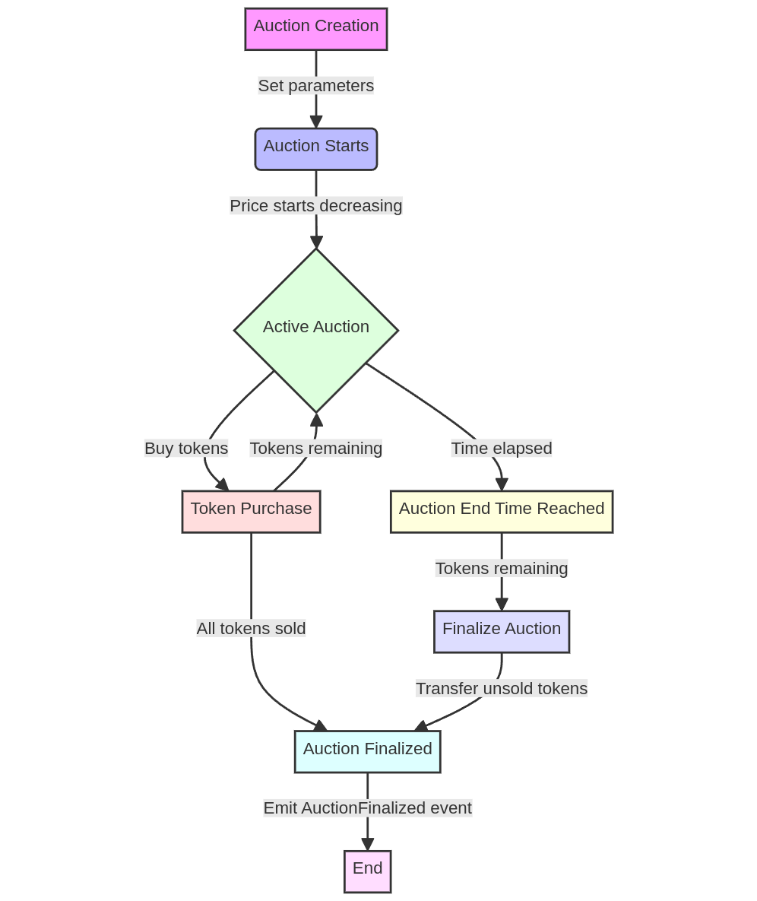
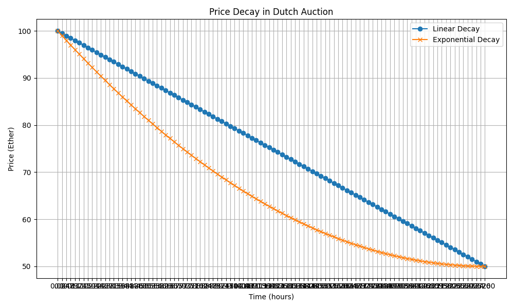

# Dutch Auction Smart Contract

This package (`@summerfi/dutch-auction`) implements a Dutch auction library for the Summer.fi
protocol. The price starts high and decreases over time until a buyer accepts the current price; the
library supports multiple simultaneous auctions and two decay models (linear and exponential).

## Key Contracts

| Contract              | Role                                                                                                         |
| --------------------- | ------------------------------------------------------------------------------------------------------------ |
| `DutchAuctionLibrary` | External library with core auction logic (price calculation, token purchase). Deployed as a linked library.  |
| `DutchAuctionManager` | Reference implementation that shows how to use `DutchAuctionLibrary` while managing auction storage and IDs. |
| `DutchAuctionMath`    | Low-level math helpers used by the library.                                                                  |
| `DecayFunctions`      | Linear and exponential price decay implementations.                                                          |
| `DutchAuctionErrors`  | Custom error definitions.                                                                                    |
| `DutchAuctionEvents`  | Event definitions.                                                                                           |

All contracts live under `src/`.

## Build and Test

```bash
# Build
pnpm build          # forge build --quiet

# Test
pnpm test           # forge test
pnpm test:coverage  # regenerates price fixtures then runs forge coverage

# Generate price fixtures only
pnpm gen:prices     # cd utils && python generate_price_data.py

# Generate NatSpec docs
pnpm docs:gen       # forge doc

# Format Solidity
pnpm format:fix
```

## Dutch Auction Lifecycle



1. Auction is created with parameters (tokens, duration, start/end price, etc.).
2. Price decreases over time according to the chosen decay function.
3. Buyers purchase tokens at the current price; remaining token amount is updated.
4. Auction ends when either all tokens are sold or the end time is reached.
5. Unsold tokens are transferred to the specified recipient on finalization.

## Python Script for Price Fixtures

`utils/generate_price_data.py` produces `utils/expected_prices.json` (consumed by tests) and
`utils/price_decay_comparison.png`. Run via `pnpm gen:prices` before running coverage;
`pnpm test:coverage` does this automatically.



## Cross-Package Connections

**Consumes:**

- `@summerfi/percentage-solidity` — percentage type used in auction parameters.
- `@summerfi/dependencies` — re-exports `@prb/math` and OpenZeppelin, accessed via remappings in
  `remappings.txt`.

**Consumed by:**

- `packages/core-contracts` — `AuctionManagerBase`, `BuyAndBurn`, and `Raft` inherit from or
  integrate `DutchAuctionLibrary`.
- `packages/deployment` — Ignition modules (`core.ts`, `buy-and-burn.ts`, `raftModuleFactory.ts`)
  deploy `DutchAuctionLibrary` as a standalone contract and pass it via the
  `libraries: { DutchAuctionLibrary: dutchAuctionLibrary }` option when deploying `Raft`. If this
  wiring is missing, the `Raft` deployment fails.

**Gotchas:**

- `DutchAuctionLibrary` is a linked external library, not an internal one. Every Ignition module
  that deploys a contract using it must declare the `libraries` option explicitly.
- `utils/expected_prices.json` is a hand-generated fixture. If auction math changes, re-run
  `pnpm gen:prices` and commit the updated JSON alongside the contract changes.

## GitBook Reference

Full NatSpec reference: [contracts/dutch-auction/reference/](https://docs.summer.fi) — also listed
in `gitbook/SUMMARY.md` under _Dutch Auction_.
